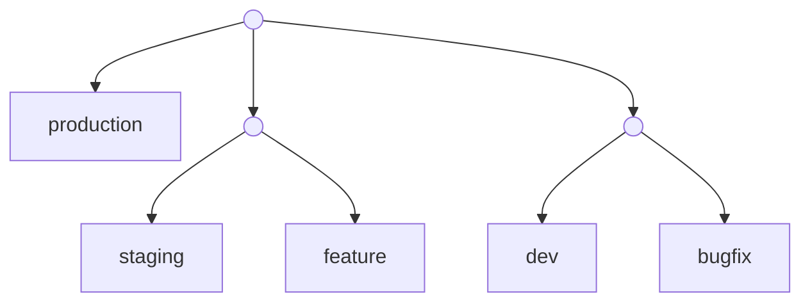

## Traditional database workflows are broken

Modern software development is built around iteration. Teams create branches, open pull requests, spin up previews, run tests in isolation, and roll changes forward or back constantly. Code workflows evolved to support this reality.

Databases did not.

```tsx
const inter = Inter({ subsets: ['latin'] })
```

Most database setups are still built around a single mutable state: one production database, maybe a shared staging database, and sometimes a shared dev database. Everything depends on copying data around and trying not to step on each other's toes. This mismatch creates friction everywhere `main`.

<MegaLink
  tag="80% OF NEON DATABASES ARE DEPLOYED BY AGENTS."
  title="Retool uses the Neon API to manage over 300,000 databases with just one engineer - handling everything from provisioning to quota enforcement."
  url="/blog/how-retool-uses-retool-and-the-neon-api-to-manage-300k-postgres-databases"
/>

## Databases don't match how teams build software

In practice, teams need databases to behave more like code:

- Engineers want isolated environments to test schema changes safely
- CI systems need fresh databases for every test run
- Preview environments should reflect real production data
- Rollbacks should be fast and predictable
- Multiple versions of an application often exist at the same time

| Purpose                              | Where                                           | Status Code                          |
| ------------------------------------ | ----------------------------------------------- | ------------------------------------ |
| Redirect user after a mutation/event | Server Components, Server Actions, Route Handlers | 307 (Temporary) or 303 (Server Action) |
| Redirect user after a mutation/event | Server Components, Server Actions, Route Handlers | 308 (Permanent)                      |
| Perform a client-side navigation     | Event Handlers in Client Components             | 307 (Temporary) or 308 (Permanent)   |

Traditional databases make all of this difficult. Creating a new environment usually means dumping and restoring data, running long migrations, or manually coordinating changes across shared databases. These workflows are slow, error-prone, and do not scale as teams or systems grow.



As a result, teams compromise:

- They test migrations against incomplete or stale data
- They share environments and accept conflicts
- They avoid certain changes because the blast radius feels too large

<Tabs labels={["Console", "CLI"]}>

<TabItem>

1. Create the database.

   In the Neon Console, go to Databases -> New Database. Make sure your `main` branch is selected, then create the new database.

2. Add the schema.

   Go to the SQL Editor, enter the following SQL statement and click Run to apply.

```sql
CREATE TABLE person (
  id SERIAL PRIMARY KEY,
  name TEXT NOT NULL,
  email TEXT UNIQUE NOT NULL
);
```

</TabItem>

<TabItem>

1. Create the database.

```bash
neon databases create --name person_db
```

2. Add the schema.

```bash
psql "$DATABASE_URL" <<'SQL'
CREATE TABLE person (
  id SERIAL PRIMARY KEY,
  name TEXT NOT NULL,
  email TEXT UNIQUE NOT NULL
);
SQL
```

</TabItem>

</Tabs>

## Weighing vertical vs. horizontal splits

Microfrontends can be organized in two main ways, allowing teams to choose the approach that best fits their scaling needs and workflow requirements.

### 1. Vertical splits

Each microfrontend is responsible for a distinct application section. This reduces cross-section dependencies and results in quicker builds for isolated changes.

### 2. Horizontal splits

Microfrontends share a page, each managing a feature within it. While this allows for more granular control over the UI, it can also complicate deployment and testing.

### Choosing the right approach

A vertical split offers cohesive ownership of individual sections, allowing teams to manage specific areas independently, though it may result in hard navigations between different sections.

## Copying databases doesn't scale

The default solution to isolation has always been, in one way or another, copying the database. But copying databases is expensive in every dimension:

1. Enhancing routing mechanisms for even smoother navigation.
2. Streamlining CI/CD workflows to support independent deployment.

To use a local image, `src` your `.jpg`, `.png`, or `.webp` image files.

As databases grow into hundreds of gigabytes or terabytes, copying simply stops being viable. Teams either stop creating isolated environments, or they accept that non-production databases are no longer representative of reality.

| Good to know |
| --- |
| When embedding videos from external platforms, consider the following best practices:<br/><br/>- Size Optimization: Automatically serve correctly sized images for each device, using modern image formats like WebP and AVIF.<br/><br/>- Implement strategies for loading videos based on network conditions, especially for users with limited data plans. |

> "The speed of <span className="rounded-sm bg-[#1D7A64] px-1.5 py-0.5 text-white">provisioning and serverless</span> scale-to-zero of Neon is critical for us"
>
> Dhruv Amin - Co-founder at Anything

<div className="my-8 rounded border border-gray-new-20 px-6 py-5">
  Databases are still treated as static resources, while modern development requires fast and cheap environments that can be created, discarded, and restored at will.
</div>

None of this is a tooling problem at the application layer. It's a database model problem, and it's solvable.
