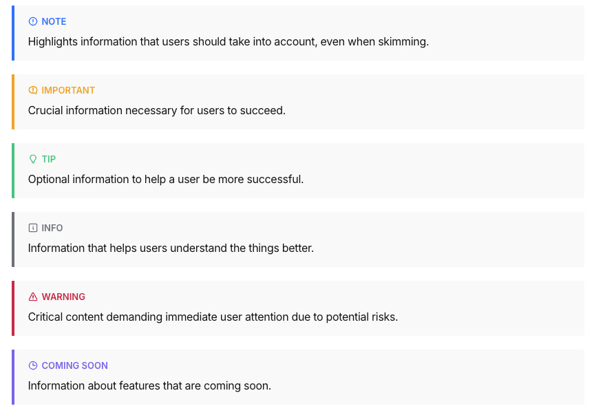
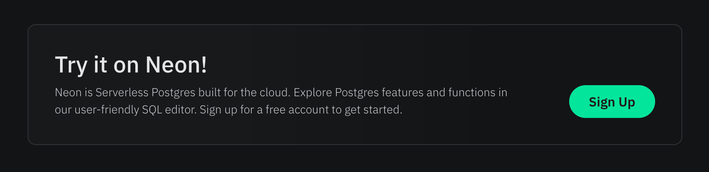

# Docs

Welcome to Neon docs! This folder contains the source code of the [Neon docs](/docs/).

## Basic information

1. Every single Markdown file in this folder will be turned into a docs page.
2. Folder and file names should follow kebab-case.
3. `slug` is generated based on the folder structure and file names inside this folder. In order to see page `slug`, you can [start](../../README.md#run-the-website) and build the project with `npm run build` command that will display all generated pages.
4. Page `path` is generated by combining [`DOCS_BASE_PATH`](../../src/constants/docs.js) and page `slug`.
5. There is no need to add `h1` to the page since it will be displayed automatically with the value from `title` field.

## Fields

Right now Markdown files accept the following fields:

1. `title` — title of the page (required)
2. `subTitle` — subtitle of the page.
3. `tag` — tag for the page. It can be one of the following: `new`, `beta`, `coming soon`, `deprecated`, or you can use your own tag. Don't forget to add it to the `navigation.yaml` file as well.
4. `redirectFrom` — array of strings with paths to redirect from to the page, should start and end with a slash, e.g. `/docs/old-path/`
5. `isDraft` — flag that says the page is not ready yet. It won't appear in production but will appear in the development mode.
6. `enableTableOfContents` — flag that turns on the display of the outline for the page. The outline gets built out of second and third-level headings ([`h2`, `h3`]), thus appears as two-level nested max.
7. `ogImage` - the social preview image of the page.

> ⚠️ Please note that the project won't build if at least one of the Markdown files is missing a required field.

## Navigation

Navigation data is stored in the [navigation.yaml](./navigation.yaml) file.

### Navigation Structure

The navigation system is a unified structure where:

- **Top-level items** appear in the header navigation
- **Child items** appear in the left sidebar

This creates a seamless navigation experience where users select a main category from the header and see its detailed structure in the sidebar.

### Top Navigation Structure

Each top-level navigation item has the following structure:

```yaml
- nav: Get started # Navigation label (displayed in header)
  slug: introduction # URL slug for the section
  title: Neon Docs # Page title
  icon: home # Icon identifier
  subnav: # Sub-navigation items for header dropdowns
    - title: Neon platform
      slug: manage/platform
      icon: settings
      items: # Sidebar navigation items
        ...
```

**Important**: Top-level items can contain either:

- **`subnav`**: Sub-navigation items that appear as header dropdowns
- **`items`**: Navigation items that appear in the sidebar

### Sidebar Navigation Structure

The sidebar navigation supports multiple levels:

```yaml
  ...
  items: # Sidebar navigation items
    - section: Features # Section header
      icon: features
      slug: guides/neon-features
      items: # Section items
        - title: Serverless
          slug: introduction/serverless
        - title: Autoscaling
          slug: introduction/autoscaling
          items: # Section subitems
            - title: Introduction
              slug: introduction/autoscaling
            - title: Architecture
              slug: introduction/autoscaling-architecture
```

### How to add a new top navigation category

To add a new top-level navigation category, add a new item to the top level array with keys `nav`, `slug`, `title`, `icon`, and optionally `items` or `subnav`.

```diff
+- nav: New Category
+  slug: new-category
+  title: New Category Title
+  icon: new-icon
+  subnav:
+    ...
```

### How to add a new section

To add a new section within a navigation category, add a new item with keys `section`, `icon`, and `items`.

```diff
  ...
  items:
+   - section: Architecture
+     icon: architecture
+     items:
+       ...
```

### How to add a new page

To add a new page, add a new item with keys `title` and `slug` under the appropriate section or navigation level.

```diff
  ...
  items:
+   - title: Overview
+     slug: introduction/architecture-overview
```

### Navigation Properties

- `nav`: The label displayed in the top navigation header
- `slug`: The URL path for the page/section
- `title`: The display title for the page/section
- `icon`: Icon identifier for visual representation
- `section`: Section header for grouping related items
- `items`: Array of navigation items
- `subnav`: Sub-navigation items for the sidebar
- `tag`: Optional tag (e.g., "new", "beta") displayed next to the title

### Important Notes

- `title` in the sidebar may differ from `title` in the Markdown file
- `slug` should always match the page's slug
- The navigation supports unlimited nesting levels for complex documentation structures
- Icons are referenced by name and should match available icon components
- Tags like "new" or "beta" are automatically displayed with special styling

## Code blocks

All available languages for code blocks can be found [here](https://shiki.matsu.io/languages).

You can use fenced code blocks with three backticks (```) on the lines before and after the code block. And display code with options

- enable highlighting single lines, multiple lines, and ranges of code lines

  Examples:
  - Single line highlight

    ````md
    ```c++ {1}
    #include <iostream>

    int main() {
        std::cout << "Hello World";
        return 0;
    }
    ```
    ````

  - Multiple lines

    ````md
    ```c++ {1,2,5}
    #include <iostream>

    int main() {
        std::cout << "Hello World";
        return 0;
    }
    ```
    ````

  - Range of code lines

    ````md
    ```c++ {1-3,5}
    #include <iostream>

    int main() {
        std::cout << "Hello World";
        return 0;
    }
    ```
    ````

- use `[!code highlight]` to highlight a line.

  ```ts
  export function foo() {
    console.log('Highlighted'); // [!code highlight]
  }
  ```

- use `[!code word:xxx]` to highlight a word.

  ```ts
  export function foo() {
    // [!code word:Hello]
    const msg = 'Hello World';
    console.log(msg);
  }
  ```

- use `[!code --]` and `[!code ++]` to highlight a code diff.

  ```ts
  export function foo() {
    const msg = 'Hello Word'; // [!code --]
    const msg = 'Hello World'; // [!code ++]
  }
  ```

- `showLineNumbers` - flag to show on the line numbers in the code block.

  Example:

  ````md
  ```c++ showLineNumbers
  #include <iostream>

  int main() {
      std::cout << "Hello World";
      return 0;
  }
  ```
  ````

- `shouldWrap` - flag to enable code wrapping in the code block.

  Example:

  ````md
  ```powershell shouldWrap
  powershell -Command "Start-Process -FilePath powershell -Verb RunAs -ArgumentList '-NoProfile','-InputFormat None','-ExecutionPolicy Bypass','-Command ""iex (iwr -UseBasicParsing https://cli.configu.com/install.ps1)""'"
  ```
  ````

## Code Tabs

To display code tabs, wrap all pieces of code with `<CodeTabs></CodeTabs>` and write labels of code tabs in order:

````md
<CodeTabs labels={["Shell", "C++", "C#", "Java"]}>

```bash {2-4}
#!/bin/bash
STR="Hello World!"
echo $STR
```

```c++
#include <iostream>

int main() {
    std::cout << "Hello World";
    return 0;
}
```

```csharp
namespace HelloWorld
{
    class Hello {
        static void Main(string[] args)
        {
            System.Console.WriteLine("Hello World");
        }
    }
}
```

```java
import java.io.*;

class GFG {
    public static void main (String[] args) {
       System.out.println("Hello World");
    }
}
```

</CodeTabs>
````

<details>
<summary>Examples</summary>


</details>

## External Code

The `ExternalCode` component allows embedding code content from external sources with syntax highlighting.

### Usage

```markdown
<ExternalCode
  url="https://raw.githubusercontent.com/neondatabase/neon/main/README.md"
/>
```

### Props

| Prop            | Type    | Default    | Description                                                   |
| --------------- | ------- | ---------- | ------------------------------------------------------------- |
| url             | string  | (required) | URL to the raw file                                           |
| language        | string  | (optional) | Language for syntax highlighting (defaults to file extension) |
| shouldWrap      | boolean | false      | Enables code wrapping in the code block                       |
| showLineNumbers | boolean | false      | Shows line numbers in the code block                          |
| className       | string  | ''         | Additional CSS classes to apply to the component              |

### Examples

```markdown
<ExternalCode
  url="https://raw.githubusercontent.com/neondatabase-labs/ai-rules/main/neon-auth.mdc"
  language="markdown"
  shouldWrap
  showLineNumbers
/>
```

### Best Practices

1. Always use raw URLs from the GitHub repository (e.g., `https://raw.githubusercontent.com/...`).
2. Use the `language` prop when the file extension doesn't match the actual content type.

## Tabs

To display the tabs with content as image, video, code block, .etc, wrap the `TabItem` with `Tabs`

````md
<Tabs labels={["Content", "CLI"]}>

<TabItem>
In your config v3 project, head to the `/metadata/databases/databases.yaml` file and add the database configuration as below.

```bash showLineNumbers
- name: <db_name>
  kind: postgres
  configuration:
    connection_info:
      database_url:
        from_env: <DB_URL_ENV_VAR>
    pool_settings:
      idle_timeout: 180
      max_connections: 50
      retries: 1
  tables: []
  functions: []
```

Apply the Metadata by running:

```bash
hasura metadata apply
```

If you've spun up the Hasura Engine with Docker, you can access the Hasura Console by accessing it in a browser at the URL of your Hasura Engine instance, usually http://localhost:8080.

<Admonition type="note">
To access the Hasura Console via the URL the HASURA_GRAPHQL_ENABLE_CONSOLE environment variable or the `--enable-console` flag must be set to true.
</Admonition>

</TabItem>

<TabItem>
Alternatively, you can create read replicas using the Neon API or Neon CLI.

```bash
curl --request POST \
     --url https://console.neon.tech/api/v2/projects/late-bar-27572981/endpoints \
     --header 'Accept: application/json' \
     --header "Authorization: Bearer $NEON_API_KEY" \
     --header 'Content-Type: application/json' \
     --data '
{
  "endpoint": {
    "type": "read_only",
    "branch_id": "br-young-fire-15282225"
  }
}
' | jq
```

</TabItem>

</Tabs>
````

## Admonition

To improve the documentation readability, one can leverage an Admonition custom component. Just wrap your piece of text with `<Admonition></Admonition>` and pass the type.

There are 6 types of Admonition: `note`, `important`, `tip`, `info`, `warning`, `comingSoon`; the default is `note`.

You may also specify an optional title with prop `title`.

Example:

```md
<Admonition type="note">
Highlights information that users should take into account, even when skimming.
</Admonition>

<Admonition type="important">
Crucial information necessary for users to succeed.
</Admonition>

<Admonition type="tip">
Optional information to help a user be more successful.
</Admonition>

<Admonition type="info">
Information that helps users understand the things better.
</Admonition>

<Admonition type="warning">
Critical content demanding immediate user attention due to potential risks.
</Admonition>

<Admonition type="comingSoon">
Information about features that are coming soon.
</Admonition>
```

<details>
<summary>Examples</summary>



</details>

## CTA

This is a simple block with title, description text and one CTA button that accomplish certain actions.

```md
<CTA />
```

Check the example for default data of CTA block

<details>
<summary>Example</summary>



</details>

To change text in CTA block, you can pass to the component props `title`, `description`, `buttonText`, `buttonUrl`:

```md
<CTA title="Try it on Neon!" description="Neon is Serverless Postgres built for the cloud. Explore Postgres features and functions in our user-friendly SQL Editor. Sign up for a free account to get started." buttonText="Sign Up" buttonUrl="https://console.neon.tech/signup" />
```

## Steps

To display numbered steps, wrap the content with `Steps` component.  
Steps will be splitted by `h2` headings.

```md
<Steps>

## Step 1: Create the Initial Schema

First, create a new database called `people`
```
