This guide shows Neon documentation writers and contributors how to create visual diagrams using Mermaid, a markdown-like syntax for generating diagrams and flowcharts. Mermaid diagrams are automatically styled with Neon's brand colors and support both light and dark modes.

## Why use Mermaid diagrams?

Visual diagrams help explain complex concepts, workflows, and architectures more effectively than text alone. Mermaid diagrams are ideal for Neon documentation because they:

- **Stay in sync**: Diagrams are created from text, making them easy to update alongside code
- **Work everywhere**: Rendered automatically in documentation, no external tools needed
- **Look professional**: Automatically styled with Neon's brand colors (#00E599 green)
- **Support themes**: Seamlessly switch between light and dark modes
- **AI-friendly**: Can be generated quickly using Cursor, Claude, or ChatGPT

## Quick start

Add a Mermaid diagram to any documentation page by using a code block with the `mermaid` language tag:

````markdown
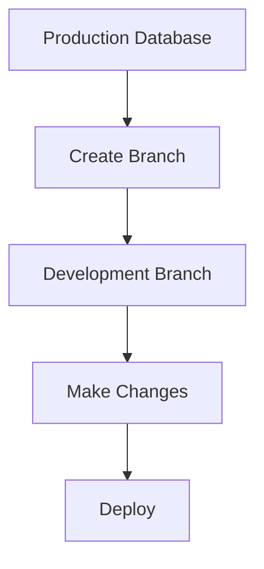
````

This renders as:


<Admonition type="note">
**Keep diagrams simple**: Mermaid diagrams are constrained to a maximum width of 800px for readability. Keep your diagrams focused with 5-10 nodes maximum. For complex workflows, consider breaking them into multiple simpler diagrams.
</Admonition>

## Using AI to generate diagrams

At Neon, we use **Cursor** and **Claude** (or ChatGPT) extensively to generate Mermaid diagrams. Here's how to leverage AI for creating diagrams:

### Using Cursor AI

Cursor has built-in AI that can generate Mermaid diagrams directly in your editor:

1. **Open your markdown file** in Cursor
2. **Start Cursor Composer** (Cmd+I or Ctrl+I)
3. **Write a prompt** describing the diagram you need

**Example prompts for Cursor:**

```
Create a Mermaid flowchart showing Neon's branching workflow:
- User creates a project
- Creates a development branch
- Makes schema changes
- Tests changes
- Merges to production
```

```
Generate a Mermaid sequence diagram for Neon's autoscaling process:
- Client connects
- Proxy checks compute status
- If idle, wake up compute
- Load data from storage
- Execute query
- Return results
```

```
Make a Mermaid ER diagram for a SaaS application using Neon with:
- tenants table
- users table
- subscriptions table
Show the relationships
```

**Tips for Cursor:**

- Be specific about the diagram type (flowchart, sequence, ER, etc.)
- Mention you want Mermaid syntax
- Include the main nodes/steps you want to show
- Ask for revisions if the first result isn't perfect

### Using Claude or ChatGPT

If you prefer using Claude or ChatGPT in their web interfaces:

1. **Open Claude or ChatGPT**
2. **Ask for a Mermaid diagram** with clear requirements
3. **Copy the generated code** and paste it into your markdown file

**Example prompts for Claude/ChatGPT:**

```
Create a Mermaid flowchart showing how Neon's scale-to-zero works:
1. Database is active
2. No activity detected for X minutes
3. Compute scales to zero
4. New connection arrives
5. Compute automatically resumes
6. Connection established

Use clear labels and make it easy to understand.
```

```
Generate a Mermaid class diagram showing Neon's API structure with:
- Project class (id, name, region, methods: createBranch, deleteBranch)
- Branch class (id, name, projectId, methods: createCompute, restore)
- Compute class (id, status, methods: start, suspend)
Show the relationships between them
```

```
Create a Mermaid Gantt chart for a database migration project:
- Planning phase (1 week)
- Schema migration (2 weeks)
- Data transfer (2 weeks)
- Testing (1 week)
- Production deployment (3 days)
```

**Pro tips:**

- Ask for specific Mermaid diagram types by name
- Provide the structure or flow you want to visualize
- Request revisions to adjust complexity or styling
- Validate the syntax using [Mermaid Live Editor](https://mermaid.live/)

### AI prompt templates

Here are reusable prompt templates for common diagram needs:

**Architecture diagram:**

```
Create a Mermaid flowchart showing [system/feature] architecture with:
- [Component 1]
- [Component 2]
- [Component 3]
Show how they interact and data flows between them.
```

**Workflow diagram:**

```
Generate a Mermaid flowchart for the [process name] workflow:
1. [Step 1]
2. [Step 2]
3. [Decision point]
4. [Step 3a or 3b based on decision]
5. [Final step]
```

**Database schema:**

```
Create a Mermaid ER diagram for [use case] with these tables:
- [table1] with fields [field1, field2, field3]
- [table2] with fields [field1, field2]
- [table3] with fields [field1, field2]
Show the relationships between them.
```

## Supported diagram types

Mermaid supports many diagram types. Here are the most useful for Neon documentation:

### Flowcharts

Best for: Workflows, decision trees, process flows

````markdown
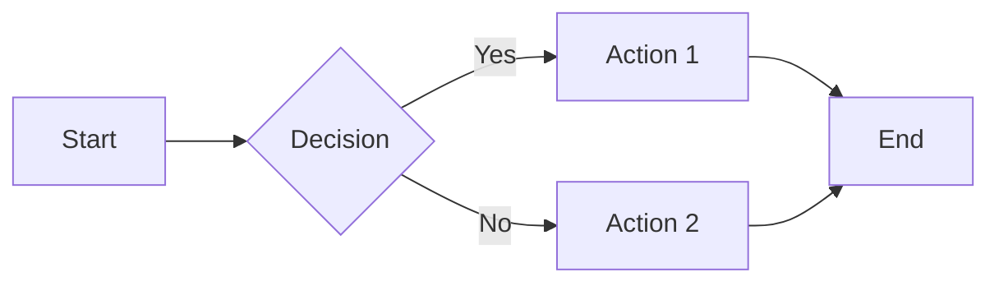
````

**Directions:**

- `TD` or `TB` - Top to bottom
- `LR` - Left to right
- `RL` - Right to left
- `BT` - Bottom to top

### Sequence Diagrams

Best for: API interactions, request/response flows, time-based processes

````markdown
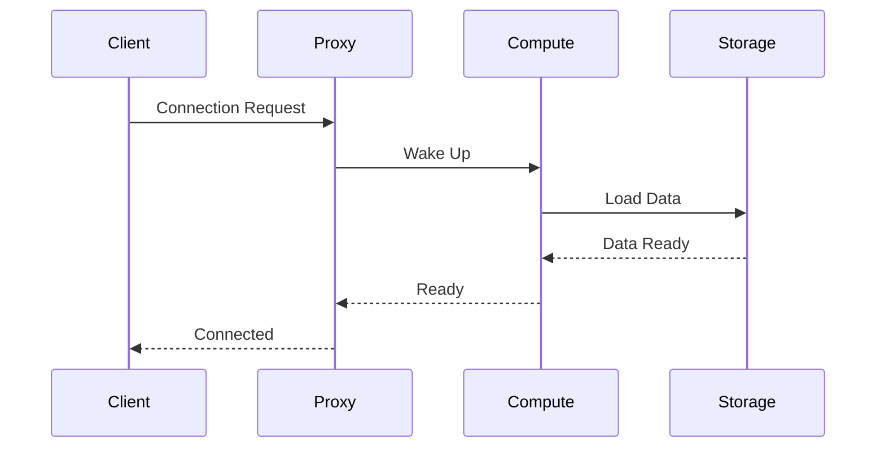
````

### Entity Relationship Diagrams

Best for: Database schemas, data models

````markdown
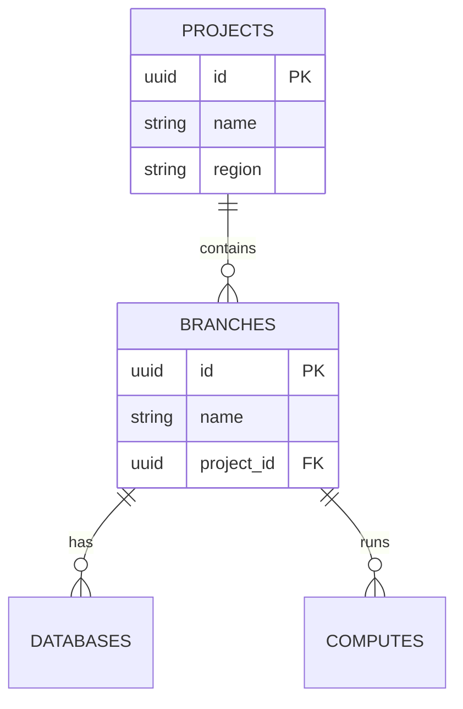
````

**Relationships:**

- `||--||` - One to one
- `||--o{` - One to many
- `}o--o{` - Many to many

### State Diagrams

Best for: Lifecycle states, status changes

````markdown
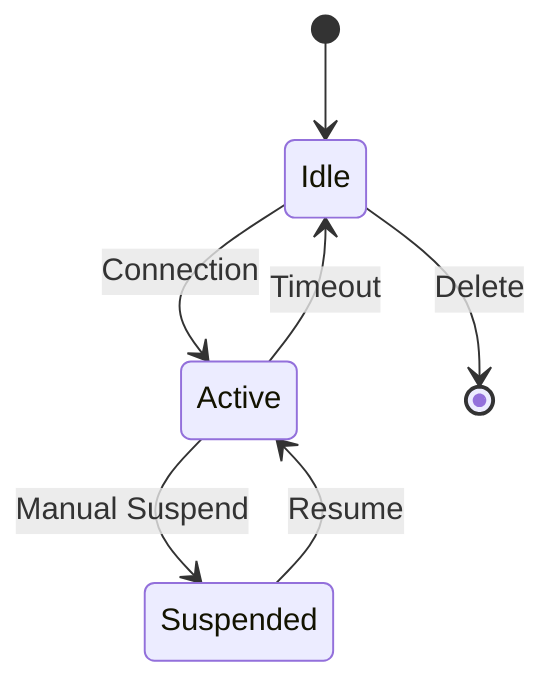
````

### Git Graphs

Best for: Branching strategies, version control workflows

````markdown
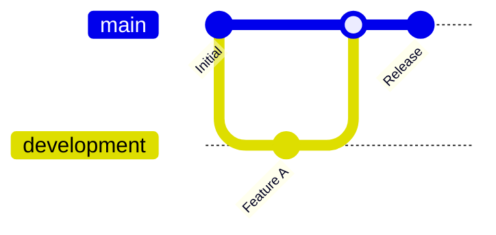
````

### Class Diagrams

Best for: Code architecture, API structure

````markdown
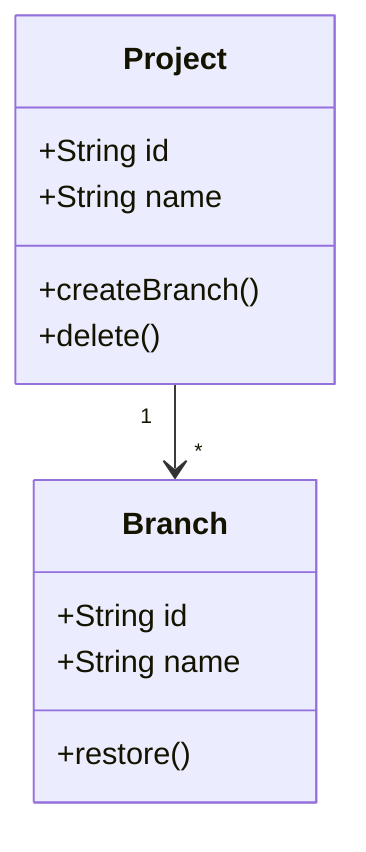
````

### Gantt Charts

Best for: Project timelines, migration plans

````markdown
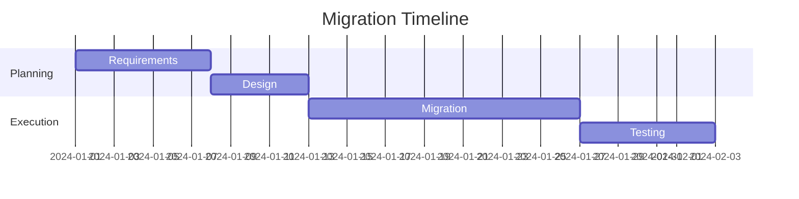
````

### Pie Charts

Best for: Usage statistics, distributions

````markdown
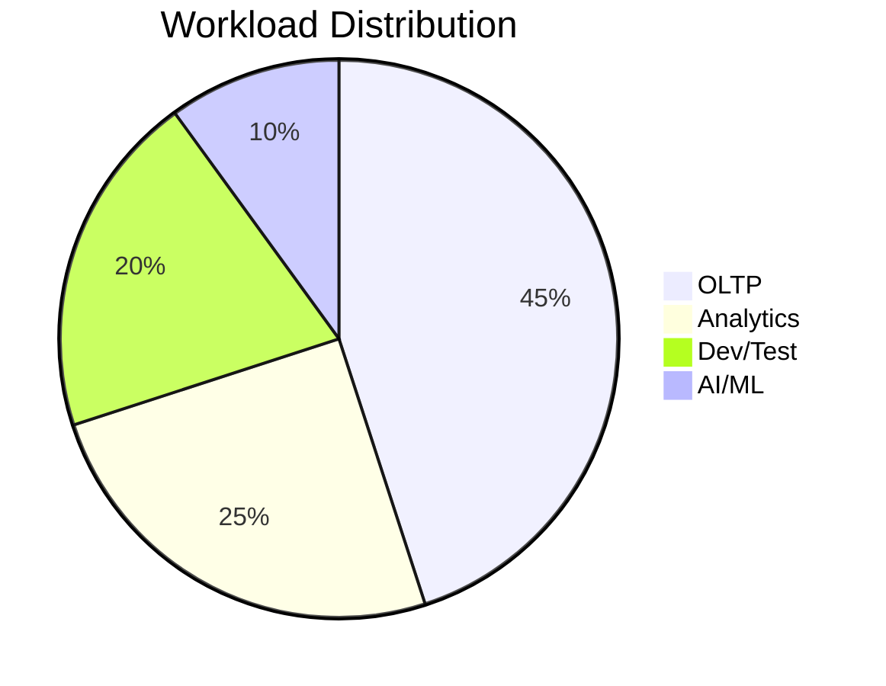
````

## Styling and best practices

### Color scheme

Mermaid diagrams automatically use Neon's brand colors:

- **Primary**: Neon green (#00E599) for main elements
- **Secondary**: Blue (#2272b4) for connections
- **Git branches**: Full Neon color palette
- **Dark mode**: Automatically adapts with proper contrast

No manual color configuration needed!

### Writing effective diagrams

**Keep it simple:**

- Focus on one concept per diagram
- Limit to 5-10 nodes for readability
- Use clear, concise labels

**Use meaningful labels:**

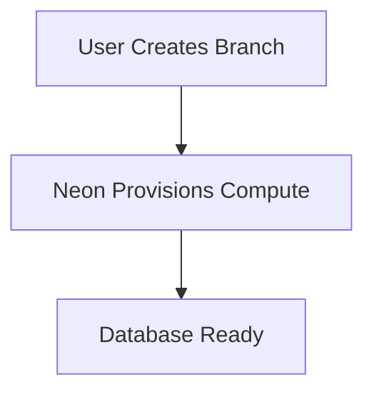

Better than:

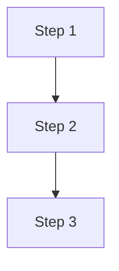

**Consider mobile users:**

- Avoid overly wide diagrams
- Test on smaller screens
- Use top-to-bottom layouts when possible

**Add context:**

- Include a brief description before the diagram
- Explain what the diagram shows
- Reference related documentation

## Testing your diagrams

### Test in Mermaid Live Editor

Before adding a diagram to documentation:

1. Go to [Mermaid Live Editor](https://mermaid.live/)
2. Paste your Mermaid code
3. Verify it renders correctly
4. Check for syntax errors

### Test locally

Run the docs site locally to see how your diagram looks:

```bash
npm run dev
```

Then navigate to your page and:

- Check light mode appearance
- Toggle to dark mode
- Test on mobile viewport
- Verify on different screen sizes

### Common syntax errors

**Missing quotes:**

```text
# Wrong - special characters in labels may cause issues
flowchart TD
    A[Label with special chars!] --> B
```

**Incorrect direction:**

```text
# Wrong - XY is not a valid direction
flowchart XY
    A --> B

# Correct - use TD, LR, RL, or BT
flowchart TD
    A --> B
```

**Broken relationships in ER diagrams:**

```text
# Wrong - incorrect relationship syntax
erDiagram
    A ||--|{ B : has

# Correct - use proper relationship notation
erDiagram
    A ||--o{ B : has
```

## Examples for common Neon use cases

### Branching workflow

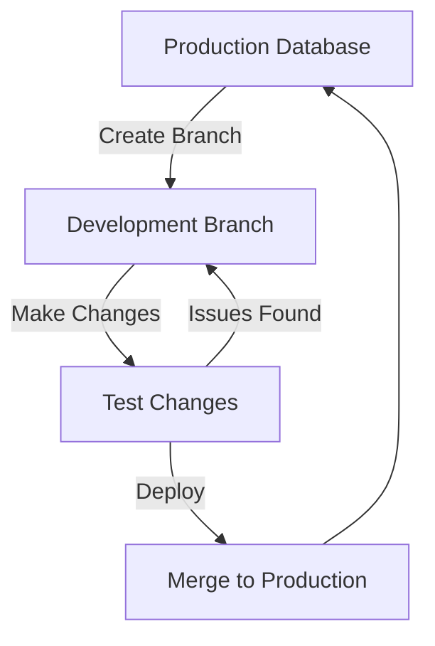

### Autoscaling process

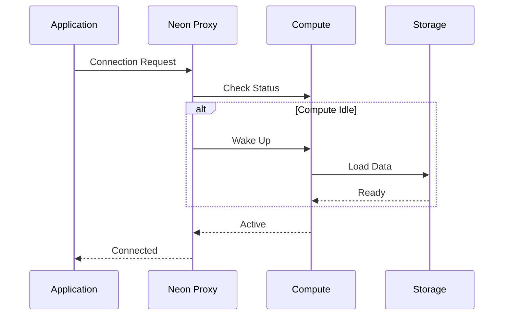

### Multi-tenant architecture

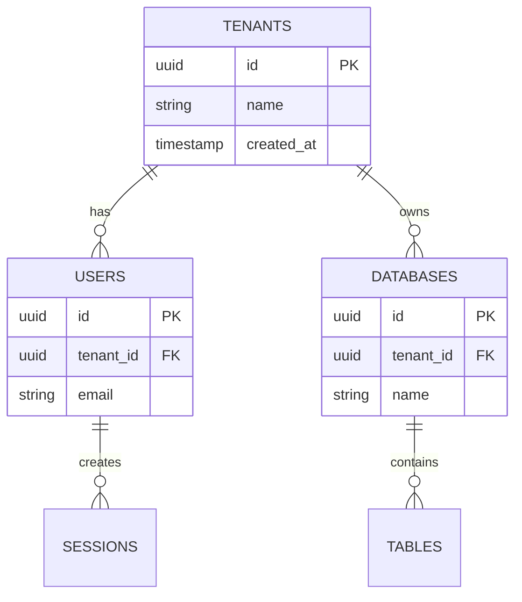

### Compute lifecycle

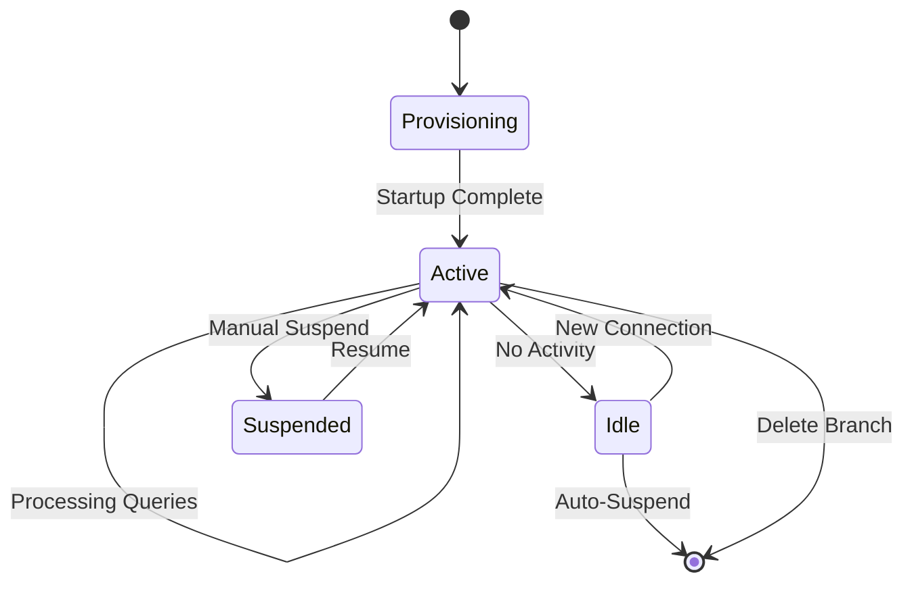

### Migration timeline

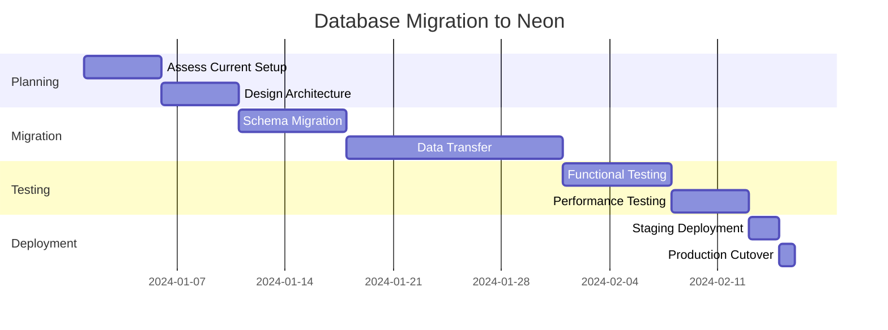

## Troubleshooting

### Diagram not rendering

**Check the language tag:**

Wrong:

````markdown
```diagram
flowchart TD
    A --> B
```
````

Correct:

````markdown
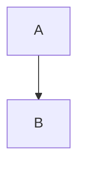
````

**Validate syntax:**

- Use [Mermaid Live Editor](https://mermaid.live/)
- Check for missing quotes, arrows, or semicolons
- Look for typos in diagram type names

### Theme not switching correctly

If diagrams don't update when switching themes:

- Hard refresh the page (Cmd+Shift+R / Ctrl+Shift+R)
- Clear browser cache
- Check browser console for JavaScript errors

### Performance issues

For pages with many diagrams:

- Consider splitting into multiple pages
- Simplify complex diagrams
- Use fewer nodes per diagram

## Additional resources

- **[Mermaid Official Documentation](https://mermaid.js.org/)** - Complete syntax reference
- **[Mermaid Live Editor](https://mermaid.live/)** - Test diagrams before adding to docs
- **[Component Guide](/docs/community/component-guide)** - Other custom components available
- **[Contribution Guide](/docs/community/contribution-guide)** - General documentation guidelines

## Getting help

Need help with Mermaid diagrams?

- **Discord**: Ask in [#docs channel](https://discord.gg/92vNTzKDGp)
- **GitHub**: Open an issue in the [website repository](https://github.com/neondatabase/website)
- **AI**: Use Cursor or Claude to help debug syntax errors

---

Ready to add visual diagrams to your documentation? Start with a simple flowchart and iterate from there. The AI tools make it easy to create professional diagrams quickly!
