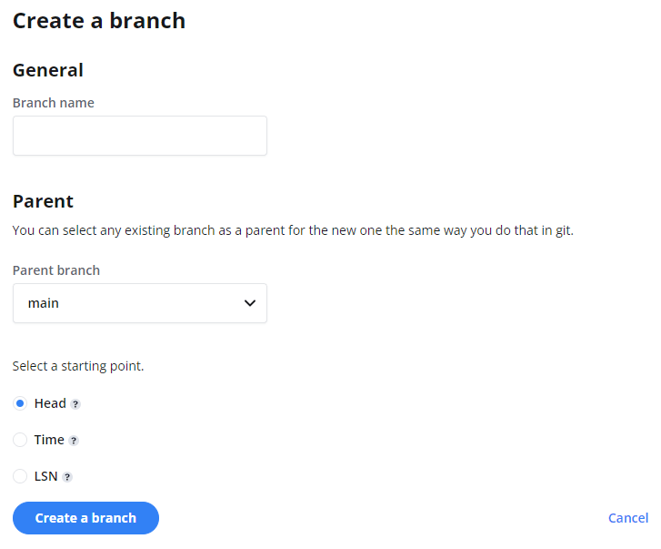

<a id="branches-coming-soon/"></a>

## About branching

Neon allows you to instantly branch your database in the same way that you branch your code. You can quickly and cost-effectively branch a database for development, testing, staging, and various of other purposes, enabling you to improve developer productivity and optimize continuous integration and delivery (CI/CD) pipelines. See [Branching use cases](#branching-use-cases) for a discussion of different ways you can integrate branching into your development workflows.

### What is a branch?

A branch is a copy-on-write clone of an existing branch. You can create a branch from a current or past state of a parent branch. For example, you can create a branch that includes all data up to the point of branch creation or up to a particular time or Log Sequence Number (LSN).

A branch is completely isolated from its parent branch, so you are free to play around with it, modify it, and delete it when it's no longer needed. Changes to the a branch are independent of the parent branch and vice versa. A branch and its parent share the same history but diverge at the point of branch creation. Writes to a branch are persisted as an independent delta.

Creating a branch does not increase load on the parent branch or affect it in any way, which means that you can create a branch at any time without impacting the performance of your production database.

A branch has the following characteristics:

- It is subject to the same technical preview limits as a Neon project:
  - Project data size is limited to 10GB.
  - The Point in Time Reset (PITR) window is limited to 7 days of reasonable usage.
  - The compute node is limited to 1 vCPU and 256MB of RAM.
- Branches are read-write.
- An endpoint is created for each branch, which permits connecting to the branch as you would connect to any Neon project from a PostgreSQL client, an application, or the Neon API.

## Create a branch

Creating a branch requires that you have a Neon project. For information about creating a project, see [Setting up a project](/docs/getting-started-with-neon/setting-up-a-project).

To create a branch:

1. In the Neon Console, select a project.
2. Select the **Branches** tab.
2. Click **New Branch** to open the branch creation page.
  
3. Enter a name for the branch.
4. Select a parent branch. You can branch from your project's `main` branch or a previously created branch.
5. Select one of the following branching options:
    - **Head**: Creates a branch with data up to the current point in time.
    - **Time**: Creates a branch with data up to the specified date and time.
    - **LSN**: Creates a branch with data up to the specified Log Sequence Number (LSN).
6. Click **Create Branch**.

An endpoint is created with each branch, which is required connect to the branch from a PostgreSQL client, an application, or the Neon API.

## View branches

To view the branches associated with a Neon project:

1. Select a project from the project drop-down list at the top of the Neon Console.
2. Select the **Branches** tab.
3. Select the branch from the table to view details about the branch.
  

Branch details include the branch name, parent branch, database size, storage size, and the time the branch was created.


The **Branches** widget on the project **Dashboard** also lists the branches associated with a Neon project. Selecting **Manage** from the **Branches** widget directs you to the **Branches** page, where you can view and manage branches.


## Delete a branch

Deleting a branch is a permanent action that also deletes the endpoint associated with the branch.

To delete a branch:

1. Select a project from the project drop-down list at the top of the Neon Console.
2. Select the **Branches** tab.
3. Select a branch from the table.
3. Click **Delete**.
4. On the **Delete the branch?** dialog, click **Delete**.

## Branching using the Neon API

Any branch action performed in the Neon Console can be performed using the Neon API. The following examples demonstrate how to create, view, and delete branches using the Neon API. For other branch-related API methods, refer to the [Neon API reference](https://neon.tech/api-reference/).

### Prerequisites

A Neon API request requires an API key. For information about obtaining an API key, see [Using API Keys](/docs/get-started-with-neon/using-api-keys). In the cURL examples below, `$NEON_API_KEY` represents the Neon API key. Replace `$NEON_API_KEY` with your API key when issuing a request.

### Create a branch

The following Neon API method creates a branch:

```bash
POST /projects/{project_id}/branches 
```

The API method appears as follows when specified in a cURL command:

```bash
curl -X 'POST' \
  'https://console.stage.neon.tech/api/v2/projects/<project_id>/branches' \
  -H 'accept: application/json' \
  -H 'Content-Type: application/json' \
  -H 'Authorization: Bearer $NEON_API_KEY' \
  -d '{
  "branch": {
    "parent_id": "<parent_id>",
    "name": "<branch_name>"
  }
}
```

- The `<project_id>` for a Neon project is found in the Neon Console on the **Settings** tab, under **General Settings**.
- The `<parent_id>` and `<branch_name>` values can be obtained by listing the branches for your project. See [List branches](#list-branches). The `<parent_id>` is the `id` of the branch you are branching from. Each Neon project is created with a branch named `main`.

The response includes information about the branch, the branch's endpoint, and the `create_branch` and `start_compute` operations that have been initiated.

```bash
{
  "branch": {
    "id": "br-soft-term-199780",
    "project_id": "autumn-lake-518875",
    "parent_id": "br-steep-bonus-114258",
    "name": "staging_branch",
    "current_state": "init",
    "pending_state": "ready",
    "created_at": "2022-10-27T22:57:27Z",
    "updated_at": "2022-10-27T22:57:27Z"
  },
  "endpoints": [
    {
      "id": "ep-red-lake-259266",
      "project_id": "autumn-lake-518875",
      "branch_id": "br-soft-term-199780",
      "instance_type_id": "scalable",
      "region_id": "aws-us-east-1",
      "type": "read_write",
      "current_state": "init",
      "pending_state": "active",
      "settings": {},
      "pooler_enabled": false,
      "pooler_mode": "transaction",
      "allow_connections": true,
      "passwordless_access": true,
      "created_at": "2022-10-27T22:57:27Z",
      "updated_at": "2022-10-27T22:57:27Z",
      "proxy_host": "cloud.stage.neon.tech"
    }
  ],
  "operations": [
    {
      "id": "8bd2e83c-29fb-46ff-a989-4c2162748b2d",
      "project_id": "autumn-lake-518875",
      "branch_id": "br-soft-term-199780",
      "action": "create_branch",
      "status": "running",
      "failures_count": 0,
      "created_at": "2022-10-27T22:57:27Z",
      "updated_at": "2022-10-27T22:57:27Z"
    },
    {
      "id": "12880f24-421c-4b63-a92f-d1c501bf89aa",
      "project_id": "autumn-lake-518875",
      "branch_id": "br-soft-term-199780",
      "endpoint_id": "ep-red-lake-259266",
      "action": "start_compute",
      "status": "scheduling",
      "failures_count": 0,
      "created_at": "2022-10-27T22:57:27Z",
      "updated_at": "2022-10-27T22:57:27Z"
    }
  ]
}
```

### List branches

The following Neon API method lists branches for the specified project.

```bash
GET /projects/{project_id}/branches
```

The API method appears as follows when specified in a cURL command:

```bash
curl -X GET -H 'Authorization: Bearer $NEON_API_KEY' https://console.neon.tech/api/v2/projects/<project_id>/branches |jq
```

The `<project_id>` for a Neon project is found in the Neon Console on the **Settings** tab, under **General Settings**.

Response:

```bash
   {
      "id": "br-steep-bonus-114258",
      "project_id": "autumn-lake-518875",
      "name": "main",
      "current_state": "ready",
      "created_at": "2022-10-24T19:12:18Z",
      "updated_at": "2022-10-24T19:12:19Z"
    },
    {
      "id": "br-snowy-flower-899793",
      "project_id": "autumn-lake-518875",
      "parent_id": "br-steep-bonus-114258",
      "parent_lsn": "0/2C01940",
      "name": "dev_branch",
      "current_state": "ready",
      "created_at": "2022-10-27T16:52:35Z",
      "updated_at": "2022-10-27T16:52:35Z"
    }
  ]
}
```

### Delete a branch

The following Neon API method deletes the specified branch.

```bash
DELETE /branches/{branch_id}
```

The API method appears as follows when specified in a cURL command:

```bash
curl -X DELETE -H 'Authorization: Bearer $NEON_API_KEY' https://console.neon.tech/api/v2/branches/<branch_id>
```

The `<branch_id>` can be found by listing the branches for your project. The `<branch_id>` is the `id` of a branch. See [List branches](#list-branches).

The response shows information about the branch being deleted and the `suspend_compute` and `delete_timeline` operations that were initiated.

```bash
  "branch": {
    "id": "br-snowy-flower-899793",
    "project_id": "autumn-lake-518875",
    "parent_id": "br-steep-bonus-114258",
    "parent_lsn": "0/2C01940",
    "name": "dev_branch",
    "current_state": "ready",
    "created_at": "2022-10-27T16:52:35Z",
    "updated_at": "2022-10-27T17:01:56Z"
  },
  "operations": [
    {
      "id": "bc2f34dc-72be-4efe-918a-30e46e4bd077",
      "project_id": "autumn-lake-518875",
      "branch_id": "br-snowy-flower-899793",
      "endpoint_id": "ep-empty-tooth-523438",
      "action": "suspend_compute",
      "status": "running",
      "failures_count": 0,
      "created_at": "2022-10-27T17:01:56Z",
      "updated_at": "2022-10-27T17:01:56Z"
    },
    {

      "id": "5c6d1ce9-793c-41e7-910e-1af424de4d36",
      "project_id": "autumn-lake-518875",
      "branch_id": "br-snowy-flower-899793",
      "action": "delete_timeline",
      "status": "scheduling",
      "failures_count": 0,
      "created_at": "2022-10-27T17:01:56Z",
      "updated_at": "2022-10-27T17:01:56Z"
    }
  ]
}
```

You can verify that a branch is deleted by listing the branches for your project. See [List branches](#list-branches). The deleted branch should no longer be listed.

## Branching use cases

Neon's branching feature has a variety of possible uses, a few of which are discussed below:

### Development

You can quickly create a branch of your production database that developers are free to play with and modify. You can create a branch instantly with access to all of the data that existed at the time the branch was created, eliminating the setup time required to deploy and maintain a development database. Branching is so easy and cost-effective that you can create a branch for each developer to work on. For example, you can create branches from a primary development branch to assign tasks to be worked on in parallel.

### Testing

Branching enables testers to use the most recent production data. Testers can quickly create new database branches for testing schema changes, validating new queries, or testing potentially destructive queries before deploying them to production. A branch is completely isolated from its parent branch but has access to all of the parent branch's data up to the point of branch creation, which eliminates the effort involved in hydrating database for testing. Testers can also run tests on separate branches in parallel, with each branch having dedicated compute resources.

Another testing scenario enabled by branching is creating a branch from a past point in time to track down and reproduce a failure or data quality issue. Neon permits creating a branch that includes data up to a user-specified time or Log Sequence Number (LSN). For example, you can create and dispose of as many point-in-time database branches as necessary to determine when an issue first occurs.

### Staging

With Neon's branching capabilities, you can create a staging database by branching your production database. Using the Neon API, you can automate the creation of a database branch for every pull request in your CI/CD pipeline.

### Data recovery

If you lose data due to an unintended deletion or some other event, you can create a branch of your database with the data as it existed before the event occurred allowing you to recover the lost data. Neon allows you to create a branch with the data that existed up to a particular time or Log Sequence Number (LSN).

### Analytics

You can run costly, long-running queries on an isolated branch of your production data, each with its own compute resources. With automation scripts, you can create and dispose of branches on a defined schedule to ensure that queries always run on an up-to-date copy of production data.

### Machine Learning

You can create point-in-time branches to ensure repeatability when training machine learning models.
