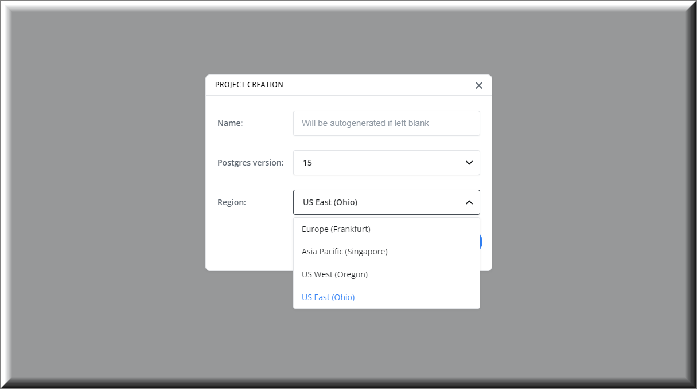

Neon supports project deployment in several regions. We recommended that you select the region closest to your application server to reduce latency between your Neon project and your application.

## Available regions

Neon currently supports the following AWS regions:

- US East (Ohio) &mdash; `us-east-2`
- US West (Oregon) &mdash; `us-west-2`
- Europe (Frankfurt) &mdash; `eu-central-1`
- Asia Pacific (Singapore) &mdash; `ap-southeast-1`

## Select a region for your Neon project

You can select the region for your Neon project during project creation. See [Setting up a project](../../get-started-with-neon/setting-up-a-project).

All branches and databases created in a Neon project are created in the region selected for the project.

_**Note**_: Once you select a region for a Neon project, it cannot be changed for that project.

## Moving project data to a new region

If you need to move your data to a different region, the following steps are recommended:

1. Create a new project in the desired region. For project creation instructions, see [Setting up a project](../../get-started-with-neon/setting-up-a-project).
1. Move your data from the old project to the new project. For instructions, see [Import data from PostgreSQL](../../how-to-guides/import-an-existing-database).

Moving data to a new Neon project may require downtime if you are moving a production database, as the import procedure may take some time depending on the size of your data. To prevent the loss of data during the import operation, consider disabling writes from your applications before initiating the import operation. You can re-enable writes when the import is completed. Neon does not currently support disabling database writes. Writes must be disabled at the application level.

To request support for additional regions, please visit the [Hosting in other AWS regions](https://community.neon.tech/t/hosting-in-other-aws-regions/81/5) topic in the Neon Community Forum.
