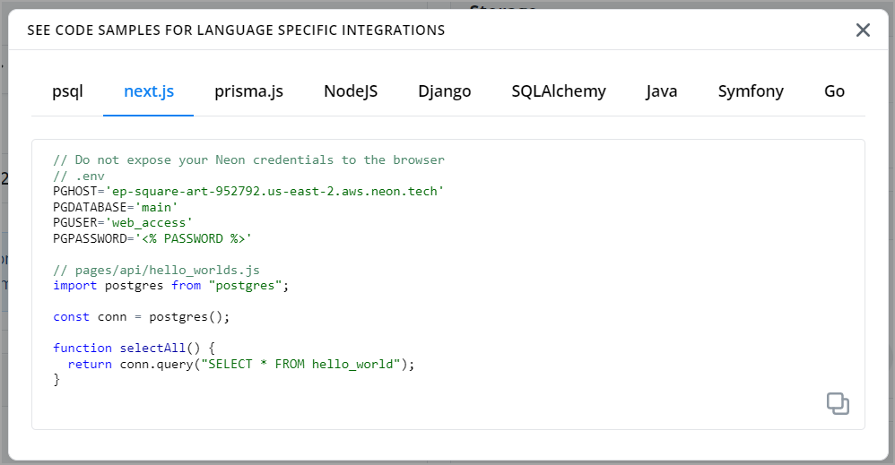

When connecting to Neon from an application or client, you will need to connect to a database in your Neon project. In Neon, a database belongs to a branch, which may the root branch of your project (`main`) or a child branch. The root branch in a Neon project has a default database named `neondb`.

To connect to a database, you must connect to the branch where the database resides, and you must do so by connecting through an endpoint, which is the compute instance associated with the branch.

```text
Project
    |----root branch (main) ---- endpoint (compute) <--- application/client
             |    |
             |    |---- database (neondb)
             |
             ---- child branch ---- endpoint (compute) <--- application/client
                            |
                            |---- database (mydb)  
```

You can obtain the connection details that you require from the **Connection Details** widget on the **Neon Dashboard**. Select a branch, a user, and the database you want to connect to. A connection string is constructed for you.


A Neon connection string includes the user, the endpoint hostname, and the database name.

```text
postgres://casey@ep-square-sea-260584.us-east-2.aws.neon.tech/neondb
             ^                       ^                          ^
             |- <user>               |- <endpoint_hostname>     |- <database>
```

<Admonition type="note">
When an application or client requires a PostgreSQL host, it is the endpoint hostname that you should provide. An endpoint hostname, such as the one shown above, is comprised of an `endpoint_id` (`ep-square-sea-260584`), a region slug (`us-east-2`), the cloud platform (`aws`), and the Neon domain (`neon.tech`).
</Admonition>

You can use the details from the connection string or the connection string itself to configure a connection. For example, you might place the connection details in an `.env` file, assign the connection string to a variable, or pass the connection string on the command-line, as shown:

`.env` file:

```text
PGHOST='ep-square-sea-260584.us-east-2.aws.neon.tech'
PGDATABASE='neondb'
PGUSER='casey'
PGPASSWORD='<password>'
PGPORT='5432'
```

Variable:

```text
DATABASE_URL="postgres://casey:<password>@ep-square-sea-260584.us-east-2.aws.neon.tech:5432/neondb"
```

Command-line:

```bash
psql postgres://casey:<password>@ep-square-sea-260584.us-east-2.aws.neon.tech/neondb
```

<Admonition type="note">
For information about connecting with `psql`, see [Connect with psql](../query-with-psql-editor). Please be aware that some older client libraries and drivers, including older `psql` executables, are built without SNI support and require a workaround. For more information, see [Connecting from older clients](../connectivity-issues).

Some Java-based tools that use the pgJDBC driver for connecting to PostgreSQL, such as DBeaver, DataGrip, and CLion, do not support inclusion of a user name and password in a database connection string. When you find that a full connection string is not accepted, try entering the user name and password values in the appropriate fields in the tool's UI when configuring a connection to Neon.
</Admonition>

## Where do I obtain a password?

A password was provided to you when you created your Neon project. If you have misplaced your password, refer to [Reset a password](../../manage/users/#reset-a-password) for password reset instructions.

## What port does Neon use?

Neon uses the default PostgreSQL port, `5432`.

## Connection examples

The **Connection Details** widget on the **Neon Dashboard** also provides connection examples for different languages and frameworks, constructed for the branch, database, and user that you select. Click **connection examples**  in the **Connection Details** widget to view or copy the examples.



Connection examples for various languages and frameworks are also provided in our *Guides* documentation.
