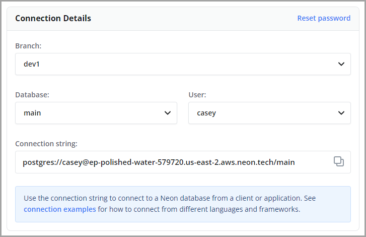

The following instructions require a working installation of [psql](https://www.postgresql.org/download/). The `psql` client is the native command-line client for PostgreSQL. It provides an interactive session for sending commands to PostgreSQL and running ad-hoc queries. For more information about `psql`, refer to the [psql reference](https://www.postgresql.org/docs/15/app-psql.html), in the _PostgreSQL Documentation_.

<Admonition type="note">
A Neon compute instance runs PostgreSQL, which means that any PostgreSQL application or standard utility such as `psql` is compatible with Neon. You can also use PostgreSQL client libraries and drivers to connect.

Neon also provide a passwordless connect feature that uses `psql`. For more information, see [Passwordless connect](../passwordless-connect).
</Admonition>

The easiest way to connect to Neon using `psql` is with a connection string.

You can obtain a connection string from the **Connection Details** widget on the **Neon Dashboard**. Select a branch, a user, and the database you want to connect to. A connection string is constructed for you.



From your terminal or command prompt, run the `psql` client with the connection string copied from the Neon **Dashboard**, but be sure to add your password, as shown:

```bash
psql postgres://casey:<password>@ep-polished-water-579720.us-east-2.aws.neon.tech/main
```

## Where do I obtain a password?

The connection string on the Neon **Dashboard** only includes a password immediately after you create a project. The password no longer appears in the connection string once you navigate away from the Neon Console or refresh the browser. If you have misplaced your password, refer to [Users](tbd) for password reset instructions.

## What port does Neon use?

Neon uses the default PostgreSQL port, `5432`. If you need to specify the port in your connection string, you can do so as follows:

```bash
psql postgres://casey:<password>@ep-polished-water-579720.us-east-2.aws.neon.tech:5432/main
```
  
## Running queries

After establishing a connection, try running the following queries:

```sql
CREATE TABLE my_table AS SELECT now();
SELECT * FROM my_table;
```

The following result set is returned:

```sql
SELECT 1
              now
-------------------------------
 2022-09-11 23:12:15.083565+00
(1 row)
```
