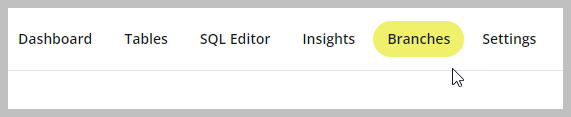

This topic describes how to get started with Neon's branching feature, which allows you to branch your data in the same way that you branch your code.

A branch is a clone of your data that you are free to play around with and modify without affecting the originating data.

You can create a branch using the Neon Console or Neon API. In this topic, we'll cover how to create a branch using the Neon Console and how to connect to a branch. For Neon API branching instructions, see [Branching with the Neon API]. 

Before you can create a branch, you must have a Neon project to branch from. If you do not have a Neon project, see [Setting up a project](./setting-up-a-project).

## Creating a branch

To create a branch:

1. On the Neon Console, select the Neon project that you want to branch from.

  

2. Select the **Branches** tab.

  

3. Click **New Branch** to open the branch creation dialog.

  

4. Enter a name for the branch.
5. Select a parent branch. You can branch from your Neon project's `main` branch or a previously created branch. Every Neon project is created with a default branch called `main`.  
6. Select one of the following branching options:
    - **Head**: Creates a branch with data up to the current point in time (the default).
    - **Time**: Creates a branch with data up to the specified date and time.
    - **LSN**: Creates a branch with data up to the specified [Log Sequence Number (LSN)](../../reference/glossary/#lsn).
7. Click **Create Branch** to create your branch.

You are directed to the **Branches** tab where you are shown the details for your new branch.

## Connecting to a branch

Now that you have created a branch, how do you connect to it? You can connect to a branch using a connection string, as you would connect to any Neon database. The following steps describe how to connect to a branch using `psql`.

_**Note:**_ You can also query a branch from the Neo Console's SQL Editor. For instructions, see [Query from psql](/query-with-neon-sql-editor).

You can obtain a branch connection string from the **Connection Details** widget on the project dashboard.

1. On the Neon Console, select a project from the project drop-down list at the top of the console.

  

2. On the project **Dashboard**, under **Connection Details**, select the branch, the database, and the user you want to connect with.

  

3. Copy the connection string.

4. Obtain a password for your branch by navigating to **Settings** > **Users**. Select the user you want to connect with and click **Reset password**.

  

4. Add your password to the connection string as shown below, and connect with `psql`:

  ```bash
  psql postgres://casey:<password>@ep-snowy-butterfly-311850.cloud.neon.tech/main
  ```

If you want to connect to a branch from an application, the **Connection Details** widget on the project **Dashboard** also provides connection details for various languages and frameworks.

## Next steps

For more information about branches, including how to view them, delete them, and use them in your development workflows, see [Branching workflows].
