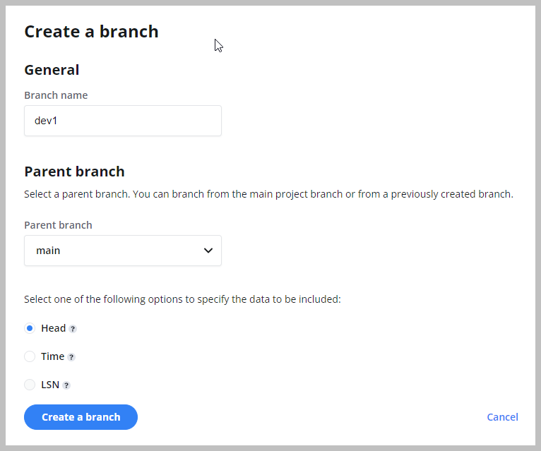
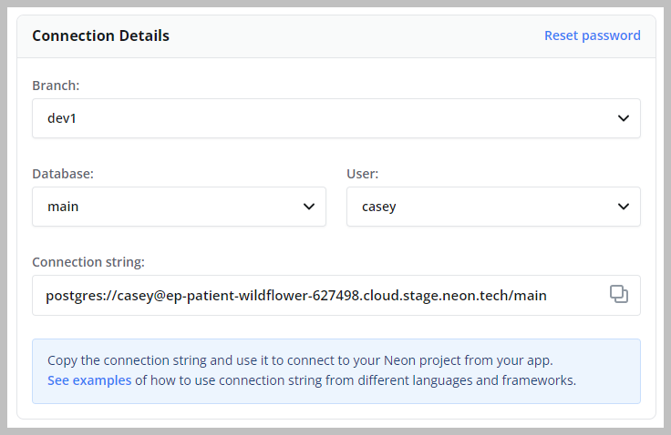
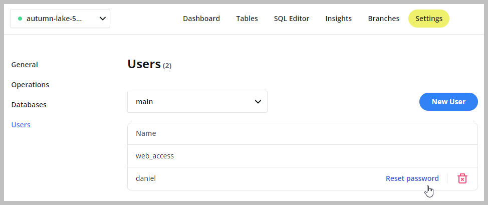

This topic describes how to get started with Neon's branching feature, which allows you to branch your data in the same way that you branch your code.

A branch is a clone of your data that you are free to play around with and modify without affecting the originating data.
For more information about what branches are and how to use them in your development workflows, see [Branching](../../conceptual-guides/branching).

_Neon Branching capabilities are not yet publicly available. If you would like to try this feature, reach out to [iwantbranching@neon.tech](mailto:iwantbranching@neon.tech) describing your use case and requesting that Neon enable branching for your account._

You can create and manage branches using the Neon Console or Neon API. In this topic, we cover branching using the Neon Console.

Before you can create a branch, you must have a Neon project to branch from. If you do not have a Neon project, see [Setting up a project](./setting-up-a-project).

## Create a branch

To create a branch:

1. On the Neon Console, select the Neon project that you want to branch from.
2. Select the **Branches** tab.
3. Click **New Branch** to open the branch creation dialog.

4. Enter a name for the branch.
5. Select a parent branch. You can branch from your Neon project's `main` branch or a previously created branch. Every Neon project is created with a default branch called `main`.  
6. Select one of the following branching options:
    - **Head**: Creates a branch with data up to the current point in time (the default).
    - **Time**: Creates a branch with data up to the specified date and time.
    - **LSN**: Creates a branch with data up to the specified [Log Sequence Number (LSN)](../../reference/glossary/#lsn).
7. Click **Create Branch** to create your branch.

You are directed to the **Branches** tab where you are shown the details for your new branch.

## View branches

To view the branches in a Neon project:

1. In the Neon Console, select a project from the project drop-down list.
2. Select the **Branches** tab to view the branches for the project.
3. Select a branch from the table to view details about the branch.

The **Branches** widget on the project **Dashboard** also lists the branches in a Neon project. Selecting **Manage** from the **Branches** widget directs you to the **Branches** page, where you can view and manage branches.

## Connect to a branch

Now that you have created a branch, how do you connect to it? You can connect to a branch using a connection string, as you would when connecting to any Neon database. The following steps describe how to connect to a branch using `psql`.

_**Note:**_ You can also query a branch from the Neon SQL Editor. For instructions, see [Query with Neon's SQL Editor](/query-with-neon-sql-editor).

You can obtain a branch connection string from the **Connection Details** widget on the project dashboard.

1. On the Neon Console, select a project from the project drop-down list at the top of the console.
2. On the project **Dashboard**, under **Connection Details**, select the branch, the database, and the user you want to connect with.

3. Copy the connection string. A connection string includes your user name, endpoint name, and database name. The endpoint name is the name of the compute instance associated with the branch.
4. Obtain a password for your branch by navigating to **Settings** > **Users**. Select the user you want to connect with and click **Reset password**.

5. Add your password to the connection string as shown below, and connect with `psql`.

  ```bash
  psql postgres://casey:<password>@ep-patient-wildflower-627498.cloud.neon.tech/main
  ```

If you want to connect to a branch from an application, the **Connection Details** widget on the project **Dashboard** also provides connection examples for various languages and frameworks.

## Delete a branch

Deleting a branch is a permanent action. Deleting a branch also deletes the branch endpoint, which is the compute instance associated with the branch.

To delete a branch:

1. In the Neon Console, select a project from the project drop-down list.
2. Select the **Branches** tab.
3. Select a branch from the table.
3. Click **Delete**.
4. On the **Delete the branch?** dialog, click **Delete**.
