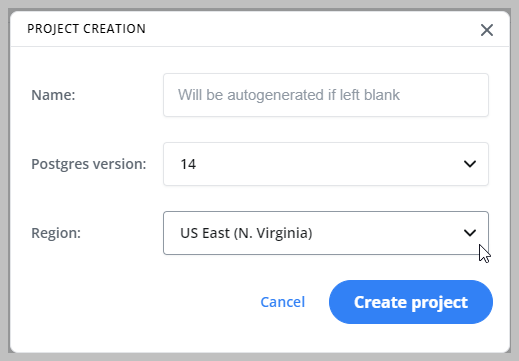

Neon supports project deployment in several regions. It is recommended that you select the region closest to your application server to reduce latency between your Neon project and your application.

## Available regions

Neon currently supports the following AWS regions:

- Asia Pacific (Singapore) Region &mdash; `ap-southeast-1`
- Europe (Frankfurt) Region &mdash; `eu-central-1`
- US East (Ohio) Region &mdash; `us-east-2`

## Select a region for your Neon project

You can select the region for your Neon project during project creation. All databases created in a Neon project are created in the region selected for the project.

_**Note**_: Once you select region for a Neon project, it cannot be changed.

## Moving project data to a new region

The region for an existing Neon project cannot be changed.

If you need to move your data to a different region, the following steps are recommended:

1. Create a new project in the new region. For project creation instructions, see [Setting up a project](../setting-up-a-project).
1. Dump and restore data from your old project to the new project. For instructions, see [Import data from PostgreSQL](../../how-to-guides/import-an-existing-database).

Migrating your data to a new project may require downtime if you are migrating from your production database, as the dump and restore procedure may take some time to complete. To avoid losing data, consider blocking writes from your applications before dumping data, and re-enabling writes when the data migration is completed.
