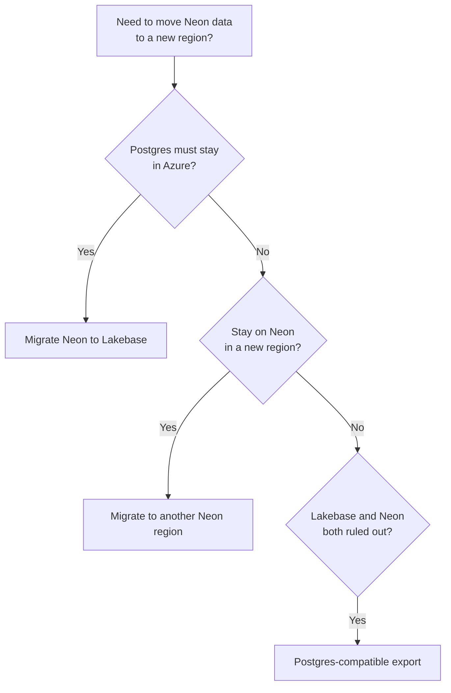

**Can you change the region of an existing Neon project?** Not directly, but you have options. A Neon **project** is created in a single [region](/docs/introduction/regions), and that region is fixed after creation. All branches in a project share the project's region, so branching alone won't move your data.

To run your database in a different region, you **create a new Neon project** in that region and **migrate your database** into it.

Common reasons to migrate to a different region:

- Your app moved to a different region and you want lower latency between your app and database.
- You need to set up a new environment in another region.
- You are migrating away from a [deprecated Neon Azure](/docs/introduction/regions#azure-regions) region.

<Admonition type="note" title="Databricks Lakebase">
If you must keep Postgres in Azure for residency or colocation, Databricks Lakebase Postgres supports Azure regions. See **[Migrate Neon to Lakebase](/docs/guides/migrate-neon-to-lakebase)**.
</Admonition>

## Choose a path

Use the flowchart to pick a migration path that fits your requirements.

## Select a migration guide

Select the guide that matches your requirements.

1. **[Migrate to another Neon region](/docs/import/migrate-neon-to-another-region)**. Compare the **Import Data Assistant**, dump and restore, and logical replication, then follow the guide linked from that page.
2. **[Migrate Neon to Lakebase](/docs/guides/migrate-neon-to-lakebase)**. Create a Lakebase project, **`pg_dump`** from Neon, **`pg_restore`** on Lakebase.
3. **[Postgres-compatible export from Neon](/docs/guides/export-neon-postgres-compatible)**. If another Neon region and Lakebase do not meet your requirements, use `pg_dump` to export your data in a Postgres-compatible format for migration elsewhere.

<NeedHelp/>
