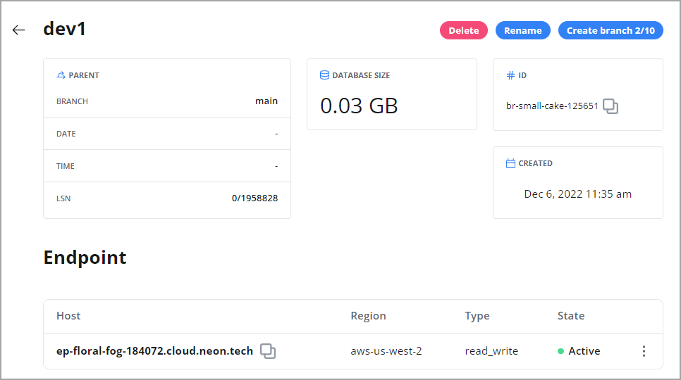

Data resides in a branch. Each Neon project has a root branch called `main`. You can create child branches from `main` or from previously created branches. A branch can contain multiple databases and users. Tier limits define the number of branches you can create in a project and the amount of data you can store in each branch.

A child branch is a copy-on-write clone the data in the parent branch. You can modify the data in a branch without affecting the data in the parent branch.
For more information about branches and how you can use them in your development workflows, see [Branching](../../conceptual-guides/branching).

You can create and manage branches using the Neon Console or [Neon API](https://neon.tech/api-reference). This topic covers branching using the Neon Console.

Before you can create a branch, you must have a Neon project. If you do not have a Neon project, see [Projects](../projects/#create-a-project).

## Create a branch

To create a branch:

1. In the Neon Console, select a project.
2. Select **Branches**.
3. Click **New Branch** to open the branch creation dialog.

4. Enter a name for the branch.
5. Select a parent branch. You can branch from your Neon project's [root branch](../../reference/glossary/#root-branch) (`main`) or a previously created branch.
6. Select one of the following branching options:
    - **Head**: Creates a branch with data up to the current point in time (the default).
    - **Time**: Creates a branch with data up to the specified date and time.
    - **LSN**: Creates a branch with data up to the specified [Log Sequence Number (LSN)](../../reference/glossary/#lsn).
7. Click **Create Branch** to create your branch.

You are directed to the **Branches** page where you are shown the details for your new branch.

## View branches

To view the branches in a Neon project:

1. In the Neon Console, select a project.
2. Select **Branches** to view the branches for the project.
3. Select a branch from the table to view details about the branch.



<Admonition type="note">
Each branch is created with a read-write endpoint, which is the compute instance associated with the branch. To connect to a database in a branch, you must connect via an endpoint. For instructions, see [Connect to a branch database](#connect-to-a-branch-database). 
</Admonition>

The **Branches** widget on the project **Dashboard** also lists the branches in a Neon project. Selecting **Manage** from the **Branches** widget directs you to the **Branches** page, where you can view and manage branches.

## Connect to a branch

Connecting to a database in a branch requires connecting via an endpoint, which is the compute instance associated with a branch. The following steps describe how to connect using `psql` and a connection string obtained from the Neon Console.

<Admonition type="tip">
You can also query the databases in a branch from the Neon SQL Editor. For instructions, see [Query with Neon's SQL Editor](../query-with-neon-sql-editor).
</Admonition>

1. In the Neon Console, select a project.
2. On the project **Dashboard**, under **Connection Details**, select the branch, the database, and the user you want to connect with.

3. Copy the connection string. A connection string includes your user name, the endpoint hostname, and database name. The endpoint is the compute instance associated with the branch.
5. Add your password to the connection string as shown below, and connect with `psql`. You can connect using the same user and password that you use to connect to the parent branch.

  ```bash
  psql postgres://casey:<password>@ep-polished-water-579720.us-east-2.aws.neon.tech/main
  ```

<Admonition type="tip">
A endpoint hostname starts with an `ep-` prefix. You can also find an endpoint hostname in the branch connection string in the **Connection Details** widget on the project **Dashboard**. An endpoint hostname can also be found on the **Branches** page in the Neon Console. See [View branches](#view-branches).
</Admonition>

If you want to connect from an application, the **Connection Details** widget on the project **Dashboard** and the _Guides_ section in the documentation provide connection examples for various languages and frameworks. For more information about connecting, see [Connect from any application](../../connect/connect-from-any-app).

## Delete a branch

Deleting a branch is a permanent action. Deleting a branch also deletes the databases and users that belong to the branch as well as the branch endpoint, which is the compute instance associated with the branch. You cannot delete a branch that has child branches. The child branches must be deleted first.

To delete a branch:

1. In the Neon Console, select a project.
2. Select **Branches**.
3. Select a branch from the table.
3. Click **Delete**.
4. On the confirmation dialog, click **Delete**.

## Check the data size

Tier limits define the amount of data you can store in a branch. Neon's free tier permits 3GB per branch.

You can check the data size for a branch in the **Storage** widget on the Neon **Dashboard** or by viewing the `DATABASE SIZE` value on the **Branches** page (see [View branchings](#view-branches)). Alternatively, you can run the following query from the Neon SQL Editor:

```sql
SELECT pg_size_pretty(sum(pg_database_size(datname)))
FROM pg_database;
```

<Admonition type="info">
Neon stores data in its own internal format.
</Admonition>
