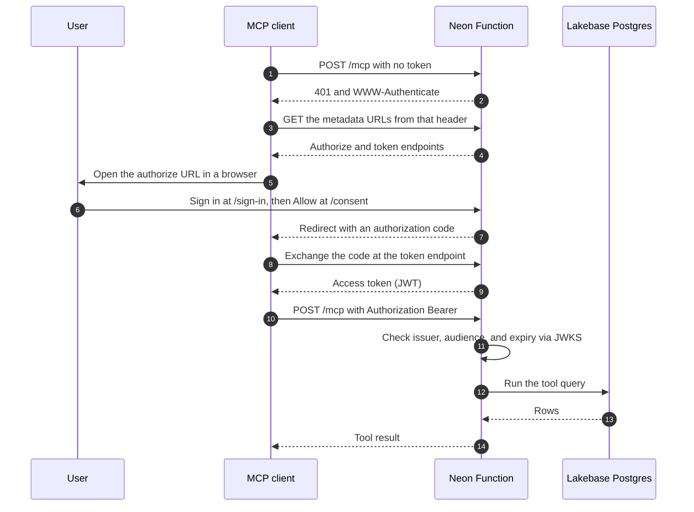

An AI assistant like Cursor or Claude needs tools it can call over the internet to work with your APIs, your backend, or your data. [Model Context Protocol](https://modelcontextprotocol.io/) (MCP) is the standard for providing those tools. An MCP server advertises a set of tools, each with a description the model reads and a schema for its arguments. When the user asks for something, the model picks a tool, fills in the arguments, and the client sends the call to your server. Your server runs the code and returns a result the assistant can read.

For example, you ask the assistant to "Add Ada Lovelace to my contacts." The assistant picks a tool named `create_contact`, fills in the values it can infer from your message, and sends the call to your server. Your server inserts the row in Postgres, replies with the created contact, and the assistant confirms it. The model never touches the database; it only sees the tool descriptions and the results.

In this guide, you'll build a small contacts app served over MCP. The server is a [Neon Function](/docs/compute/functions/overview) running in the same region as your Lakebase Postgres database on Neon, so queries stay fast.

Here's what you'll build:

- A **Hono app** on Neon Functions that exposes three tools (create, search, and delete contacts) over the streamable HTTP transport, using the MCP TypeScript SDK
- **Postgres-backed tools** with Drizzle ORM
- A **stable URL on your own domain** with [custom domains for Neon Functions](/docs/compute/functions/custom-domains), so client configs and OAuth settings survive redeploys
- **Authentication**, either a shared API key or OAuth 2.1 through [Better Auth](https://www.better-auth.com) and its MCP plugin, so a client can sign the user in through the browser

<CopyPrompt
  src="/prompts/deploy-mcp-server-on-neon-functions-prompt.md"
  description="Use this prompt to customize the guide and build it with your AI agent."
  buttonText="Copy prompt"
/>

<Callout title="This page hosts your own MCP server">
The [Neon MCP Server](/docs/ai/neon-mcp-server) lets an assistant manage Neon itself (projects, branches, SQL against a project you connect). This guide hosts a different server: your tools, your API, your data.
</Callout>

## How it works

An MCP setup has two parts. The **MCP client** is the app where the user chats, such as Cursor or Claude Code, and it holds the connection to your server. Your code is the **MCP server**: it advertises the tools and runs them when asked. The two talk over HTTP using [JSON-RPC 2.0](https://www.jsonrpc.org/specification), a small request/response format where every message names a method such as `tools/list`. The MCP SDK handles the protocol for you so you can focus on the tools themselves.

Here's the typical flow of a request from the client to your server:

1. **Request**: The MCP client sends JSON-RPC to `https://mcp.example.com/mcp`.
2. **Authentication**: The function checks the caller before any tool runs. With an API key, that's a string compare on the `Authorization` header. With OAuth, it verifies the access token against Better Auth's JWKS endpoint and reads the user identity from the claims.
3. **Tool execution**: The SDK matches the method to a tool handler, which queries Postgres through Drizzle.
4. **Response**: The handler returns a `content` array, the SDK wraps it in a JSON-RPC result, and the client hands the text to the model.

## Prerequisites

Before starting, ensure you have:

1. **Node.js**: Version 22 or later. Download from [nodejs.org](https://nodejs.org/).
2. **Neon Account**: Sign up for an account at [console.neon.tech](https://console.neon.tech/signup).
3. **Neon CLI**: Installed globally (`npm i -g neon@latest`) and authenticated (`neon login`). Check out the [Neon CLI Quickstart](/docs/cli/quickstart) for details.
4. **A domain (optional)**: To serve the function from your own URL, you'll need a domain. If you don't have one, you can still deploy the function and test it using the native Neon Function URL. Throughout this guide, whenever you see `mcp.example.com`, replace it with your own domain or the native function URL.

<Steps>

## Set up the project

Create a directory for your project and initialize it:

```bash
mkdir contacts-mcp && cd contacts-mcp
npm init -y
```

Install the Neon agent skills so AI agents like Claude Code and Cursor have the context to help you build and deploy. This project uses the **Neon**, **Neon Functions** and **Neon Postgres** skills:

```bash
neon skills -s neon -s neon-postgres -s neon-functions
```

When prompted, select the AI assistant you'd like to use (for example, Claude Code or Cursor) and confirm the recommended skills. This will provide your agent with the necessary context to assist you with Neon.

Next, link your local workspace to a Neon project. Run the following command:

```bash
neon link
```

You'll be prompted to select your organization, then a project. **Create a new project** named `contacts-mcp` (or pick an existing one), then select a region. Choose **AWS US East (Ohio)** (`aws-us-east-2`), **AWS US East (N. Virginia)** (`aws-us-east-1`), **AWS Europe (Frankfurt)** (`aws-eu-central-1`), or **AWS Asia Pacific (Singapore)** (`aws-ap-southeast-1`); this guide uses US East (Ohio). Neon Functions are currently available in these regions. Support is expanding toward [all regions](/docs/introduction/regions).

Confirm that you want to manage your setup as code, which generates a `neon.ts` file in your project root. Then, when asked which Neon services you require, select **Functions**:

```text
$ neon link
✔ Which organization would you like to link? › MyOrg (org-example-12345678)
✔ Which project would you like to link? › ＋ Create new project…
✔ Name for the new project: … contacts-mcp
✔ Which region should the new project run in? › AWS US East 2 (Ohio) (aws-us-east-2)
Created project quiet-fog-09491284 ("contacts-mcp") in aws-us-east-2.
Linked ~/contacts-mcp/.neon:
  orgId:     org-example-12345678
  projectId: quiet-fog-09491284
  branch:    main

✔ Manage this project's Neon setup as code? Adds a neon.ts you can edit and apply with `neon config apply`. … yes

INFO: Pulled 3 Neon variables into ~/contacts-mcp/.env.local: NEON_BRANCH, DATABASE_URL, DATABASE_URL_UNPOOLED
INFO: Created neon.ts declaring functions.
INFO: Created hello.ts - the source of the hello function.
```

The `neon link` command also creates a placeholder function, `hello.ts`, at your project root. You'll build the MCP server in your own files, so delete the placeholder:

```bash
rm hello.ts
```

It also creates a `.env.local` file with your Neon project variables, including `DATABASE_URL`. Your function uses these to connect to the database.

Next, install the dependencies you'll need for the MCP server:

```bash
npm install hono @neon/functions @modelcontextprotocol/server drizzle-orm pg zod dotenv
npm install --save-dev drizzle-kit @types/node @types/pg typescript esbuild
```

Here's what each package does:

- `hono`: A lightweight web framework for routing. Neon Functions support Hono by default.
- `@neon/functions`: Neon's package for Postgres pool management in functions.
- `@modelcontextprotocol/server`: The MCP server SDK used to register tools and handle JSON-RPC requests.
- `drizzle-orm` and `pg`: The ORM and the Node.js Postgres driver it uses to query your database.
- `zod`: Schema validation for tool input and output, which the MCP SDK uses to validate arguments before they reach your handlers.
- `dotenv`: Loads `.env.local` into the environment for local scripts like Drizzle Kit and the Better Auth CLI.

You'll also need a `tsconfig.json` file to tell TypeScript how to compile the function. Create it in the project root:

```json filename="tsconfig.json"
{
  "compilerOptions": {
    "target": "ES2022",
    "module": "NodeNext",
    "moduleResolution": "NodeNext",
    "types": ["node"],
    "strict": true,
    "esModuleInterop": true,
    "skipLibCheck": true,
    "forceConsistentCasingInFileNames": true
  }
}
```

## Build the contacts MCP server

You'll build a simple contacts app with three tools: `create_contact`, `search_contacts`, and `delete_contact`.

<Admonition type="info" title="What is an MCP tool?">
A tool is a function with: a name the model can call, a plain-language description of what it does, a schema that describes its arguments, and the function that runs. You write the function; the MCP SDK handles the protocol around it, including the initialization handshake, list of tools, and the JSON-RPC request/response. The SDK also validates the arguments against the schema before they reach your function, so you can assume the values are present and of the right type.
</Admonition>

Each contact has a name, email, phone number, company, and free-form notes. The model can call `create_contact` to add a new row, `search_contacts` to find rows by substring, and `delete_contact` to remove a row by id.

### Define the database schema

Create `src/schema.ts` to define the `contacts` table. Drizzle Kit reads this file to create the table in Postgres, and the MCP handlers import it to build queries.

```typescript filename="src/schema.ts"
import { pgTable, serial, text, timestamp } from 'drizzle-orm/pg-core';

export const contacts = pgTable('contacts', {
  id: serial('id').primaryKey(),
  name: text('name').notNull(),
  email: text('email'),
  phone: text('phone'),
  company: text('company'),
  notes: text('notes'),
  createdAt: timestamp('created_at').defaultNow().notNull(),
  updatedAt: timestamp('updated_at').defaultNow().notNull(),
});
```

`id` is an auto-incrementing primary key, `name` is required, and the rest of the columns are optional. `created_at` and `updated_at` default to the current time.

### Create the database client

Create `src/db.ts` to export a Drizzle client that connects to the branch on Neon. The MCP handlers import this client to run queries.

```typescript filename="src/db.ts"
import { attachDatabasePool } from '@neon/functions';
import { drizzle } from 'drizzle-orm/node-postgres';
import { Pool } from 'pg';
import { contacts } from './schema';

const pool = new Pool({ connectionString: process.env.DATABASE_URL, max: 5 });
attachDatabasePool(pool);

export const db = drizzle(pool);
```

The pool is created once at module scope, so requests on the same instance reuse its connections. Call `attachDatabasePool(pool)` once after creating the pool: when Postgres drops an idle client (scale-to-zero, pooler reclaim, a TCP reset), `pg` emits an `error` on the pool, and with no listener attached, that becomes an uncaught exception and the isolate exits. `attachDatabasePool` swallows expected idle disconnects and logs anything unexpected, so the next query opens a fresh connection. You don't need to drain the pool on shutdown. When the runtime evicts an isolate, Neon's pooler reclaims those connections for you. See [Connecting to Postgres](/docs/compute/functions/get-started#connect-to-postgres) for the full picture.

### Create the Hono app with the MCP endpoint

Create an `index.ts` file at the project root. It builds the MCP server, registers the three tools, and exposes them at the `/mcp` endpoint through Hono. The MCP SDK owns the protocol details; your code is the three tool functions and their schemas.

The file has three parts: a helper that shapes results, a factory that creates the server and registers the tools, and a Hono app with the routes.

```typescript shouldWrap filename="index.ts"
import { Hono } from 'hono';
import { and, eq, ilike, or } from 'drizzle-orm';
import { z } from 'zod';
import { McpServer, createMcpHandler } from '@modelcontextprotocol/server';
import { db } from './src/db';
import { contacts } from './src/schema';

function asTextResult(payload: unknown, isError = false) {
  return {
    content: [{ type: 'text' as const, text: JSON.stringify(payload, null, 2) }],
    isError,
  };
}

function createServer() {
  const server = new McpServer({ name: 'contacts-mcp', version: '1.0.0' });

  server.registerTool(
    'create_contact',
    {
      title: 'Create contact',
      description: 'Create a new contact in the contacts database.',
      inputSchema: z.object({
        name: z.string().min(1).describe('Full name of the contact.'),
        email: z.string().optional().describe('Email address.'),
        phone: z.string().optional().describe('Phone number.'),
        company: z.string().optional().describe('Company or organization.'),
        notes: z.string().optional().describe('Free-form notes.'),
      }),
    },
    async ({ name, email, phone, company, notes }) => {
      const [row] = await db
        .insert(contacts)
        .values({ name, email, phone, company, notes })
        .returning();
      return asTextResult({ created: row });
    },
  );

  server.registerTool(
    'search_contacts',
    {
      title: 'Search contacts',
      description:
        'Search contacts by name, email, company, or notes. Omit the query to list all contacts.',
      inputSchema: z.object({
        query: z
          .string()
          .optional()
          .describe('Case-insensitive substring to match; omit to list everyone.'),
        limit: z
          .number()
          .int()
          .positive()
          .max(100)
          .default(20)
          .describe('Maximum number of contacts to return.'),
      }),
    },
    async ({ query, limit }) => {
      const where = query
        ? or(
            ilike(contacts.name, `%${query}%`),
            ilike(contacts.email, `%${query}%`),
            ilike(contacts.company, `%${query}%`),
            ilike(contacts.notes, `%${query}%`),
          )
        : undefined;
      const rows = await db
        .select()
        .from(contacts)
        .where(and(where))
        .orderBy(contacts.name)
        .limit(limit);
      return asTextResult({ count: rows.length, contacts: rows });
    },
  );

  server.registerTool(
    'delete_contact',
    {
      title: 'Delete contact',
      description: 'Delete a contact by ID.',
      inputSchema: z.object({
        id: z.number().int().positive().describe('ID of the contact to delete.'),
      }),
    },
    async ({ id }) => {
      const [row] = await db.delete(contacts).where(eq(contacts.id, id)).returning();
      if (!row) {
        return asTextResult({ error: `No contact found with id ${id}.` }, true);
      }
      return asTextResult({ deleted: row });
    },
  );

  return server;
}

const mcpHandler = createMcpHandler(() => createServer());

const app = new Hono();

app.get('/', (c) => c.text('Contacts MCP server. Connect an MCP client to /mcp'));

app.all('/mcp', (c) => mcpHandler.fetch(c.req.raw));

export default app;
```

The above code does the following:

- **`asTextResult()`**: Wraps each result in the MCP `content` array. When a tool reports a problem such as a missing id, it sets `isError: true`; the JSON-RPC response still succeeds, so the model can tell the user. An exception thrown out of a handler is a server error instead, and the stack lands in the [function logs](/docs/compute/functions/logs).
- **`createServer()`**: Builds a new `McpServer` and registers the three tools. The factory closes over `db`, and the pool is process-wide.
- **`registerTool()` with `inputSchema`**: Descriptions are the interface. Each `inputSchema` is a `z.object()`, and every field has `.describe()`. The client shows that text to the model, which uses it to pick the tool and fill the arguments. Vague descriptions produce wrong calls, and arguments that fail the schema never reach the handler because the SDK rejects the call first.
- **`createMcpHandler()`**: The SDK v2 HTTP entry point. It returns a web-standard handler with a `fetch(request)` method, which is the shape a Neon Function already exports through Hono. It calls the factory per request, so every request gets a fresh `McpServer`.
- **Stateless by default**: The handler serves the current `2026-07-28` protocol and older `2025` clients, with no `Mcp-Session-Id` to store state.
- **Bound parameters in Search**: The `search_contacts` tool uses `or()` and `ilike()` to match the query against multiple columns. If the query is omitted, it lists all contacts, limited by the `limit` argument.

### Configure neon.ts

The `neon link` command created a `neon.ts` file in your project root. Replace its contents with the following:

```typescript filename="neon.ts"
import { defineConfig } from '@neon/config/v1';

export const config = defineConfig({
  functions: {
    mcp: {
      name: 'Contacts MCP server',
      source: './index.ts',
    },
  },
});

export default config;
```

The function is named `mcp`, and its source is the `index.ts` file you just created. The `name` field is a human-readable description that appears in the Console and CLI. This file must be in place before you run `neon dev` in the next section: it tells the CLI which file to build and serve. Without it, `neon dev` reports that no function is found.

## Generate and apply the migrations

Drizzle Kit reads `DATABASE_URL` from the environment, so first create a `drizzle.config.ts` file in the project root. It points Drizzle Kit at your schema and tells it to use the Postgres dialect.

```typescript filename="drizzle.config.ts"
import { config } from 'dotenv';
import { defineConfig } from 'drizzle-kit';

config({ path: '.env.local' });

export default defineConfig({
  out: './drizzle',
  schema: './src/schema.ts',
  dialect: 'postgresql',
  dbCredentials: {
    url: process.env.DATABASE_URL!,
  },
});
```

Then generate and apply the migrations by running:

```bash
npx drizzle-kit generate
npx drizzle-kit migrate
```

The `generate` command creates a migration file in the `drizzle` folder, and `migrate` applies it to your branch on Neon. The `contacts` table is now ready for the MCP server.

Start the function locally with `neon dev`. It injects the linked branch's variables and prints the URL (`http://localhost:8787`). The MCP endpoint is at `/mcp`, so the full URL is `http://localhost:8787/mcp`.

```bash
neon dev
```

In a second terminal, use `mcporter list` to confirm the server is running and the tools are registered. The `--schema` flag shows the input schema for each tool, which is what the model sees.

```bash
npx mcporter list http://localhost:8787/mcp --schema --allow-http
```

The `--allow-http` flag is required for local testing, because the MCP spec requires HTTPS in production.

The `mcporter list` command initializes the server with a JSON-RPC request, then calls `tools/list` to fetch the catalog. The output shows the three tools you registered, along with their descriptions and input schemas.

Create a contact with `mcporter call`:

```bash
npx mcporter call "http://localhost:8787/mcp.create_contact" --allow-http \
  name="Ada Lovelace" email="ada@example.com" company="Analytical Engines"
```

```json filename="Output"
{
  "created": {
    "id": 1,
    "name": "Ada Lovelace",
    "email": "ada@example.com",
    "phone": null,
    "company": "Analytical Engines",
    "notes": null,
    "createdAt": "2026-09-22T10:00:00.000Z",
    "updatedAt": "2026-09-22T10:00:00.000Z"
  }
}
```

Search for the contact you just created:

```bash
npx mcporter call "http://localhost:8787/mcp.search_contacts" --allow-http query="ada"
```

The tool matches `ada` against name, email, company, and notes, so the response returns the contact you created along with a `count` of the matches.

Finally, delete it:

```bash
npx mcporter call "http://localhost:8787/mcp.delete_contact" --allow-http id=1
```

Search again to confirm the row is gone. This time the response contains no contacts.

You can also connect the local server to a coding agent. Run the `add-mcp` command for your agent:

<CodeTabs labels={["Claude Code", "Cursor"]}>

```bash
npx add-mcp http://localhost:8787/mcp -a claude-code
```

```bash
npx add-mcp http://localhost:8787/mcp -a cursor
```

</CodeTabs>

`add-mcp` works with other MCP-capable coding agents too. See the [add-mcp supported agents](https://github.com/neon-solutions/add-mcp#supported-agents) list for the full set.

That writes a `mcp.json` config file in your project root. The agent reads that file to discover the tools and their schemas, so it can call them when you ask for something. You can now ask the agent to create, search, and delete contacts through the local server.

Open your AI agent and ask it to create a contact. It will pick the `create_contact` tool, fill in the arguments, and send the call to your local server. The server runs the query and returns the result, which the agent shows you.

For example in Claude Code, you can ask:

```text
Create 10 random contacts with placeholder values
```

and the agent will call `create_contact` ten times, returning the created rows.


You now have a working MCP server running locally. Next you'll deploy it so any MCP client can reach it over HTTPS.

## Deploy the function

Deploy the function to Neon Functions with the `neon deploy` command. The CLI builds the function, uploads it to Neon, and provisions a public HTTPS URL for it.

```bash
neon deploy
```

You'll see output like this:

```text
Function URLs
  • mcp: https://br-cool-forest-a1b2c3d4-mcp.compute.c-2.us-east-2.aws.neon.tech
```

The host is `<branch_id>-<slug>.compute.<cell>.<region>.aws.neon.tech`. In the above example, `br-cool-forest-a1b2c3d4` is the branch, `mcp` is the slug, and `us-east-2` is the project region. Redeploys of this branch keep the same host, while a new branch gets a new host and runs against that branch's data. If you need the URL later, run `neon functions get mcp`.

You can now test the deployed function with `mcporter list`:

```bash
npx mcporter list https://br-cool-forest-a1b2c3d4-mcp.compute.c-2.us-east-2.aws.neon.tech/mcp --schema
```

You should see the same three tools you registered locally, along with their descriptions and input schemas. You can also call the tools with `mcporter call` just like you did locally.

Your server is now live on the public internet.

Connect it to your coding agent too. The local server entry you added earlier is still in your agent's `mcp.json`, so replace its URL with the deployed one, or rerun the `add-mcp` command for your agent with the deployed URL.

Ask your agent to create, search, or delete a contact to confirm it reaches the deployed server over HTTPS.

<Admonition type="warning" title="The function URL is public">
A Neon Function gets a public HTTPS URL that anyone can reach. Right now anyone who finds this URL can create, search, and delete your contacts. The next section adds authentication so only authorized clients can call the tools.
</Admonition>

## Serve it from your own domain

Neon Functions supports [custom domains](/docs/compute/functions/custom-domains), so you can serve the function from a hostname you control.

Add the `customDomains` field to the function in `neon.ts`:

```typescript filename="neon.ts" {8}
import { defineConfig } from '@neon/config/v1';

export const config = defineConfig({
  functions: {
    mcp: {
      name: 'Contacts MCP server',
      source: './index.ts',
      customDomains: ['mcp.example.com'],
    },
  },
});

export default config;
```

Replace `mcp.example.com` with a hostname you control.

Deploy the function again. The output shows the CNAME hostname you need to point your DNS record at:

```bash
neon deploy
```

You'll see output like this:

```text
INFO: → Applying to branch main (br-odd-darkness-auvxtp3p)
Applied changes
  ~ function mcp

Custom domains
  CNAME mcp.example.com -> fn-custom-domains.us-east-1.aws.neon.tech
  Point each hostname at the CNAME target. Neon does not create DNS records.

Function URLs
  • mcp: https://br-cool-forest-a1b2c3d4-mcp.compute.c-2.us-east-2.aws.neon.tech/
```

Create a CNAME record at your DNS provider. Follow [Configure DNS](/docs/compute/functions/custom-domains#configure-dns) for the full steps, including removing conflicting records:

- **Type:** `CNAME`
- **Name:** `mcp.example.com` (some providers expect only the host label, `mcp`)
- **Value:** The exact CNAME hostname from the deploy output, such as `fn-custom-domains.us-east-1.aws.neon.tech`. Don't include `https://` or a path.
- **TTL:** Your provider's default.

For example on Cloudflare, you would create a CNAME record with `mcp` as the name and `fn-custom-domains.us-east-1.aws.neon.tech` as the target.


DNS changes can take a few minutes to propagate. Neon checks the record, provisions a TLS certificate, and flips the domain status to `active`. Verify with an HTTPS request:

```bash
curl -i https://mcp.example.com/
```

```text
HTTP/2 200
content-type: text/plain;charset=UTF-8

Contacts MCP server. Connect an MCP client to /mcp
```

The first request can trigger certificate issuance, so it may take a few seconds. For the Console, CLI, and API ways to register domains, status codes, and troubleshooting, see [Custom domains for Neon Functions](/docs/compute/functions/custom-domains).

Although the function is now available at your custom domain, the native URL remains functional. Update your agent's `mcp.json` to use the custom domain, or rerun the `add-mcp` command with the new URL. Then, test that the agent can still successfully access and use the tools.

## Secure the server

Right now, anyone who reaches `/mcp` can create, search, and delete contacts. You can secure the server with either a shared API key or OAuth 2.1 through Better Auth. Choose the option that fits your use case:

- **API key**: You generate one secret, and every client sends it with each request. It's quick to set up, but it can't tell callers apart, because they all present the same key. Use it if you're the only user or you don't need to know who made a call.
- **OAuth**: Each client gets its own tokens, so you can tell which user made a call and revoke one client without affecting the others. It's the path the [MCP authorization spec](https://modelcontextprotocol.io/specification/2026-07-28/basic/authorization) describes. Use it if you have multiple users or need to know which user made a call.

### Option 1: API key

Generate a random 32-byte base64 string to use as the API key. Run the following command in your terminal:

```bash
openssl rand -base64 32
```

Copy the output and add it to your `.env.local` file as `MCP_API_KEY`. For example:

```bash filename=".env.local"
# ...other Neon credentials...
MCP_API_KEY=<the-value-you-generated>
```

You'll also need to add the key to the `neon.ts` file so the function can read it from the environment:

```typescript filename="neon.ts"
import { defineConfig } from '@neon/config/v1';

export const config = defineConfig({
  functions: {
    mcp: {
      name: 'Contacts MCP server',
      source: './index.ts',
      customDomains: ['mcp.example.com'],
      env: {
        MCP_API_KEY: process.env.MCP_API_KEY!,
        NEON_FUNCTION_MCP_BASE_URL: process.env.NEON_FUNCTION_MCP_BASE_URL!,
      },
    },
  },
});

export default config;
```

<Admonition type="note">
The `parseEnv` function in `index.ts` requires the `NEON_FUNCTION_MCP_BASE_URL` environment variable (the base URL of your MCP function), which `neon link` automatically adds to your `.env.local` file.
</Admonition>

Add a check to the `/mcp` route in `index.ts` that reads the `Authorization` header and compares it to the secret. If the header is missing or doesn't match, return a `401 Unauthorized` response before calling the MCP handler.

```typescript filename="index.ts"
// other imports...
import { parseEnv } from "@neon/env"; // [!code ++]
import { config } from "./neon"; // [!code ++]

const env = parseEnv(config, "mcp"); // [!code ++]

// ...existing code...
app.all('/mcp', (c) => {
  if (c.req.header('authorization') !== `Bearer ${env.function.MCP_API_KEY}`) { // [!code ++]
    return c.json({ error: 'Unauthorized' }, 401); // [!code ++]
  } // [!code ++]
  return mcpHandler.fetch(c.req.raw)
});
```

You now have a shared secret that only your function knows. Any client that wants to call the tools must send it in the `Authorization` header as `Bearer <your-api-key>`.

Redeploy the function to apply the changes. Run the following command with the `--env` flag to include the `.env.local` file:

```bash
neon deploy --env .env.local
```

After the deploy, test the server with `mcporter list` using the API key:

```bash
npx mcporter list https://mcp.example.com/mcp --schema
```

You'll get a `401 Unauthorized` response because the request is missing the `Authorization` header. Add the header with your API key and try again:

```bash
npx mcporter list https://mcp.example.com/mcp --schema \
  --header "Authorization=Bearer <your-api-key>"
```

You should see the same three tools you registered, along with their descriptions and input schemas. You can call the tools with `mcporter call` just like you did locally, as long as each request includes the `Authorization` header. Every client shares the same key, so share it with anyone you want to authorize.

To add the server to Claude Code or Cursor, run the `add-mcp` command for your agent:

<CodeTabs labels={["Claude Code", "Cursor"]}>

```bash
npx add-mcp https://mcp.example.com/mcp -a claude-code \
  --header "Authorization: Bearer <your-api-key>"
```

```bash
npx add-mcp https://mcp.example.com/mcp -a cursor \
  --header "Authorization: Bearer <your-api-key>"
```

</CodeTabs>

### Option 2: OAuth with Better Auth

The MCP authorization spec expects your server to act as an OAuth resource server: clients discover your authorization server, sign the user in through a browser, and send an access token with every JSON-RPC request. [Neon's Managed Better Auth](/docs/auth/overview) doesn't support the OAuth provider plugin yet, so you'll self-host [Better Auth](https://www.better-auth.com) inside the same Neon Function using its [MCP plugin](https://www.better-auth.com/docs/plugins/mcp). Better Auth stores its data in your database on Neon, so you don't need to run a separate service.

The plugin turns your app into both an OAuth authorization server and a protected resource in one process. It builds on the OAuth 2.1 provider and serves protected resource metadata that MCP clients use for discovery, so clients can register and authorize on their own. The flow looks like this:



Three values move through that flow, and you never handle any of the user's credentials directly:

- **Authorization code**: issued when the user clicks Allow. The client exchanges it once at the token endpoint; it's never sent with a tool call.
- **Access token**: a JWT Better Auth issues at that endpoint, with `MCP_RESOURCE` as its audience. The client sends it as `Authorization: Bearer` on every `/mcp` request.
- **PKCE pair**: the client generates a verifier and challenge before opening the browser. Better Auth checks they match at the token endpoint, so the code can't be stolen and reused by a malicious party.

Better Auth serves the OAuth endpoints under `/api/auth/*`, including the authorization-server discovery document (`/api/auth/.well-known/oauth-authorization-server`) and the `/api/auth/jwks` endpoint token verification uses. The protected-resource metadata (`/.well-known/oauth-protected-resource`, plus the `/mcp`-suffixed variant naming your endpoint) is served at the domain root by the `mcp()` plugin, so the wiring below forwards `/.well-known/*` to `auth.handler` as well. That root route is load-bearing: without it, clients fail discovery with a plain-text `404` before a browser ever opens. You serve `/sign-in`, `/consent`, and `/mcp` yourself.

Clients register with your server in one of two ways:

- **CIMD (Client ID Metadata Document)**: the mechanism the `2026-07-28` profile recommends. The client's ID is an HTTPS URL serving a JSON document (name, redirect URIs); the `cimd()` plugin fetches it.
- **Dynamic client registration**: the fallback, where the client `POST`s a registration body and gets a `client_id` back. The two flags in the config below allow it, even before anyone is signed in, so the first connection can register itself.

Install the auth packages:

```bash
npm install better-auth @better-auth/mcp @better-auth/cimd
```

#### Configure Better Auth

Create an `auth.ts` file in your project root:

```typescript shouldWrap filename="auth.ts"
import { betterAuth } from 'better-auth';
import { jwt } from 'better-auth/plugins';
import { mcp } from '@better-auth/mcp';
import { cimd } from '@better-auth/cimd';
import { fetchClientMetadataResource } from '@better-auth/cimd/node';
import { Pool } from 'pg';
import { parseEnv } from "@neon/env";
import { config } from "./neon";

const env = parseEnv(config, "mcp");

export const MCP_RESOURCE = `${env.function.BETTER_AUTH_URL}/mcp`;

export const auth = betterAuth({
    baseUrl: env.function.BETTER_AUTH_URL!,
    database: new Pool({ connectionString: env.postgres.databaseUrl, max: 5 }),
    emailAndPassword: { enabled: true },
    plugins: [
        jwt(),
        mcp({
            loginPage: '/sign-in',
            consentPage: '/consent',
            resource: MCP_RESOURCE,
            allowDynamicClientRegistration: true,
            allowUnauthenticatedClientRegistration: true,
        }),
        cimd({
            fetchClientMetadataResource,
            metadataProfile: 'mcp-2026-07-28',
        }),
    ],
});
```

Here's what each piece does:

- **`database`**: A `pg` pool pointing at your Neon database. Better Auth stores users, sessions, and OAuth records (clients, tokens, consents) in tables it manages in the same database.
- **`jwt()`**: Required by the MCP plugin. It provides the signing keys behind the `/api/auth/jwks` endpoint that access token verification uses.
- **`mcp({...})`**: The OAuth provider configured for MCP. `resource` is the protected resource identifier. It must be the exact URL clients connect to, path included, and access tokens carry it as their audience. `loginPage` and `consentPage` are the browser pages you'll add next. A mismatch here is the usual reason a client signs in and then fails every tool call.
- **`allowDynamicClientRegistration` and `allowUnauthenticatedClientRegistration`**: Enable the fallback registration endpoint, including for a client that doesn't have a user session yet. CIMD, configured by `cimd()`, is the preferred path. Leave both flags on while you follow this guide so Cursor can connect on the first try.
- **`dotenv`**: Loads `.env.local` so the Better Auth CLI can read `DATABASE_URL` when you run the migration later in this guide. In the deployed function, `.env.local` doesn't exist and the call is a no-op; Neon injects the variables instead.

The `dotenv` call sits between the imports and the `betterAuth` call on purpose: ESM hoists imports, but `process.env` is only read when `betterAuth()` runs, which happens after `config()` runs.

Add the auth variables to your `.env.local` file. First generate a secret:

```bash
openssl rand -base64 32
```

```bash filename=".env.local"
BETTER_AUTH_SECRET=<the-value-you-generated>
BETTER_AUTH_URL=http://localhost:8787
```

`BETTER_AUTH_URL` is the base URL Better Auth uses to build issuer URLs and to check browser origins. The value in `.env.local` is what `neon dev` and the auth CLI see. The deployed function gets a different value from `neon.ts` below, `https://mcp.example.com`, because that's the origin clients will use.

`MCP_RESOURCE` in `auth.ts` is already the public URL, so leave it there. If you verify OAuth against `http://localhost:8787/mcp`, the issuer (`BETTER_AUTH_URL`) and the audience (`MCP_RESOURCE`) won't match, and `requireMcpAuth` rejects the token. This guide verifies OAuth on the custom domain after deploy. To exercise the browser flow locally, point both values at the local origin for that session, then put the public origin back before you deploy.

#### Wire auth into the function

Update `index.ts` to mount the Better Auth handler, add the sign-in and consent pages, and protect `/mcp` with `requireMcpAuth`. The new imports and routes go at the top of the file:

```typescript shouldWrap filename="index.ts" {1-2,13,15-17,23,25,27,29,31}
import { auth, MCP_RESOURCE } from './auth';
import { requireMcpAuth } from '@better-auth/mcp';
import { Hono } from 'hono';
import { and, eq, ilike, or } from 'drizzle-orm';
import { z } from 'zod';
import { McpServer, createMcpHandler } from '@modelcontextprotocol/server';
import { db } from './src/db';
import { contacts } from './src/schema';

// ... asTextResult, createServer, and mcpHandler stay as they were,
// with one change to the handler options shown below

const mcpHandler = createMcpHandler(() => createServer(), { legacy: 'reject' });

const protectedMcp = requireMcpAuth(auth, (request) => mcpHandler.fetch(request), {
  resource: MCP_RESOURCE,
});

const app = new Hono();

app.get('/', (c) => c.text('Contacts MCP server. Connect an MCP client to /mcp'));

app.all('/api/auth/*', (c) => auth.handler(c.req.raw));

app.all('/.well-known/*', (c) => auth.handler(c.req.raw));

app.get('/sign-in', (c) => c.html(signInPage()));

app.get('/consent', (c) => c.html(consentPage()));

app.all('/mcp', (c) => protectedMcp(c.req.raw));

export default app;
```

Here's what changed:

- **`legacy: 'reject'`**: With OAuth in place, the snippet pins the server to the MCP `2026-07-28` profile: `2025`-era protocol traffic gets a `400` unsupported-protocol-version on `POST` (and `405` on `GET`/`DELETE`, which are session operations). Only clients speaking the current profile can connect: recent Cursor, Claude Code, and Claude Desktop. If you need to keep supporting older clients, omit this option; the default serves both protocol eras (statelessly, so `GET`/`DELETE` still answer `405`, which spec-compliant clients tolerate).
- **`requireMcpAuth`**: Wraps the MCP handler. It reads the `Authorization` header, verifies the access token against Better Auth's JWKS, and checks the issuer, audience, and expiry. Unauthenticated requests get a JSON-RPC `401` with an RFC 9728 `WWW-Authenticate` header, which is the signal MCP clients use to start the authorization flow.
- **`auth.handler`**: Mounted at `/api/auth/*`, it serves sign-in, sign-up, and every OAuth endpoint (`/oauth2/authorize`, `/oauth2/token`, and the authorization-server discovery document). Use `app.all`, not just `GET`/`POST`, so token, revocation, and metadata requests all reach it.
- **`/.well-known/*`**: Forwards the domain-root discovery path to `auth.handler`. That's where the `mcp()` plugin answers `/.well-known/oauth-protected-resource/mcp`, the URL the `401` challenge points clients at. Hono returns its own plain-text `404` for unmounted paths, and clients surface that as `Invalid OAuth error response ... Raw body: 404 Not Found`, so this route has to exist.

Now add the two page helpers at the bottom of `index.ts`, above the `export default app;` line. These are minimal pages the OAuth flow redirects the user through. Both forward the signed query parameters from the page URL back to Better Auth, so the server can resume the pending authorization after sign-in or consent:

<Admonition type="note" title="Example pages only">
The sign-in and sign-up pages here are simple inline examples for demonstrating this guide. In an actual scenario, you'd serve these from your own frontend with proper styling, and add typical sign-in options like third-party social sign-in providers, just as you would on your main frontend website. Better Auth supports all of this by default, including social sign-in providers, custom styled pages, and more. See the [Better Auth authentication docs](https://better-auth.com/docs/authentication/google) and the [MCP plugin docs](https://www.better-auth.com/docs/plugins/mcp) for details.
</Admonition>

```typescript shouldWrap filename="index.ts"
function signInPage() {
  return `<!doctype html>
<html>
  <body style="font-family: system-ui; max-width: 360px; margin: 80px auto">
    <h1>Sign in</h1>
    <p>Sign in to authorize the MCP client.</p>
    <form id="form">
      <input name="email" type="email" placeholder="Email" required
        style="width:100%;padding:8px;margin-bottom:8px;box-sizing:border-box" />
      <input name="password" type="password" placeholder="Password" required
        style="width:100%;padding:8px;margin-bottom:8px;box-sizing:border-box" />
      <button type="submit" style="width:100%;padding:10px">Sign in</button>
    </form>
    <p id="error" style="color:#b91c1c"></p>
    <script>
      const form = document.getElementById('form');
      form.addEventListener('submit', async (event) => {
        event.preventDefault();
        const data = new FormData(form);
        const response = await fetch('/api/auth/sign-in/email', {
          method: 'POST',
          headers: { 'content-type': 'application/json' },
          body: JSON.stringify({
            email: data.get('email'),
            password: data.get('password'),
            oauth_query: window.location.search.slice(1),
          }),
        });
        const result = await response.json();
        if (result.redirect) {
          window.location.href = result.url;
        } else if (!response.ok) {
          document.getElementById('error').textContent =
            result.message ?? 'Sign-in failed';
        } else {
          document.getElementById('error').textContent =
            'Signed in. Reload this page to continue.';
        }
      });
    </script>
  </body>
</html>`;
}

function consentPage() {
  return `<!doctype html>
<html>
  <body style="font-family: system-ui; max-width: 360px; margin: 80px auto">
    <h1>Authorize access</h1>
    <p>An MCP client is requesting access to your contacts.</p>
    <button id="allow" style="padding:10px 24px">Allow</button>
    <p id="status"></p>
    <script>
      document.getElementById('allow').addEventListener('click', async () => {
        const response = await fetch('/api/auth/oauth2/consent', {
          method: 'POST',
          headers: { 'content-type': 'application/json' },
          body: JSON.stringify({
            accept: true,
            oauth_query: window.location.search.slice(1),
          }),
        });
        const result = await response.json();
        if (result.redirect) {
          window.location.href = result.url;
        } else {
          document.getElementById('status').textContent =
            'Could not complete authorization. Reload and try again.';
        }
      });
    </script>
  </body>
</html>`;
}
```

Those two pages are the sign-in and consent hops in the diagram above. They forward the signed query string (`oauth_query`) back to Better Auth so it can resume the authorization that sent the user here. When that query is present, the sign-in response includes a `redirect` URL: first `/consent`, and after Allow, the MCP client's redirect URL with an authorization code. The client exchanges the code for an access token whose audience is `MCP_RESOURCE`, then calls `/mcp`.

If the response has no `redirect` field, the sign-in happened outside an OAuth flow (someone opened `/sign-in` directly), and the page says so. Start from the MCP client so the redirect carries the signed query.

#### Pass the custom domain to the deployment

Update `neon.ts` to inject the auth environment variables. `BETTER_AUTH_URL` is the issuer that access tokens are checked against, and the origin Better Auth compares browser requests against. It must be the custom domain, with `https` and no path. `MCP_RESOURCE` is that same origin plus `/mcp`. The two values are different strings on purpose: the issuer identifies the authorization server, and the resource identifies the MCP endpoint that tokens are allowed to call.

`BETTER_AUTH_SECRET` is read from `.env.local` when `neon deploy` evaluates this file, and only the keys inside `env` are stored on the function. Don't put `DATABASE_URL` here; Neon injects it.

```typescript filename="neon.ts"
import { defineConfig } from '@neon/config/v1';

export const config = defineConfig({
  functions: {
    mcp: {
      name: 'Contacts MCP server',
      source: './index.ts',
      customDomains: ['mcp.example.com'],
      env: {
        BETTER_AUTH_URL: 'https://mcp.example.com',
        BETTER_AUTH_SECRET: process.env.BETTER_AUTH_SECRET!,
        NEON_FUNCTION_MCP_BASE_URL: process.env.NEON_FUNCTION_MCP_BASE_URL!,
      },
    },
  },
});

export default config;
```

Redeploy:

```bash
neon deploy --env .env.local
```

#### Create the auth tables

Better Auth's CLI applies its schema (users, sessions, OAuth clients, tokens, consents) directly to your database. Run the migration command with the custom domain as the base URL:

```bash
export BETTER_AUTH_URL=https://mcp.example.com
npx auth@latest migrate
```

<Admonition type="note">
Make sure to replace `mcp.example.com` with your actual custom domain.
</Admonition>

#### Create a user and verify the setup

Register the user who will authorize MCP clients. The following `curl` command creates a user using the Better Auth email/password endpoint. Replace the email, password, and name with your desired values:

<Admonition type="info">
In a real deployment, your frontend would typically include a sign-up page that uses Better Auth's user registration flow. The `curl` command performs the same operation as a sign-up form, but provides a quick way to create a user for testing.
</Admonition>

```bash
curl -X POST https://mcp.example.com/api/auth/sign-up/email \
  -H "Content-Type: application/json" \
  -d '{"email":"dana@example.com","password":"AbC123dEf","name":"Dana Smith"}'
```

Now confirm that the server challenges unauthenticated MCP requests the way clients expect:

```bash
curl -s -i https://mcp.example.com/mcp \
  -H "Content-Type: application/json" \
  -d '{"jsonrpc":"2.0","id":1,"method":"ping"}' | grep -i www-authenticate
```

You should see a `WWW-Authenticate` header pointing at the protected resource metadata.

```text
www-authenticate: Bearer resource_metadata="https://mcp.example.com/.well-known/oauth-protected-resource/mcp"
```

You can see the metadata yourself with a `curl` request to the protected-resource discovery endpoint:

```bash
curl -s https://mcp.example.com/.well-known/oauth-protected-resource/mcp
```

This returns `{"resource":"https://mcp.example.com/mcp","authorization_servers":[...],...}`.

```json
{"resource":"https://mcp.example.com/mcp","authorization_servers":["https://mcp.example.com/api/auth"],"bearer_methods_supported":["header"],"dpop_signing_alg_values_supported":["EdDSA","ES256","ES512","PS256","RS256"]}
```

You now have a working MCP server with OAuth. The next step is to connect an MCP client to it.

## Verify the client connection

Run the `add-mcp` command for your agent with the deployed URL:

<CodeTabs labels={["Claude Code", "Cursor"]}>

```bash
npx add-mcp https://mcp.example.com/mcp -a claude-code
```

```bash
npx add-mcp https://mcp.example.com/mcp -a cursor
```

</CodeTabs>

Open your AI agent where you added the MCP server. On the first connect, the client calls `/mcp`, reads the `401` challenge, discovers the authorization server, and opens a browser. Sign in as `dana@example.com` and select **Allow**, and the client then lists the three tools. Ask it to create, search, or delete a contact to confirm it reaches the deployed server over HTTPS.

```bash filename="Claude Code"
❯ /mcp
  ⎿  Authentication successful. Connected to example_mcp.

❯ List my contacts

  Thought for 3s, called example_mcp

You have 10 contacts:

┌─────┬─────────────────┬─────────────────────┬─────────────────────────────┬─────────────┐
│ ID  │      Name       │       Company       │            Email            │    Phone    │
├─────┼─────────────────┼─────────────────────┼─────────────────────────────┼─────────────┤
│ 2   │ Ada Lindqvist   │ Northwind Analytics │ ada.lindqvist@example.com   │ +1-555-0101 │
├─────┼─────────────────┼─────────────────────┼─────────────────────────────┼─────────────┤
│ 3   │ Bruno Ferreira  │ Cobalt Logistics    │ bruno.ferreira@example.com  │ +1-555-0102 │
├─────┼─────────────────┼─────────────────────┼─────────────────────────────┼─────────────┤
....
```

On Claude Code, you will be prompted to enable the MCP server by running `/mcp` in the chat and then selecting the server from the list which opens the browser for you to sign in and authorize.

<Admonition type="note" title="Production hardening">
The dynamic registration flags keep this guide simple, but on a production server prefer CIMD clients or pre-registering known clients with `auth.api.createOAuthClient`, and drop `allowUnauthenticatedClientRegistration` so registration requires a signed-in user. See the [Better Auth MCP plugin docs](https://www.better-auth.com/docs/plugins/mcp) for the full configuration surface, including scopes and DPoP.
</Admonition>

</Steps>

## Extending this workflow

The server you built is a complete, secured MCP deployment. The contacts table is still shared by every caller. Here's where to take it next:

- **Scopes per tool**: The `mcp()` plugin supports OAuth scopes, and `requireMcpAuth` accepts `requiredScopes` to enforce them at the route level. For per-tool requirements, throw `createInsufficientScopeError` inside the handler; MCP clients handle the resulting challenge by re-authorizing with the missing scopes.
- **Audit logging**: Record tool name, arguments, user id, and latency to a Postgres table from the handlers. With OAuth, each row has a verified `sub` claim from the access token, so you know which user made the call.

## Resources

- [Neon Functions overview](/docs/compute/functions/overview)
- [Custom domains for Neon Functions](/docs/compute/functions/custom-domains)
- [Managed Better Auth overview](/docs/auth/overview)
- [Better Auth MCP plugin](https://www.better-auth.com/docs/plugins/mcp)
- [MCP TypeScript SDK](https://github.com/modelcontextprotocol/typescript-sdk)
- [with-mcp example repository](https://github.com/neondatabase/examples/tree/main/with-mcp)
- [MCP authorization specification](https://modelcontextprotocol.io/specification/2026-07-28/basic/authorization)

<NeedHelp/>
