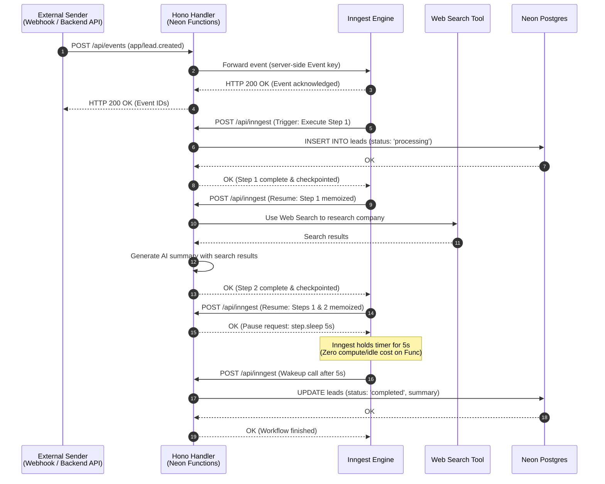

If you're building modern web applications, you inevitably run into work that shouldn't or can't happen inside a single HTTP request-response cycle. Whether it's running multi-step AI enrichment pipelines, orchestrating customer onboarding sequences, processing background uploads, or handling third-party webhooks, background work is a core requirement of production backends.

In traditional architectures, handling background work forces a technical compromise:

- **Fragile serverless execution**: Running multi-step tasks inside standard serverless functions is inherently brittle. Short execution limits cut off long runs mid-stream. If step 3 of a 5-step pipeline fails due to a network hiccup or rate limit, the entire function crashes. Re-running the function duplicates earlier database writes and burns through expensive AI API tokens, while building bespoke state tracking in your database quickly turns into a maintenance nightmare.
- **Heavy infrastructure overhead**: Moving to dedicated queue systems (like BullMQ, Celery, or SQS + worker pools) requires provisioning Redis instances, running separate long-lived worker servers, and writing custom orchestration code to handle retries, backoff, and failure recovery.

The root cause of this complexity is that serverless compute has historically lacked **step-level durability**. If a single step in a multi-step workflow fails, the entire workflow fails, and you have to manually recover state and re-run the workflow.

This guide solves that problem by combining [Inngest](https://www.inngest.com) with [Neon Functions](/docs/compute/functions/overview). Inngest provides an event-driven durable execution engine that turns code into checkpointed steps orchestrated over standard HTTP. Neon Functions provides long-running Node.js compute sitting right next to your [Lakebase Postgres](/docs/postgres/overview) database, with [Neon AI Gateway](/docs/ai-gateway/overview) credentials injected automatically.

Inngest handles the orchestration layer: event triggers, step-level retries, and durable delays, while Neon Functions provides the co-located compute and data. Your function code stays linear and readable, and you avoid standing up separate queue infrastructure.

In this tutorial, you will build an automated lead enrichment pipeline that receives a customer signup event, writes initial state to Lakebase Postgres, researches the company using a web search tool to generate an executive summary, executes a durable delay, and updates the database record upon completion. This serves as a blueprint for building multi-step AI agents, human-in-the-loop approval flows, scheduled reporting jobs, or any workflow which requires durable retries.

<CopyPrompt
  src="/prompts/durable-workflow-on-neon-functions-prompt.md"
  description="Use this prompt to customize the guide and build it with your AI agent."
  buttonText="Copy prompt"
/>

## Architecture overview

Here is how events, compute, and data flow through an Inngest + Neon Functions workflow:



1. **Event dispatch**: Your API sends an event to the `/api/events` proxy endpoint on your Neon Function. The proxy forwards the event to Inngest using your server-side Event key.
2. **HTTP step orchestration**: Inngest invokes your Neon Function endpoint over HTTP (`/api/inngest`) for each discrete step in your workflow.
3. **In-process persistence & web search**: The handler executes queries against **Lakebase Postgres** using `pg` and uses a mock web search tool to simulate company research and generate an executive summary.
4. **Automatic checkpointing**: Inngest serializes and stores the return value of every completed step. If a transient network drop occurs during step 2, Inngest resumes execution directly at step 2, reusing the cached output of step 1.

## Prerequisites

Before starting, ensure you have:

1. **Node.js**: Version 20 or later (v24 recommended). Download from [nodejs.org](https://nodejs.org/).
2. **Neon Account**: Sign up at [console.neon.tech](https://console.neon.tech/signup).
3. **Neon CLI**: Installed globally (`npm i -g neon`) and authenticated (`neon auth`). See the [Neon CLI Quickstart](/docs/cli/quickstart) for details.
4. **Inngest Account**: Sign up for a free account at [inngest.com](https://www.inngest.com).
   <Admonition type="tip" title="Self-Hosting Inngest">
   You can also self-host Inngest using the [Inngest self-hosting guide](https://www.inngest.com/docs/self-hosting). Use Lakebase Postgres as the backing database for Inngest's durable state storage. The workflow code in this guide works identically with either Inngest Cloud or a self-hosted Inngest instance.
   </Admonition>

<Steps>

## Initialize your project

Create a project directory and navigate into it:

```bash
mkdir neon-inngest-workflow && cd neon-inngest-workflow
```

Install the Neon agent skills so AI agents like Claude Code and Cursor have the context to help you build and deploy. This durable workflow uses the **Neon**, **Neon Functions**, and **Neon AI Gateway** skills:

```bash
neon skills -s neon -s neon-functions -s neon-ai-gateway
```

Link your local workspace to a Neon project:

```bash
neon link
```

You'll be prompted to select your organization, then a project. Create a new one or pick an existing project. Choose the **AWS US East 2 (Ohio)** (`aws-us-east-2`) region, since Neon Functions are available only there during beta.

Next, install the required dependencies:

```bash
npm install hono inngest @neon/ai-sdk-provider pg ai zod
npm install --save-dev esbuild @types/node @types/pg typescript dotenv
```

- `hono`: A lightweight web framework for routing HTTP requests to Inngest's adapter.
- `inngest`: The core Inngest SDK used to define durable steps, triggers, and retry behaviors.
- `@neon/ai-sdk-provider`: Neon's AI SDK Provider, which provides access to LLMs through the Neon AI Gateway.
- `pg`: Node.js PostgreSQL client for communicating with Lakebase Postgres.

## Link your Neon project

Link your local workspace to a Neon project:

```bash
neon link
```

Select your organization and choose to create a new project named `neon-inngest-demo`.

<Admonition type="note">
Ensure you select the **AWS US East 2 (Ohio)** region (`aws-us-east-2`) when creating your Neon project, as Neon Functions are currently available in this region during beta. Select **Yes** when prompted to manage your setup as code (`neon.ts`).
</Admonition>

A `.env.local` file should be created automatically in your project root with your Neon project details, including `DATABASE_URL` and other Neon-specific variables.

## Create the leads table

Before building the workflow, create the `leads` table in your Neon database using either the Neon CLI or the [Neon SQL Editor](/docs/get-started/query-with-neon-sql-editor). The table will store lead information, including the AI-generated summary and processing status.

<CodeTabs labels={["Use neon cli", "Raw SQL"]}>

```bash shouldWrap
neon psql main -- -c "CREATE TABLE leads (
  id TEXT PRIMARY KEY,
  email TEXT NOT NULL,
  company TEXT NOT NULL,
  summary TEXT,
  status TEXT NOT NULL DEFAULT 'pending',
  created_at TIMESTAMPTZ DEFAULT NOW()
);"
```

```sql
CREATE TABLE leads (
  id TEXT PRIMARY KEY,
  email TEXT NOT NULL,
  company TEXT NOT NULL,
  summary TEXT,
  status TEXT NOT NULL DEFAULT 'pending',
  created_at TIMESTAMPTZ DEFAULT NOW()
);
```

</CodeTabs>

## Configure database connection pooling

Neon Functions run on long-lived Node.js isolates rather than short-lived ephemeral workers. This means you can maintain persistent connection pools across invocations rather than re-establishing database connections on every request.

Create `src/db.ts` to manage your Postgres pool:

```ts filename="src/db.ts"
import { Pool } from 'pg';

export const pool = new Pool({
  connectionString: process.env.DATABASE_URL,
  max: 5,
});
```

## Write the durable workflow function

Create the Inngest client configuration at `src/inngest/client.ts`:

```ts filename="src/inngest/client.ts"
import { Inngest } from "inngest";

export const inngest = new Inngest({
  id: "neon-inngest-app",
});
```

The `id` field uniquely identifies your application within Inngest. When you register this function with Inngest Cloud, the ID ties your deployed function to your Inngest account and ensures events are routed correctly.

Now create your workflow definition at `src/inngest/functions.ts`.

The `inngest.createFunction` call takes three arguments: a config object (function ID and retry count), a trigger (which event starts this function), and the handler containing your workflow logic. Each discrete logical task is wrapped inside a `step.run` block or `step.sleep` call, which lets Inngest checkpoint and retry at the step level.

```ts filename="src/inngest/functions.ts" shouldWrap
import { inngest } from "./client";
import { pool } from "../db";
import { generateText, isStepCount, tool } from "ai";
import { neon } from "@neon/ai-sdk-provider";
import z from "zod";

const webSearch = tool({
    description: "Search the web for up-to-date information, news, and real-time events.",
    inputSchema: z.object({
        query: z.string().describe("The search query string"),
    }),
    execute: async ({ query }) => {
        // Mock implementation: returns placeholder data.
        // Replace with a real search provider (e.g. Brave Search, Exa, Tavily) for production use.
        return {
            query,
            results: [
                `${query} is a leading technology company specializing in innovative solutions for modern businesses. They have a strong presence in the APAC region and are known for their cutting-edge products and services for enterprise clients.`,
                `${query} is founded in ${Math.floor(Math.random() * 20 + 2000)} and has recently expanded into AI code sandbox environments. Their recent funding round raised $${Math.floor(Math.random() * 100 + 50)}M, signaling strong investor confidence.`,
            ],
        };
    },
});

export const processLeadWorkflow = inngest.createFunction(
    { id: "process-lead-workflow", retries: 3, triggers: [{ event: "app/lead.created" }] },
    async ({ event, step }) => {
        const { leadId, email, company } = event.data;

        // Step 1: Initialize record in Neon Postgres
        await step.run("save-lead-to-db", async () => {
            await pool.query(`
                INSERT INTO leads (id, email, company, status)
                VALUES ($1, $2, $3, $4)
                ON CONFLICT (id) DO UPDATE SET status = $4
                `,
                [leadId, email, company, "processing"]
            );
            return { leadId, status: "processing" };
        });

        // Step 2: Research company using web search and generate summary
        const aiSummary = await step.run("generate-ai-summary", async () => {
            const { text } = await generateText({
                model: neon("gpt-oss-120b"),
                prompt: `Research the company "${company}" (contact: ${email}). Find information about their products, services, recent news, and market position. Then write a concise 2-sentence executive summary highlighting potential business opportunities and key insights.`,
                system: "You are a lead enrichment assistant. Provide information about companies based on your knowledge. Be concise and actionable.",
                tools: { webSearch },
                stopWhen: isStepCount(3)
            });
            return text;
        });

        // Step 3: Simulate a processing window with a durable sleep
        await step.sleep("wait-for-processing-window", "5s");

        // Step 4: Persist final result back to Postgres
        await step.run("complete-lead-processing", async () => {
            await pool.query(
                `UPDATE leads SET summary = $1, status = $2 WHERE id = $3`,
                [aiSummary, "completed", leadId]
            );
            return { leadId, status: "completed" };
        });

        return { success: true, leadId, summary: aiSummary };
    }
);

export const functions = [processLeadWorkflow];
```

The input to the workflow is an `app/lead.created` event with a payload containing the lead's ID, email, and company name (as would be sent from your frontend or backend API). The workflow executes four steps:

- **Step 1 (`save-lead-to-db`)**: Inserts the incoming lead into Lakebase Postgres with a `processing` status.
- **Step 2 (`generate-ai-summary`)**: Uses a mock web search tool to simulate real-time research. The tool returns placeholder data so you can test the full workflow without external API keys. The LLM synthesizes the search results into a concise executive summary. See [Using a real web search API](#using-a-real-web-search-api) below for an example of how to swap in a real search provider for production use.
- **Step 3 (`wait-for-processing-window`)**: Sleeps durably for 5 seconds without consuming compute or billing. This simulates a processing window, for example waiting on external API results or a human review cycle.
- **Step 4 (`complete-lead-processing`)**: Writes the AI-generated summary back to Postgres and marks the lead as `completed`.

Inngest checkpoints each step's return value. If a step fails, Inngest retries only that step, and prior steps are not re-executed. The `retries: 3` config on the function controls how many times a failed step is retried before the run is marked as failed.

For more details on error handling, retries, and failure recovery, see the [Inngest error handling docs](https://www.inngest.com/docs/guides/error-handling).

## Mount Inngest on Hono

Create `index.ts` at the root of your project. This file wires your Inngest client and function definitions into a Hono router:

```ts filename="index.ts"
import { Hono } from "hono";
import { serve } from "inngest/hono";
import { inngest } from "./src/inngest/client";
import { functions } from "./src/inngest/functions";

const app = new Hono();

app.on(["GET", "PUT", "POST"], "/api/inngest",
  serve({
    client: inngest,
    functions,
  })
);

app.post("/api/events", async (c) => {
  const body = await c.req.json();
  const result = await inngest.send(body);
  return c.json({ ids: result.ids, status: 200 });
});

app.get("/", (c) => c.text("Example Inngest + Neon + Hono App"));

export default app;
```

Here's what this entry point does:

- **`serve()` from `inngest/hono`**: This is Inngest's adapter for Hono. It creates a set of route handlers that implement the [Inngest serve protocol](https://www.inngest.com/docs/learn/serving-inngest-functions#framework-hono). Inngest communicates with your function over HTTP using three methods: `GET` for configuration discovery, `PUT` for registering the function, and `POST` for executing steps. The `serve` function handles all of this automatically.
- **`client` and `functions`**: The `serve` adapter needs your Inngest client (for authentication and signing) and your array of function definitions (so it knows which functions are available and how to route events to them).
- **Route path `/api/inngest`**: This is the endpoint Inngest calls to orchestrate your workflow. When you register your app with Inngest Cloud, you'll point it at `https://<your-function-url>/api/inngest`.
- **`POST /api/events`**: A server-side proxy endpoint that forwards events to Inngest. This keeps your Event key server-side instead of exposing it to clients or external callers. Call this endpoint from your frontend or external services to trigger workflows.
- **`export default app`**: Because Neon Functions natively support standard web `Response` and `fetch` signatures, exporting the Hono app directly lets it handle incoming HTTP requests from both Inngest and standard callers.

## Configure environment variables

Your function needs two Inngest keys to authenticate communication between your Neon Function and Inngest Cloud.

1. **Copy the signing key** (`INNGEST_SIGNING_KEY`): Open the [Inngest Cloud dashboard](https://app.inngest.com/env/production/apps). The signing key is displayed by clicking on **Apps** > **Sync new app**. Copy it and add it to your `.env.local` file. Inngest uses this key to sign and authenticate the requests it sends to your function endpoint, ensuring that only Inngest can trigger your workflow steps.

2. **Copy the Event key** (`INNGEST_EVENT_KEY`): This is a server-side key your function uses to authenticate events it sends to Inngest. Open the [Inngest Cloud dashboard keys page](https://app.inngest.com/env/production/manage/keys), create a new Event key, and copy it.

Update your `.env.local` file by adding both keys to the end of the file:

```bash filename=".env.local"
# ..other Neon environment variables..
INNGEST_SIGNING_KEY="signkey-prod-..."
INNGEST_EVENT_KEY="your-event-key"
```

## Configure `neon.ts` and deploy to Neon Functions

The `neon link` command created a `neon.ts` file in your project root. Update it to configure the function and AI Gateway:

```ts filename="neon.ts" {9-20}
import { defineConfig } from "@neon/config/v1";

export default defineConfig({
  branch: (branch) => {
    if (branch.isDefault) { return {}; }
    if (!branch.exists) { return { ttl: "7d" }; }
    return {};
  },
  preview: {
    functions: {
      inngest: {
        name: "Inngest Workflow Endpoint",
        source: "./index.ts",
        env: {
          INNGEST_EVENT_KEY: process.env.INNGEST_EVENT_KEY!,
          INNGEST_SIGNING_KEY: process.env.INNGEST_SIGNING_KEY!,
        },
      }
    },
    aiGateway: true
  },
});
```

Here's what each property does:

- **`preview.functions.inngest`**: Registers `index.ts` as a deployable Neon Function named "Inngest Workflow Endpoint". The `source` field tells Neon where to find the entry point for your function.
- **`env`**: Passes the Inngest keys from your `.env.local` file to the function at runtime. Other Neon specific environment variables (like `DATABASE_URL`) are automatically injected by Neon.
- **`aiGateway: true`**: Activates the Neon AI Gateway, giving your function access to LLM endpoints.

Deploy your function to Neon with the following command:

```bash
neon deploy --env .env.local
```

The `--env .env.local` flag loads your `.env.local` file so the `process.env` references in `neon.ts` resolve at deploy time. The CLI bundles your code, configures the runtime environment, and returns your deployment's live HTTPS URL:

```text
Function URLs
  • inngest: https://br-damp-voice-xxx-inngest.compute.c-3.us-east-2.aws.neon.tech
```

Your full production Inngest endpoint is:
`https://<your-function-url>/api/inngest`

<details>
<summary>How to run the workflow locally</summary>

Run the Hono function and Inngest Dev Server in two terminals:

```bash
# Terminal 1: start the local Neon Functions server
INNGEST_DEV=1 neon dev

# Terminal 2: start the Inngest Dev Server
npx inngest-cli@latest dev -u http://localhost:8787/api/inngest
```

Then trigger a test event with the same `curl` command from [Verify production execution](#verify-production-execution), pointing it at `http://localhost:8787/api/events` instead.

</details>

## Connect to Inngest Cloud

Register your deployed Neon Function with Inngest Cloud to enable production event routing:

1. Log in to your [Inngest Cloud Dashboard](https://app.inngest.com).
2. Go to **Apps** > **Sync New App**.
   
3. Enter your deployed Neon Function Inngest URL (`https://<your-function-url>/api/inngest`) and sync the app.
4. You should see your `process-lead-workflow` function appear in the Inngest dashboard, along with its trigger event (`app/lead.created`).
   

You can now send events to your deployed Neon Function, and Inngest will orchestrate the workflow in production.

## Verify production execution

Test the workflow by sending a production event to your deployed Neon Function. Use `curl` or any HTTP client to POST an `app/lead.created` event to the `/api/events` endpoint:

```bash shouldWrap
curl -X POST "https://<your-function-url>/api/events" \
  -H "Content-Type: application/json" \
  -d '{
    "name": "app/lead.created",
    "data": {
      "leadId": "lead_prod_999",
      "email": "alex@globex.com",
      "company": "Globex International"
    }
  }'
```

> Replace `<your-function-url>` with your deployed Neon Function URL.

The `/api/events` endpoint forwards the event to Inngest using your server-side Event key, so the key is never exposed to callers. When this request reaches Inngest, the engine looks up which functions are subscribed to the `app/lead.created` event and begins orchestrating execution against your deployed Neon Function.

Because the workflow includes a 5-second durable sleep, the full run takes about 5-10 seconds to complete. Inngest handles the delay externally, so no compute is consumed on your Neon Function during the wait.

After the workflow completes, you can query your Lakebase Postgres database to verify that the lead record was updated with the AI-generated summary and marked as `completed`:

```bash shouldWrap
neon psql main -- -c "SELECT * FROM leads WHERE id = 'lead_prod_999'
```

<details>

<summary>Example Output</summary>

```text
| id            | email           | company              | summary                                                                                           | status    | created_at                  |
|---------------|-----------------|----------------------|---------------------------------------------------------------------------------------------------|-----------|-----------------------------|
| lead_prod_999 | alex@globex.com | Globex International | **Globex International** is a mid‑size technology firm delivering AI‑cloud platforms, analytics... | completed | 2026-07-28 07:52:25.116338+00 |
|               |                 |                      | *Opportunity*: Rapid capital raise and roadmap create openings for joint initiatives, reseller... |           |                             |
|               |                 |                      | *Key Insight*: Focus on AI automation and APAC markets makes them a strategic ally...           |           |                             |
```

</details>

The `status` column shows `completed` and the `summary` column contains the AI-generated executive summary. This confirms that all four steps executed successfully: the initial insert, the web search and AI synthesis, the durable sleep, and the final update.

If a step had failed (for example, due to a transient API outage), Inngest would have retried that specific step up to 3 times without re-executing the earlier database insert. After fixing any issues, you can replay failed runs directly from the [Inngest Cloud Dashboard](https://app.inngest.com).

</Steps>

## Using a real web search API

The example above uses a mock web search tool so you can run the full workflow locally without external API keys. For production use, swap in a real search provider. Here's an example using the [Brave Search API](https://brave.com/search/api/):

<details>
<summary>Replace the mock `webSearch` tool with this Brave Search implementation</summary>

1. Get a free API key at [brave.com/search/api](https://brave.com/search/api/).
2. Add `BRAVE_SEARCH_API_KEY` to your `.env.local` file.
3. Replace the mock `webSearch` tool in `src/inngest/functions.ts` with:

```ts filename="src/inngest/functions.ts" shouldWrap
import { tool } from "ai";
import z from "zod";

const webSearch = tool({
  description:
    "Search the web for up-to-date information, news, and real-time events.",
  inputSchema: z.object({
    query: z.string().describe("The search query string"),
    count: z
      .number()
      .optional()
      .default(5)
      .describe("Number of search results to return (1-20)"),
  }),
  execute: async ({ query, count }) => {
    const apiKey = process.env.BRAVE_SEARCH_API_KEY;
    if (!apiKey) {
      throw new Error("BRAVE_SEARCH_API_KEY environment variable is missing");
    }

    const url = new URL("https://api.search.brave.com/res/v1/web/search");
    url.searchParams.append("q", query);
    url.searchParams.append("count", count.toString());

    const response = await fetch(url.toString(), {
      headers: {
        Accept: "application/json",
        "Accept-Encoding": "gzip",
        "X-Subscription-Token": apiKey,
      },
    });

    if (!response.ok) {
      throw new Error(`Brave Search API error: ${response.statusText}`);
    }

    const data = await response.json();

    const results =
      data.web?.results?.map((result: any) => ({
        title: result.title,
        url: result.url,
        snippet: result.description,
      })) || [];

    return { query, results };
  },
});
```

4. Update `neon.ts` to pass the key to your function:

```ts filename="neon.ts" {4}
env: {
  INNGEST_EVENT_KEY: process.env.INNGEST_EVENT_KEY!,
  INNGEST_SIGNING_KEY: process.env.INNGEST_SIGNING_KEY!,
  BRAVE_SEARCH_API_KEY: process.env.BRAVE_SEARCH_API_KEY!,
},
```

5. Redeploy your function:

```bash
neon deploy --env .env.local
```

Other search providers like [Tavily](https://tavily.com/) or [Exa](https://exa.ai) work the same way: define a `tool()` with an `execute` function that calls their API and returns search results.

</details>

## Next steps

This lead enrichment pipeline is a starting point. You can extend the same pattern to build multi-step AI agents, human-in-the-loop approval flows, scheduled reporting jobs, or any workflow where durable retries and step-level checkpointing are critical.

## Source code

You can find the complete source code for this example on GitHub.

<DetailIconCards>
<a href="https://github.com/dhanushreddy291/durable-workflow-on-neon-functions" description="Complete source code for the Durable Workflow on Neon Functions example" icon="github">Durable Workflow on Neon Functions Example Repository</a>
</DetailIconCards>

## Resources

- [Neon Functions Overview](/docs/compute/functions/overview)
- [Neon AI Gateway](/docs/ai-gateway/overview)
- [Neon AI SDK Provider](https://github.com/neondatabase/neon-pkgs/tree/main/packages/ai-sdk-provider)
- [Inngest Documentation](https://www.inngest.com/docs)
- [Vercel AI SDK Documentation](https://ai-sdk.dev/docs/introduction)

<NeedHelp/>
