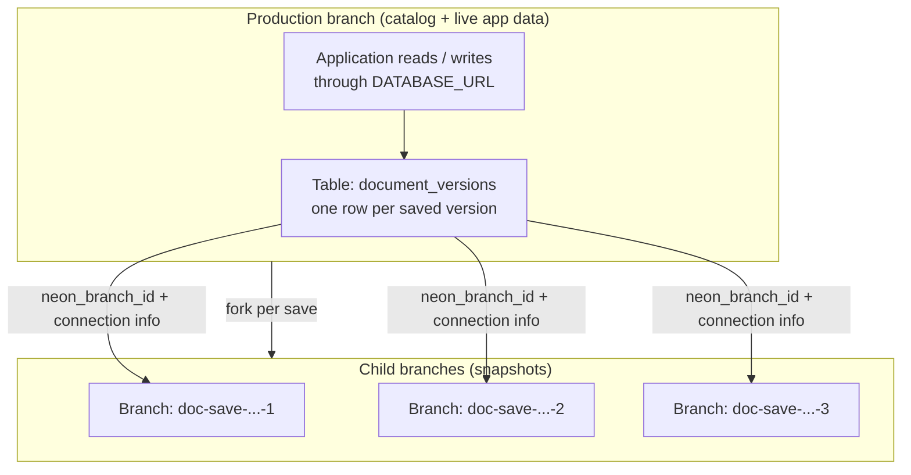
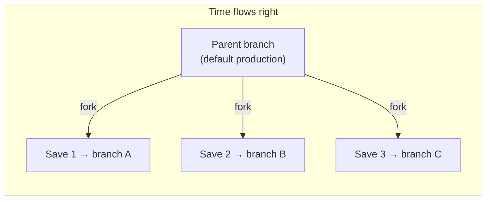
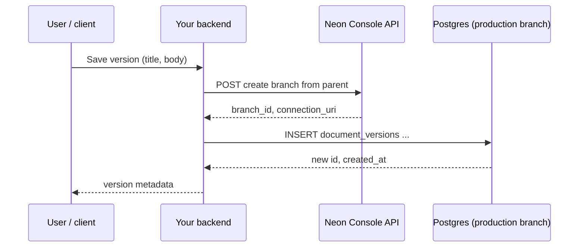
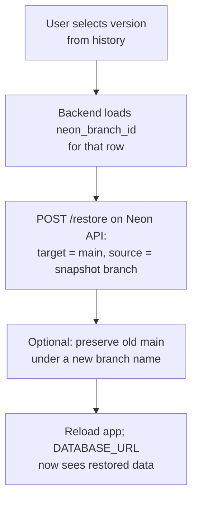

If you have ever used Google Docs version history, you know how easily you can jump to an older version, compare it to what you have now, and roll back without losing the thread of what changed. Relational databases usually give you one live schema and one head revision, unless you add your own audit tables or event sourcing.

Neon already gives you instant database branches that share storage with their parent until they diverge. That means you can treat each "save" as a cheap fork of your production database state, keep a lightweight catalog of those forks on your primary branch, and use Neon's APIs to restore the main line to match a fork when someone clicks "restore this version."

This guide explains that pattern end to end i.e. how the schema on your production branch acts as an index of versions, how child branches represent frozen snapshots, and how save, preview, and restore fit together in such a use case with Neon.

## Demo

Let's start by taking a look at what's covered in this guide. In the following demo, you'll see how to use Neon database branching to create a Google Docs-style version history in an application.

<YoutubeIframe embedId="Y_jDxhX_YJ4" />

A live demo of this project is also deployed and available at [https://neon-demos-docs.vercel.app/](https://neon-demos-docs.vercel.app/).

You can explore the full source code used in this guide on GitHub at https://github.com/rishi-raj-jain/google-docs-version-history.

## Why branching fits document version history

Classic approaches store every revision in one table (`revision_id`, `body`, `created_at`) or append only to an event log. Both work but [branching](/docs/introduction/branching) adds a different axis i.e. each version can capture **the entire database** as it existed at save time.

For a single rich text field, a column on the production branch is often enough but for apps where a "document" spans many tables such as sections, comments, and permissions (much like Google Docs), a branch (as a snapshot) keeps [referential integrity](https://wiki.postgresql.org/wiki/Referential_Integrity_Tutorial_%26_Hacking_the_Referential_Integrity_tables) for free (very low cost) at that instant.

Neon's branching is a good fit because:

- [Creating a branch](https://api-docs.neon.tech/reference/createprojectbranch) is fast and does not require copying all data up front.
- You can connect to a historical branch with its own connection string when you need to run queries against that snapshot.
- The [Restore API](https://api-docs.neon.tech/reference/restoreprojectbranch) can repoint your primary branch at a snapshot when you want a true rollback of database state.

As we move forward, you will learn how to combine **a catalog on production** with **per version branches** to build a product that feels like Google Docs without building your own storage engine.

## Architecture at a glance

Think of the application building blocks in two layers:

1. **Catalog (production branch):** A table listing every saved version, human readable titles, timestamps, and pointers to Neon branch ids (and optionally encrypted connection strings for that branch).
2. **Snapshots (child branches):** One Neon branch per save, forked from a parent branch (often your default production branch). Each snapshot starts as an exact copy of the parent at fork time and can diverge if you write to it.



When a user clicks **Save version**, you'd create a new child branch, record metadata on the main, and keep the editor state in sync with the catalog. When they click **Restore**, you call Neon's restore endpoint so the production branch's storage head matches the chosen snapshot branch.

## How Neon branching maps to your rows

Each row in your catalog corresponds to one **branch id**. The branch name might include a timestamp (for example `doc-save-2026-05-03T12-00-00-000Z`) so your can recognize it in the dashboard.



One key schema choice is deciding which branch you fork snapshots from. The most straightforward approach is to always create new branches from your production branch as forking from a single parent keeps your history of the versions in one place (as the source of truth), and makes branch creation more predictable in your application flow.

## Schema on the production branch

The catalog table is intentionally small. It answers: _which versions exist, when were they saved, who saved them, and which Neon branch represents that snapshot?_

| Column                      | Role                                                                                                                                                                        |
| --------------------------- | --------------------------------------------------------------------------------------------------------------------------------------------------------------------------- |
| `id`                        | Stable UUID for APIs (`GET /versions/:id`).                                                                                                                                 |
| `created_at`                | Sort order for the version history sidebar.                                                                                                                                 |
| `title`                     | Optional display string for the document at save time.                                                                                                                      |
| `document_json`             | Structured payload for the editor (for example `{ "text": "..." }`). Often the **source of truth** for plain document bodies.                                               |
| `neon_branch_id`            | Neon branch identifier returned by the Console API when the snapshot branch was created.                                                                                    |
| `encoded_connection_string` | Lets your server open a SQL connection to that branch later (for preview queries or admin tools). Encrypt at rest in production (for example AES-GCM with a server secret). |
| `author_label`              | Shown in the UI ("You", display name, or service account).                                                                                                                  |

The [reference demo](#demo) uses exactly this shape and you can create it [with ordinary SQL](https://github.com/rishi-raj-jain/google-docs-version-history/blob/main/scripts/create-versions-table.sql):

```sql
CREATE TABLE IF NOT EXISTS document_versions (
  id UUID PRIMARY KEY DEFAULT gen_random_uuid(),
  created_at TIMESTAMPTZ NOT NULL DEFAULT now(),
  title TEXT,
  document_json JSONB NOT NULL DEFAULT '{}'::jsonb,
  neon_branch_id TEXT NOT NULL,
  encoded_connection_string TEXT NOT NULL,
  author_label TEXT NOT NULL DEFAULT 'You'
);

CREATE INDEX IF NOT EXISTS document_versions_created_at_idx
  ON document_versions (created_at DESC);
```

## Save versions with history



When the user saves the document at a given state, the server then would:

1. Resolve the parent branch id (your production branch).
2. Call Neon's API to create a child branch with a read-write endpoint and obtain a `connection_uri`.
3. Insert a row into `document_versions` on the production database connection (`DATABASE_URL`), storing `document_json`, `neon_branch_id`, and an encoded form of the branch URI.
4. Return the new `id` so the client can highlight it in the history list.
5. When branches are always created from the production branch, each new snapshot branch contains all rows and references up to the point of creation, ensuring that any restore brings the entire state (not just a single row) back to that precise point. This makes restores reliable and predictable, as every branch is a consistent snapshot of the full DB at save time.


## Preview and compare old versions

Preview like how you see in Google Docs usually means: "show me what differs between what I have in the editor and that saved version."

You can implement that in two ways:

- **Read from the catalog row:** Compare the current editor buffer to `document_versions.document_json` for the selected `id`. This is simple and always consistent with what you stored on production.
- **Read from the snapshot branch:** Connect with the stored branch URI and run queries against tables as they existed on that branch. Use this when the truth lives across tables or when you want to validate migrations against historical state.


The [reference demo](#demo) uses a line based diff in the UI (baseline versus current) so users see additions and removals in green and red, similar in spirit to the Google Docs.

## Restore production to a snapshot

Restore is where Neon branching shines compared to hand rolled revision tables. Neon's [branch restore API](https://api-docs.neon.tech/reference/restoreprojectbranch) updates a **target** branch (typically your default branch) so its state reflects a **source** snapshot branch, with an optional `preserve_under_name` so the previous head survives as a new branch for safety.

<div align="center">



</div>

Operationally, you would need the following:

- Project's [API Key](https://neon.com/docs/manage/api-keys) (as `NEON_API_KEY`) to manage branches.
- Project's [ID](https://neon.com/docs/manage/projects#project-settings) (as `NEON_PROJECT_ID`) to make sure that the right document is being referenced.
- A clear choice of **which branch is "production"** for your app (`NEON_MAIN_BRANCH_ID`).

Once the restore is complete, just refresh your app or reload your data as now your document will reflect the state from the restored snapshot, with the **version history up to that point**.

## Conclusion

Neon’s branching isn’t just for testing or CI, it’s a fast, developer-friendly way to build features like Google Docs-style version history right in production. Whenever a user saves, you spin up a lightweight branch (an instant snapshot of your database) which you can view, diff, or roll back to, without maintaining your own custom snapshot tables. Since [branches share storage with their parent until you write changes](/docs/introduction/branching#what-is-a-branch), you avoid duplicated data and keep costs low, making this approach perfect for preview environments.
