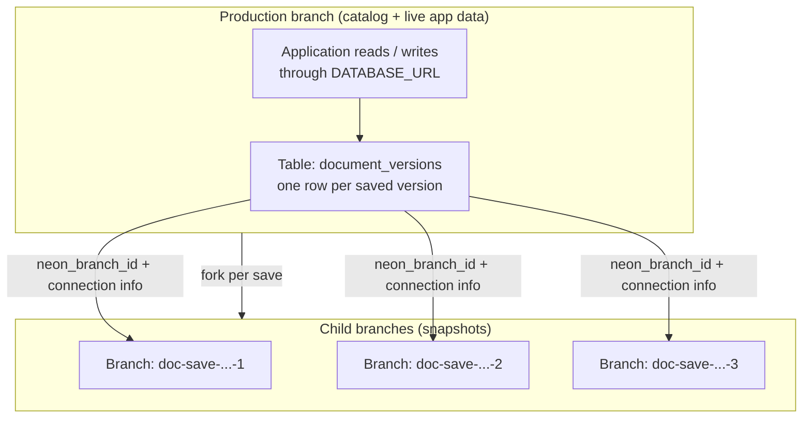
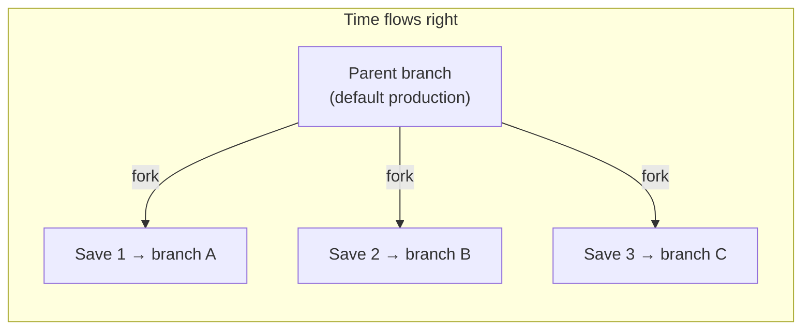
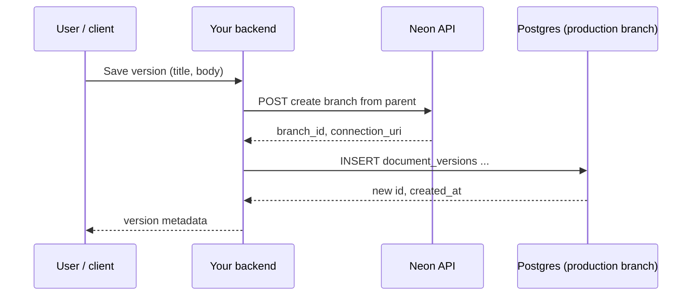
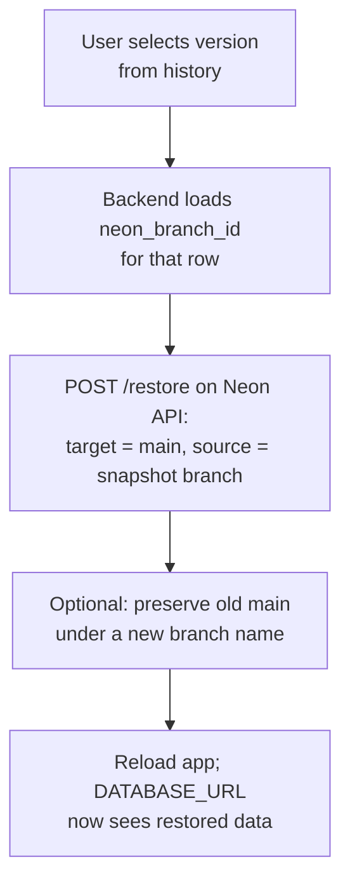

If you have used Google Docs version history, you know you can jump to an older version, compare it to what you have now, and roll back without losing the thread of what changed. Relational databases usually give you one live schema and one head revision, unless you add your own audit tables or event sourcing.

Neon gives you instant database branches that share storage with their parent until they diverge. You can treat each "save" as a cheap fork of your production database state, keep a small catalog of those forks on your primary branch, and use the Neon API to restore the main line to match a fork when someone clicks "restore this version."

This guide explains that pattern end to end: how a table on your production branch acts as an index of versions, how child branches represent frozen snapshots, and how save, preview, and restore fit together.

## Demo

The following demo shows an application that uses Neon database branching for Google Docs-style version history.

<YoutubeIframe embedId="Y_jDxhX_YJ4" />

A live demo of this project is also deployed and available at [https://neon-demos-docs.vercel.app/](https://neon-demos-docs.vercel.app/).

You can explore the full source code used in this guide on GitHub at https://github.com/rishi-raj-jain/google-docs-version-history.

## Why branching fits document version history

Classic approaches store every revision in one table (`revision_id`, `body`, `created_at`) or append only to an event log. Both work, but with [branching](/docs/introduction/branching) each version can capture **the entire database** as it existed at save time.

For a single rich text field, a column on the production branch is often enough. For apps where a "document" spans many tables, such as sections, comments, and permissions (much like Google Docs), a branch snapshot preserves [referential integrity](https://wiki.postgresql.org/wiki/Referential_Integrity_Tutorial_%26_Hacking_the_Referential_Integrity_tables) across all of them at that instant, at low storage cost.

Neon's branching is a good fit because:

- [Creating a branch](/docs/reference/api/branches/create-project-branch) is fast and does not require copying all data up front.
- You can connect to a historical branch with its own connection string when you need to run queries against that snapshot.
- The [Restore API](/docs/reference/api/branches/restore-project-branch) can repoint your primary branch at a snapshot when you want a true rollback of database state.

The rest of this guide combines **a catalog on production** with **per-version branches** to get Google Docs-style history without building your own storage engine.

## Architecture at a glance

Think of the application building blocks in two layers:

1. **Catalog (production branch):** A table listing every saved version, human-readable titles, timestamps, and pointers to Neon branch IDs (and optionally encrypted connection strings for that branch).
2. **Snapshots (child branches):** One Neon branch per save, forked from a parent branch (often your default production branch). Each snapshot starts as an exact copy of the parent at fork time and can diverge if you write to it.


```mermaid
flowchart TB
  subgraph main["Production branch (catalog + live app data)"]
    DV["Table: document_versions<br/>one row per saved version"]
    APP["Application reads / writes<br/>through DATABASE_URL"]
  end

  subgraph children["Child branches (snapshots)"]
    B1["Branch: doc-save-...-1"]
    B2["Branch: doc-save-...-2"]
    B3["Branch: doc-save-...-3"]
  end

  APP --> DV
  DV -->|"neon_branch_id + connection info"| B1
  DV -->|"neon_branch_id + connection info"| B2
  DV -->|"neon_branch_id + connection info"| B3
  main -->|"fork per save"| children
```

When a user clicks **Save version**, you create a new child branch, record metadata on the production branch, and keep the editor state in sync with the catalog. When they click **Restore**, you call the Neon API's restore endpoint so the production branch's storage head matches the chosen snapshot branch.

## How Neon branching maps to your rows

Each row in your catalog corresponds to one **branch ID**. The branch name might include a timestamp (for example `doc-save-2026-05-03T12-00-00-000Z`) so you can recognize it in the Neon Console.


```mermaid
flowchart LR
  subgraph time["Time flows right"]
    S0["Parent branch<br/>(default production)"]
    S1["Save 1 → branch A"]
    S2["Save 2 → branch B"]
    S3["Save 3 → branch C"]
  end

  S0 -->|"fork"| S1
  S0 -->|"fork"| S2
  S0 -->|"fork"| S3
```

One design choice is which branch you fork snapshots from. The simplest approach is to always create new branches from your production branch. Forking from a single parent keeps the version history in one place and makes branch creation predictable in your application flow.

Each save creates a branch, and branches count toward your plan's per-project allowance (10 per project on the Free and Launch plans, 25 on the Scale plan; paid plans bill extra branches at $1.50/branch-month). See [Plans](/docs/introduction/plans#branches), and plan a policy for deleting old snapshots.

## Schema on the production branch

The catalog table is small. It answers: _which versions exist, when were they saved, who saved them, and which Neon branch represents that snapshot?_

| Column                      | Role                                                                                                                                                                        |
| --------------------------- | --------------------------------------------------------------------------------------------------------------------------------------------------------------------------- |
| `id`                        | Stable UUID for APIs (`GET /versions/:id`).                                                                                                                                 |
| `created_at`                | Sort order for the version history sidebar.                                                                                                                                 |
| `title`                     | Optional display string for the document at save time.                                                                                                                      |
| `document_json`             | Structured payload for the editor (for example `{ "text": "..." }`). Often the **source of truth** for plain document bodies.                                               |
| `neon_branch_id`            | Neon branch identifier returned by the Neon API when the snapshot branch was created.                                                                                       |
| `encoded_connection_string` | Lets your server open a SQL connection to that branch later (for preview queries or admin tools). Encrypt at rest in production (for example AES-GCM with a server secret). |
| `author_label`              | Shown in the UI ("You", display name, or service account).                                                                                                                  |

The [reference demo](#demo) uses this shape, and you can create it [with ordinary SQL](https://github.com/rishi-raj-jain/google-docs-version-history/blob/main/scripts/create-versions-table.sql):

```sql
CREATE TABLE IF NOT EXISTS document_versions (
  id UUID PRIMARY KEY DEFAULT gen_random_uuid(),
  created_at TIMESTAMPTZ NOT NULL DEFAULT now(),
  title TEXT,
  document_json JSONB NOT NULL DEFAULT '{}'::jsonb,
  neon_branch_id TEXT NOT NULL,
  encoded_connection_string TEXT NOT NULL,
  author_label TEXT NOT NULL DEFAULT 'You'
);

CREATE INDEX IF NOT EXISTS document_versions_created_at_idx
  ON document_versions (created_at DESC);
```

## Save versions with history


```mermaid
sequenceDiagram
  participant U as User / client
  participant API as Your backend
  participant Neon as Neon API
  participant Main as Postgres (production branch)

  U->>API: Save version (title, body)
  API->>Neon: POST create branch from parent
  Neon-->>API: branch_id, connection_uri
  API->>Main: INSERT document_versions ...
  Main-->>API: new id, created_at
  API-->>U: version metadata
```

When the user saves the document, the server:

1. Resolves the parent branch ID (your production branch).
2. Calls the Neon API to create a child branch with a read-write compute and gets a `connection_uri`.
3. Inserts a row into `document_versions` on the production database connection (`DATABASE_URL`), storing `document_json`, `neon_branch_id`, and an encoded form of the branch URI.
4. Returns the new `id` so the client can highlight it in the history list.

Because branches are always created from the production branch, each snapshot branch contains all rows and references up to the point of creation. A restore brings the entire database state (not just a single row) back to that point, since every branch is a consistent snapshot of the full database at save time.


## Preview and compare old versions

In Google Docs, preview usually means "show me what differs between what I have in the editor and that saved version."

You can implement that in two ways:

- **Read from the catalog row:** Compare the current editor buffer to `document_versions.document_json` for the selected `id`. This is simple and always consistent with what you stored on production.
- **Read from the snapshot branch:** Connect with the stored branch URI and run queries against tables as they existed on that branch. Use this when the truth lives across tables or when you want to validate migrations against historical state.


The [reference demo](#demo) uses a line-based diff in the UI (baseline versus current) so users see additions and removals in green and red, similar to Google Docs.

## Restore production to a snapshot

Restore is where branching does something hand-rolled revision tables can't. The Neon [branch restore API](/docs/reference/api/branches/restore-project-branch) updates a **target** branch (typically your default branch) so its state reflects a **source** snapshot branch. The `preserve_under_name` field saves the previous head as a new backup branch. It's required here because your production branch has child branches (the snapshots), and those children move to the backup branch. Backup branches created by restoring a root branch from another branch can't be deleted, so each restore adds a branch to your project. See [Branch restore](/docs/postgres/backup-restore/branch-restore) for the full rules.

<div align="center">


```mermaid
flowchart TD
  A["User selects version<br/>from history"] --> B["Backend loads neon_branch_id<br/>for that row"]
  B --> C["POST /restore on Neon API:<br/>target = main, source = snapshot branch"]
  C --> D["Optional: preserve old main<br/>under a new branch name"]
  D --> E["Reload app; DATABASE_URL<br/>now sees restored data"]
```

</div>

To call these APIs, you need:

- A Neon [API key](/docs/manage/api-keys) (as `NEON_API_KEY`) to manage branches.
- Your project's [ID](/docs/manage/projects#project-settings) (as `NEON_PROJECT_ID`) so the API calls target the right project.
- A clear choice of **which branch is "production"** for your app (`NEON_MAIN_BRANCH_ID`).

Once the restore is complete, refresh your app or reload your data. Your document now reflects the restored snapshot, and the catalog shows the **version history up to that point**.

## Conclusion

You built Google Docs-style version history on Neon branching: each save creates a branch (an instant snapshot of your database) that you can view, diff, or restore, without custom snapshot tables. Since [branches share storage with their parent until you write changes](/docs/introduction/branching#what-is-a-branch), the snapshots don't duplicate your data. To go further, explore the [full source code](https://github.com/rishi-raj-jain/google-docs-version-history).
