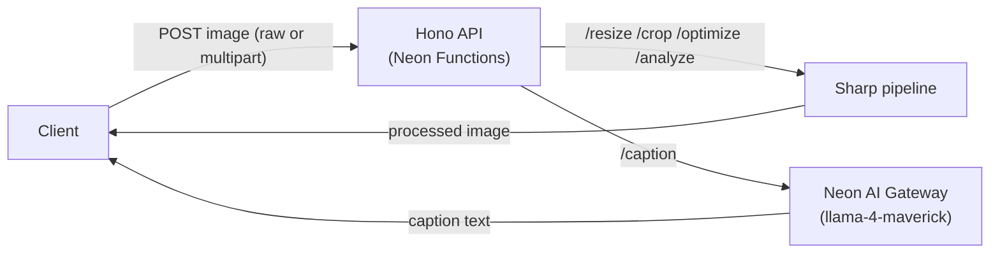

If you're building an application that handles images (profile avatars, product photos, or user uploads), you run into the same set of problems every time. Users upload 12-megapixel photos straight from their phones, and if you serve those files back as-is, pages get slow and bandwidth costs climb. Every image needs resizing for different layouts, cropping to fit, and re-encoding into modern formats like WebP. On top of that, every image needs alt text for accessibility and SEO.

This guide shows you how to build a complete image processing API that handles all of that in one place. The API provides five endpoints to resize, crop, optimize, analyze, and caption images. You'll also learn how to store the processed images in your branch's [Neon Object Storage](/docs/storage/overview) bucket, so you can serve them directly from S3 instead of reprocessing on every request.

The API runs on [**Neon Functions**](/docs/compute/functions/overview) which provide a serverless compute environment in the same region as your Neon Postgres database. Image transformations run on [**Sharp**](https://sharp.pixelplumbing.com), a high-performance image processing library powered by libvips. And for captions, the [**Neon AI Gateway**](/docs/ai-gateway/overview) provides access to the latest vision models.

## How it works



1. **Upload**: The client POSTs an image to any endpoint, either as a raw binary body with an `image/*` content type or as a `multipart/form-data` upload.
2. **Sharp processing**: The `/resize`, `/crop`, `/optimize`, and `/analyze` routes decode the image and run the pipeline in-process.
3. **AI captioning**: The `/caption` route uses Sharp to downscale the image, then sends it to a vision model through the Neon AI Gateway for a one-sentence alt text caption.

## Prerequisites

Before starting, ensure you have:

1. **Node.js**: Version 20 or later (v24 recommended). Download from [nodejs.org](https://nodejs.org/).
2. **Neon Account**: Sign up for an account at [console.neon.tech](https://console.neon.tech/signup).
3. **The Neon CLI**: Installed globally (`npm i -g neon`) and authenticated (`neon auth`). See the [Neon CLI Quickstart](/docs/cli/quickstart) for details.

<Steps>

## Set up the project

Create a directory for the project and initialize a workspace:

```bash
mkdir image-api && cd image-api
npm init -y
```

Run the Neon CLI initialization command:

```bash
neon init
```

Use the default setup options for all prompts: this enables AI skills, configures the MCP server, and installs the VS Code extension. These ensure AI agents such as Claude Code and Cursor can assist you in building and working with Neon.

During initialization, **Neon Platform** and **Postgres** skills are installed automatically. You'll also need the **Neon Functions**, **Neon AI Gateway**, and **Neon Object Storage** skills so AI agents have the context to help you build and deploy your image API. Install them with the following command:

```bash
npx skills add neondatabase/agent-skills --skill neon-ai-gateway --skill neon-functions --skill neon-object-storage
```

Link your local workspace to a Neon project:

```bash
neon link
```

You'll be prompted to select your organization, then a project. **Create a new project** named `image-api` (or pick an existing one). Next, select a region. Choose **AWS US East 2 (Ohio)** (`aws-us-east-2`), as Neon Functions are currently available only in this region during beta. When asked which Neon services you require, select **Functions** and **AI Gateway**. Finally, confirm that you want to manage your setup as code, which generates a `neon.ts` file in your project root:

```text
$ neon link
✔ Which organization would you like to link? › MyOrg (org-example-12345678)
✔ Which project would you like to link? › ＋ Create new project…
✔ Name for the new project: … image-api
✔ Which region should the new project run in? › AWS US East 2 (Ohio) (aws-us-east-2)
Created project quiet-fog-09491284 ("image-api") in aws-us-east-2.
Linked ~/image-api/.neon:
  orgId:     org-example-12345678
  projectId: quiet-fog-09491284
  branch:    main

✔ Manage this project's Neon setup as code? Adds a neon.ts you can edit and apply with `neon config apply`. … yes
✔ Which Neon services should neon.ts declare? (space to toggle, enter to confirm) › Functions, AI Gateway

INFO: Pulled 5 Neon variables into ~/image-api/.env.local: NEON_BRANCH, DATABASE_URL, DATABASE_URL_UNPOOLED, NEON_AI_GATEWAY_TOKEN, NEON_AI_GATEWAY_BASE_URL
INFO: Created neon.ts declaring functions, ai-gateway.
INFO: Created hello.ts - the source of the hello function.
INFO: Installing @neon/config, @neon/env with npm…
```

The `neon link` command also creates a placeholder function: `hello.ts`, at your project root. You'll build the image API in your own `index.ts` file, so delete the placeholder:

```bash
rm hello.ts
```

It also creates a `.env.local` file with your project's variables.

Install the dependencies for your function. You'll need [`hono`](https://hono.dev/) for routing, [`sharp`](https://sharp.pixelplumbing.com) for image processing, and the [Neon AI SDK provider](https://github.com/neondatabase/neon-pkgs/tree/main/packages/ai-sdk-provider) and [Vercel AI SDK](https://ai-sdk.dev/docs) for captioning. You'll also install TypeScript, type definitions, and `esbuild` for bundling:

```bash
npm install hono sharp @neon/ai-sdk-provider ai@6
npm install --save-dev @types/node typescript esbuild
```

> Install `ai` version 6. Newer versions of the Vercel AI SDK have breaking changes with the `generateText` API used in this guide.

TypeScript needs a `tsconfig.json` for the linter to resolve types correctly. Create it in your project root:

```json filename="tsconfig.json"
{
  "compilerOptions": {
    "target": "ES2022",
    "module": "NodeNext",
    "moduleResolution": "NodeNext",
    "types": ["node"],
    "strict": true,
    "esModuleInterop": true,
    "skipLibCheck": true,
    "forceConsistentCasingInFileNames": true
  }
}
```

## Build the image API

Create an `index.ts` file in the root of your project. It defines a `GET /` smoke-test route, the API's five endpoints, and the shared helpers they rely on:

```ts filename="index.ts"
import { Hono, type Context } from 'hono';
import sharp, { type FitEnum, type FormatEnum } from 'sharp';
import { neon } from '@neon/ai-sdk-provider';
import { generateText } from 'ai';

const app = new Hono();

const MAX_IMAGE_SIZE = 10 * 1024 * 1024; // 10 MB
const FORMATS = ['jpeg', 'png', 'webp', 'avif'];
const FITS = ['cover', 'contain', 'fill', 'inside', 'outside'];

class BadRequest extends Error {}

// Reads the uploaded image from the request, either as a raw binary body
// (Content-Type: image/*) or as multipart/form-data with a "file" field.
async function getImageBuffer(c: Context): Promise<Buffer> {
  const contentType = c.req.header('content-type') ?? '';

  if (contentType.startsWith('multipart/form-data')) {
    const form = await c.req.parseBody();
    const file = form['file'];
    if (!(file instanceof File) || !file.type.startsWith('image/')) {
      throw new BadRequest('Expected an image in the "file" form field');
    }
    return checkSize(Buffer.from(await file.arrayBuffer()));
  }

  if (!contentType.startsWith('image/')) {
    throw new BadRequest(
      'Send the image as a raw body with an image/* Content-Type, or as multipart/form-data'
    );
  }

  return checkSize(Buffer.from(await c.req.arrayBuffer()));
}

function checkSize(buffer: Buffer): Buffer {
  if (buffer.byteLength === 0) throw new BadRequest('Empty request body');
  if (buffer.byteLength > MAX_IMAGE_SIZE) throw new BadRequest('Image exceeds the 10 MB limit');
  return buffer;
}

function getFormat(c: Context): keyof FormatEnum {
  const format = c.req.query('format') ?? 'webp';
  if (!FORMATS.includes(format)) throw new BadRequest(`format must be one of: ${FORMATS.join(', ')}`);
  return format as keyof FormatEnum;
}

function imageResponse(c: Context, output: Buffer, format: keyof FormatEnum, extraHeaders: Record<string, string> = {}) {
  return c.body(new Uint8Array(output), 200, {
    'Content-Type': `image/${format}`,
    'Cache-Control': 'public, max-age=31536000, immutable',
    ...extraHeaders,
  });
}

app.get('/', (c) =>
  c.json({
    endpoints: ['POST /resize', 'POST /crop', 'POST /optimize', 'POST /analyze', 'POST /caption'],
  })
);

app.post('/resize', async (c) => {
  const input = await getImageBuffer(c);
  const width = Number(c.req.query('width')) || undefined;
  const height = Number(c.req.query('height')) || undefined;
  const fit = c.req.query('fit') ?? 'cover';
  const format = getFormat(c);

  if (!width && !height) throw new BadRequest('Pass at least one of ?width or ?height');
  if (!FITS.includes(fit)) throw new BadRequest(`fit must be one of: ${FITS.join(', ')}`);

  const output = await sharp(input)
    .rotate() // normalize EXIF orientation from phone cameras
    .resize({ width, height, fit: fit as keyof FitEnum })
    .toFormat(format, { quality: 80 })
    .toBuffer();

  return imageResponse(c, output, format);
});

app.post('/crop', async (c) => {
  const input = await getImageBuffer(c);
  const left = Number(c.req.query('left'));
  const top = Number(c.req.query('top'));
  const width = Number(c.req.query('width'));
  const height = Number(c.req.query('height'));
  const format = getFormat(c);

  const valid =
    Number.isInteger(left) && left >= 0 &&
    Number.isInteger(top) && top >= 0 &&
    Number.isInteger(width) && width > 0 &&
    Number.isInteger(height) && height > 0;
  if (!valid) {
    throw new BadRequest('Pass non-negative integer ?left and ?top, and positive integer ?width and ?height');
  }

  const output = await sharp(input)
    .rotate()
    .extract({ left, top, width, height })
    .toFormat(format, { quality: 80 })
    .toBuffer();

  return imageResponse(c, output, format);
});

app.post('/optimize', async (c) => {
  const input = await getImageBuffer(c);
  const format = getFormat(c);
  const quality = Math.min(Math.max(Number(c.req.query('quality')) || 80, 1), 100);

  const output = await sharp(input)
    .rotate()
    .toFormat(format, { quality })
    .toBuffer();

  return imageResponse(c, output, format, {
    'X-Original-Size': String(input.byteLength),
    'X-Optimized-Size': String(output.byteLength),
  });
});

app.post('/analyze', async (c) => {
  const input = await getImageBuffer(c);
  const [metadata, stats] = await Promise.all([sharp(input).metadata(), sharp(input).stats()]);

  const { r, g, b } = stats.dominant;
  const toHex = (v: number) => v.toString(16).padStart(2, '0');

  return c.json({
    width: metadata.width,
    height: metadata.height,
    format: metadata.format,
    sizeBytes: input.byteLength,
    hasAlpha: metadata.hasAlpha,
    dominantColor: `#${toHex(r)}${toHex(g)}${toHex(b)}`,
  });
});

app.post('/caption', async (c) => {
  const input = await getImageBuffer(c);

  // Downscale before calling the model: vision models don't need full-resolution
  // input, and a smaller image costs fewer tokens and less latency.
  const thumbnail = await sharp(input)
    .rotate()
    .resize(1024, 1024, { fit: 'inside', withoutEnlargement: true })
    .jpeg({ quality: 80 })
    .toBuffer();

  const { text } = await generateText({
    model: neon('llama-4-maverick'),
    messages: [
      {
        role: 'user',
        content: [
          {
            type: 'text',
            text: 'Write a concise one-sentence alt text caption for this image. Describe only what is visible.',
          },
          { type: 'image', image: thumbnail, mediaType: 'image/jpeg' },
        ],
      },
    ],
  });

  return c.json({ caption: text });
});

// Central error handler: BadRequest becomes a 400, anything else a 500.
app.onError((err, c) => {
  if (err instanceof BadRequest) return c.json({ error: err.message }, 400);
  console.error(err);
  return c.json({ error: 'Failed to process image' }, 500);
});

export default app;
```

Here's how the pieces fit together.

### Setup and shared helpers

- `hono` handles routing and `sharp` does the image processing. `MAX_IMAGE_SIZE` caps uploads at 10 MB, `FORMATS` and `FITS` hold the allowed `format` and `fit` values, and `BadRequest` is a custom error type mapped to a `400` by the handler.
- **`getImageBuffer`** reads the image from every request, either as a raw binary body (`Content-Type: image/*`) or as `multipart/form-data` with a `file` field. Anything else returns a `400`, and `checkSize` rejects empty bodies and uploads over 10 MB.
- **`getFormat`** reads the `format` query parameter (default `webp`) and validates it against `FORMATS`. **`imageResponse`** sets the correct `Content-Type` and a year-long `Cache-Control` header, plus any extra headers a route passes in.

### Endpoints

- **`/resize`** resizes to the given `width` and `height` (pass one or both; Sharp preserves the aspect ratio with one). The `fit` parameter controls how the image fills the box, and `.rotate()` applies EXIF orientation so phone photos come out upright.
- **`/crop`** extracts a pixel rectangle defined by `left`, `top`, `width`, and `height` using Sharp's [`extract`](https://sharp.pixelplumbing.com/api-resize/#extract).
- **`/optimize`** re-encodes to `format` at `quality` (1-100) and reports the savings via the `X-Original-Size` and `X-Optimized-Size` headers.
- **`/analyze`** runs `metadata()` and `stats()` in parallel and returns the dimensions, format, size, alpha channel, and dominant color.

### Captioning

The `/caption` route downscales the image and sends the thumbnail to `llama-4-maverick` for a one-sentence alt text caption. The `generateText` call uses the Neon AI SDK provider to route the request through the Neon AI Gateway.

### Error handler

Bad input throws `BadRequest`, mapped to a `400`; anything else becomes a `500`. The final line exports the app so Neon Functions can serve it.

<Admonition type="note" title="Model access">
For improved captioning, you can use frontier vision models like `claude-opus-5`, `gpt-5-6-sol` instead of `llama-4-maverick`.

Frontier models are [rolling out gradually](/docs/ai-gateway/models#model-access). If `claude-opus-5`, `gpt-5-6-sol` etc. aren't available in your project yet, open-weight vision models such as `llama-4-maverick` and `gemma-3-12b` are accessible immediately. Just swap the model ID in the `/caption` route. No other changes are required.
</Admonition>

## Configure neon.ts

The `neon link` command created a `neon.ts` file in your project root. Replace its contents with the following:

```ts filename="neon.ts" {4-13}
import { defineConfig } from '@neon/config/v1';

export default defineConfig({
  preview: {
    functions: {
      imageapi: {
        name: 'Image API',
        source: './index.ts',
        externalPackages: ['sharp'],
      }
    },
    aiGateway: true
  }
});
```

Here's what each property does:

- **`preview.functions.imageapi`**: Registers `index.ts` as a deployable function. The key (`imageapi`) is the function's slug, which becomes part of its invocation URL.
- **`externalPackages: ['sharp']`**: Ships Sharp's files with the deploy instead of bundling them into the function bundle. See the note below for why this matters.
- **`aiGateway: true`**: Enables the Neon AI Gateway on the branch. This is what injects the `NEON_AI_GATEWAY_*` credentials your `/caption` route uses.

<Admonition type="important" title="Deploying from an x86-64 machine">
Sharp loads a compiled libvips binary from a platform-specific package, like `@img/sharp-libvips-linux-x64`. Neon Functions run on `linux-arm64`, so if you deploy from an x86-64 machine, npm installs the wrong build locally, and a compiled binary can't be bundled into the function anyway. `neon deploy` warns about this, but the warning doesn't fail the deploy; instead, the function fails at invoke time when it tries to load Sharp. Setting `externalPackages: ['sharp']` avoids this by shipping Sharp's files with the deploy instead of bundling them.
</Admonition>

## Test locally

You can run your function locally using `neon dev`, which starts a local server with your branch's environment variables injected:

```bash
neon dev
```

Grab a sample image to test with (any photo works; this one comes from [Lorem Picsum](https://picsum.photos), a free placeholder image service):

```bash shouldWrap
curl -L -o sample.jpg "https://picsum.photos/id/1015/1280/853"
```

Try the endpoints. First, a raw binary upload to `/resize`:

```bash shouldWrap
curl -X POST "http://localhost:8787/resize?width=400" -H "Content-Type: image/jpeg" --data-binary @sample.jpg -o resized.webp
```

Then a multipart upload to `/optimize`:

```bash shouldWrap
curl -X POST "http://localhost:8787/optimize?format=webp&quality=70" -F "file=@sample.jpg" -o optimized.webp
```

You can verify the images were processed correctly by opening `resized.webp` and `optimized.webp` in an image viewer.

Test the `/caption` endpoint, which uses the `llama-4-maverick` from the Neon AI Gateway to generate a one-sentence alt text caption:

```bash shouldWrap
curl -X POST "http://localhost:8787/caption" -H "Content-Type: image/jpeg" --data-binary @sample.jpg
```

```json
{
  "caption": "A group of people stand on a rocky outcropping, overlooking a blue body of water surrounded by mountains under a partly cloudy sky."
}
```

You now have a working image processing API running locally. Deploy it to Neon Functions to make it publicly accessible.

## Deploy the API

Deploy your function to Neon:

```bash
neon deploy
```

The CLI bundles your function, applies the `neon.ts` configuration, and prints the public URL:

```text
Function URLs
  • imageapi: https://br-damp-voice-xxx-imageapi.compute.c-3.us-east-2.aws.neon.tech
```

Your API is now live. If you need to retrieve the URL later, run `neon functions get imageapi`.

## Test the deployed API

Export the function URL to an environment variable so you can test it with `curl`:

```bash shouldWrap
export API_URL="https://br-damp-voice-xxx-imageapi.compute.c-3.us-east-2.aws.neon.tech"
```

**List the endpoints:**

```bash
curl $API_URL/
```

**Resize** an image to a 400x400 square thumbnail:

```bash shouldWrap
curl -X POST "$API_URL/resize?width=400&height=400&fit=cover" -H "Content-Type: image/jpeg" --data-binary @sample.jpg -o thumbnail.webp
```

**Crop** a 600x600 region starting at (300, 100):

```bash shouldWrap
curl -X POST "$API_URL/crop?left=300&top=100&width=600&height=600" -H "Content-Type: image/jpeg" --data-binary @sample.jpg -o crop.webp
```

**Optimize** an image and inspect the size headers:

```bash shouldWrap
curl -X POST "$API_URL/optimize?format=webp&quality=70" \
  -F "file=@sample.jpg" \
  -D - \
  -o optimized.webp
```

```text
content-type: image/webp
cache-control: public, max-age=31536000, immutable
x-optimized-size: 158974
x-original-size: 201611
```

**Analyze** an image:

```bash shouldWrap
curl -X POST "$API_URL/analyze" -H "Content-Type: image/jpeg" --data-binary @sample.jpg
```

```json
{
  "width":1280,
  "height":853,
  "format":"jpeg",
  "sizeBytes":201611,
  "hasAlpha":false,
  "dominantColor":"#084898"
}
```

**Caption** an image:

```bash shouldWrap
curl -X POST "$API_URL/caption" -H "Content-Type: image/jpeg" --data-binary @sample.jpg
```

Because LLMs are non-deterministic, the generated caption may differ from what you have seen in the local test, but it should be a concise one-sentence description of the image.

You now have a working image processing API deployed on Neon Functions. The next step is to store the processed images in your branch's Neon Object Storage bucket so you can serve them directly from S3 instead of reprocessing on every request.

## Optional: Store processed images in your branch bucket

The endpoints you've built return the processed bytes directly in the response. The `Cache-Control: immutable` header only helps clients cache the result, not your function. Storing each result in your branch's [Neon Object Storage](/docs/storage/overview) bucket turns this into a real media pipeline: process once, store, and serve from the bucket.

### Install the AWS SDK

Add the S3 client and presigner packages:

```bash
npm install @aws-sdk/client-s3 @aws-sdk/s3-request-presigner
```

### Add a `/store` route

Add an S3 client and a `/store` route to `index.ts`. The route processes the image the same way `/resize` does, uploads the result to your branch's bucket, and returns a presigned URL you can hand to a client:

```ts filename="index.ts"
import { S3Client, PutObjectCommand, GetObjectCommand } from '@aws-sdk/client-s3';
import { getSignedUrl } from '@aws-sdk/s3-request-presigner';

const BUCKET = 'processed-images';

const s3 = new S3Client({
  region: process.env.AWS_REGION,
  endpoint: process.env.AWS_ENDPOINT_URL_S3,
  credentials: {
    accessKeyId: process.env.AWS_ACCESS_KEY_ID!,
    secretAccessKey: process.env.AWS_SECRET_ACCESS_KEY!,
  },
  forcePathStyle: true,
});

app.post('/store', async (c) => {
  const input = await getImageBuffer(c);
  const width = Number(c.req.query('width')) || undefined;
  const height = Number(c.req.query('height')) || undefined;
  const fit = c.req.query('fit') ?? 'cover';
  const format = getFormat(c);

  if (!width && !height) throw new BadRequest('Pass at least one of ?width or ?height');
  if (!FITS.includes(fit)) throw new BadRequest(`fit must be one of: ${FITS.join(', ')}`);

  const output = await sharp(input)
    .rotate()
    .resize({ width, height, fit: fit as keyof FitEnum })
    .toFormat(format, { quality: 80 })
    .toBuffer();

  const key = `processed/${Date.now()}.${format}`;
  await s3.send(new PutObjectCommand({ Bucket: BUCKET, Key: key, Body: output }));

  const url = await getSignedUrl(s3, new GetObjectCommand({ Bucket: BUCKET, Key: key }), {
    expiresIn: 3600,
  });

  return c.json({ key, url });
});
```

The `/store` route is similar to `/resize`, but instead of returning the processed bytes, it uploads them to the `processed-images` bucket and returns a presigned GET URL that works for an hour.

### Declare the bucket

Add the bucket to the `preview` block in `neon.ts`, next to the function and the AI Gateway:

```ts filename="neon.ts" {13-15}
import { defineConfig } from '@neon/config/v1';

export default defineConfig({
  preview: {
    functions: {
      imageapi: {
        name: 'Image API',
        source: './index.ts',
        externalPackages: ['sharp'],
      },
    },
    aiGateway: true,
    buckets: {
      'processed-images': {},
    },
  },
});
```

The `{}` means the bucket is `private`: only the branch's credentials can read and write it. Set `access: 'public_read'` instead if you want clients to fetch objects without a presigned URL.

### Redeploy and test

Redeploy. This provisions the bucket and injects the `AWS_*` credentials into your function:

```bash
neon deploy
```

Then store a resized image:

```bash shouldWrap
curl -X POST "$API_URL/store?width=400&format=webp" -H "Content-Type: image/jpeg" --data-binary @sample.jpg
```

```json
{
  "key": "processed/1723430987654.webp",
  "url": "https://br-damp-voice-xxx.storage.c-3.us-east-2.aws.neon.tech/processed-images/processed/1723430987654.webp?X-Amz-Algorithm=AWS4-HMAC-SHA256&..."
}
```

The URL is a presigned GET link that works for an hour. The object also lives in your bucket, so you can list it with `neon buckets object list processed-images --recursive` or browse it in the Neon Console.

</Steps>

## Next steps

Because the function runs on your Neon branch with Postgres and Object Storage credentials already injected, you can easily extend it to store processed images and captions in your database. For example:

- **Cache transforms and captions in Postgres**: Image transforms are deterministic, so hash the image bytes plus the query parameters and cache the result location in a table. You can also store every caption and `/analyze` result alongside the image record, giving you a searchable media library with alt text included. `DATABASE_URL` is already injected into your function.
- **Add authentication and rate limiting**: Image processing burns CPU, and AI captions burn tokens. Verify callers with a JWT and cap per-user usage using the pattern from [Build an LLM proxy with Neon Functions, Neon AI Gateway, and Managed Better Auth](/guides/llm-proxy-neon-functions).

## Resources

- [Neon Functions overview](/docs/compute/functions/overview)
- [Neon AI Gateway overview](/docs/ai-gateway/overview)
- [Neon Object Storage overview](/docs/storage/overview)
- [Sharp API documentation](https://sharp.pixelplumbing.com/)
- [Vercel AI SDK: Generate Text with Image Prompt](https://ai-sdk.dev/cookbook/node/generate-text-with-image-prompt)
- [Neon AI SDK Provider](https://github.com/neondatabase/neon-pkgs/tree/main/packages/ai-sdk-provider)
- [Hono Framework](https://hono.dev/)

<NeedHelp/>
