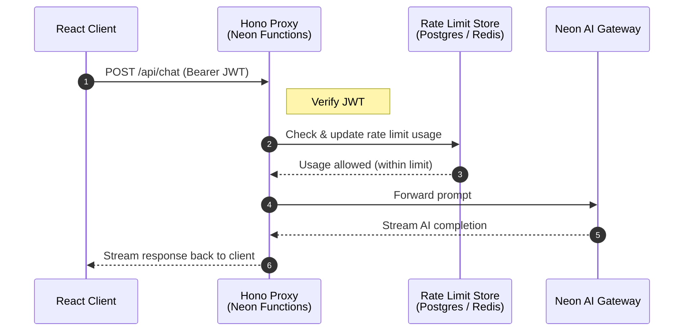

If you’re building a web application that uses large language models (LLMs), you need a secure way to handle requests from the frontend to the model endpoints. Whether it’s a chat interface or a content generation tool, the frontend needs to reach a model endpoint. But exposing LLM API keys directly to the browser is a serious security risk. Secret keys can leak through browser DevTools or network logs. Without server-side controls, there’s also nothing stopping a user from sending unlimited requests, driving up costs, or bypassing access restrictions entirely.

A common workaround is to hardcode API keys in a backend service, but this introduces its own problems. You lose visibility into which user made which request, can’t enforce per-user rate limits, and end up managing model provider credentials across multiple services. As your application scales, these gaps become harder to close.

This guide explains how to build a secure LLM proxy backend that authenticates requests, enforces per-user rate limits, and streams AI responses back to the client. Using **[Neon Functions](/docs/compute/functions/overview)** for compute, **[Neon AI Gateway](/docs/ai-gateway/overview)** for unified model access, and **[Managed Better Auth](/docs/auth/overview)** for authentication, you’ll create a backend that authenticates every request with a JWT, enforces per-user rate limits backed by Postgres or Redis, and streams model responses back to the client without ever exposing provider keys.

## Architecture overview

Consider the following architecture for a React frontend that interacts with a LLM proxy backend built with Neon Functions:

1. **Client Request**: The React application grabs a session JWT from Auth service and attaches it as a Bearer token in the `Authorization` header when sending a chat request to the Hono proxy backend.
2. **Authentication**: The Hono proxy verifies the JWT signature against Neon Auth’s JWKS endpoint and extracts the verified `userId`.
3. **Rate Limiting**: The proxy queries the rate limit store (Postgres or Redis) for that `userId`. If the user has exceeded their quota, the proxy returns a `429 Too Many Requests` status code.
4. **AI Generation & Streaming**: If allowed, the proxy forwards the prompt to the **Neon AI Gateway** and streams the AI output back to the client in real-time.



## Prerequisites

Before starting, ensure you have:

1. **Node.js**: Version `20` or higher installed. Download from [nodejs.org](https://nodejs.org/).
2. **Neon Account**: Sign up at [console.neon.tech](https://console.neon.tech/signup).
3. **Neon CLI**: Installed globally (`npm i -g neon`) and authenticated (`neon auth`). Check out the [Neon CLI Quickstart](/docs/cli/quickstart) for details.

<Steps>

## Set up the backend proxy (Neon functions & Hono)

Create a directory for your project and set up the Neon Functions backend.

```bash
mkdir llm-proxy-backend && cd llm-proxy-backend
```

Run the Neon CLI initialization command:

```bash
neon init
```

Use the default setup options for all prompts such as enabling AI skills, configuring the MCP server, and installing the VS Code extension. This streamlined setup makes it easier to build Neon powered applications with AI agents like Claude Code, Cursor, and others.

Create a new Neon project by running:

```bash
neon link
```

You will be prompted to select your organization. After selecting your organization, choose an existing Neon project if you already have one, or create a new project named `llm-proxy-demo`.

<Admonition type="note">
Ensure you select the **AWS US East 2 (Ohio)** region when creating your Neon project, as Neon Functions are currently only available in this region during Beta.
</Admonition>

```bash
$ neon link
INFO: Linking organization XXX (org-round-sun-33472318).
✔ Which project would you like to link? › ＋ Create new project…
✔ Name for the new project: … llm-proxy-demo
✔ Which region should the new project run in? › AWS US East 2 (Ohio) (aws-us-east-2)
Created project winter-breeze-65209364 ("llm-proxy-demo") in aws-us-east-2.
Linked /home/llm-proxy-backend/.neon:
  orgId:     org-round-sun-33472318
  projectId: winter-breeze-65209364
  branch:    main

✔ Manage this project's Neon setup as code? Adds a neon.ts you can edit and apply with `neon config apply`. … yes
```

When prompted whether to manage setup as code, select **Yes** to generate a `neon.ts` file.

A `.env.local` file should be created automatically in your project root with your Neon project details

## Implement rate limiting

### Install dependencies

Select your preferred rate limiting backend and install the required dependencies:

<Tabs labels={['postgres', 'redis']}>

<TabItem>

```bash
npm install hono @neon/ai-sdk-provider @neon/functions @neondatabase/serverless jose
npm install --save-dev esbuild @types/node typescript dotenv
```

</TabItem>

<TabItem>

```bash
npm install hono @neon/ai-sdk-provider @neon/functions jose @upstash/ratelimit @upstash/redis
npm install --save-dev esbuild @types/node typescript dotenv
```

</TabItem>
</Tabs>

- `hono`: A lightweight web framework for routing and middleware.
- `@neon/ai-sdk-provider`: Neon's provider for the Vercel AI SDK, allowing unified access to LLMs.
- `@neondatabase/serverless`: Serverless driver for querying Neon Postgres over HTTP.
- `jose`: A lightweight module for cryptographic JWT verification using JWKS endpoints.
- `@upstash/ratelimit` & `@upstash/redis`: (Optional) Redis driver if choosing Redis for rate limiting.

### Implement the rate limiting logic

LLM requests cost real money. Unlike typical API endpoints, where rate limiting is mostly about abuse prevention, LLM requests directly affect your bill. Without a per-user cap, a single user could send thousands of requests and drive up your bill. Rate limiting solves this by capping how many requests each user can make within a fixed time window (for example, 5 requests per 60 seconds).

Since Neon Functions are serverless, there's no persistent in-memory state between requests. The rate limit counter needs to live in an external store that every function instance can read and write to. You have two options:

- **Neon Postgres**: Keeps your entire stack within Neon. Uses serverless HTTP queries over `@neondatabase/serverless`, eliminating the need to manage additional cloud infrastructure.
- **Upstash Redis**: An alternative if you prefer an in-memory, key-value store specifically designed for low-latency rate-limiting counters.

<Tabs labels={['postgres', 'redis']}>

<TabItem>

Create a file named `src/ratelimit.ts`. This module tracks request counts per user using a fixed-window counter stored in Neon Postgres.

```typescript shouldWrap filename="src/ratelimit.ts"
import { neon } from '@neondatabase/serverless';

const sql = neon(process.env.DATABASE_URL!);

const MAX_REQUESTS = 5;
const WINDOW_MS = 60_000;
const CLEANUP_INTERVAL_MS = 300_000;

let lastCleanup = 0;
let tableEnsured = false;

function getWindowStart(now: number): number {
  return Math.floor(now / WINDOW_MS) * WINDOW_MS;
}

async function ensureTable(): Promise<void> {
  await sql`
    CREATE TABLE IF NOT EXISTS rate_limits (
      user_id TEXT NOT NULL,
      window_start BIGINT NOT NULL,
      count INT NOT NULL DEFAULT 0,
      PRIMARY KEY (user_id, window_start)
    )
  `;
}

async function cleanup(): Promise<void> {
  const now = Date.now();
  if (now - lastCleanup < CLEANUP_INTERVAL_MS) return;
  lastCleanup = now;
  const cutoff = now - WINDOW_MS;
  await sql`DELETE FROM rate_limits WHERE window_start < ${cutoff}`;
}

export async function checkRateLimit(userId: string): Promise<{
  success: boolean;
  remaining: number;
  resetAt: number;
}> {
  if (!tableEnsured) {
    await ensureTable();
    tableEnsured = true;
  }

  const now = Date.now();
  const windowStart = getWindowStart(now);
  const resetAt = windowStart + WINDOW_MS;

  const result = await sql`
    INSERT INTO rate_limits (user_id, window_start, count)
    VALUES (${userId}, ${windowStart}, 1)
    ON CONFLICT (user_id, window_start)
    DO UPDATE SET count = CASE
      WHEN rate_limits.count < ${MAX_REQUESTS} THEN rate_limits.count + 1
      ELSE rate_limits.count
    END
    RETURNING count
  `;

  const count = result[0]?.count ?? 0;
  const remaining = MAX_REQUESTS - count;

  await cleanup();

  return {
    success: count < MAX_REQUESTS,
    remaining: Math.max(0, remaining),
    resetAt,
  };
}
```

**How the rate limiter works:**

1. **Fixed-window counters**: Time is divided into 60-second buckets. `getWindowStart()` rounds the current timestamp down to the nearest window boundary, so all requests within the same 60 seconds share one counter. For example, a request at `t=75000ms` and another at `t=95000ms` both map to window `t=60000ms`.

2. **Atomic upsert with cap**: `ON CONFLICT DO UPDATE` is a Postgres upsert. If no row exists for this user and window, it inserts one with `count = 1`. If a row already exists, the `CASE` expression increments the counter only when `count < MAX_REQUESTS`, otherwise it leaves the value unchanged. This ensures that once a user hits the limit, further requests do not increment the counter, and the `success` flag will be `false`.

3. **Cleanup**: Old window rows are deleted every 5 minutes (`CLEANUP_INTERVAL_MS`) to prevent the table from growing indefinitely. The cutoff is one full window behind the current time, so rows are only deleted after they can no longer affect any active window.

4. **Lazy table creation**: `ensureTable()` runs once on the first request to create the `rate_limits` table if it doesn't already exist. This avoids requiring a separate migration step during deployment. Set `tableEnsured = true` for new deployments to skip this check on subsequent requests.

</TabItem>

<TabItem>

Create a file named `src/ratelimit.ts`. This module delegates rate limiting to Upstash Redis, which handles the fixed-window counter logic for you over HTTP.

```typescript shouldWrap filename="src/ratelimit.ts"
import { Ratelimit } from '@upstash/ratelimit';
import { Redis } from '@upstash/redis';

const redis = Redis.fromEnv();

const ratelimit = new Ratelimit({
  redis,
  limiter: Ratelimit.fixedWindow(5, '60s'),
  analytics: true,
});

export async function checkRateLimit(userId: string): Promise<{
  success: boolean;
  remaining: number;
  resetAt: number;
}> {
  const { success, remaining, reset } = await ratelimit.limit(userId);
  return {
    success,
    remaining,
    resetAt: reset,
  };
}
```

The Redis implementation is simpler than the Postgres one because `@upstash/ratelimit` handles all the counter logic internally. `Ratelimit.fixedWindow(5, '60s')` creates a limiter that allows 5 requests per 60-second window, the same algorithm as the Postgres version, but managed by Upstash's Redis infrastructure. The `limit()` call atomically checks and increments the counter in a single HTTP round-trip, returning whether the request is allowed, how many remain, and when the window resets.

Add the following environment variables at the end of your `.env.local` file:

```bash
UPSTASH_REDIS_REST_URL=<your-upstash-redis-rest-url>
UPSTASH_REDIS_REST_TOKEN=<your-upstash-redis-rest-token>
```

</TabItem>
</Tabs>

## Create the Hono proxy server

Create an `index.ts` file in the root of your project. This is the main server file that wires together three concerns, processed in order for every request:

1. **Authentication**: Verify who's making the request by validating their JWT.
2. **Rate limiting**: Check if they're over their per-user limit.
3. **AI generation**: Forward the prompt to the Neon AI Gateway and stream the response back.

Each layer belongs in its own middleware function, so the code is modular and easy to maintain.

JWTs issued by Managed Better Auth are signed with a private key, and the corresponding public keys are published at a JWKS endpoint. The `jose` library's `createRemoteJWKSet` handles this by fetching the JWKS and caching it. When a JWT arrives, `jose` automatically picks the right key to verify the signature based on the key ID embedded in the token.

```typescript shouldWrap filename="index.ts"
import { Hono, type Context, type Next } from 'hono';
import { cors } from 'hono/cors';
import { neon as neonAI } from '@neon/ai-sdk-provider';
import { convertToModelMessages, streamText, toUIMessageStream, createUIMessageStreamResponse } from 'ai';
import * as jose from 'jose';
import { checkRateLimit } from './src/ratelimit';

type AppVariables = { userId: string };

const app = new Hono<{ Variables: AppVariables }>();

const JWKS = jose.createRemoteJWKSet(new URL(process.env.NEON_AUTH_JWKS_URL!));

const authMiddleware = async (c: Context<{ Variables: AppVariables }>, next: Next) => {
    const authHeader = c.req.header('Authorization');

    if (!authHeader || !authHeader.startsWith('Bearer ')) {
        return c.json({ error: 'Unauthorized: Missing token' }, 401);
    }
    const token = authHeader.split(' ')[1];

    try {
        const { payload } = await jose.jwtVerify(token, JWKS, {
            issuer: new URL(process.env.NEON_AUTH_JWKS_URL!).origin,
        });

        if (!payload.sub) {
            return c.json({ error: 'Unauthorized: Invalid token subject' }, 401);
        }

        c.set('userId', payload.sub);
        await next();
    } catch (err) {
        console.error('JWT verification failed:', err);
        return c.json({ error: 'Unauthorized: Token verification failed' }, 401);
    }
};

app.use(
    '/api/*',
    cors({
        origin: '*',
        allowMethods: ['GET', 'POST', 'OPTIONS'],
        allowHeaders: ['Content-Type', 'Authorization'],
    })
);

app.post('/api/chat', authMiddleware, async (c) => {
    const userId = c.get('userId');

    const { success, remaining, resetAt } = await checkRateLimit(userId);

    if (!success) {
        return c.json(
            { error: 'Rate limit exceeded. Please wait before sending more requests.' },
            429,
            {
                'X-RateLimit-Limit': '5',
                'X-RateLimit-Remaining': '0',
                'X-RateLimit-Reset': resetAt.toString(),
            }
        );
    }

    const { messages } = await c.req.json();

    const result = streamText({
        model: neonAI('gpt-oss-120b'),
        messages: await convertToModelMessages(messages),
    });

    return createUIMessageStreamResponse({
        stream: toUIMessageStream({ stream: result.stream }),
        headers: {
            'X-RateLimit-Remaining': remaining.toString(),
            'X-RateLimit-Reset': resetAt.toString(),
        }
    });
});

export default app;
```

Here's what this server code handles:

1. **JWKS setup**: `jose.createRemoteJWKSet` fetches the public keys from Managed Better Auth's JWKS URL and caches them. When a JWT arrives, `jose` automatically picks the right key to verify the signature based on the key ID embedded in the token.

2. **Auth middleware**: Runs before every `/api/*` route. It extracts the Bearer token from the `Authorization` header, verifies it against the cached JWKS, and checks that the `iss` (issuer) claim matches the expected origin. If verification succeeds, the `sub` (subject) claim, which contains the user's ID, is stored in the request context via `c.set('userId', payload.sub)` so downstream handlers can access it without re-parsing the token.

3. **Rate limit check**: Calls `checkRateLimit(userId)` from the module you created earlier. This single call atomically increments the user's counter and returns whether the request is allowed. If the user has exceeded their quota, the response includes standard `X-RateLimit-*` headers so the frontend can display a countdown or disable the input until the window resets. The `429` status code follows the HTTP convention for rate limit errors.

4. **CORS configuration**: The `cors()` middleware allows the React frontend (running on a different origin during development) to make authenticated requests to the proxy. `origin: '*'` is permissive for development; in production, you'd restrict this to your actual frontend domain.

5. **AI Streaming**: The `streamText` function from the Vercel AI SDK sends prompts to the Neon AI Gateway and streams back text tokens in real time. These tokens are then converted into a frontend-friendly format using `toUIMessageStream` and `createUIMessageStreamResponse`, allowing the `useChat` hook to display them incrementally in the chat UI instead of waiting for the full response. Meanwhile, `convertToModelMessages` from the AI SDK transforms the frontend message format into the model's expected input format. Checkout [AI SDK](#resources) for more details.

## Configure neon.ts and Deploy the Function

Update the `neon.ts` configuration file generated by the Neon CLI. This file tells Neon which services to enable for your project and how to deploy your function.

<CodeTabs labels={['postgres', 'redis']}>

```typescript {4,10-18} filename="neon.ts"
import { defineConfig } from "@neon/config/v1";

export default defineConfig({
  auth: true,
  branch: (branch) => {
    if (branch.isDefault) { return {}; }
    if (!branch.exists) { return { ttl: "7d" }; }
    return {};
  },
  preview: {
    functions: {
      proxy: {
        name: "LLM Proxy Server",
        source: "./index.ts",
      }
    },
    aiGateway: true
  }
});
```

```typescript {4,10-22} filename="neon.ts"
import { defineConfig } from "@neon/config/v1";

export default defineConfig({
  auth: true,
  branch: (branch) => {
    if (branch.isDefault) { return {}; }
    if (!branch.exists) { return { ttl: "7d" }; }
    return {};
  },
  preview: {
    functions: {
      proxy: {
        name: "LLM Proxy Server",
        source: "./index.ts",
        env: {
          UPSTASH_REDIS_REST_URL: process.env.UPSTASH_REDIS_REST_URL!,
          UPSTASH_REDIS_REST_TOKEN: process.env.UPSTASH_REDIS_REST_TOKEN!,
        }
      },
    },
    aiGateway: true
  }
});
```

</CodeTabs>

Here's what each property does:

- **`auth: true`**: Enables Managed Better Auth for this project, which provisions the JWKS endpoint your proxy uses to verify JWTs.
- **`preview.functions.proxy`**: Registers `index.ts` as a deployable Neon Function named "LLM Proxy Server".
- **`aiGateway: true`**: Activates the Neon AI Gateway, giving your function access to LLMs through `@neon/ai-sdk-provider` without you needing to manage provider API keys.

Apply the configuration and deploy your function to Neon:

```bash
neon deploy --env .env.local
```

The terminal will log your public function URL upon completion:

```bash
Function URLs
  • proxy: https://br-damp-voice-xxx-proxy.compute.c-3.us-east-2.aws.neon.tech
```

Copy this function endpoint URL. You will use it in your React frontend. Your `.env.local` file should now also include the `NEON_AUTH_JWKS_URL` and other necessary environment variables for the proxy to verify JWTs and connect to the AI Gateway.

## Build the React frontend

Now, create a React frontend that handles user authentication and streams AI chat completions through the proxy you just deployed. The frontend has three main pieces:

1. **Managed Better Auth**: Handles sign-ups, logins, and issues session JWTs. You won't build auth UI from scratch; the `@neondatabase/auth-ui` package provides pre-built components for sign-in, sign-out, and session management.
2. **Chat interface**: A simple message input and display area. The [`useChat`](https://ai-sdk.dev/docs/reference/ai-sdk-ui/use-chat) hook from the Vercel AI SDK manages the message state and handles streaming responses automatically.
3. **Authenticated transport**: Before each request to the proxy, the frontend grabs the session JWT and attaches it as a Bearer token. The proxy verifies this token to identify the user and enforce rate limits.

You'll build these in a new directory, separate from the backend.

### Initialize Vite React project

Open a new terminal window and run:

```bash
npm create vite@latest llm-proxy-frontend -- --template react-ts
cd llm-proxy-frontend
```

Install the dependencies for Managed Better Auth, Tailwind CSS, and the Vercel AI SDK:

```bash
npm install @neondatabase/neon-js@latest @neondatabase/auth-ui react-router @ai-sdk/react ai
npm install tailwindcss @tailwindcss/vite
```

### Configure Tailwind CSS

Update `vite.config.ts` to register `@tailwindcss/vite`:

```typescript
import { defineConfig } from 'vite'
import react from '@vitejs/plugin-react'
import tailwindcss from '@tailwindcss/vite'

export default defineConfig({
  plugins: [react(), tailwindcss()],
})

```

Update `src/index.css` to load Tailwind CSS and Managed Better Auth component styling:

```css filename="src/index.css"
@import 'tailwindcss';
@import '@neondatabase/auth-ui/tailwind';

body {
  margin: 0;
  min-height: 100vh;
  background-color: #0f172a;
  color: #f8fafc;
  font-family: system-ui, -apple-system, sans-serif;
}
```

### Set environment variables

Create `.env` in `llm-proxy-frontend/`:

```env filename=".env"
VITE_NEON_AUTH_URL="https://ep-xxx.neon.tech/neondb/auth"
VITE_PROXY_API_URL="https://br-damp-voice-xxx-proxy.compute.c-3.us-east-2.aws.neon.tech/api/chat"
```

Replace `VITE_PROXY_API_URL` with your deployed Neon Function URL and `VITE_NEON_AUTH_URL` with your Managed Better Auth endpoint (`NEON_AUTH_BASE_URL`) from your `.env.local` file in the backend. (Optionally, you can link the frontend folder to the same neon project using `neon link` to automatically keep the env variables in sync.)

### Initialize Auth client

Create `src/neon.ts` to instantiate the authentication client:

```typescript filename="src/neon.ts"
import { createAuthClient } from '@neondatabase/neon-js/auth';

export const authClient = createAuthClient(import.meta.env.VITE_NEON_AUTH_URL);
```

### Configure application providers

Update `src/main.tsx` to wrap your app in auth and router providers:

```tsx shouldWrap filename="src/main.tsx"
import { StrictMode } from 'react';
import { createRoot } from 'react-dom/client';
import { BrowserRouter } from 'react-router';
import { NeonAuthUIProvider } from '@neondatabase/auth-ui';
import App from './App.tsx';
import { authClient } from './neon.ts';
import './index.css';

createRoot(document.getElementById('root')!).render(
  <StrictMode>
    <NeonAuthUIProvider authClient={authClient}>
      <BrowserRouter>
        <App />
      </BrowserRouter>
    </NeonAuthUIProvider>
  </StrictMode>
);
```

### Create the authentication page and chat interface

Create `src/pages/Auth.tsx` to host auth components:

<Admonition type="note" title="Using your own authentication system">
If you already have your own authentication system: session cookies, API keys, OAuth, or any other mechanism, you can apply the same approach. Extract a stable `user_id` identifier from your auth service (a session lookup, a decoded token, an API key record), and use it in the rate limiting logic. The key is to ensure that every request to the LLM proxy carries a verified user identity, which the backend can use to enforce limits and track usage for billing or analytics.
</Admonition>

```tsx filename="src/pages/Auth.tsx"
import { AuthView } from '@neondatabase/auth-ui';
import { useParams } from 'react-router';

export default function AuthPage() {
  const { pathname } = useParams();
  return (
    <div className="flex min-h-screen items-center justify-center p-4">
      <AuthView pathname={pathname} />
    </div>
  );
}
```

Now, update `src/App.tsx` to render the interactive AI Chat interface connected to your Neon Function proxy:

```tsx shouldWrap filename="src/App.tsx"
import { useState } from 'react';
import { useChat } from '@ai-sdk/react';
import { DefaultChatTransport } from 'ai';
import { SignedIn, RedirectToSignIn, UserButton } from '@neondatabase/auth-ui';
import { Routes, Route } from 'react-router';
import { authClient } from './neon';
import AuthPage from './pages/Auth';

function Chat() {
  const [input, setInput] = useState('');
  const [errorMessage, setErrorMessage] = useState<string | null>(null);

  const { messages, sendMessage } = useChat({
    transport: new DefaultChatTransport({
      api: import.meta.env.VITE_PROXY_API_URL,
      headers: async () => {
        const { data } = await authClient.getSession();
        const token = data?.session?.token;
        return {
          Authorization: token ? `Bearer ${token}` : '',
        };
      },
    }),
  });

  const handleSubmit = async (e: React.FormEvent) => {
    e.preventDefault();
    if (!input.trim()) return;

    setErrorMessage(null);
    try {
      await sendMessage({ text: input });
      setInput('');
    } catch (error: any) {
      console.error('Failed to send message:', error);
      setErrorMessage(error.message || 'Request failed. You may have hit your rate limit.');
    }
  };

  return (
    <div className="mx-auto flex h-screen max-w-3xl flex-col p-4">
      <header className="flex items-center justify-between border-b border-slate-700 pb-4">
        <h1 className="text-xl font-bold">Neon AI Proxy Chat</h1>
        <UserButton size="icon" />
      </header>

      <SignedIn>
        <div className="flex-1 overflow-y-auto py-4 space-y-4">
          {messages.map((message) => (
            <div
              key={message.id}
              className={`p-3 rounded-lg max-w-[80%] ${
                message.role === 'user'
                  ? 'ml-auto bg-blue-600 text-white'
                  : 'bg-slate-800 text-slate-100'
              }`}
            >
              <strong>{message.role === 'user' ? 'You' : 'AI Gateway'}: </strong>
              {message.parts?.map(
                (part, i) =>
                  part.type === 'text' && <span key={`${message.id}-${i}`}>{part.text}</span>
              )}
            </div>
          ))}

          {errorMessage && (
            <div className="p-3 bg-red-900/50 border border-red-500 text-red-200 rounded-md text-sm">
              ⚠️ {errorMessage}
            </div>
          )}
        </div>

        <form onSubmit={handleSubmit} className="flex gap-2 pt-2 border-t border-slate-700">
          <input
            className="flex-1 rounded-md bg-slate-800 border border-slate-700 p-3 text-white focus:outline-none focus:ring-2 focus:ring-blue-500"
            value={input}
            placeholder="Ask something..."
            onChange={(e) => setInput(e.target.value)}
          />
          <button
            type="submit"
            className="rounded-md bg-blue-600 px-5 py-3 font-medium text-white hover:bg-blue-500 transition"
          >
            Send
          </button>
        </form>
      </SignedIn>

      <RedirectToSignIn />
    </div>
  );
}

export default function App() {
  return (
    <Routes>
      <Route path="/" element={<Chat />} />
      <Route path="/auth/:pathname" element={<AuthPage />} />
    </Routes>
  );
}
```

This code handles several key aspects of the frontend:

1. **Session-based auth**: `NeonAuthUIProvider` wraps the app and provides auth state. `SignedIn` conditionally renders the chat UI only for authenticated users. `RedirectToSignIn` sends unauthenticated users to the login page automatically.

2. **Authenticated requests**: `DefaultChatTransport` is configured with a custom `headers` function that calls `authClient.getSession()` before every request. This retrieves the current session JWT and attaches it as a Bearer token in the `Authorization` header, the same header the proxy's auth middleware checks.

3. **Streaming responses**: The `useChat` hook manages the message array and handles the streaming protocol automatically. As tokens arrive from the proxy, they're appended to the latest assistant message, creating the typing effect you see in chat interfaces.

## Test the Application

1. Start your Vite frontend development server:
   ```bash
   npm run dev
   ```
2. Navigate to `http://localhost:5173` in your browser.
3. **Sign In**: Register a new account or log in using Managed Better Auth.
4. **Send Prompts**: Enter prompts into the text area. Watch the AI Gateway stream answers back in real-time through your Neon Function.
5. **Verify Rate Limits**: Send more than 5 prompts within 1 minute. The 6th request should fail with a `429 Too Many Requests` error.

</Steps>

## Extending this workflow

Now that you have built a basic LLM Proxy on Neon Functions, consider expanding it into a full production setup:

- **Token-based Rate Limiting**: The `count` column is generic by design. In the base implementation, it tracks request counts. You can repurpose it to track actual token consumption (`prompt_tokens` + `completion_tokens`) returned by the AI SDK instead. This gives you finer-grained control over costs, since a single request with a long prompt or response can consume far more tokens than a short one. The `streamText` API exposes a `usage` object in its `onFinish` callback that reports `totalTokens` once the stream completes. Capture this value and write it to your rate limit table after each response.

  ```typescript shouldWrap
  // Add a function to record actual token usage after streaming completes
  export async function addTokenUsage(userId: string, tokens: number): Promise<void> {
    const now = Date.now();
    const windowStart = getWindowStart(now);

    await sql`
      INSERT INTO rate_limits (user_id, window_start, count)
      VALUES (${userId}, ${windowStart}, ${tokens})
      ON CONFLICT (user_id, window_start)
      DO UPDATE SET count = rate_limits.count + ${tokens}
    `;
  }
  ```

  Then, in your proxy route, use the `onFinish` callback to record actual usage after the stream completes:

  ```typescript shouldWrap
    const result = streamText({
      model: neonAI('gpt-oss-120b'),
      messages: await convertToModelMessages(messages),
      onFinish: ({ usage }) => {
        if (usage?.totalTokens) {
          addTokenUsage(userId, usage.totalTokens);
        }
      },
    });
  ```

  Because tokens are recorded after the response finishes, a user can technically start one request even if they are near the limit. To guard against overages, you can add a pre-check that estimates token count from the prompt length before forwarding to the model, or set a max tokens parameter on the model call to cap individual response sizes.

- **Model Tiering**: Inspect user subscription tiers in Postgres (e.g., Free vs. Paid). Direct free-tier users to smaller, cost-effective models (`gpt-oss-120b`) and allow paid users access to advanced models (`gpt-5`).
- **Audit Logging & Analytics**: Store all prompts, completion metadata, latency metrics, and user IDs in a Postgres table for compliance and usage tracking.

## Resources

- [Neon Functions Overview](/docs/compute/functions/overview)
- [Neon AI Gateway](/docs/ai-gateway/overview)
- [Managed Better Auth Overview](/docs/auth/overview)
- [Neon AI SDK Provider](https://github.com/neondatabase/neon-pkgs/tree/main/packages/ai-sdk-provider)
- [Vercel AI SDK Documentation](https://sdk.vercel.ai/docs)
- [Hono Framework](https://hono.dev/)
- [Upstash Rate Limit](https://www.npmjs.com/package/@upstash/ratelimit)

<NeedHelp />
