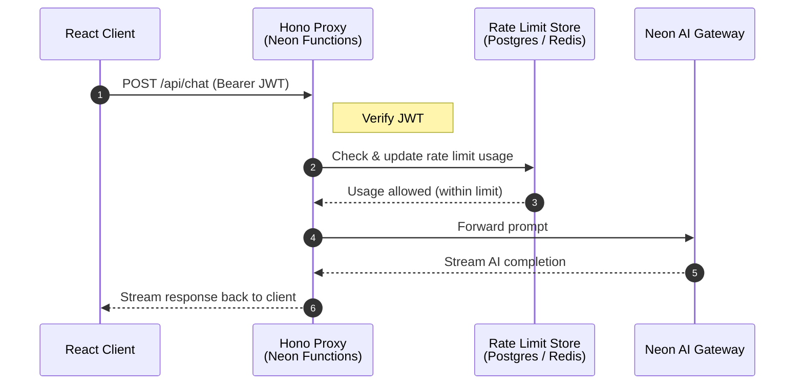

If you’re building a web application that uses large language models (LLMs), you need a secure way to handle requests from the frontend to the model endpoints. Whether it’s a chat interface or a content generation tool, the frontend needs to reach a model endpoint. But exposing LLM API keys directly to the browser is a serious security risk. Secret keys can leak through browser DevTools or network logs. Without server-side controls, there’s also nothing stopping a user from sending unlimited requests, driving up costs, or bypassing access restrictions entirely.

A common workaround is to hardcode API keys in a backend service, but this introduces its own problems. You lose visibility into which user made which request, can’t enforce per-user rate limits, and end up managing model provider credentials across multiple services. As your application scales, these gaps become harder to close.

In this guide, you’ll build a secure LLM proxy that solves all of this. You’ll implement:

- A **Hono proxy backend** on [Neon Functions](/docs/compute/functions/overview) that authenticates every request with a JWT
- **Per-user rate limiting** backed by Postgres or Redis.
- **Streaming AI responses** through the [Neon AI Gateway](/docs/ai-gateway/overview), without ever exposing provider keys to the frontend
- A **React frontend** with [Managed Better Auth](/docs/auth/overview) for sign-in and the [Vercel AI SDK UI](https://ai-sdk.dev/docs/ai-sdk-ui/overview) for real-time chat

<CopyPrompt
  src="/prompts/llm-proxy-neon-functions-prompt.md"
  description="Use this prompt to customize the guide and build it with your AI agent."
  buttonText="Copy prompt"
/>

## Architecture overview

Consider the following architecture for a React frontend that interacts with a LLM proxy backend built with Neon Functions:

1. **Client request**: The React application grabs a session JWT from Auth service and attaches it as a Bearer token in the `Authorization` header when sending a chat request to the Hono proxy backend.
2. **Authentication**: The Hono proxy verifies the JWT signature against [Neon Auth’s JWKS endpoint](/docs/auth/guides/plugins/jwt#the-jwks-endpoint) and extracts the verified `userId`.
3. **Rate limiting**: The proxy queries the rate limit store (Postgres or Redis) for that `userId`. If the user has exceeded their quota, the proxy returns a `429 Too Many Requests` status code.
4. **AI generation & streaming**: If allowed, the proxy forwards the prompt to the **Neon AI Gateway** and streams the AI output back to the client in real-time.



## Prerequisites

Before starting, ensure you have:

1. **Node.js**: Version `20` or higher installed. Download from [nodejs.org](https://nodejs.org/).
2. **Neon Account**: Sign up at [console.neon.tech](https://console.neon.tech/signup).
3. **Neon CLI**: Installed globally (`npm i -g neon`) and authenticated (`neon auth`). Check out the [Neon CLI Quickstart](/docs/cli/quickstart) for details.

<Steps>

## Set up the backend proxy (Neon Functions & Hono)

Create a directory for your project and initialize a Neon Functions project. This will set up the backend for your LLM proxy.

```bash
mkdir llm-proxy-backend && cd llm-proxy-backend
```

Install the Neon agent skills so AI agents like Claude Code and Cursor have the context to help you build and deploy. This proxy uses the **Neon**, **Neon Functions**, and **Neon AI Gateway** skills:

```bash
neon skills -s neon -s neon-functions -s neon-ai-gateway
```

Create a new Neon project by running the following command. This links your local project to a Neon project and sets up the necessary configuration:

```bash
neon link
```

You will be prompted to select your organization. After selecting your organization, choose an existing Neon project if you already have one, or create a new project named `llm-proxy-demo`.

<Admonition type="note">
Select **AWS US East (Ohio)** (`aws-us-east-2`) or **AWS Europe (Frankfurt)** (`aws-eu-central-1`) when creating your Neon project; this guide uses US East (Ohio). Neon Functions are currently available in these regions during beta. Support is expanding toward all regions.
</Admonition>

```bash
$ neon link
INFO: Linking organization XXX (org-round-sun-33472318).
✔ Which project would you like to link? › ＋ Create new project…
✔ Name for the new project: … llm-proxy-demo
✔ Which region should the new project run in? › AWS US East 2 (Ohio) (aws-us-east-2)
Created project winter-breeze-65209364 ("llm-proxy-demo") in aws-us-east-2.
Linked <project-directory>/llm-proxy-backend/.neon:
  orgId:     org-round-sun-33472318
  projectId: winter-breeze-65209364
  branch:    main

✔ Manage this project's Neon setup as code? Adds a neon.ts you can edit and apply with `neon config apply`. … yes

INFO: Pulled 3 Neon variables into <project-directory>/llm-proxy-backend/.env.local: NEON_BRANCH, DATABASE_URL, DATABASE_URL_UNPOOLED
```

When prompted whether to manage setup as code, select **Yes** to generate a `neon.ts` file. This file will configure your project's services and function deployment.

A `.env.local` file should be created automatically in your project root with your Neon project details, including `DATABASE_URL` and other Neon-specific variables. You'll add more environment variables to this file as you configure the proxy.

## Implement rate limiting

### Install dependencies

Select your preferred rate limiting backend and install the required dependencies. The core packages are the same for both options; the only difference is which rate limiting library you add:

<Tabs labels={['postgres', 'redis']}>

<TabItem>

```bash
npm install hono @neon/ai-sdk-provider @neon/functions pg jose
npm install --save-dev esbuild @types/node @types/pg typescript dotenv
```

</TabItem>

<TabItem>

```bash
npm install hono @neon/ai-sdk-provider @neon/functions jose @upstash/ratelimit @upstash/redis
npm install --save-dev esbuild @types/node typescript dotenv
```

</TabItem>
</Tabs>

- `hono`: A lightweight web framework for routing and middleware.
- `@neon/ai-sdk-provider`: Neon's provider for the Vercel AI SDK, giving you a single interface to LLMs.
- `pg`: PostgreSQL client for Node.js.
- `jose`: A lightweight module for cryptographic JWT verification using JWKS endpoints.
- `@upstash/ratelimit` & `@upstash/redis`: Redis driver if choosing Redis for rate limiting.

### Implement the rate limiting logic

LLM requests cost real money. Unlike typical API endpoints, where rate limiting is mostly about abuse prevention, LLM requests directly affect your bill. Without a per-user cap, a single user could send thousands of requests and drive up your bill. Rate limiting solves this by capping how many requests each user can make within a fixed time window (for example, 5 requests per 60 seconds).

Neon Functions run as long-lived Node.js processes, but they can still scale horizontally. This means multiple instances of your function may operate simultaneously, each maintaining its own in-memory state. To enforce consistent rate limiting across all instances, you’ll need a shared store accessible to every process. You have two main options:

- [**Lakebase Postgres**](/docs/postgres/overview): Keeps your entire stack on Neon, eliminating the need to manage additional cloud infrastructure.
- [**Upstash Redis**](https://upstash.com/redis): An alternative if you prefer an in-memory, key-value store specifically designed for low-latency rate-limiting counters.

Both implementations follow the same pattern: a fixed-window counter that tracks requests per user within a 60-second bucket.

<Tabs labels={['postgres', 'redis']}>

<TabItem>

Create a file named `src/ratelimit.ts`. This module tracks request counts per user using a fixed-window counter stored in Lakebase Postgres. It uses a connection pool to efficiently manage database connections and a simple upsert pattern to atomically check and increment the counter:

```typescript shouldWrap filename="src/ratelimit.ts"
import { Pool } from 'pg';

const pool = new Pool({ connectionString: process.env.DATABASE_URL, max: 5 });

const MAX_REQUESTS = 5;
const WINDOW_MS = 60_000;
const CLEANUP_INTERVAL_MS = 300_000;

let lastCleanup = 0;
let tableEnsured = false;

function getWindowStart(now: number): number {
  return Math.floor(now / WINDOW_MS) * WINDOW_MS;
}

async function ensureTable(): Promise<void> {
  await pool.query(`
    CREATE TABLE IF NOT EXISTS rate_limits (
      user_id TEXT NOT NULL,
      window_start BIGINT NOT NULL,
      count INT NOT NULL DEFAULT 0,
      PRIMARY KEY (user_id, window_start)
    )
  `);
}

async function cleanup(): Promise<void> {
  const now = Date.now();
  if (now - lastCleanup < CLEANUP_INTERVAL_MS) return;
  lastCleanup = now;
  const cutoff = now - WINDOW_MS;
  await pool.query('DELETE FROM rate_limits WHERE window_start < $1', [cutoff]);
}

export async function checkRateLimit(userId: string): Promise<{
  success: boolean;
  remaining: number;
  resetAt: number;
}> {
  if (!tableEnsured) {
    await ensureTable();
    tableEnsured = true;
  }

  const now = Date.now();
  const windowStart = getWindowStart(now);
  const resetAt = windowStart + WINDOW_MS;

  const result = await pool.query(
    `INSERT INTO rate_limits (user_id, window_start, count)
     VALUES ($1, $2, 1)
     ON CONFLICT (user_id, window_start)
     DO UPDATE SET count = CASE
       WHEN rate_limits.count < $3 THEN rate_limits.count + 1
       ELSE rate_limits.count
     END
     RETURNING count`,
    [userId, windowStart, MAX_REQUESTS]
  );

  const count = result.rows[0]?.count ?? 0;
  const remaining = MAX_REQUESTS - count;

  await cleanup();

  return {
    success: count < MAX_REQUESTS,
    remaining: Math.max(0, remaining),
    resetAt,
  };
}
```

Here's how the rate limiter works:

- **Connection pooling**: A `pg` `Pool` is created once at module scope with a max of 5 connections. Since Neon Functions run on long-lived Node.js compute, the pool is reused across requests, avoiding the overhead of establishing new connections for each invocation.
- **Fixed-window counters**: Time is divided into 60-second buckets. `getWindowStart()` rounds the current timestamp down to the nearest window boundary, so all requests within the same 60 seconds share one counter. For example, a request at `t=75000ms` and another at `t=95000ms` both map to window `t=60000ms`.
- **Atomic upsert with cap**: `ON CONFLICT DO UPDATE` is a Postgres upsert. If no row exists for this user and window, it inserts one with `count = 1`. If a row already exists, the `CASE` expression increments the counter only when `count < MAX_REQUESTS`, otherwise it leaves the value unchanged. This ensures that once a user hits the limit, further requests do not increment the counter, and the `success` flag will be `false`.
- **Cleanup**: Old window rows are deleted every 5 minutes (`CLEANUP_INTERVAL_MS`) to prevent the table from growing indefinitely. The cutoff is one full window behind the current time, so rows are only deleted after they can no longer affect any active window.
- **Lazy table creation**: `ensureTable()` runs once on the first request to create the `rate_limits` table if it doesn't already exist. This avoids requiring a separate migration step during deployment.
  > Set `tableEnsured = true` for new deployments to skip this check on subsequent requests.

</TabItem>

<TabItem>

Create a file named `src/ratelimit.ts`. This module delegates rate limiting to Upstash Redis, which handles the fixed-window counter logic for you over HTTP. The implementation is abstracted behind the `@upstash/ratelimit` library which provides a simple API for rate limiting:

```typescript shouldWrap filename="src/ratelimit.ts"
import { Ratelimit } from '@upstash/ratelimit';
import { Redis } from '@upstash/redis';

const redis = Redis.fromEnv();

const ratelimit = new Ratelimit({
  redis,
  limiter: Ratelimit.fixedWindow(5, '60s'),
  analytics: true,
});

export async function checkRateLimit(userId: string): Promise<{
  success: boolean;
  remaining: number;
  resetAt: number;
}> {
  const { success, remaining, reset } = await ratelimit.limit(userId);
  return {
    success,
    remaining,
    resetAt: reset,
  };
}
```

The Redis-based rate limiter works as follows:

- **`Ratelimit.fixedWindow(5, '60s')`**: Creates a limiter that allows 5 requests per 60-second window, the same algorithm as the Postgres version, but managed by Upstash's Redis infrastructure.
- **`limit()` call**: Atomically checks and increments the counter in a single HTTP round-trip, returning whether the request is allowed, how many remain, and when the window resets. This is the same pattern as the Postgres upsert, but abstracted behind the library.

Add the following environment variables at the end of your `.env.local` file. These credentials allow your function to connect to Upstash Redis for rate limiting:

```bash
UPSTASH_REDIS_REST_URL=<your-upstash-redis-rest-url>
UPSTASH_REDIS_REST_TOKEN=<your-upstash-redis-rest-token>
```

</TabItem>
</Tabs>

## Create the Hono proxy server

Create an `index.ts` file in the root of your project. This is the main server file that wires together three concerns, processed in order for every request:

- **Authentication**: Verify who's making the request by validating their JWT.
- **Rate limiting**: Check if they're over their per-user limit.
- **AI generation**: Forward the prompt to the Neon AI Gateway and stream the response back.

Each layer belongs in its own middleware function, so the code is modular and easy to maintain.

JWTs issued by Managed Better Auth are signed with a private key, and the corresponding public keys are published at a JWKS endpoint. See [Neon Functions authentication](/docs/compute/functions/authentication) for more on this pattern. The `jose` library's `createRemoteJWKSet` handles this by fetching the JWKS and caching it. When a JWT arrives, `jose` automatically picks the right key to verify the signature based on the key ID embedded in the token.

```typescript shouldWrap filename="index.ts"
import { Hono, type Context, type Next } from 'hono';
import { cors } from 'hono/cors';
import { neon as neonAI } from '@neon/ai-sdk-provider';
import { convertToModelMessages, streamText, toUIMessageStream, createUIMessageStreamResponse } from 'ai';
import * as jose from 'jose';
import { checkRateLimit } from './src/ratelimit';

type AppVariables = { userId: string };

const app = new Hono<{ Variables: AppVariables }>();

const JWKS = jose.createRemoteJWKSet(new URL(process.env.NEON_AUTH_JWKS_URL!));

const authMiddleware = async (c: Context<{ Variables: AppVariables }>, next: Next) => {
    const authHeader = c.req.header('Authorization');

    if (!authHeader || !authHeader.startsWith('Bearer ')) {
        return c.json({ error: 'Unauthorized: Missing token' }, 401);
    }
    const token = authHeader.split(' ')[1];

    try {
        const { payload } = await jose.jwtVerify(token, JWKS, {
            issuer: new URL(process.env.NEON_AUTH_BASE_URL!).origin,
        });

        if (!payload.sub) {
            return c.json({ error: 'Unauthorized: Invalid token subject' }, 401);
        }

        c.set('userId', payload.sub);
        await next();
    } catch (err) {
        console.error('JWT verification failed:', err);
        return c.json({ error: 'Unauthorized: Token verification failed' }, 401);
    }
};

app.use(
    '/api/*',
    cors({
        origin: '*',
        allowMethods: ['GET', 'POST', 'OPTIONS'],
        allowHeaders: ['Content-Type', 'Authorization'],
    })
);

app.post('/api/chat', authMiddleware, async (c) => {
    const userId = c.get('userId');

    const { success, remaining, resetAt } = await checkRateLimit(userId);

    if (!success) {
        return c.json(
            { error: 'Rate limit exceeded. Please wait before sending more requests.' },
            429,
            {
                'X-RateLimit-Limit': '5',
                'X-RateLimit-Remaining': '0',
                'X-RateLimit-Reset': resetAt.toString(),
            }
        );
    }

    const { messages } = await c.req.json();

    const result = streamText({
        model: neonAI('gpt-oss-120b'),
        messages: await convertToModelMessages(messages),
    });

    return createUIMessageStreamResponse({
        stream: toUIMessageStream({ stream: result.stream }),
        headers: {
            'X-RateLimit-Remaining': remaining.toString(),
            'X-RateLimit-Reset': resetAt.toString(),
        }
    });
});

export default app;
```

Here's what this server code handles:

- **JWKS setup**: `jose.createRemoteJWKSet` fetches the public keys from Managed Better Auth's JWKS URL and caches them. When a JWT arrives, `jose` automatically picks the right key to verify the signature based on the key ID embedded in the token.
- **Auth middleware**: Runs before every `/api/*` route. It extracts the Bearer token from the `Authorization` header, verifies it against the cached JWKS, and checks that the `iss` (issuer) claim matches the expected origin. If verification succeeds, the `sub` (subject) claim, which contains the user's ID, is stored in the request context via `c.set('userId', payload.sub)` so downstream handlers can access it without re-parsing the token.
- **Rate limit check**: Calls `checkRateLimit(userId)` from the module you created earlier. This single call atomically increments the user's counter and returns whether the request is allowed. If the user has exceeded their quota, the server responds with a `429 Too Many Requests` status and includes `X-RateLimit-*` headers to inform the client of their limit, remaining requests, and reset time.
- **CORS configuration**: The `cors()` middleware allows the React frontend (running on a different origin during development) to make authenticated requests to the proxy. `origin: '*'` is permissive for development; in production, you'd restrict this to your actual frontend domain.
- **AI Streaming**: The `streamText` function from the Vercel AI SDK sends prompts to the Neon AI Gateway and streams back text tokens in real time. `createUIMessageStreamResponse` and `toUIMessageStream` wrap the streaming response in a format that the frontend's `useChat` hook can consume incrementally, creating a typing effect in the chat UI. See the [AI SDK docs](https://ai-sdk.dev/docs) for more details.

## Configure neon.ts and Deploy the Function

The `neon link` command created a `neon.ts` file in your project root. Update it to configure the services your proxy needs: authentication, the AI Gateway, and the function itself.

<CodeTabs labels={['postgres', 'redis']}>

```typescript {4,10-18} filename="neon.ts"
import { defineConfig } from "@neon/config/v1";

export default defineConfig({
  auth: true,
  branch: (branch) => {
    if (branch.isDefault) { return {}; }
    if (!branch.exists) { return { ttl: "7d" }; }
    return {};
  },
  preview: {
    functions: {
      proxy: {
        name: "LLM Proxy Server",
        source: "./index.ts",
      }
    },
    aiGateway: true
  }
});
```

```typescript {4,10-22} filename="neon.ts"
import { defineConfig } from "@neon/config/v1";

export default defineConfig({
  auth: true,
  branch: (branch) => {
    if (branch.isDefault) { return {}; }
    if (!branch.exists) { return { ttl: "7d" }; }
    return {};
  },
  preview: {
    functions: {
      proxy: {
        name: "LLM Proxy Server",
        source: "./index.ts",
        env: {
          UPSTASH_REDIS_REST_URL: process.env.UPSTASH_REDIS_REST_URL!,
          UPSTASH_REDIS_REST_TOKEN: process.env.UPSTASH_REDIS_REST_TOKEN!,
        }
      },
    },
    aiGateway: true
  }
});
```

</CodeTabs>

Here's what each property does:

- **`auth: true`**: Enables Managed Better Auth for this project, which provisions the JWKS endpoint your proxy uses to verify JWTs. Without this, the `NEON_AUTH_JWKS_URL` environment variable won't be available to your function.
- **`preview.functions.proxy`**: Registers `index.ts` as a deployable Neon Function named "LLM Proxy Server". The `source` field tells Neon where to find the entry point for your function.
- **`aiGateway: true`**: Activates the Neon AI Gateway, giving your function access to LLM endpoints without exposing provider keys.

Apply the configuration and deploy your function to Neon. This builds and uploads your proxy code, making it available at a public URL:

```bash
neon deploy --env .env.local
```

The terminal will log your public function URL upon completion:

```bash
Function URLs
  • proxy: https://br-damp-voice-xxx-proxy.compute.c-3.us-east-2.aws.neon.tech
```

Copy this function endpoint URL. You will use it in your React frontend to connect to the proxy. Your `.env.local` file should now also include the `NEON_AUTH_JWKS_URL` and other necessary environment variables for the proxy to verify JWTs and connect to the AI Gateway.

## Verify the backend

<Callout title="Local development with Neon Functions">
You can run your Hono function locally using `neon dev`. This allows you to test and debug the proxy in your local environment before deploying it to production. You can replace the `VITE_PROXY_API_URL` in your frontend `.env` file with the local URL (usually `http://localhost:8787/api/chat`) to test the full flow end-to-end.
</Callout>

Before building the frontend, confirm the proxy is running and rejecting unauthenticated requests. Send a quick test request with an invalid token:

```bash
curl -s -o /dev/null -w "%{http_code}"   -X POST https://your-function-url/api/chat   -H "Authorization: Bearer test"   -H "Content-Type: application/json"   -d '{"messages":[]}'
```

Replace `your-function-url` with the URL from the deployment output. You should get a `401 Unauthorized` response, which means the proxy is live and the auth middleware is working. If you get a connection error, double-check that the function URL is correct and that the deployment completed successfully.

## Build the React frontend

### What the proxy expects

Before writing frontend code, it helps to understand the contract between the frontend and the proxy. Every chat request must follow this pattern:

| Property               | Description                                                                                                                        |
| ---------------------- | ---------------------------------------------------------------------------------------------------------------------------------- |
| **Method & path**      | `POST /api/chat`                                                                                                                   |
| **Headers**            | `Authorization: Bearer <JWT>`, a session token from Managed Better Auth                                                            |
| **Body**               | `{ "messages": [...] }`, the conversation history in [AI SDK message format](https://ai-sdk.dev/docs/reference/ai-sdk-ui/use-chat) |
| **Response**           | A streaming text response that the `useChat` hook consumes incrementally                                                           |
| **Rate limit headers** | `X-RateLimit-Remaining` and `X-RateLimit-Reset` are included on every response                                                     |
| **Error**              | `429 Too Many Requests` with rate limit headers if the user exceeds their quota                                                    |

Create a React frontend that handles user authentication and streams AI chat completions through the proxy you just deployed. The frontend has three main pieces:

- **Managed Better Auth**: Handles sign-ups, logins, and issues session JWTs. You won't build auth UI from scratch; the `@neondatabase/auth-ui` package provides pre-built components for sign-in, sign-out, and session management.
- **Chat interface**: A simple message input and display area. The [`useChat`](https://ai-sdk.dev/docs/reference/ai-sdk-ui/use-chat) hook from the Vercel AI SDK manages the message state and handles streaming responses automatically.
- **Authenticated transport**: Before each request to the proxy, the frontend grabs the session JWT and attaches it as a Bearer token. The proxy verifies this token to identify the user and enforce rate limits.

Here's how data flows through the system once everything is connected:

1. User types a message and clicks Send → `sendMessage({ text })` fires a `POST` to the proxy URL
2. `DefaultChatTransport` calls its `headers` function → retrieves the JWT from `authClient.getSession()` and attaches it as `Authorization: Bearer <token>`
3. The proxy verifies the JWT, checks the rate limit, and forwards the prompt to the AI Gateway
4. The AI Gateway streams tokens back to the proxy, which relays them to the frontend
5. `useChat` receives the stream and appends each token to the `messages` array, creating the typing effect in the chat UI

You'll build these in a new directory, separate from the backend.

### Initialize Vite React project

Open a new terminal window and create a new Vite project with the React TypeScript template:

```bash
npm create vite@latest llm-proxy-frontend -- --template react-ts
cd llm-proxy-frontend
```

Install the dependencies for Managed Better Auth, Tailwind CSS, and the Vercel AI SDK:

```bash
npm install @neondatabase/neon-js@latest @neondatabase/auth-ui react-router @ai-sdk/react ai
npm install tailwindcss @tailwindcss/vite
```

- `@neondatabase/neon-js` and `@neondatabase/auth-ui`: Auth client and pre-built UI components for Managed Better Auth.
- `@ai-sdk/react` and `ai`: The [Vercel AI SDK](https://ai-sdk.dev/docs), including the `useChat` hook for streaming chat UI and `DefaultChatTransport` for configuring how requests are sent.
- `react-router`: Client-side routing for the auth page and chat page.

### Configure Tailwind CSS

Update `vite.config.ts` to register `@tailwindcss/vite` as a plugin. This enables Tailwind CSS processing for your Vite build:

```typescript
import { defineConfig } from 'vite'
import react from '@vitejs/plugin-react'
import tailwindcss from '@tailwindcss/vite'

export default defineConfig({
  plugins: [react(), tailwindcss()],
})

```

Update `src/index.css` to load Tailwind CSS and Managed Better Auth component styling. This sets up the base styles for your app, including the dark theme and auth component styling:

```css filename="src/index.css"
@import 'tailwindcss';
@import '@neondatabase/auth-ui/tailwind';

body {
  margin: 0;
  min-height: 100vh;
  background-color: #0f172a;
  color: #f8fafc;
  font-family: system-ui, -apple-system, sans-serif;
}
```

### Set environment variables

Create a `.env` file in the `llm-proxy-frontend/` directory and add the following variables:

```env filename=".env"
VITE_NEON_AUTH_URL="https://ep-xxx.neon.tech/neondb/auth"
VITE_PROXY_API_URL="https://br-damp-voice-xxx-proxy.compute.c-3.us-east-2.aws.neon.tech/api/chat"
```

Replace `VITE_PROXY_API_URL` with your deployed Neon Function URL and `VITE_NEON_AUTH_URL` with your Managed Better Auth endpoint (`NEON_AUTH_BASE_URL`) from your `.env.local` file in the backend. The proxy URL points to the function you just deployed; the auth URL points to the service that issues JWTs. (Optionally, you can link the frontend folder to the same neon project using `neon link` to automatically keep the env variables in sync.)

### Initialize Auth client

Create `src/neon.ts` to instantiate the authentication client. This client handles sign-ups, logins, and session management:

```typescript filename="src/neon.ts"
import { createAuthClient } from '@neondatabase/neon-js/auth';

export const authClient = createAuthClient(import.meta.env.VITE_NEON_AUTH_URL);
```

### Configure application providers

Update `src/main.tsx` to wrap your app in auth and router providers. This makes auth state available throughout your app and enables client-side routing:

```tsx shouldWrap filename="src/main.tsx" {3-5,11-12,14-15}
import { StrictMode } from 'react';
import { createRoot } from 'react-dom/client';
import { BrowserRouter } from 'react-router';
import { NeonAuthUIProvider } from '@neondatabase/auth-ui';
import { authClient } from './neon.ts';
import App from './App.tsx';
import './index.css';

createRoot(document.getElementById('root')!).render(
  <StrictMode>
    <NeonAuthUIProvider authClient={authClient}>
      <BrowserRouter>
        <App />
      </BrowserRouter>
    </NeonAuthUIProvider>
  </StrictMode>
);
```

`NeonAuthUIProvider` wraps the app with auth state context, allowing any component to access the current session and auth methods. `BrowserRouter` enables client-side routing for the auth page and chat interface.

### Create the authentication page and chat interface

Create `src/pages/Auth.tsx` to host the auth components. This page renders the sign-in/sign-up form provided by [`@neondatabase/auth-ui`](/docs/auth/reference/ui-components):

<Admonition type="note" title="Using your own authentication system">
If you already have your own authentication system: session cookies, API keys, OAuth, or any other mechanism, you can apply the same approach. Extract a stable `user_id` identifier from your auth service (a session lookup, a decoded token, an API key record), and use it in the rate limiting logic. The key is to ensure that every request to the LLM proxy carries a verified user identity, which the backend can use to enforce limits and track usage for billing or analytics.
</Admonition>

```tsx filename="src/pages/Auth.tsx"
import { AuthView } from '@neondatabase/auth-ui';
import { useParams } from 'react-router';

export default function AuthPage() {
  const { pathname } = useParams();
  return (
    <div className="flex min-h-screen items-center justify-center p-4">
      <AuthView pathname={pathname} />
    </div>
  );
}
```

Now, update `src/App.tsx` to render the interactive AI Chat interface. This is where the three concerns come together: the `useChat` hook from the Vercel AI SDK manages the message state and streaming, `DefaultChatTransport` points at your proxy URL and attaches the JWT before every request, and the auth components from `@neondatabase/auth-ui` gate the UI behind a login wall.

The key piece is the `headers` function inside `DefaultChatTransport`. Before every request, it calls `authClient.getSession()` to get the current session JWT and returns it as an `Authorization: Bearer` header. This is the same header the proxy's auth middleware checks on the backend. This is what connects the frontend's login state to the backend's rate limiting and identity tracking.

```tsx shouldWrap filename="src/App.tsx"
import { useState } from 'react';
import { useChat } from '@ai-sdk/react';
import { DefaultChatTransport } from 'ai';
import { SignedIn, RedirectToSignIn, UserButton } from '@neondatabase/auth-ui';
import { Routes, Route } from 'react-router';
import { authClient } from './neon';
import AuthPage from './pages/Auth';

function Chat() {
  const [input, setInput] = useState('');

  const { messages, sendMessage, error, clearError } = useChat({
    transport: new DefaultChatTransport({
      api: import.meta.env.VITE_PROXY_API_URL,
      headers: async () => {
        const { data } = await authClient.getSession();
        const token = data?.session?.token;
        return {
          Authorization: token ? `Bearer ${token}` : '',
        };
      },
    }),
    onError: (error) => {
      console.error('Chat error:', error);
    },
  });

  const handleSubmit = (e: React.FormEvent) => {
    e.preventDefault();
    if (!input.trim()) return;

    clearError();
    sendMessage({ text: input });
    setInput('');
  };

  return (
    <div className="mx-auto flex h-screen max-w-3xl flex-col p-4">
      <header className="flex items-center justify-between border-b border-slate-700 pb-4">
        <h1 className="text-xl font-bold">Neon AI Proxy Chat</h1>
        <UserButton size="icon" />
      </header>

      <SignedIn>
        <div className="flex-1 overflow-y-auto py-4 space-y-4">
          {messages.map((message) => (
            <div
              key={message.id}
              className={`p-3 rounded-lg max-w-[80%] ${
                message.role === 'user'
                  ? 'ml-auto bg-blue-600 text-white'
                  : 'bg-slate-800 text-slate-100'
              }`}
            >
              <strong>{message.role === 'user' ? 'You' : 'AI Gateway'}: </strong>
              {message.parts?.map(
                (part, i) =>
                  part.type === 'text' && <span key={`${message.id}-${i}`}>{part.text}</span>
              )}
            </div>
          ))}

          {error && (
            <div className="p-3 bg-red-900/50 border border-red-500 text-red-200 rounded-md text-sm">
              You are rate limited. Please wait a few seconds before sending another message.
            </div>
          )}
        </div>

        <form onSubmit={handleSubmit} className="flex gap-2 pt-2 border-t border-slate-700">
          <input
            className="flex-1 rounded-md bg-slate-800 border border-slate-700 p-3 text-white focus:outline-none focus:ring-2 focus:ring-blue-500"
            value={input}
            placeholder="Ask something..."
            onChange={(e) => setInput(e.target.value)}
          />
          <button
            type="submit"
            className="rounded-md bg-blue-600 px-5 py-3 font-medium text-white hover:bg-blue-500 transition"
          >
            Send
          </button>
        </form>
      </SignedIn>

      <RedirectToSignIn />
    </div>
  );
}

export default function App() {
  return (
    <Routes>
      <Route path="/" element={<Chat />} />
      <Route path="/auth/:pathname" element={<AuthPage />} />
    </Routes>
  );
}
```

Here's how the three concerns are handled:

**Authentication** (`SignedIn`, `RedirectToSignIn`): `NeonAuthUIProvider` (set up in `main.tsx`) provides auth state to the entire app. `SignedIn` conditionally renders the chat UI only for authenticated users. `RedirectToSignIn` sends unauthenticated users to the login page automatically.

**Authenticated transport** `DefaultChatTransport` is configured with the proxy URL and a custom `headers` function. That function runs before every request. It calls `authClient.getSession()` to get the current session JWT and returns it as `{ Authorization: 'Bearer <token>' }`. If the session expires or the user signs out, the token will be empty and the proxy will reject the request with a `401`.

**Streaming responses** (`useChat`, `sendMessage`): The `useChat` hook manages the message array and handles the streaming protocol automatically. When you call `sendMessage({ text: input })`, it sends a `POST` to the proxy URL with the conversation history. As tokens arrive from the proxy, they're appended to the latest assistant message via the `message.parts` array, creating the typing effect you see in the chat UI. Each message has a `role` (`'user'` or `'assistant'`) and a `parts` array where each part has a `type` (e.g., `'text'`) and content.

**Error handling**: If the proxy returns a `429` (rate limit exceeded) or any other error, the `catch` block in `handleSubmit` displays it in a red banner above the input.

## Test the Application

With both the backend and frontend running, you can test the full flow:

1. Start your Vite frontend development server:
   ```bash
   npm run dev
   ```
2. Navigate to `http://localhost:5173` in your browser. You should be redirected to the sign-in page.
3. **Sign In**: Register a new account or log in using Managed Better Auth. After signing in, you'll see the chat interface with a text input and Send button.
4. **Send a prompt**: Type a question and click Send. Watch the AI Gateway stream tokens back in real-time through your Neon Function. You should see the assistant's response appear word by word.
5. **Check the network tab**: Open DevTools > Network, find the `POST /api/chat` request, and inspect the response headers. You should see `X-RateLimit-Remaining` and `X-RateLimit-Reset` headers on every response.
6. **Verify rate limits**: Send more than 5 prompts within 1 minute. The 6th request should return a `429 Too Many Requests` error, and the frontend should display the rate limit warning.

</Steps>

## Extending this workflow

The proxy you built counts requests per user, which is a good starting point. But LLM costs are driven by tokens, not requests. A single request with a long prompt and a detailed response can consume thousands of tokens, while a short question might use a few hundred. Here's how to evolve the proxy into a production-ready setup:

- **Token-based rate limiting**: The `count` column is generic by design. In the base implementation, it tracks request counts. You can repurpose it to track actual token consumption (`prompt_tokens` + `completion_tokens`) returned by the AI SDK instead. This gives you finer-grained control over costs. The `streamText` API exposes a `usage` object in its `onFinish` callback that reports `totalTokens` once the stream completes. Capture this value and write it to your rate limit table after each response. Because tokens are recorded after the response finishes, a user can technically start one request even if they are near the limit. To guard against overages, you can add a pre-check that estimates token count from the prompt length before forwarding to the model, or set a max tokens parameter on the model call to cap individual response sizes.

  ```typescript shouldWrap
  // Add a function to record actual token usage after streaming completes
  export async function addTokenUsage(userId: string, tokens: number): Promise<void> {
    const now = Date.now();
    const windowStart = getWindowStart(now);

    await pool.query(
      `INSERT INTO rate_limits (user_id, window_start, count)
       VALUES ($1, $2, $3)
       ON CONFLICT (user_id, window_start)
       DO UPDATE SET count = rate_limits.count + $3`,
      [userId, windowStart, tokens]
    );
  }
  ```

  Then, in your proxy route, use the `onFinish` callback to record actual usage after the stream completes:

  ```typescript shouldWrap
    const result = streamText({
      model: neonAI('gpt-oss-120b'),
      messages: await convertToModelMessages(messages),
      onFinish: ({ usage }) => {
        if (usage?.totalTokens) {
          addTokenUsage(userId, usage.totalTokens);
        }
      },
    });
  ```

  Update the `MAX_REQUESTS` and `WINDOW_MS` constants to reflect token limits instead of request counts. For example, you might allow 10,000 tokens per minute for free users and 50,000 for paid users.

- **Model tiering**: Inspect user subscription tiers in Postgres (e.g., Free vs. Paid). Direct free-tier users to smaller, cost-effective models (`gpt-oss-120b`) and allow paid users access to advanced models (`gpt-5`). This lets you control costs while offering premium features to paying users.
- **Audit logging & analytics**: Store all prompts, completion metadata, latency metrics, and user IDs in a Postgres table for compliance and usage tracking.

## Resources

- [Neon Functions Overview](/docs/compute/functions/overview)
- [Neon AI Gateway](/docs/ai-gateway/overview)
- [Managed Better Auth Overview](/docs/auth/overview)
- [Neon AI SDK Provider](https://github.com/neondatabase/neon-pkgs/tree/main/packages/ai-sdk-provider)
- [Vercel AI SDK Documentation](https://sdk.vercel.ai/docs)
- [Hono Framework](https://hono.dev/)
- [Upstash Rate Limit](https://www.npmjs.com/package/@upstash/ratelimit)

<NeedHelp />
