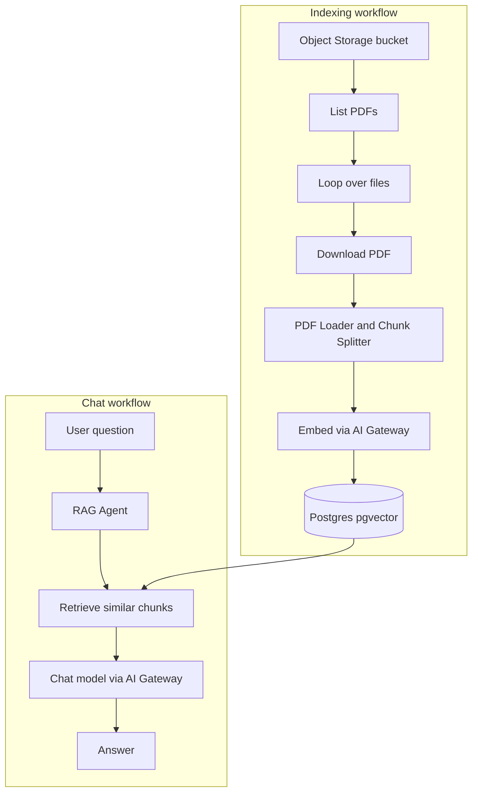

Neon is a complete set of cloud backend primitives built around Lakebase Postgres. [Neon Object Storage](/docs/storage/overview) gives you S3-compatible file storage that branches with your database. The [Neon AI Gateway](/docs/ai-gateway/overview) serves embedding and chat models through one credential and an OpenAI-compatible endpoint, and [Lakebase Postgres](/docs/postgres/overview) with [`pgvector`](/docs/extensions/pgvector) handles vector storage and similarity search. They all run alongside your database in the same project.

In this guide, you'll use those three services with **n8n** to build a RAG chatbot over your PDFs. You'll configure the n8n Assistant to use the models served through the Neon AI Gateway, and let it build the workflows for you.

Here's what you'll do:

- Deploy self-hosted n8n with Docker Compose, including task runners, the code sandbox, and SearXNG
- Create a Neon project with Object Storage and the AI Gateway enabled
- Create a Neon credential scoped for Object Storage and the AI Gateway
- Connect the n8n Assistant to your AI Gateway endpoint
- Describe the workflows you want in a prompt and let the Assistant build them
- Fill in the Neon credentials, index a few PDFs, and chat with them

## Prerequisites

Before starting, make sure you have:

1. **Docker and Docker Compose**: You'll deploy self-hosted n8n with Docker Compose in the next section. Install [Docker Desktop](https://docs.docker.com/get-docker/) (includes Compose) or Docker Engine with the Compose plugin.
2. **Neon account on a paid plan**: The AI Gateway needs a project on the Launch or Scale plan. Sign up at [console.neon.tech](https://console.neon.tech/signup) if you don't have one.
3. **Prepaid AI Gateway credits**: Buy credits from the **Billing** page in the Neon Console. One credit is $1 USD, with a $5 minimum. See [AI Gateway prepaid credits](/docs/ai-gateway/prepaid-credits).
4. **Sample documents**: A few PDFs to chat with. You'll upload these to a Neon Object Storage bucket later in the guide.

<Admonition type="info" title="Region availability">
The AI Gateway and Object Storage are currently available in AWS US East (Ohio) (`aws-us-east-2`), AWS US East (N. Virginia) (`aws-us-east-1`), AWS Europe (Frankfurt) (`aws-eu-central-1`), and AWS Asia Pacific (Singapore) (`aws-ap-southeast-1`). Support is expanding toward [all regions](/docs/introduction/regions). Create your project in one of these regions to follow along.
</Admonition>

<Admonition type="important" title="AI Gateway model access">
The AI Gateway is available on paid plans with prepaid credits, and any paid project with credits can use every model in the catalog. This guide uses `glm-5-3-flash`. See [Model access](/docs/ai-gateway/overview#model-access).
</Admonition>

<Steps>

## Create a Neon project

You'll need a Neon project with Object Storage and the AI Gateway enabled. Create one in the Neon Console:

1. In the [Neon Console](https://console.neon.tech), click **New Project**.
2. Enter a **Project name** and choose a **Region** that supports Object Storage and the AI Gateway, such as AWS US East (Ohio) (`aws-us-east-2`). See the region note in [Prerequisites](#prerequisites).
3. Under **Services**, enable **Object storage** and **AI gateway**. See [Create a project](/docs/manage/projects#create-a-project) for more details.
4. Click **Create project**.

## Deploy n8n with Docker Compose

This guide uses a self-hosted n8n deployment with Docker Compose. You'll set up the n8n editor, code sandbox, task runners, and SearXNG for web search. This is the official [recommended setup](https://docs.n8n.io/deploy/host-n8n/install-options/install-using-docker-compose) for the n8n Assistant.

Alternatively, you can use [n8n Cloud](https://app.n8n.cloud/) if you'd rather not self-host. If you already have n8n running with the Assistant set up, skip to the next section.

1. Create a project folder and move into it:

   ```bash filename="Terminal"
   mkdir n8n && cd n8n
   ```

2. Create a `docker-compose.yml` file in the folder with the following contents:

   ```yaml filename="docker-compose.yml"
   volumes:
     n8n-data:
     sandbox-tls:

   services:
     sandbox-certs:
       image: ghcr.io/n8n-io/n8n-sandbox-service-api:${N8N_SANDBOX_VERSION}
       user: '0:0'
       entrypoint: ['sh', '-c']
       command:
         - >
           bootstrap-mtls.sh --out-dir /tls --api-san sandbox-api
           --control-san-prefix sandbox-runner --world-readable &&
           chown -R sandbox-api:sandbox-api /tls/api && chmod -R a+rX /tls
       environment:
         NUM_RUNNERS: '1'
       volumes:
         - sandbox-tls:/tls

     sandbox-api:
       image: ghcr.io/n8n-io/n8n-sandbox-service-api:${N8N_SANDBOX_VERSION}
       depends_on:
         sandbox-certs:
           condition: service_completed_successfully
       environment:
         SANDBOX_API_KEYS: ${SANDBOX_API_KEYS}
         SANDBOX_API_RUNNER_REGISTRATION_TOKEN: ${SANDBOX_API_RUNNER_REGISTRATION_TOKEN}
         SANDBOX_API_RUNNER_API_KEY: ${SANDBOX_API_RUNNER_API_KEY}
         SANDBOX_API_GRPC_TLS_CERT_FILE: /tls/api/grpc-server.crt
         SANDBOX_API_GRPC_TLS_KEY_FILE: /tls/api/grpc-server.key
         SANDBOX_API_GRPC_TLS_CLIENT_CA_FILE: /tls/api/ca.crt
         SANDBOX_API_RUNNER_CONTROL_GRPC_TLS_CA_FILE: /tls/api/ca.crt
         SANDBOX_API_RUNNER_CONTROL_GRPC_TLS_CERT_FILE: /tls/api/control-grpc-api-client.crt
         SANDBOX_API_RUNNER_CONTROL_GRPC_TLS_KEY_FILE: /tls/api/control-grpc-api-client.key
         SANDBOX_API_RUNNER_CONTROL_GRPC_TLS_SERVER_NAME: sandbox-runner-1
       volumes:
         - sandbox-tls:/tls:ro
       healthcheck:
         test: ['CMD', 'wget', '-qO-', 'http://localhost:8080/healthz']
         interval: 5s
         timeout: 3s
         retries: 5
         start_period: 10s

     sandbox-runner-1:
       image: ghcr.io/n8n-io/n8n-sandbox-service-runner-dind:${N8N_SANDBOX_VERSION}
       privileged: true
       depends_on:
         sandbox-api:
           condition: service_healthy
       environment:
         SANDBOX_RUNNER_API_KEYS: ${SANDBOX_API_RUNNER_API_KEY}
         SANDBOX_RUNNER_REGISTRATION_TOKEN: ${SANDBOX_API_RUNNER_REGISTRATION_TOKEN}
         SANDBOX_RUNNER_API_GRPC_ADDR: sandbox-api:9090
         SANDBOX_RUNNER_HTTP_BASE_URL: https://sandbox-runner-1:8080
         SANDBOX_RUNNER_CONTROL_GRPC_LISTEN_ADDR: ':9091'
         SANDBOX_RUNNER_CONTROL_GRPC_ADVERTISE_ADDR: sandbox-runner-1:9091
         SANDBOX_RUNNER_ID: runner-1
         SANDBOX_RUNNER_DOCKER_SANDBOX_IMAGE: ghcr.io/n8n-io/n8n-sandbox-service-sandbox:${N8N_SANDBOX_VERSION}
         SANDBOX_RUNNER_REGISTRATION_GRPC_CA_FILE: /tls/runner/ca.crt
         SANDBOX_RUNNER_REGISTRATION_GRPC_CERT_FILE: /tls/runner/grpc-client.crt
         SANDBOX_RUNNER_REGISTRATION_GRPC_KEY_FILE: /tls/runner/grpc-client.key
         SANDBOX_RUNNER_REGISTRATION_GRPC_SERVER_NAME: sandbox-api
         SANDBOX_RUNNER_CONTROL_GRPC_TLS_CERT_FILE: /tls/runner/control-grpc-server.crt
         SANDBOX_RUNNER_CONTROL_GRPC_TLS_KEY_FILE: /tls/runner/control-grpc-server.key
         SANDBOX_RUNNER_CONTROL_GRPC_TLS_CLIENT_CA_FILE: /tls/runner/ca.crt
         DOCKER_IGNORE_BR_NETFILTER_ERROR: 1
       volumes:
         - sandbox-tls:/tls:ro

     n8n:
       image: docker.io/n8nio/n8n:${N8N_VERSION}
       depends_on:
         sandbox-api:
           condition: service_healthy
       ports:
         - '5678:5678'
       env_file: .env
       volumes:
         - n8n-data:/home/node/.n8n

     runners:
       image: ghcr.io/n8n-io/runners:${N8N_VERSION}
       depends_on:
         - n8n
       environment:
         N8N_RUNNERS_AUTH_TOKEN: ${N8N_RUNNERS_AUTH_TOKEN}
         N8N_RUNNERS_TASK_BROKER_URI: http://n8n:5679
         N8N_RUNNERS_AUTO_SHUTDOWN_TIMEOUT: '15'

     searxng:
       image: ghcr.io/searxng/searxng:latest
       environment:
         SEARXNG_SECRET: ${SEARXNG_SECRET}
       volumes:
         - ./searxng-settings.yml:/etc/searxng/settings.yml:ro
         - ./limiter.toml:/etc/searxng/limiter.toml:ro
   ```

   The Compose file defines the following services:
   - `n8n`: the workflow editor
   - `sandbox-certs`, `sandbox-api`, `sandbox-runner-1`: generate TLS certs once, then run the code sandbox the Assistant uses
   - `runners`: external task runner for workflow executions
   - `searxng`: local web search backend for the Assistant

3. Create a `.env` file in the same folder with the following contents. Fill in your own values for the tokens and keys:

   ```bash filename=".env"
   # Configure version
   N8N_VERSION=2.41.6
   N8N_SANDBOX_VERSION=1.6.0

   # n8n Runner config
   N8N_RUNNERS_MODE=external
   N8N_RUNNERS_BROKER_LISTEN_ADDRESS=0.0.0.0
   N8N_RUNNERS_AUTH_TOKEN=change-me-runner-auth-token

   # n8n Sandbox config
   SANDBOX_API_KEYS=change-me-api-key
   SANDBOX_API_RUNNER_REGISTRATION_TOKEN=change-me-registration-token
   SANDBOX_RUNNER_API_KEYS=change-me-runner-key
   # Key the sandbox-api sends to the runner - must match SANDBOX_RUNNER_API_KEYS above
   SANDBOX_API_RUNNER_API_KEY=change-me-runner-key
   N8N_INSTANCE_AI_SANDBOX_ENABLED=true
   N8N_INSTANCE_AI_SANDBOX_PROVIDER=n8n-sandbox
   N8N_SANDBOX_SERVICE_URL=http://sandbox-api:8080
   N8N_SANDBOX_SERVICE_API_KEY=change-me-api-key

   # SearXNG Config
   SEARXNG_SECRET=change-me-searxng-secret
   N8N_INSTANCE_AI_SEARXNG_URL=http://searxng:8080
   ```

   Generate a random secret for each placeholder using:

   ```bash filename="Terminal"
   openssl rand -hex 32
   ```

   Run the command once per secret, then paste the value over the matching placeholder (`change-me-...`).

   Make sure these two keys match:
   - `SANDBOX_API_RUNNER_API_KEY` must match `SANDBOX_RUNNER_API_KEYS`
   - `N8N_SANDBOX_SERVICE_API_KEY` must match `SANDBOX_API_KEYS`

4. Create a `searxng-settings.yml` file in the same folder with the following contents. This configures SearXNG to use default settings and return HTML and JSON formats:

   ```yaml filename="searxng-settings.yml"
   use_default_settings: true
   search:
     formats:
       - html
       - json
   ```

   Then create a `limiter.toml` file in the same folder with the following contents. It configures SearXNG's rate limiting and bot detection:

   ```toml filename="limiter.toml"
   [botdetection]

   ipv4_prefix = 32
   ipv6_prefix = 48

   trusted_proxies = [
     '127.0.0.0/8',
     '::1',
   ]

   [botdetection.ip_limit]

   filter_link_local = false
   link_token = false

   [botdetection.ip_lists]

   block_ip = []
   pass_ip = []

   pass_searxng_org = true
   ```

5. Start the containers:

   ```bash filename="Terminal"
   docker compose up -d
   docker compose ps
   ```

   Wait until `sandbox-api` shows `healthy`. `sandbox-runner-1` and `n8n` start after it.

6. After the containers are running, check that the sandbox API and n8n are healthy:

   ```bash filename="Terminal"
   docker compose exec n8n wget -qO- http://sandbox-api:8080/healthz
   curl -sf http://localhost:5678/healthz
   ```

You now have a self-hosted n8n deployment with the Sandbox API configured. Open [http://localhost:5678](http://localhost:5678) in your browser to access the n8n editor.

## Create a Neon credential

You'll need a Neon credential with **Storage** and **AI Gateway** scopes so the n8n workflows can access your branch's buckets and call models through the gateway. Create one in the project you just created:

1. On your Neon project settings page, select the **Credentials** tab.
2. Click **Create credential** and give it a name, such as `n8n`.
3. Under **Storage**, check `storage:read` and `storage:write` so n8n can read from and write to your buckets.
4. Under **AI Gateway**, check `ai_gateway:invoke` so the AI nodes can call models through the gateway.
5. Click **Create credential**.
   
6. Download or copy the credentials. Save the S3 values (`AWS_ACCESS_KEY_ID`, `AWS_SECRET_ACCESS_KEY`, `AWS_ENDPOINT_URL_S3`, `AWS_REGION`) and the AI Gateway token. You'll need them later when configuring the n8n nodes.

## Get your AI Gateway base URL

You'll also need your branch's AI Gateway base URL to connect the n8n Assistant and the AI nodes.

1. In the Neon Console sidebar, select your project and branch, then click **Connect** at the top of the sidebar.
2. In the **Connect to your branch** dialog, open the **AI Gateway** tab.
3. Copy the value of `NEON_AI_GATEWAY_BASE_URL` shown there. For example, it looks like `https://br-example-branch-123456-api.ai.c-6.us-east-2.aws.neon.tech`.

## Create a bucket for your PDFs

You'll need a bucket to hold the PDFs you want to chat with. Create one in the Neon Console:

1. In the Neon Console sidebar, select your project and branch, then open the **Object storage** tab.
2. Click **Create bucket**. Name it `n8n` and keep the visibility set to **Private**. Click **Create bucket**.

## Connect the n8n Assistant

The Assistant is the part of n8n that builds and edits workflows through conversation. It runs on a model you connect yourself, and the AI Gateway is what serves that model.

### Open the Assistant

In the n8n sidebar, open **n8n Assistant** and click **Get started**.


### Point it at the AI Gateway

The setup dialog asks for a model provider. Choose the OpenAI-compatible option and fill in your gateway values:

- **Provider**: `Self-hosted or OpenAI-compatible endpoint`
- **Base URL**: Your AI Gateway base URL with `/v1` appended, for example `https://br-example-branch-123456-api.ai.c-6.us-east-2.aws.neon.tech/v1`
- **API key**: The token from the credential you created in [Create a Neon credential](#create-a-neon-credential)
- **Model**: Choose any model available for your project. For example, `glm-5-3-flash`. See the [AI Gateway models](/docs/ai-gateway/models) page for a list of available models and their capabilities.


### Finish setup

After you click **Continue**, the Assistant displays a summary of the model it will use, along with the code sandbox (`n8n-sandbox` via `sandbox-api`) and web search (SearXNG) configuration from your Compose `.env` file. Click **Finish setup**.


The Assistant is now ready, with its model served through the Neon AI Gateway. You can reuse the same credential on the AI nodes in the workflows it creates.

## Build the workflows

You can now ask the Assistant to build an AI workflow. In this guide, you'll build a RAG system that lets you chat with PDF documents stored in a Neon Object Storage bucket. Describe what you want in a prompt, and the Assistant builds it.

A working result typically has two parts. An indexing workflow lists PDFs in your bucket, splits them into chunks, embeds them through the AI Gateway, and stores them in Lakebase Postgres with `pgvector`. A chat workflow retrieves the closest chunks and passes them to a chat model as context. Your exact nodes may differ, but the flow looks like this:



For example, copy and paste the following prompt into the Assistant:

```text
Build a RAG system in n8n that allows me to chat with PDF documents stored in my S3 bucket.

Use Postgres with pgvector as the vector database. Use Neon services such as Object Storage and AI Gateway wherever applicable.

Refer to the following documentation:
- https://neon.com/docs/extensions/pgvector
- https://neon.com/docs/ai/ai-concepts
- https://neon.com/docs/storage/overview
```


The Assistant reads the prompt, plans the build, and asks for permission to access the Neon documentation. Click **Approve** to let it build the workflows.


<Admonition type="note" title="Your workflows may differ">
The Assistant builds the workflow from your prompt, so the output varies with the model you choose and how it interprets your requirements. What you get may look different from the examples here while still meeting the same functional requirements.
</Admonition>


When it finishes, you'll have the workflow or workflows your request needs. In this example, it built two separate workflows for indexing PDFs and chatting with them. It also opens a guided setup panel where you enter your Neon credentials and the other required values.

The generated workflows use the Neon services you configured earlier:

- **S3 nodes** (`List PDFs` and `Download PDF`) read PDF files from Neon Object Storage using the Neon S3 credential.
- **AI nodes** (`Neon AI Gateway Chat Model` and `Neon AI Gateway Embeddings`) use the AI Gateway credential to access the configured models.
- **Postgres nodes** (`Store in pgvector` and the `PDF Knowledge Base` retrieval tool) use the Postgres credential to store and retrieve vector embeddings.

### Import the example workflows

If you'd rather start from the exact workflows used in this guide instead of building your own with the Assistant, download the JSON exports:

- [Index PDFs from Neon Object Storage (pgvector)](/docs/guides/n8n-ai-gateway/index-pdfs-from-neon-storage.json)
- [Chat with PDFs (Neon pgvector RAG)](/docs/guides/n8n-ai-gateway/chat-with-pdfs.json)

To import either file, create a new workflow in n8n, open the three-dot menu at the top left, and select **Import from File**. You can also copy a file's contents and paste them directly onto an empty canvas. Imported workflows carry no credentials, so nodes show a warning until you fill them in. The example chat workflow uses `gpt-5-mini` for its chat model; you can switch it to `glm-5-3-flash` or any other catalog model. Continue with [Fill in the Neon credentials](#fill-in-the-neon-credentials).

## Fill in the Neon credentials

The guided setup walks through one card per node that still needs a value. You'll create three credentials: S3, Postgres, and OpenAI (pointed at the AI Gateway).

### S3 nodes

The first two cards configure `List PDFs` and `Download PDF`. Pick your S3 credential and enter the bucket name (`n8n` here).


Fill in the following fields with your S3 credentials:

- **S3 Endpoint**: Your branch's Object Storage endpoint. This is the value of `AWS_ENDPOINT_URL_S3` from the credential you saved in [Create a Neon credential](#create-a-neon-credential). For example: `https://br-example-branch-123456.storage.c-6.us-east-2.aws.neon.tech`
- **Region**: Your Object Storage region. This is the value of `AWS_REGION` from the same credential. For example: `us-east-2`
- **Access Key ID**: Enter your `AWS_ACCESS_KEY_ID`.
- **Secret Access Key**: Enter your `AWS_SECRET_ACCESS_KEY`.
- **Force Path Style**: Turn this **on**. Neon Object Storage requires path-style addressing.


### Postgres credential

The next card configures the `Store in pgvector` node.

Fill in the following fields with your Lakebase Postgres credentials. To find them, navigate to your Neon project in the Neon Console, select your branch, and click **Connect**. The Postgres tab shows the connection details.


- **Host**: Your Neon host (`PGHOST` in the Neon Console).
- **Database**: Your database name, such as `neondb` (`PGDATABASE` in the Neon Console).
- **User**: Your database user, such as `neondb_owner` (`PGUSER` in the Neon Console).
- **Password**: Your database password (`PGPASSWORD` in the Neon Console).
- **SSL**: Set this to **Require**.


### AI Gateway credential

The AI nodes use a standard **OpenAI** credential with the base URL overridden to point at the Neon AI Gateway. Fill in the following fields:

- **API Key**: The token from the credential you created in [Create a Neon credential](#create-a-neon-credential)
- **Organization ID**: Leave blank
- **Base URL**: `NEON_AI_GATEWAY_BASE_URL` with `/v1` appended, for example `https://br-example-branch-123456-api.ai.c-6.us-east-2.aws.neon.tech/v1`


### Embeddings node

The embeddings node uses the same OpenAI credential as the chat model:


<Admonition type="important" title="Keep the embedding model consistent">
The model on the embeddings node must match the model used for retrieval in the chat workflow, because each model has its own dimensionality and vector space. Mixing two models produces vectors that can't be compared.
</Admonition>

## Enable pgvector and upload your PDFs

Before the workflows can run, enable `pgvector` and upload a few PDFs. The Assistant reminds you of both:

1. In your [Neon Console](https://console.neon.tech/), open the [**SQL Editor**](/docs/get-started/query-with-neon-sql-editor) for your project and run the following command to enable the `pgvector` extension:

   ```sql
   CREATE EXTENSION IF NOT EXISTS vector;
   ```

2. Open the **Object storage** tab in the Neon Console and upload a few PDFs to the bucket you created earlier (`n8n` in this example).


## Run a live test

With the workflows built and the credentials filled in, you can ask your Assistant to run a live test. It will index the PDFs you uploaded and then ask the chat workflow a question over that data.


In the run below, the indexing workflow turned 3 PDFs into **174 chunks** in the `pdf_chunks` table, each row tagged with `source_file` metadata so answers can cite their source. The Assistant then asked the chat workflow a question over that same data. It retrieved the matching chunks and answered with specific numbers from the papers, citing the source PDF for each claim.


Open the chat workflow in the editor and click **Open chat** to try it yourself. You can also continue asking the Assistant to modify the workflows to fit your needs.

You now have a RAG system that lets you chat with your PDFs, powered by the n8n Assistant and Neon services. You built it without writing workflow code or wiring nodes by hand. The Assistant handled the setup for you, and you can keep refining the workflows by describing what you want to change.

</Steps>

## Next steps

This RAG setup is only one example. You can build any other workflow the same way: describe what you want in the Assistant, approve the plan, and fill in the same Neon credentials when it asks. The Assistant picks the nodes and wires them together, then walks you through setup. Here's where to go from here:

- **Use a frontier model:** This guide uses `glm-5-3-flash`. For more accurate workflows and better answers, swap it for a frontier model such as `gpt-6-astra` or `claude-fable-5` in the Assistant setup and in your AI nodes. See [AI Gateway models](/docs/ai-gateway/models).
- **Keep building with the Assistant:** Ask it to schedule the indexing workflow on a cron trigger, add Slack or email output to the chat workflow, or start something new entirely.
- **Prefer to wire nodes yourself?** Read [Build an AI-powered knowledge base chatbot using n8n and Lakebase Postgres](/guides/n8n-neon) for the manual version of this same RAG setup.

## Use Lakebase Postgres as the n8n database

The Compose file above uses n8n's built-in SQLite database, which is fine for testing. For production, point n8n at Lakebase Postgres instead. Add these lines to your `.env` and fill in your own values from the Neon Console:

```bash filename=".env"
# Database Config
DB_TYPE=postgresdb
DB_POSTGRESDB_HOST="<your-neon-host>"
DB_POSTGRESDB_PORT=5432
DB_POSTGRESDB_DATABASE="<your-database-name>"
DB_POSTGRESDB_USER="<your-database-user>"
DB_POSTGRESDB_PASSWORD="<your-database-password>"
DB_POSTGRESDB_SSL_ENABLED=true
DB_POSTGRESDB_SSL_REJECT_UNAUTHORIZED=true
```

Then restart the stack with `docker compose up -d`. On startup, n8n creates its tables in Lakebase Postgres. It doesn't copy existing data from SQLite. For details, see [Use PostgreSQL instead of SQLite](https://docs.n8n.io/deploy/host-n8n/install-options/install-using-docker-compose#optional-use-postgresql-instead-of-sqlite) in the n8n docs.

## Resources

- [Neon AI Gateway](/docs/ai-gateway/overview)
- [AI Gateway models](/docs/ai-gateway/models)
- [Neon Object Storage](/docs/storage/overview)
- [n8n documentation](https://docs.n8n.io/)
- [n8n Assistant documentation](https://docs.n8n.io/build/ways-of-building-workflows/n8n-assistant)

<NeedHelp/>
