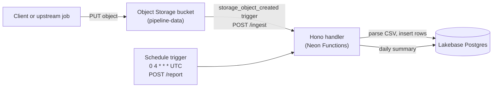

If you're building a backend, you eventually need work that runs outside the request-response cycle. Some of it runs on the clock: nightly reports, cleanup jobs, periodic syncs. Some of it runs on events: a file lands in storage, and something needs to process it before anyone notices it's there.

In a typical microservices setup, you'd deploy a scheduler, a queue, and a worker to handle these jobs. The scheduler fires on the clock, the queue receives events, and the worker does the work. Each of those is a separate deployment to run and monitor.

A common example of this pattern is a data pipeline that ingests CSV files into a database. You want to:

- Ingest files as soon as they arrive in object storage
- Generate a daily report of how many files were processed, how many failed, and how many rows were imported

The two jobs are asynchronous, but they start differently: the ingest is set off by an event, the report by the clock. Either way, something has to watch for the moment and invoke your code when it happens.

With [Neon Function Triggers](/docs/compute/functions/triggers/overview), you attach your function to a schedule or an event, and Neon invokes it when the moment arrives. This guide shows how to build a CSV ingestion pipeline with two triggers. One fires when an object is created in storage, and one fires on a nightly schedule. The function parses the CSV, inserts the rows into a Postgres table, and generates a daily report.

<CopyPrompt
  src="/prompts/neon-function-triggers-cron-and-object-storage-prompt.md"
  description="Use this prompt to customize the guide and build it with your AI agent."
  buttonText="Copy prompt"
/>

## Architecture overview

Here is how an upload, the two triggers, and the function fit together:



1. **Upload**: A client or an upstream job puts a CSV file into the `pipeline-data` bucket under the `uploads/` prefix.
2. **Object trigger**: Neon sees the new object and sends a `POST /ingest` to your function with the bucket name and object key in the body.
3. **Ingestion**: The handler downloads the object, parses the CSV, inserts the rows into an `events` table, and marks the upload as `processed` or `failed` in an `uploads` table.
4. **Nightly report**: At 04:00 UTC every day, the schedule trigger sends a `POST /report`. The handler summarizes the previous day's uploads into a `daily_reports` table.

## Prerequisites

Before starting, you'll need:

1. **Node.js**: Version 22 or later (v24 recommended). Download from [nodejs.org](https://nodejs.org/).
2. **Neon account**: Sign up for an account at [console.neon.tech](https://console.neon.tech/signup).
3. **Neon CLI**: Installed globally (`npm i -g neon@latest`) and authenticated (`neon login`). See the [Neon CLI quickstart](/docs/cli/quickstart) for details.

<Steps>

## Set up the project

Create a directory for the project and initialize a workspace:

```bash
mkdir csv-pipeline && cd csv-pipeline
npm init -y
```

Install the Neon agent skills so AI agents like Claude Code and Cursor have the context to help you build and deploy. Your project will use the **Neon**, **Neon Functions**, and **Neon Object Storage** skills:

```bash
neon skills -s neon -s neon-functions -s neon-object-storage
```

Link your local workspace to a Neon project:

```bash
neon link
```

You'll be prompted to select your organization, then a project. **Create a new project** named `csv-pipeline` (or pick an existing one). Next, select a region. Choose **AWS US East (Ohio)** (`aws-us-east-2`), **AWS US East (N. Virginia)** (`aws-us-east-1`), **AWS Europe (Frankfurt)** (`aws-eu-central-1`), or **AWS Asia Pacific (Singapore)** (`aws-ap-southeast-1`). This guide uses US East (Ohio). Neon Functions are currently available in these regions. Support is expanding toward [all regions](/docs/introduction/regions).

Confirm that you want to manage your setup as code, which generates a `neon.ts` file in your project root. Then, when asked which Neon services you require, select **Functions** and **Object Storage**:

```text
$ neon link
✔ Which organization would you like to link? › MyOrg (org-example-12345678)
✔ Which project would you like to link? › ＋ Create new project…
✔ Name for the new project: … csv-pipeline
✔ Which region should the new project run in? › AWS US East 2 (Ohio) (aws-us-east-2)
Created project quiet-fog-09491284 ("csv-pipeline") in aws-us-east-2.
Linked ~/csv-pipeline/.neon:
  orgId:     org-example-12345678
  projectId: quiet-fog-09491284
  branch:    main

✔ Manage this project's Neon setup as code? Adds a neon.ts you can edit and apply with `neon config apply`. … yes
✔ Which Neon services should neon.ts declare? (space to toggle, enter to confirm) › Functions, Object Storage

INFO: Pulled 5 Neon variables into ~/csv-pipeline/.env.local: NEON_BRANCH, DATABASE_URL, DATABASE_URL_UNPOOLED
INFO: Created neon.ts declaring functions, buckets.
INFO: Created hello.ts - the source of the hello function.
```

The `neon link` command also creates a placeholder function, `hello.ts`, at your project root. You'll build the pipeline in your own `index.ts` file, so delete the placeholder:

```bash
rm hello.ts
```

It also creates a `.env.local` file with your Neon project's credentials. The function will use these to connect to the database and the bucket.

Next, install the dependencies you'll need for the function:

```bash
npm install hono @neon/functions pg drizzle-orm @aws-sdk/client-s3 csv-parse
npm install --save-dev @types/node @types/pg drizzle-kit dotenv typescript esbuild
```

Here's what each package does:

- `hono`: A lightweight web framework and the recommended framework for Neon Functions. You'll use its routing and middleware to organize your function.
- `@neon/functions`: Neon's package for Postgres pool management in functions.
- `pg`: The Node.js Postgres client Drizzle uses to connect to the database.
- `drizzle-orm`: Drizzle's type-safe ORM for defining the schema and running queries.
- `drizzle-kit`: Drizzle's CLI for generating and running migrations.
- `dotenv`: Loads `.env.local` into the environment when running migrations.
- `@aws-sdk/client-s3`: The AWS SDK client for reading objects from the bucket.
- `csv-parse`: Parses the CSV files into records.

You'll also need a `tsconfig.json` file to tell TypeScript how to compile the function. Create it in the project root:

```json filename="tsconfig.json"
{
  "compilerOptions": {
    "target": "ES2022",
    "module": "NodeNext",
    "moduleResolution": "NodeNext",
    "types": ["node"],
    "strict": true,
    "esModuleInterop": true,
    "skipLibCheck": true,
    "forceConsistentCasingInFileNames": true
  }
}
```

## Define the schema

To manage your database schema and migrations, you'll use [Drizzle ORM](https://orm.drizzle.team). You define the schema in TypeScript, Drizzle generates the SQL migrations, and its type-safe query builder runs the queries.

You'll need three tables:

- `uploads`: one row per uploaded file, with a status that moves from `processing` to `processed` or `failed`
- `events`: the data rows parsed out of each CSV file
- `daily_reports`: one row per day, written by the nightly cron trigger

1.  **Define the schema:**

    Create `db/schema.ts` in the project root:

    ```ts filename="db/schema.ts"
    import { pgTable, uuid, text, integer, timestamp, date, unique } from 'drizzle-orm/pg-core';

    export const uploads = pgTable(
      'uploads',
      {
        id: uuid('id').primaryKey().defaultRandom(),
        bucket: text('bucket').notNull(),
        objectKey: text('object_key').notNull(),
        status: text('status').notNull().default('received'),
        rowsImported: integer('rows_imported'),
        error: text('error'),
        createdAt: timestamp('created_at', { withTimezone: true })
          .notNull()
          .defaultNow(),
      },
      (t) => [unique('uploads_bucket_object_key_unique').on(t.bucket, t.objectKey)],
    );

    export const events = pgTable(
      'events',
      {
        id: uuid('id').primaryKey().defaultRandom(),
        uploadId: uuid('upload_id')
          .notNull()
          .references(() => uploads.id),
        occurredAt: timestamp('occurred_at', { withTimezone: true }).notNull(),
        userEmail: text('user_email').notNull(),
        eventName: text('event_name').notNull(),
      },
      (t) => [
        unique('events_upload_row_unique').on(
          t.uploadId,
          t.occurredAt,
          t.userEmail,
          t.eventName,
        ),
      ],
    );

    export const dailyReports = pgTable('daily_reports', {
      reportDate: date('report_date').primaryKey(),
      uploadsProcessed: integer('uploads_processed').notNull(),
      uploadsFailed: integer('uploads_failed').notNull(),
      rowsImported: integer('rows_imported').notNull(),
      generatedAt: timestamp('generated_at', { withTimezone: true })
        .notNull()
        .defaultNow(),
    });
    ```

2.  **Configure Drizzle Kit:**

    Create `drizzle.config.ts` in your project root. Drizzle Kit uses this to generate and run migrations against your database:

    ```ts filename="drizzle.config.ts"
    import { defineConfig } from 'drizzle-kit';
    import { config } from 'dotenv';

    config({ path: '.env.local' });

    export default defineConfig({
        schema: './db/schema.ts',
        out: './db/migrations',
        dialect: 'postgresql',
        dbCredentials: {
            url: process.env.DATABASE_URL!,
        },
    });
    ```

    The `dotenv/config` import loads your `.env.local` file, which `neon link` created with your project's `DATABASE_URL`.

3.  **Generate and run the migration:**

    ```bash
    npx drizzle-kit generate
    npx drizzle-kit migrate
    ```

    You now have the three tables in your database, ready for the function to use.

## Build the function

Create an `index.ts` file in the root of your project. It defines two routes: `/ingest` for the object trigger and `/report` for the schedule trigger:

```ts filename="index.ts"
import { Hono, type MiddlewareHandler } from 'hono';
import { attachDatabasePool } from '@neon/functions';
import { Pool } from 'pg';
import { drizzle } from 'drizzle-orm/node-postgres';
import { and, eq, gte, lt, sql } from 'drizzle-orm';
import * as schema from './db/schema';
import { GetObjectCommand, S3Client } from '@aws-sdk/client-s3';
import { parse } from 'csv-parse/sync';

const app = new Hono();

const pool = new Pool({ connectionString: process.env.DATABASE_URL, max: 5 });
attachDatabasePool(pool);

const db = drizzle(pool, { schema });

const s3 = new S3Client({ forcePathStyle: true });

type TriggerBody = {
    version: number;
    invocation_id: string;
    trigger: { type: string; id: string; name: string };
    data: Record<string, string>;
};

const requireTriggerCall: MiddlewareHandler = async (c, next) => {
    if (!c.req.header('x-neon-trigger-invocation-id')) {
        return c.json({ error: 'not a trigger call' }, 403);
    }
    await next();
};

app.use('/ingest', requireTriggerCall);
app.use('/report', requireTriggerCall);

app.get('/', (c) => c.json({ endpoints: ['POST /ingest', 'POST /report'] }));

app.post('/ingest', async (c) => {
    const { data } = await c.req.json<TriggerBody>();
    const bucket = data.bucket_name;
    const key = data.object_key;

    const [upload] = await db
        .insert(schema.uploads)
        .values({ bucket, objectKey: key, status: 'processing' })
        .onConflictDoUpdate({
            target: [schema.uploads.bucket, schema.uploads.objectKey],
            set: { status: 'processing', error: null, rowsImported: null },
        })
        .returning({ id: schema.uploads.id });
    const uploadId = upload.id;

    try {
        const obj = await s3.send(new GetObjectCommand({ Bucket: bucket, Key: key }));
        const csv = await obj.Body!.transformToString('utf-8');

        const records: { occurred_at: string; user_email: string; event_name: string }[] =
            parse(csv, { columns: true, skipEmptyLines: true });

        if (records.length === 0) throw new Error('CSV has no data rows');

        await db
            .insert(schema.events)
            .values(
                records.map((r) => ({
                    uploadId,
                    occurredAt: new Date(r.occurred_at),
                    userEmail: r.user_email,
                    eventName: r.event_name,
                })),
            )
            .onConflictDoNothing();

        await db
            .update(schema.uploads)
            .set({ status: 'processed', rowsImported: records.length })
            .where(eq(schema.uploads.id, uploadId));

        console.log(`ingested ${key}: ${records.length} rows`);
        return c.json({ ok: true, upload_id: uploadId, rows: records.length });
    } catch (err) {
        const message = err instanceof Error ? err.message : String(err);
        await db
            .update(schema.uploads)
            .set({ status: 'failed', error: message })
            .where(eq(schema.uploads.id, uploadId));
        console.error(`ingest failed for ${key}: ${message}`);
        return c.json({ ok: false, error: message }, 500);
    }
});

app.post('/report', async (c) => {
    const { data } = await c.req.json<TriggerBody>();
    const scheduledAt = data.scheduled_at;

    const dayStart = sql`date_trunc('day', now() - interval '1 day')`;
    const dayEnd = sql`date_trunc('day', now())`;
    const [summary] = await db
        .select({
            uploadsProcessed: sql<number>`count(*) filter (where ${schema.uploads.status} = 'processed')`,
            uploadsFailed: sql<number>`count(*) filter (where ${schema.uploads.status} = 'failed')`,
            rowsImported: sql<number>`coalesce(sum(${schema.uploads.rowsImported}) filter (where ${schema.uploads.status} = 'processed'), 0)`,
        })
        .from(schema.uploads)
        .where(and(gte(schema.uploads.createdAt, dayStart), lt(schema.uploads.createdAt, dayEnd)));

    await db
        .insert(schema.dailyReports)
        .values({
            reportDate: sql`(now() - interval '1 day')::date`,
            uploadsProcessed: Number(summary.uploadsProcessed),
            uploadsFailed: Number(summary.uploadsFailed),
            rowsImported: Number(summary.rowsImported),
        })
        .onConflictDoUpdate({
            target: schema.dailyReports.reportDate,
            set: {
                uploadsProcessed: Number(summary.uploadsProcessed),
                uploadsFailed: Number(summary.uploadsFailed),
                rowsImported: Number(summary.rowsImported),
                generatedAt: sql`now()`,
            },
        });

    console.log(
        `daily report for ${scheduledAt}: ${summary.uploadsProcessed} processed, ` +
        `${summary.uploadsFailed} failed, ${summary.rowsImported} rows`,
    );
    return c.json({ ok: true, ...summary });
});

export default app;
```

The code does the following:

- **Sets up the app and clients**: Creates a Hono app, attaches a Postgres pool with Drizzle for type-safe queries, and creates an S3 client for downloading objects from the bucket.
- **Guards the trigger routes**: The `requireTriggerCall` middleware rejects any request without an `X-Neon-Trigger-Invocation-Id` header, so only Neon's trigger system can call `/ingest` and `/report`.
- **Handles uploads in `/ingest`**: Reads the bucket name and object key from the trigger body, upserts an `uploads` row, downloads and parses the CSV, and bulk-inserts the rows into `events`. Then it marks the upload as `processed` or `failed`. On failure, it records the error message on the upload row and returns a `500`, which is what the nightly report counts later. On success, it returns a `200` with the number of rows imported.
- **Builds the nightly report in `/report`**: Aggregates the previous day's uploads by status and upserts the counts into `daily_reports`. Reading `data.scheduled_at` from the body ties the log line to the run that produced it, so you can trace scheduled invocations in the logs.

### The trigger payload

Both trigger types deliver the same envelope: a `trigger` object saying which trigger fired, a `data` object with the event details, and an `invocation_id`. A schedule invocation carries `data.scheduled_at`; an object-created invocation carries `data.bucket_name` and `data.object_key`. For example:

```json
{
  "version": 1,
  "invocation_id": "abc123FUPHOw0Pl1ZooidgpJhvHaShi1aX40cQ0b321",
  "trigger": { "type": "storage_object_created", "id": "trigger-1a2b3c4d-5e6f-7890-abcd-ef1234567890", "name": "ingest-uploads" },
  "data": { "bucket_name": "pipeline-data", "object_key": "uploads/sample.csv" }
}
```

Because Neon delivers trigger calls to the function's public URL, any client could try to call it. The `requireTriggerCall` middleware rejects requests without the `X-Neon-Trigger-Invocation-Id` header. See [Confirming a request came from Neon](/docs/compute/functions/triggers/overview#confirming-a-request-came-from-neon) for why that header is trustworthy.

## Configure neon.ts

The `neon link` command created a `neon.ts` file in your project root. Replace its contents with the following:

```ts filename="neon.ts" {4-27}
import { defineConfig } from "@neon/config/v1";

export default defineConfig({
  functions: {
    pipeline: {
      name: 'CSV Pipeline',
      source: './index.ts',
    },
  },
  triggers: {
    'nightly-report': {
      type: 'schedule',
      function: 'pipeline',
      cron: '0 4 * * *',
      functionPath: '/report',
    },
    'ingest-uploads': {
      type: 'storage_object_created',
      function: 'pipeline',
      bucket: 'pipeline-data',
      prefix: 'uploads/',
      functionPath: '/ingest',
    },
  },
  buckets: {
    'pipeline-data': {}
  },
  branch: (branch) => {
    if (branch.isDefault) { return {}; }
    if (!branch.exists) { return { ttl: "7d" }; }
    return {};
  },
});

```

Here's what each property does:

- **`functions.pipeline`**: Registers `index.ts` as a deployable function. The key (`pipeline`) is the function's slug, which becomes part of its invocation URL.
- **`triggers.nightly-report`**: Declares the schedule trigger as code. `cron` is a five-field expression, always evaluated in UTC, and `functionPath: '/report'` sends the invocation to the report route. `function: 'pipeline'` attaches it to the `pipeline` function.
- **`triggers.ingest-uploads`**: Declares the object-storage trigger as code. `bucket: 'pipeline-data'` selects the bucket, `prefix: 'uploads/'` scopes it to uploads under that path, and `functionPath: '/ingest'` sends the invocation to the ingest route.
- **`buckets`**: Declares the `pipeline-data` bucket on the branch. Deploying provisions it and injects the `AWS_*` credentials into your function.

Schedules on Neon run in UTC. You can test your expressions with [crontab.guru](https://crontab.guru/), and the [cron reference](/docs/compute/functions/triggers/schedule#cron-reference) covers the five fields and the special characters you can use.

## Deploy

Now that the function, schema, and triggers are in place, deploy it to Neon by running:

```bash
neon deploy
```

You'll see output like this:

```bash
$ neon deploy
INFO: → Applying to branch main (br-delicate-surf-b4o4haqi)
Applied changes
  + bucket pipeline-data
  + function pipeline
  + trigger:pipeline:ingest-uploads
  + trigger:pipeline:nightly-report

Function URLs
  • pipeline: https://br-xxx.compute.c-6.us-east-2.aws.neon.tech

Utilized services: Postgres, Object Storage, Functions
INFO: Pulled 8 Neon variables into /home/ubuntu/codes/guides/csv-pipeline/.env.local: DATABASE_URL, DATABASE_URL_UNPOOLED, NEON_BRANCH, AWS_ACCESS_KEY_ID, AWS_SECRET_ACCESS_KEY, AWS_ENDPOINT_URL_S3, AWS_REGION, NEON_FUNCTION_PIPELINE_BASE_URL
INFO: Wrote credential secrets, these now hold fresh values: AWS_ACCESS_KEY_ID, AWS_SECRET_ACCESS_KEY
```

List the triggers to confirm both are in place:

```bash
neon triggers list
```

```text filename="Output"
Trigger Id                                    Name            Type                    Function Slug  Function Path  Schedule   Storage                 Enabled  Inherited  Next Run At
trigger-1a2b3c4d-5e6f-7890-abcd-ef1234567890  ingest-uploads  storage_object_created  pipeline       /ingest                   pipeline-data uploads/  true     false
trigger-8f7e6d5c-4b3a-2190-fedc-ba9876543210  nightly-report  schedule                pipeline       /report        0 4 * * *                          true     false      2026-09-22T04:00:00.000000Z
```

<Admonition type="note">
A newly created trigger takes a few seconds to become active. If your first test upload doesn't fire the function, wait a moment and upload again.
</Admonition>

<Admonition type="tip" title="Want to test locally?">
To iterate without redeploying, run `neon dev` and replay the trigger payloads with `curl`. See [Test triggers locally](/docs/compute/functions/triggers/overview#test-triggers-locally). [Verify the nightly report](#verify-the-nightly-report) shows a replay for this pipeline.
</Admonition>

## Test the pipeline

Create a sample CSV with a few event rows:

```bash filename="Terminal"
cat > sample.csv <<'EOF'
occurred_at,user_email,event_name
2026-09-18T08:01:00Z,ada@example.com,signup
2026-09-18T09:24:00Z,grace@example.com,signup
2026-09-18T10:03:00Z,alan@example.com,login
2026-09-18T11:47:00Z,linus@example.com,signup
2026-09-18T15:30:00Z,barbara@example.com,login
EOF
```

Upload it into the bucket under the prefix the trigger watches:

```bash
neon buckets object put pipeline-data/uploads/sample.csv --file ./sample.csv
```

The upload should fire the trigger within a few seconds. Check the function's logs:

```bash
neon logs query --since 5m --source function
```

You should see a line like this in the logs, confirming the ingest worked:

```text
Timestamp             Source    Service Name            Severity Text  Message
2026-09-21T06:35:38Z  function  neon-function/pipeline  INFO           ingested uploads/sample.csv: 5 rows
```

Then verify the database state with `neon psql`:

```bash shouldWrap
neon psql main -- -c "SELECT object_key, status, rows_imported FROM uploads;"
```

```text
      object_key       |  status   | rows_imported
-----------------------+-----------+---------------
 uploads/sample.csv    | processed |             5
```

```bash shouldWrap
neon psql main -- -c "SELECT count(*) FROM events;"
```

Now test the failure path. Upload a file with a malformed timestamp:

```bash filename="Terminal"
cat > broken.csv <<'EOF'
occurred_at,user_email,event_name
not-a-date,dana@example.com,signup
EOF
neon buckets object put pipeline-data/uploads/broken.csv --file ./broken.csv
```

The ingest fails, the handler records the error, and the upload row shows it:

```bash shouldWrap
neon psql main -- -c "SELECT object_key, status, error FROM uploads WHERE status = 'failed';"
```

```text
     object_key     | status |       error
--------------------+--------+--------------------
 uploads/broken.csv | failed | Invalid time value
```

The nightly report counts this failed row.

## Verify the nightly report

The report runs at 04:00 UTC, which is a long wait for a test. Test the handler locally first with `neon dev`, which serves the function on `http://localhost:8787` and injects the database and bucket credentials from the linked branch.

```bash
neon dev
```

Triggers only fire from Neon's side against the deployed function, so locally you replay the schedule payload yourself with `curl`. Send the replay to `/report` with an `X-Neon-Trigger-Invocation-Id` header so the request passes the `requireTriggerCall` guard.

<Admonition type="note" title="The report counts yesterday, not today">
The `/report` handler aggregates `uploads` by `created_at` for the previous UTC day (`date_trunc('day', now() - interval '1 day')` to `date_trunc('day', now())`). It doesn't look at `occurred_at` inside the CSV. So if you uploaded `sample.csv` and `broken.csv` today and replay `/report` right away, you'll correctly get `0 processed, 0 failed, 0 rows` because your test files are outside the window.
</Admonition>

For a meaningful local test, move your test uploads into yesterday's window first:

```bash shouldWrap
neon psql main -- -c "UPDATE uploads SET created_at = now() - interval '1 day';"
```

Then send the replay:

```bash shouldWrap
curl -X POST http://localhost:8787/report \
  -H "Content-Type: application/json" \
  -H "X-Neon-Trigger-Invocation-Id: local-test" \
  -d '{"version":1,"invocation_id":"local-2","trigger":{"type":"schedule","id":"trigger-local","name":"nightly-report"},"data":{"scheduled_at":"2026-09-21T04:00:00Z"}}'
```

Watch the `neon dev` terminal for the `daily report for ...` log line, then check the table:

```bash shouldWrap
neon psql main -- -c "SELECT report_date, uploads_processed, uploads_failed, rows_imported FROM daily_reports;"
```

With the two test uploads backdated, you should see one row for yesterday with `1 processed, 1 failed, 5 rows`. Without the backdate step you'll see `0, 0, 0`, which means the query worked but found nothing in range.

You can replay the object trigger the same way against `/ingest` while iterating, and leaving off the `X-Neon-Trigger-Invocation-Id` header should return `403` from the guard.

Optionally, you can temporarily change the cron expression to `* * * * *` to run the report every minute on Neon. This is useful for testing the deployed function without waiting until 04:00 UTC. Change the `cron` in `neon.ts`:

```ts filename="neon.ts"
triggers: {
  'nightly-report': {
    type: 'schedule',
    function: 'pipeline',
    cron: '* * * * *', // [!code ++]
    functionPath: '/report',
  },
  // ...keep 'ingest-uploads' unchanged...
},
```

Redeploy and wait about a minute:

```bash
neon deploy
```

The logs show the report run, and the table gets its row:

```bash
neon logs query --since 5m --source function
```

```text
daily report for 2026-09-19T12:00:00Z: 1 processed, 1 failed, 5 rows
```

```bash shouldWrap
neon psql main -- -c "SELECT * FROM daily_reports;"
```

Once you've confirmed it works, set the cron back to `0 4 * * *` and redeploy.

<Admonition type="warning">
Leaving it at `* * * * *` keeps invoking the function every minute.
</Admonition>

</Steps>

## Triggers and branches

If you branch `main` for testing, both triggers arrive disabled so you don't double-send the report or re-fire ingest. See [Triggers and branching](/docs/compute/functions/triggers/overview#triggers-and-branching) for how to enable or edit them per branch.

## Extending the pipeline

This guide keeps the pipeline narrow so you can see how the two triggers work. A few ways to extend it:

- **Multiple schedules on one function**: a function can have several triggers, each evaluated independently. Add a weekly deep-clean trigger with its own `functionPath`, and use `trigger.name` from the request body to tell them apart in the handler.
- **Larger files**: the handler loads the whole CSV into memory. For files that don't fit, stream the object body and insert in batches inside a transaction.
- **Notifications**: on the failure path, call a webhook or enqueue an alert instead of only recording the error. The function can reach any external HTTP API. See [Monitor Neon Functions with Sentry](/guides/sentry-neon-functions) for error tracking and alerts.

## Resources

- [Function Triggers overview](/docs/compute/functions/triggers/overview)
- [Neon Functions overview](/docs/compute/functions/overview)
- [Neon Object Storage overview](/docs/storage/overview)
- [`neon triggers` CLI reference](/docs/cli/triggers)
- [`neon.ts` reference](/docs/reference/neon-ts)

<NeedHelp/>
