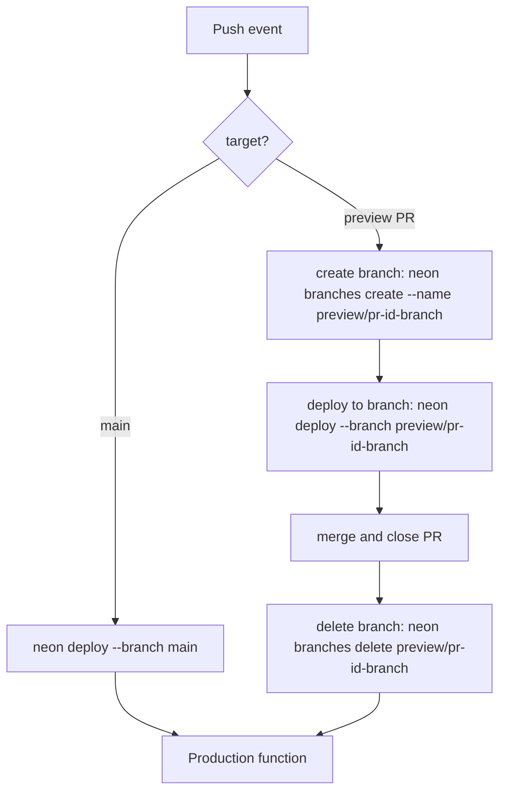

[Neon Functions](/docs/compute/functions/overview) are long-running serverless functions you deploy onto a Neon branch, so your backend runs right next to your Postgres database. Each branch runs its own function at its own URL against its own database state, with `DATABASE_URL` injected automatically. That makes them a natural fit for a workflow where every environment gets its own isolated function.

The Neon CLI (`neon deploy`) lets you deploy a function to any branch with a single command. It works well for testing locally, but as a best practice you should never deploy to the production branch by hand or push changes to it directly. Instead, every change should go through a pull request that gets exercised in isolation first. Because a PR's preview branch runs the exact same code, config, and deploy command as production, merging it becomes a simple step: if it worked in preview, it works in production.

Automating your deployments keeps things consistent and reproducible. No one has to remember the right command or wonder what state production is in, and there's less risk that an unreviewed change reaches production.

You'll set up that automation with GitHub Actions and build a small API on Neon Functions with a pipeline that:

- Deploys your function to the production branch whenever code is merged into `main`
- Creates an isolated Neon branch for every pull request and deploys a preview function to it, running against that branch's own database
- Comments the preview function's URL directly on the pull request so reviewers can try the change live
- Cleans up the preview branch (and its function) when the pull request is closed

Because the pipeline is just the [Neon CLI](/docs/cli) running in a CI job, the same recipe works in GitLab CI, CircleCI, Azure DevOps, or any other CI/CD system. The last section shows how to adapt it.

<Admonition type="note" title="Neon Functions are in beta">
Functions are currently available only in the **AWS US East (Ohio)** (`aws-us-east-2`) region, so create your Neon project there to follow along. Functions run JavaScript or TypeScript on the Node.js 24 runtime.
</Admonition>

## Prerequisites

1. **Node.js**: Version 20 or later (v24 recommended). Download from [nodejs.org](https://nodejs.org/).
2. **Neon Account**: Sign up for a free account at [console.neon.tech](https://console.neon.tech/signup).
3. **GitHub Account**: Sign up for a free account at [github.com](https://github.com/).
4. **The Neon CLI**: Installed and authenticated:
   ```bash
   npm install -g neon@latest
   neon auth
   ```

## Set up the project

Create a directory for the project and initialize a workspace:

```bash
mkdir neon-functions-api && cd neon-functions-api
npm init -y
```

Install the Neon agent skills so AI agents such as Claude Code and Cursor have the context to help you build and work with Neon. This function uses the **Neon** and **Neon Functions** skills:

```bash
neon skills -s neon -s neon-functions
```

Link your local workspace to a Neon project:

```bash
neon link
```

You'll be prompted to select your organization, then a project. **Create a new project** named `neon-functions-api` (or pick an existing one). Next, select a region. Choose **AWS US East 2 (Ohio)** (`aws-us-east-2`), because Neon Functions are currently available only in this region during beta. When asked which Neon services you require, select **Functions**. Finally, confirm that you want to manage your setup as code, which generates a `neon.ts` file in your project root:

```text
$ neon link
✔ Which organization would you like to link? › MyOrg (org-example-12345678)
✔ Which project would you like to link? › ＋ Create new project…
✔ Name for the new project: … neon-functions-api
✔ Which region should the new project run in? › AWS US East 2 (Ohio) (aws-us-east-2)
Created project quiet-mist-12345678 ("neon-functions-api") in aws-us-east-2.
Linked ~/neon-functions-api/.neon:
  orgId:     org-example-12345678
  projectId: quiet-mist-12345678
  branch:    main

INFO: Pulled 3 Neon variables into ~/neon-functions-api/.env.local: NEON_BRANCH, DATABASE_URL, DATABASE_URL_UNPOOLED
✔ Manage this project's Neon setup as code? Adds a neon.ts you can edit and apply with `neon config apply`. … yes
✔ Which Neon services should neon.ts declare? (space to toggle, enter to confirm) › Functions
INFO: Created neon.ts declaring functions.
INFO: Created hello.ts — the source of the hello function.
INFO: Installing @neon/config, @neon/env with npm…
```

The `neon link` command also creates a placeholder function, `hello.ts`, at your project root and a `.env.local` file with your project's variables, including `DATABASE_URL`.

```ts filename="hello.ts"
export default async function hello(): Promise<Response> {
  return new Response("Hello from Neon Functions");
}
```

The `hello.ts` file defines a default exported function that returns a plain text response. You will replace this with a Hono app, allowing you to handle multiple routes within the same function.

Install the dependencies for your function:

```bash
npm install hono pg
npm install --save-dev @types/pg typescript
```

You now have a project linked to Neon and the necessary dependencies to build a Hono-based API that interacts with your Postgres database.

## Write the function

Replace the contents of `hello.ts` with the following code, which creates a Hono app that responds to `GET` requests at the root path (`/`) with a JSON object containing a greeting and the Postgres version:

```ts filename="hello.ts"
import { Hono } from 'hono';
import { Pool } from 'pg';
import { parseEnv } from '@neon/env';
import config from './neon';

const env = parseEnv(config, 'hello');

const pool = new Pool({ connectionString: env.postgres.databaseUrl, max: 5 });
const app = new Hono();

app.get('/', async (c) => {
  const { rows } = await pool.query('SELECT version()');
  return c.json({
    greeting: env.function.GREETING,
    database: rows[0].version,
  });
});

export default app;
```

[`parseEnv`](https://www.npmjs.com/package/@neon/env) reads your `neon.ts` config, validates the injected variables, and returns a typed `env` object. Passing the function's slug (`hello`) adds a typed `env.function` namespace for the variables you declare. So `env.postgres.databaseUrl` is the branch's `DATABASE_URL` injected at runtime, and `env.function.GREETING` is the `GREETING` you declare below, catching typos or missing variables at build time. See the [Neon environment variables docs](/docs/compute/functions/environment-variables) for full detail.

> `GREETING` is a placeholder for the secret you'll set in GitHub. The workflow injects it at deploy time, and `parseEnv` reads it from there, so the secret never appears in your source code.

## Declare the function in neon.ts

Replace the contents of the generated `neon.ts` with the following:

```ts filename="neon.ts"
import { defineConfig } from '@neon/config/v1';

export default defineConfig({
  preview: {
    functions: {
      hello: {
        name: 'Hello API',
        source: './hello.ts',
        env: {
          GREETING: process.env.GREETING ?? 'Hello World',
        },
      },
    },
  },
});
```

The key (`hello`) is the function's slug. It becomes part of the invocation URL and can't be changed after the first deploy.

The important line for CI/CD is the `env` block. Values here are resolved **at deploy time**: when `neon deploy` runs, `process.env.GREETING` captures whatever `GREETING` is set to in that environment. Locally that's your shell; in CI it's the job's environment, which is where GitHub secrets come in. Neon injects `DATABASE_URL` and other branch-specific variables at runtime, so you only declare your own variables here.

## Test a manual deploy

Before automating anything, verify the function deploys cleanly from your machine.

1. Set `GREETING` in the `.env.local` file that `neon link` created:

   ```bash
   echo 'GREETING="Hello from Neon Functions"' >> .env.local
   ```

2. Deploy:

   ```bash
   neon deploy --env .env.local
   ```

3. Get the function's public URL and call it:

   ```bash
   neon functions get hello
   ```

   ```bash shouldWrap
   curl https://<branch_id>-hello.compute.<cell>.us-east-2.aws.neon.tech/
   ```

   The response shows your secret and the Postgres version of the branch's database:

   ```json
   { "greeting": "Hello from Neon Functions", "database": "PostgreSQL 18.4 on ..." }
   ```

4. Update `.gitignore` to exclude `node_modules`. The `.env.local` and `.neon` files are already ignored by default, so you don't accidentally commit secrets or project IDs.

   ```text filename=".gitignore" {3}
   .neon
   .env.local
   node_modules/
   ```

5. Initialize a Git repository and commit your code:

   ```bash
   git init
   git add .
   git commit -m "feat: initial function"
   git branch -M main
   ```

6. Create a new repository on GitHub by following the instructions at [Creating a new repository](https://docs.github.com/en/repositories/creating-and-managing-repositories/quickstart-for-repositories#create-a-repository). Then push your local repository to GitHub:

   ```bash
   git remote add origin <your-github-repo-url>
   git push -u origin main
   ```

Now you have a working Neon Functions project with an API, ready to deploy automatically through GitHub Actions for both preview and production environments.

## Set up the Neon GitHub Integration

The [Neon GitHub Integration](/docs/guides/neon-github-integration) connects your Neon project to your repository and automatically creates a `NEON_API_KEY` secret and a `NEON_PROJECT_ID` variable, which are exactly what the workflow needs.

1. In the [Neon Console](https://console.neon.tech), navigate to the **Integrations** page in your Neon project.
2. Locate the **GitHub** card and click **Add**.
   
3. On the **GitHub** drawer, click **Install GitHub App**.
4. If you have more than one GitHub account, select the account where you want to install the GitHub app.
5. Select the GitHub repository to connect to your Neon project, and click **Connect**.

Your Neon project is now connected to your GitHub repository, and the integration has created the `NEON_API_KEY` secret and `NEON_PROJECT_ID` variable in your repository's settings. But your application also needs its own set of secrets and variables (in this case, the `GREETING` variable) to be available at deploy time. You will create that next.

1. Navigate to your GitHub repository's **Settings** > **Secrets and variables** > **Actions**.
2. Create a new repository secret called `GREETING` with the value `Hello from Neon Functions deployed via GitHub Actions`. In a real application, this is where API keys and other sensitive configuration would go.

## Create the GitHub Actions workflow

Create `.github/workflows/deploy-functions.yaml` with the following content:

```yaml filename=".github/workflows/deploy-functions.yaml"
name: Deploy Neon Functions

on:
  push:
    branches: [main]
  pull_request:
    branches: [main]
    types:
      - opened
      - reopened
      - synchronize
      - closed

# Ensure only one workflow runs at a time for a given branch or PR, and cancel any in-progress runs if a new one is triggered.
concurrency:
  group: ${{ github.workflow }}-${{ github.event.pull_request.number || github.ref }}
  cancel-in-progress: true

jobs:
  setup:
    name: Setup
    runs-on: ubuntu-latest
    outputs:
      branch: ${{ steps.branch_name.outputs.current_branch }}
    steps:
      - name: Get branch name
        id: branch_name
        uses: tj-actions/branch-names@5250492686b253f06fa55861556d1027b067aeb5

  deploy_preview:
    name: Deploy preview function
    needs: setup
    if: |
      github.event_name == 'pull_request' && (
      github.event.action == 'opened' || github.event.action == 'reopened' || github.event.action == 'synchronize')
    runs-on: ubuntu-latest
    permissions:
      contents: read
      pull-requests: write
    env:
      NEON_API_KEY: ${{ secrets.NEON_API_KEY }}
    steps:
      - name: Create Neon branch
        uses: neondatabase/create-branch-action@v6
        with:
          project_id: ${{ vars.NEON_PROJECT_ID }}
          branch_name: preview/pr-${{ github.event.number }}-${{ needs.setup.outputs.branch }}
          api_key: ${{ secrets.NEON_API_KEY }}

      - uses: actions/checkout@v7

      - uses: actions/setup-node@v7
        with:
          node-version: 24

      - name: Install dependencies
        run: npm ci

      - name: Install Neon CLI
        run: npm install -g neon@latest

      - name: Deploy function to preview branch
        run: neon deploy --project-id ${{ vars.NEON_PROJECT_ID }} --branch preview/pr-${{ github.event.number }}-${{ needs.setup.outputs.branch }} --update-existing --no-env-pull
        env:
          GREETING: ${{ secrets.GREETING }}

      - name: Get preview function URLs
        id: function_urls
        run: |
          urls=$(neon functions list --project-id ${{ vars.NEON_PROJECT_ID }} --branch preview/pr-${{ github.event.number }}-${{ needs.setup.outputs.branch }} -o json \
            | jq -r '.[] | "- " + .slug + ": " + .invocation_url')
          echo "urls<<EOF" >> "$GITHUB_OUTPUT"
          echo "$urls" >> "$GITHUB_OUTPUT"
          echo "EOF" >> "$GITHUB_OUTPUT"

      - name: Comment preview URLs on the pull request
        uses: actions/github-script@v7
        with:
          script: |
            const urls = `${{ steps.function_urls.outputs.urls }}`;
            const body = `**Preview functions deployed:**\n${urls}\n\nThese functions run on an isolated Neon branch for this PR, against the branch's own database. Both are deleted when the PR is closed.`;
            await github.rest.issues.createComment({
              owner: context.repo.owner,
              repo: context.repo.repo,
              issue_number: context.issue.number,
              body,
            });

  deploy_production:
    name: Deploy production function
    if: github.event_name == 'push' && github.ref == 'refs/heads/main'
    runs-on: ubuntu-latest
    env:
      NEON_API_KEY: ${{ secrets.NEON_API_KEY }}
    steps:
      - uses: actions/checkout@v7

      - uses: actions/setup-node@v7
        with:
          node-version: 24

      - name: Install dependencies
        run: npm ci

      - name: Install Neon CLI
        run: npm install -g neon@latest

      - name: Deploy function to production branch
        run: neon deploy --project-id ${{ vars.NEON_PROJECT_ID }} --branch main --update-existing --allow-protected --no-env-pull
        env:
          GREETING: ${{ secrets.GREETING }}

      - name: Print production function URLs
        run: |
          echo "**Production functions deployed:**" >> "$GITHUB_STEP_SUMMARY"
          neon functions list --project-id ${{ vars.NEON_PROJECT_ID }} --branch main -o json \
            | jq -r '.[] | "- " + .slug + ": " + .invocation_url' \
            >> "$GITHUB_STEP_SUMMARY"

  cleanup:
    name: Delete preview branch and function
    needs: setup
    if: github.event_name == 'pull_request' && github.event.action == 'closed'
    runs-on: ubuntu-latest
    steps:
      - name: Delete Neon branch
        uses: neondatabase/delete-branch-action@v3
        with:
          project_id: ${{ vars.NEON_PROJECT_ID }}
          branch: preview/pr-${{ github.event.number }}-${{ needs.setup.outputs.branch }}
          api_key: ${{ secrets.NEON_API_KEY }}
```

## Understanding the workflow

The workflow (excluding the setup) has three main jobs: **deploy preview**, **deploy production**, and **cleanup**, and each one runs the same idea: deploy function to a branch. Because functions are branch-scoped, every environment ends up with its own function at its own URL, running against its own database state. Thinking of it as "deploy to a branch" makes the whole workflow easy to follow.

- **Deploy preview**: Runs when a PR is opened, reopened, or updated. It creates an isolated branch, deploys to it, comments the preview URL on the PR for review.
- **Deploy production**: Runs on any push to `main` (which includes merged PRs). It applies the same code to the production branch.
- **Cleanup**: Runs when a PR is closed. It deletes the preview branch, which removes the preview function too, so you don't have to worry about orphaned branches or functions.

The command that does the deploying is always the same. Only the `--branch` flag changes which environment it targets:

```bash shouldWrap
neon deploy \
  --project-id ${{ vars.NEON_PROJECT_ID }} \
  --branch main \
  --update-existing \
  --allow-protected \
  --no-env-pull
```

A few flags make the command safe to run unattended on a CI runner:

- **`--update-existing`**: Answers "yes" when the deploy would override something already on the branch, so the CLI doesn't stop and ask for confirmation.
- **`--allow-protected`**: Does the same for a production branch marked as [protected](/docs/guides/protected-branches). It's a no-op if the branch isn't protected.
- **`--no-env-pull`**: Skips writing the branch's variables to a local `.env` file, which there's no use for on a throwaway runner.

Because every job installs the CLI and runs this same deploy logic, the workflow scales to any number of functions. `neon deploy` applies whatever's in your `neon.ts`, and the steps that list URLs pick up every function on the branch, so you never need to touch the YAML when you add a function.

### Reusable actions

The workflow uses a few GitHub Actions to handle the branch lifecycle and other tasks:

- **[`neondatabase/create-branch-action`](https://github.com/marketplace/actions/neon-create-branch-github-action)** (Neon): Creates a Neon branch from your primary branch. The preview job calls it to create a branch for the PR, so the function runs against that branch's database state.
- **[`neondatabase/delete-branch-action`](https://github.com/marketplace/actions/neon-database-delete-branch)** (Neon): Removes a Neon branch when you no longer need it. The cleanup job calls it to tear down the preview branch (and its function) once its PR closes, so branches don't accumulate.
- **`actions/checkout`**, **`actions/setup-node`**, and **`actions/github-script`**: Standard GitHub Actions for checking out the repo, installing Node, and running JavaScript against the GitHub API.
- **`tj-actions/branch-names`**: Outputs the name of the branch that triggered the run. The preview branch is named after it (for example `preview/pr-12-fix-auth`) so you can tell which PR and code it came from.

The two Neon actions handle the branch lifecycle, and plain `neon deploy` invocations handle the function lifecycle. So this exact workflow boils down to: create a branch with Neon's action, deploy the function with the CLI, and clean up the branch.

<Admonition type="note" title="Secrets are shared across branches">
GitHub doesn't support branch-specific secrets. Any secret you define (like `GREETING`) is shared across all environments, so both preview and production get the same value.

If you need different secrets per branch or environment, use a secrets manager such as [AWS Secrets Manager](https://aws.amazon.com/secrets-manager/), [Google Cloud Secret Manager](https://cloud.google.com/secret-manager), or [HashiCorp Vault](https://www.vaultproject.io/). These tools let you store separate values and have your pipeline fetch the correct one depending on the branch being deployed.

For many projects, a single set of secrets is sufficient. But if environments require different credentials, you can define separate secret names in GitHub (e.g., `PREVIEW_GREETING` and `PROD_GREETING`) and reference the appropriate one during deployment:

```yaml
# Preview deployment
env:
  GREETING: ${{ secrets.PREVIEW_GREETING }}

# Production deployment
env:
  GREETING: ${{ secrets.PROD_GREETING }}
```

Even when you update a secret in GitHub, the new value only applies to future deployments. Existing deployments continue using the previous value until they are redeployed. In production, this means the old secret remains active until the related PR is merged and the production deployment job runs again.
</Admonition>

## Commit and push the workflow

With the workflow in place, commit and push it to GitHub:

```bash
git add .github/workflows/deploy-functions.yaml
git commit -m "ci: add GitHub Actions workflow for Neon Functions"
git push origin main
```

## Test the workflow

To see the full cycle, make a change on a feature branch:

1. Create a branch and add a new route to the Hono app:

   ```bash
   git checkout -b feature/add-health-route
   ```

   ```ts filename="hello.ts"
   // ... old code ...
   app.get('/health', (c) => c.json({ status: 'ok' })); // [!code ++]

   export default app;
   ```

2. Commit and push:

   ```bash
   git add .
   git commit -m "feat: add health check route"
   git push origin feature/add-health-route
   ```

3. Open a [pull request](https://docs.github.com/en/pull-requests/how-tos/create-pull-requests/creating-a-pull-request#creating-the-pull-request) on GitHub.

The workflow creates the preview branch, deploys the function to it, and comments on the PR with the preview URL.


Call the new route on the preview function:

```bash shouldWrap
curl https://<preview-branch-id>-hello.compute.<cell>.us-east-2.aws.neon.tech/health
```

Merge the PR, and the production deploy job runs. Check the workflow run's summary in the **Actions** tab for the production URL, then call it to confirm the route is live. With the PR closed, the cleanup job runs and deletes the preview branch and function.

The same workflow extends to any number of functions. Add a new function to `neon.ts`, deploy it, and the workflow automatically picks it up and comments all the preview URLs on the PR:


## Adapting to other CI/CD platforms

The workflow is just a branch lifecycle: create a Neon branch, deploy the function to it, and delete the branch when it's done. GitHub Actions bundles that into jobs with the `neondatabase/create-branch-action` and `neondatabase/delete-branch-action`, but those actions are the Neon CLI (and its REST API) under the hood. On any other CI/CD platform you run the same commands in your pipelines:



The logic is the same everywhere:

- **Merge to `main`**: Run `neon deploy --branch main`. The branch already exists, so there's nothing to create.
- **Preview merge request**: Create a branch with `neon branches create`, deploy to it with `neon deploy --branch preview/<id>`, and on close remove it with `neon branches delete`. Every command targets a branch with a `--branch` flag.

Add `NEON_API_KEY` and `NEON_PROJECT_ID` to your CI/CD environment, and the workflow works the same way on any platform.

## Conclusion

You now have a CI/CD pipeline that treats every Neon Functions deployment like a branch: merge to `main` ships to production, and each pull request gets its own isolated preview function running against its own database. Because the deploy command is the same every time, review happens where it should, in a production-like preview, before a change ever reaches production.

The same recipe adapts to any CI/CD platform and scales to any number of functions. Add a function to `neon.ts` and the pipeline picks it up automatically, so the setup you have today keeps working as your API grows.

Use `neon deploy` on your local machine for your own dev branches while you iterate. But for branches the whole team shares, like QA, staging, or production, deploy through the pipeline instead. That way every change is reviewed, runs the same command, and reaches the branch with a commit trail you can trace, rather than depending on whoever happened to run the deploy by hand.

## Resources

- [Neon Functions overview](/docs/compute/functions/overview)
- [neon.ts configuration reference](/docs/reference/neon-ts)
- [Neon CLI installation](/docs/cli/install)
- [Neon GitHub integration](/docs/guides/neon-github-integration)
- [GitHub Actions documentation](https://docs.github.com/en/actions)
- [Automated Database Branching with GitHub Actions](/guides/neon-github-actions-authomated-branching)

<NeedHelp/>
