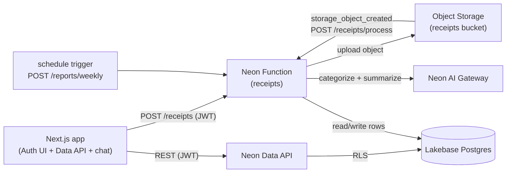

[`neon.ts`](/docs/reference/neon-ts) is Neon's native **Infrastructure-as-Code (IaC)** file for full-stack TypeScript projects. Traditional IaC tools such as [Terraform](/docs/reference/terraform), [Pulumi](/guides/neon-pulumi), or [OpenTofu](/guides/opentofu-neon), require learning a new DSL, managing state files, and wiring outputs into your application by hand. `neon.ts` is part of your local development loop instead. It provisions infrastructure through the [Neon CLI (`neon`)](/docs/cli), syncs connection strings directly into `.env.local`, and validates those variables in your application code with TypeScript types.

With `neon.ts`, you can:

- **Provision every Neon backend service** in one file: [Postgres](/docs/postgres/overview), [Managed Better Auth](/docs/auth/overview), the [Data API](/docs/data-api/overview), [Functions](/docs/compute/functions/overview), [Object Storage](/docs/storage/overview), and the [AI Gateway](/docs/ai-gateway/overview).
- **Declare event-driven work** with [Function Triggers](/docs/compute/functions/triggers/overview), so a function runs on a cron schedule or when a file lands in a bucket.
- **Configure branch policies** in code, for example, capping compute on preview branches or setting TTLs so they're deleted automatically.
- **Generate type-safe environment variables** so your application knows which services are available, with IDE autocomplete.
- **Skip state files entirely**, since `neon` reads live state directly from your Neon project.

Every service you declare in `neon.ts` is provisioned on every branch. So a preview or feature branch gets its own database, buckets, functions, auth environment, and AI Gateway endpoint. See [the Neon backend is generally available](/docs/changelog/2026-09-18) and [How a Neon backend fits together](/docs/get-started/backend-overview).

<Admonition type="note" title="Backend services are GA in neon.ts">
The GA release moved `aiGateway`, `functions`, and `buckets` to top-level keys in `defineConfig`, alongside `auth` and `dataApi`. Declaring them under a `preview` block still works but logs a deprecation warning. This guide uses the top-level form. If you're on `@neon/config` earlier than 1.6.0, upgrade with `npm install @neon/config@latest`. See the [`neon.ts` reference](/docs/reference/neon-ts#services).
</Admonition>

This guide walks through a full-stack example app called Receipts, that uses every Neon service, so you can see how `neon.ts` provisions them and how your code consumes the injected credentials. The workflow is simple:

- **Declare** every service you use, plus per-branch policy, in one `neon.ts`.
- **Preview** a change with `neon config plan`, then **apply** it with `neon deploy`.
- **Read** the injected credentials with type-safe `parseEnv` instead of hand-copying them.
- **Inspect** the branch's live state with `neon config status`.
- **Fork** the whole backend from your policy with `neon checkout`.
- **Compare** branches with `neon diff` before you merge.
- **Extend** the config with triggers and a custom domain.

## The example app

The Receipts app has a simple workflow for uploading receipts, categorizing them with the AI Gateway, and rolling up weekly totals. It uses every Neon service:



1. **Upload**: A signed-in user submits a receipt. The browser sends it to the `receipts` function with the user's JWT.
2. **Store**: The function verifies the JWT, writes a row to Postgres, and uploads the file to the `receipts` bucket.
3. **Categorize**: The new object fires a `storage_object_created` trigger, which calls `/receipts/process`. The handler uses the AI Gateway to categorize the receipt and updates the row.
4. **Read**: The dashboard queries the Data API from the browser. RLS ensures a user sees only their own receipts.
5. **Summarize**: A `schedule` trigger calls `/reports/weekly` every Monday to roll up the previous week.
6. **Chat**: The assistant endpoint streams answers from the AI Gateway.

## Prerequisites

Before you begin, make sure you have:

1. **Node.js**: Version 22 or later (v24 recommended). Download from [nodejs.org](https://nodejs.org/).
2. **Neon account**: Sign up for a free Neon account at [console.neon.tech](https://console.neon.tech/signup).
3. **Neon CLI**: Installed globally (`npm i -g neon@latest`) and authenticated (`neon login`). See the [Neon CLI quickstart](/docs/cli/quickstart) for details.

<Admonition type="note" title="Plan and feature limits">
Object Storage and Functions are available on any plan, subject to usage limits. The AI Gateway requires a paid plan. The Data API and Managed Better Auth don't support projects with [IP Allow](/docs/manage/projects#configure-ip-allow) or [Private Networking](/docs/guides/neon-private-networking) enabled.
</Admonition>

<Steps>

## Set up the project

Create a new Next.js project with TypeScript, Tailwind CSS, and the App Router:

```bash
npx create-next-app@latest receipts --yes
cd receipts
```

Link the directory to a Neon project:

```bash
neon link
```

You'll be prompted to select your organization, then a project. **Create a new project** (or pick an existing one). Next, select a region. Choose **AWS US East (Ohio)** (`aws-us-east-2`), **AWS US East (N. Virginia)** (`aws-us-east-1`), **AWS Europe (Frankfurt)** (`aws-eu-central-1`), or **AWS Asia Pacific (Singapore)** (`aws-ap-southeast-1`). Functions, Object Storage, and the AI Gateway are currently available in these regions. Support is expanding toward [all regions](/docs/introduction/regions). Confirm that you want to manage your setup as code, which generates a `neon.ts` file in your project root. Then, when asked which Neon services you require, select **Managed Better Auth**, **Data API**, **Functions**, **Object Storage** and **AI Gateway**.

The CLI creates a `neon.ts` file which declares the services you selected. It also creates a `.env.local` file with the connection strings and credentials for those services.

`neon link` also creates a placeholder function, `hello.ts`, at your project root. This guide builds its own `functions/receipts.ts` function instead, so delete the placeholder:

```bash
rm hello.ts
```

Install the dependencies for the Receipts app:

```bash
npm install @neondatabase/neon-js@latest @neondatabase/auth @neondatabase/auth-ui
npm install @neon/ai-sdk-provider @neon/functions hono pg drizzle-orm jose ai @ai-sdk/react
npm install files-sdk @aws-sdk/client-s3 @aws-sdk/s3-request-presigner @aws-sdk/s3-presigned-post
npm install --save-dev drizzle-kit @types/pg dotenv
```

Here's what each package does:

- `@neondatabase/neon-js`, `@neondatabase/auth`, and `@neondatabase/auth-ui`: the combined Auth and Data API client, the server SDK, and prebuilt auth UI components.
- `@neon/ai-sdk-provider`, `ai`, and `@ai-sdk/react`: the AI Gateway provider, the Vercel AI SDK, and its React hooks.
- `@neon/functions`, `hono`, `pg`, `drizzle-orm`, and `jose`: the function runtime helpers, the Hono web framework, the Postgres driver, the Drizzle ORM, and JWT verification for the function.
- `files-sdk` and the `@aws-sdk/*` packages: S3-compatible Object Storage access through Neon's `files-sdk/neon` adapter.
- `drizzle-kit` and `dotenv`: schema generation and migration for Postgres, and loading `.env.local` in the Drizzle config.

## Define your backend in `neon.ts`

Open `neon.ts` and replace its contents with the following. It declares every service, plus triggers and per-branch policy:

```typescript filename="neon.ts"
import { defineConfig } from "@neon/config/v1";

export default defineConfig({
  auth: true,
  dataApi: true,
  aiGateway: true,
  buckets: {
    receipts: {},
  },
  functions: {
    receipts: {
      name: "Receipts API",
      source: "./functions/receipts.ts",
      // Optional: serve the function from a domain you own (default branch only).
      // customDomains: ["api.example.com"],
    },
  },
  triggers: {
    "process-receipt": {
      type: "storage_object_created",
      function: "receipts",
      bucket: "receipts",
      prefix: "receipts/",
      functionPath: "/receipts/process",
    },
    "weekly-summary": {
      type: "schedule",
      function: "receipts",
      cron: "0 6 * * 1", // 06:00 UTC every Monday
      functionPath: "/reports/weekly",
    },
  },
  branch: (branch) => {
    if (branch.isDefault) {
      return {
        // protected: true, // requires a paid plan
        postgres: {
          computeSettings: {
            autoscalingLimitMinCu: 0.5,
            autoscalingLimitMaxCu: 2,
          },
        },
      };
    }

    if (!branch.exists) {
      if (branch.name.startsWith("dev")) {
        return {
          ttl: "7d",
          postgres: {
            computeSettings: {
              autoscalingLimitMinCu: 0.25,
              autoscalingLimitMaxCu: 1,
            },
          },
        };
      }

      return {
        ttl: "2d",
        postgres: {
          computeSettings: {
            autoscalingLimitMinCu: 0.25,
            autoscalingLimitMaxCu: 0.25,
          },
        },
      };
    }

    return {};
  },
});
```

### What this config does

The `neon.ts` above declares the services, triggers, and branch policies for the Receipts app:

- **Services**: `auth`, `dataApi`, `aiGateway`, a `receipts` bucket, and a `receipts` function are declared once and exist on every branch. Every branch also has Postgres with the default compute profile.
- **Triggers**: `process-receipt` fires when an object is created under the `receipts/` prefix, and `weekly-summary` fires every Monday at 06:00 UTC. Both invoke the `receipts` function at a specific path.
- **Production**: Allows scaling up to 2 Compute Units (CU). You can also mark the main branch as `protected` to prevent accidental deletion by uncommenting the `protected: true` line. Protected branches require a paid plan. Learn more about [protected branches](/docs/guides/protected-branches).
- **Development branches** (`dev*`): New branches whose name starts with `dev` are capped at 1 CU and scheduled for deletion after 7 days.
- **Other new branches**: Get an even more minimal profile with a 2-day TTL and a fixed 0.25 CU ceiling.
- **Existing branches**: Left untouched. Returning `{}` for branches that already exist avoids overwriting settings on branches already in use. `neon checkout` only applies policy when _creating_ a new branch, never when checking out an existing one.

The above config is a simple example. You can customize compute limits, idle suspend behavior (`suspendTimeout`), branch lifetime (`ttl`), protected status, `parent`, and per-function options such as `env` and `customDomains`. See the [`neon.ts` reference](/docs/reference/neon-ts) for the complete list of available options.

The config declares a function whose `source` points at `./functions/receipts.ts`, so that file must exist before you deploy. Create a minimal placeholder now; you'll replace it with the full implementation later in the guide:

```typescript filename="functions/receipts.ts"
import { Hono } from "hono";

const app = new Hono();

app.get("/", (c) => c.json({ ok: true }));

export default app;
```

<Admonition type="tip" title="Type-safe infrastructure validation">
If you remove `auth: true` while keeping `dataApi: true`, your IDE shows a TypeScript error on the `dataApi` field:

```text
Type 'true' is not assignable to type '`dataApi` with Managed Better Auth (the default
`authProvider: 'neon'`) requires Managed Better Auth, so add `auth: true`. To enable the
Data API WITHOUT Managed Better Auth, verify a third-party IdP instead: `dataApi: {
authProvider: 'external', jwksUrl: 'https://your-idp/.well-known/jwks.json' }`'
```

Instead of the usual unhelpful `Type 'true' is not assignable to type 'never'`, `neon.ts` encodes the dependency rule and its fixes into the expected type. Your IDE tells you that the Data API requires Managed Better Auth unless you specify a [different](/docs/reference/neon-ts#dataapi) `authProvider`, and how to fix it either way.
</Admonition>

## Deploy and pull credentials

Preview what would change before applying it with `neon config plan`. This is a safe way to see what will be provisioned without actually creating any resources:

```bash
neon config plan
```

You should see output like this, showing the services that will be created:

```bash
$ neon config plan
INFO: → Planning against branch main (br-cool-forest-a1b2c3d4)
Planned changes
  + Neon Auth
  + bucket receipts
  + Data API
  + function receipts
  + trigger:receipts:process-receipt
  + trigger:receipts:weekly-summary
  ~ main
      computeSettings.autoscalingLimitMaxCu  → 2
      computeSettings.autoscalingLimitMinCu  → 0.5

Utilized services: Postgres, Neon Auth, Data API, Object Storage, Functions, AI Gateway
```

When you are ready, apply the changes:

```bash
neon deploy
```

<Admonition type="tip">
`neon deploy` is an alias for `neon config apply`. Use `neon config plan` first if you want to preview changes before applying.
</Admonition>

<Admonition type="note" title="Conflicting remote state">
If your Neon project has different compute settings on the main branch (for example, set from the Neon Console), `neon deploy` may fail with:

```text
ERROR: pushConfig refused to apply: local config conflicts with remote state.
```

The CLI won't silently overwrite existing remote settings. To override and apply your `neon.ts` configuration, pass the `--update-existing` flag:

```bash
neon deploy --update-existing
```

For a full list of available flags, see the [neon config reference](/docs/cli/config).
</Admonition>

The output shows the services being provisioned:

```bash
$ INFO: → Applying to branch main (br-cool-forest-a1b2c3d4)
Applied changes
  + function receipts
  + trigger:receipts:process-receipt
  + trigger:receipts:weekly-summary

Function URLs
  • receipts: https://br-cool-forest-a1b2c3d4-receipts.compute.c-13.us-east-1.aws.neon.tech/

Utilized services: Postgres, Neon Auth, Data API, Object Storage, Functions, AI Gateway
INFO: Pulled 13 Neon variables into /home/dhanush/codes/neon/functions/receipts/.env.local: DATABASE_URL, DATABASE_URL_UNPOOLED, NEON_BRANCH, NEON_AUTH_BASE_URL, NEON_AUTH_JWKS_URL, NEON_DATA_API_URL, AWS_ACCESS_KEY_ID, AWS_SECRET_ACCESS_KEY, AWS_ENDPOINT_URL_S3, AWS_REGION, NEON_AI_GATEWAY_TOKEN, NEON_AI_GATEWAY_BASE_URL, NEON_FUNCTION_RECEIPTS_BASE_URL
INFO: Wrote credential secrets — these now hold fresh values: AWS_ACCESS_KEY_ID, AWS_SECRET_ACCESS_KEY, NEON_AI_GATEWAY_TOKEN
```

After the deploy completes, `neon` updates `.env.local` with the connection strings and credentials for the services you provisioned, so you don't have to copy them by hand.

You'll also need to generate a secret for the Managed Better Auth cookie. Run the following command to generate a random 32-character string, then paste it into `.env.local` as `NEON_AUTH_COOKIE_SECRET`:

```bash
openssl rand -base64 32
```

Add the secret to `.env.local`:

```bash filename=".env.local"
# other variables...
NEON_AUTH_COOKIE_SECRET=your-secret-at-least-32-characters-long
```

You now have a fully provisioned backend with Postgres, Managed Better Auth, the Data API, Object Storage, the AI Gateway, and a function with two triggers.

### Verify the deployment

You can verify the branch's live state with `neon config status` which shows the services and their current settings:

```bash
neon config status
```

## Read the credentials with type-safe env

Values in `.env` files are plain strings, so it's easy to make a typo or forget a variable. `@neon/env` provides a typed environment parser that reads your `neon.ts` config.

Create a file named `env.ts` at the root of your project to parse the environment variables from `.env.local`:

```typescript filename="env.ts"
import { parseEnv } from "@neon/env";
import config from "./neon";

export const env = parseEnv(config);
```

Because your `neon.ts` declared the services, `env` contains typed namespaces for each of them. Each namespace only exists when its service is declared, so TypeScript catches an access to a namespace your config doesn't enable:

```typescript
env.postgres.databaseUrl; // DATABASE_URL
env.postgres.databaseUrlUnpooled; // DATABASE_URL_UNPOOLED
env.branch?.name; // NEON_BRANCH
env.auth.baseUrl; // NEON_AUTH_BASE_URL
env.auth.jwksUrl; // NEON_AUTH_JWKS_URL
env.dataApi.url; // NEON_DATA_API_URL
env.aiGateway.apiKey; // NEON_AI_GATEWAY_TOKEN
env.aiGateway.baseUrl; // NEON_AI_GATEWAY_BASE_URL
env.storage.endpoint; // AWS_ENDPOINT_URL_S3
env.storage.region; // AWS_REGION
env.functions.receipts.baseUrl; // NEON_FUNCTION_RECEIPTS_BASE_URL
```

## Configure Postgres with Drizzle

You'll use [Drizzle ORM](https://orm.drizzle.team) to define the Postgres schema, generate migrations, and apply them. The Receipts app has two tables:

- `receipts` stores the uploaded receipts, and each row is owned by a user.
- `weekly_reports` stores the weekly expense reports generated by the app.

<details>
<summary>Show the Drizzle schema and migration setup</summary>

The Data API reads directly from Postgres, so per-user isolation belongs in the database as [Row-Level Security (RLS)](/docs/guides/row-level-security) policies. Drizzle generates the SQL for those policies, so you can declare them in TypeScript instead of writing raw SQL.

Configure Drizzle Kit in `drizzle.config.ts`. Use the unpooled connection string for migrations. The `schemaFilter` includes `neon_auth`, the schema where Managed Better Auth stores its user data:

```typescript filename="drizzle.config.ts"
import { config } from "dotenv";
import { defineConfig } from "drizzle-kit";

config({ path: ".env.local" });

export default defineConfig({
  schema: "./lib/db/schema.ts",
  out: "./drizzle",
  dialect: "postgresql",
  schemaFilter: ["public", "neon_auth"],
  dbCredentials: {
    url: process.env.DATABASE_URL_UNPOOLED!,
  },
});
```

Managed Better Auth creates and maintains its tables in the `neon_auth` schema of your database. Because these tables live in your database, you can reference them directly from your Drizzle schema, including foreign key relationships. Run the Drizzle Kit `pull` command to introspect the database and generate the Drizzle definitions for those tables:

```bash
npx drizzle-kit pull
```

This command connects to your database, inspects its structure, and creates `schema.ts` and `relations.ts` files inside a new `drizzle` folder. Move them to `lib/db/schema.ts` and `lib/db/relations.ts`:

```
 ├ 📂 drizzle
 │ ├ 📂 meta
 │ ├ 📜 migration.sql
 │ ├ 📜 relations.ts ────────┐
 │ └ 📜 schema.ts ───────────┤
 ├ 📂 lib                    │
 │ ├ 📂 db                   │
 │ │ ├ 📜 relations.ts <─────┤
 │ │ └ 📜 schema.ts <────────┘
 └ …
```

Open `lib/db/schema.ts` to view the `neon_auth` tables that Drizzle generated from your database. At the bottom of the file, append the `receipts` and `weekly_reports` table definitions as shown below:

```typescript filename="lib/db/schema.ts" {1,3,25-74}
import { pgTable, pgSchema, index, foreignKey, uuid, text, timestamp, unique, boolean, uniqueIndex, jsonb, bigint, integer, primaryKey, date } from "drizzle-orm/pg-core"
import { sql } from "drizzle-orm"
import { crudPolicy, authenticatedRole } from "drizzle-orm/neon";

export const neonAuth = pgSchema("neon_auth");

// ... other Managed Better Auth table definitions ...

export const userInNeonAuth = neonAuth.table("user", {
	id: uuid().defaultRandom().primaryKey().notNull(),
	name: text().notNull(),
	email: text().notNull(),
	emailVerified: boolean().notNull(),
	image: text(),
	createdAt: timestamp({ withTimezone: true, mode: 'string' }).default(sql`CURRENT_TIMESTAMP`).notNull(),
	updatedAt: timestamp({ withTimezone: true, mode: 'string' }).default(sql`CURRENT_TIMESTAMP`).notNull(),
	role: text(),
	banned: boolean(),
	banReason: text(),
	banExpires: timestamp({ withTimezone: true, mode: 'string' }),
}, (table) => [
	unique("user_email_key").on(table.email),
]);

export const receipts = pgTable(
  "receipts",
  {
    id: bigint("id", { mode: "number" })
      .primaryKey()
      .generatedByDefaultAsIdentity(),
    userId: uuid("user_id")
      .notNull()
      .default(sql`auth.uid()`)
      .references(() => userInNeonAuth.id),
    merchant: text("merchant").notNull(),
    amountCents: bigint("amount_cents", { mode: "number" }).notNull(),
    currency: text("currency").notNull().default("USD"),
    category: text("category"),
    objectKey: text("object_key").notNull(),
    createdAt: timestamp("created_at", { withTimezone: true })
      .notNull()
      .defaultNow(),
  },
  (table) => [
    crudPolicy({
      role: authenticatedRole,
      read: sql`(select auth.user_id() = ${table.userId}::text)`,
      modify: sql`(select auth.user_id() = ${table.userId}::text)`,
    }),
  ],
).enableRLS();

export const weeklyReports = pgTable(
  "weekly_reports",
  {
    userId: uuid("user_id")
      .notNull()
      .references(() => userInNeonAuth.id),
    weekStart: date("week_start").notNull(),
    totalCents: bigint("total_cents", { mode: "number" }).notNull(),
    receiptCount: integer("receipt_count").notNull(),
    generatedAt: timestamp("generated_at", { withTimezone: true })
      .notNull()
      .defaultNow(),
  },
  (table) => [
    primaryKey({ columns: [table.userId, table.weekStart] }),
    crudPolicy({
      role: authenticatedRole,
      read: sql`(select auth.user_id() = ${table.userId}::text)`,
      modify: null
    }),
  ],
).enableRLS();
```

The `receipts` table has a foreign key to `userInNeonAuth`, which is the Drizzle representation of the `neon_auth.user` table. The `weekly_reports` table has a composite primary key of `(user_id, week_start)` and a foreign key to `receipts.user_id`. Both tables have RLS policies that restrict access to the row's owner.

- `crudPolicy` generates SELECT, INSERT, UPDATE, and DELETE policies for the `authenticated` role in one declaration. The `read` and `modify` conditions compare `auth.user_id()` against the row's `user_id`, so each user can only read and modify their own rows.
- `auth.user_id()` reads the JWT `sub` claim that the Data API passes to Postgres. It returns `text`, so the `uuid` `user_id` column is cast to `text` for the comparison.
- `auth.uid()` parses the same claim as a UUID. It's the default for `receipts.user_id`, so a Data API insert automatically attributes the new row to the signed-in user.
- `.enableRLS()` turns on Row-Level Security for the table. Without it, any authenticated user could read every row.

Generate the SQL migration and apply it to your database:

```bash
npx drizzle-kit generate
```

<Admonition type="important" title="Issue with commented migrations">
This is a [known issue](https://github.com/drizzle-team/drizzle-orm/issues/4851) in Drizzle. If `drizzle-kit pull` generated an initial migration file (e.g., `0000_...sql`) wrapped in block comments (`/* ... */`), `drizzle-kit migrate` may fail with an `unterminated /* comment` error.

To resolve this, manually delete the contents of the `0000_...sql` file or replace the block comments with line comments (`--`).
</Admonition>

```bash
npx drizzle-kit migrate
```

Next, grant the `authenticated` role access to the tables. The Data API switches to this role for requests that carry a valid token, but the role still needs table privileges.

This step is separate from the migration you just ran. Drizzle's `crudPolicy` generated the RLS policies, which control _which rows_ the `authenticated` role can see and modify. But RLS never grants access in the first place: it only filters it. Before Postgres evaluates any policy, the role needs standard SQL privileges on the schema, the tables, and the sequences behind identity columns. Drizzle Kit doesn't generate `GRANT` statements, so you apply them yourself in a small SQL file. The [Access control & security](/docs/data-api/access-control) doc covers both layers in detail:

```sql filename="lib/db/grants.sql"
GRANT USAGE ON SCHEMA public TO authenticated;

GRANT SELECT, INSERT, UPDATE, DELETE ON ALL TABLES IN SCHEMA public TO authenticated;

ALTER DEFAULT PRIVILEGES IN SCHEMA public
  GRANT SELECT, INSERT, UPDATE, DELETE ON TABLES TO authenticated;

GRANT USAGE, SELECT ON ALL SEQUENCES IN SCHEMA public TO authenticated;
```

The above SQL grants the `authenticated` role access to the `public` schema, all tables and sequences in it, and any new tables created in the future.

Apply the grants as `neondb_owner`, the role that owns the tables and is therefore allowed to grant privileges on them. The `--` separates the `neon psql` flags from the arguments passed to `psql` itself, so `-f` runs your grants file as a script:

```bash
neon psql main --role-name neondb_owner -- -f lib/db/grants.sql
```

Then refresh the Data API schema cache:

```bash
neon data-api refresh-schema --database neondb
```

The Data API introspects your database and caches its schema (tables, columns, and relationships) to translate REST requests into SQL. It doesn't watch the database for changes, so tables created after the last introspection aren't exposed until you refresh. This command re-introspects `neondb` and makes the new `receipts` and `weekly_reports` tables available through the REST API immediately, instead of waiting for the next automatic refresh. See [Neon CLI command: data-api](/docs/cli/data-api#refresh-schema) for the command reference.

`neondb` is the default database name for a new Neon project. Run `neon databases list` if yours differs.

</details>

## Implement the function

You'll now implement the `receipts` function, which handles the following endpoints:

- `POST /receipts` writes a row and uploads the file to the bucket.
- `POST /receipts/process` is the target of the `process-receipt` trigger.
- `POST /reports/weekly` is the target of the `weekly-summary` trigger.
- `POST /assistant` streams an answer from the AI Gateway.

Replace the placeholder in `functions/receipts.ts` with the full implementation:

<details>
<summary>Show the function implementation</summary>

```typescript filename="functions/receipts.ts"
import { Hono } from "hono";
import { cors } from "hono/cors";
import { attachDatabasePool } from "@neon/functions";
import { Pool } from "pg";
import { drizzle } from "drizzle-orm/node-postgres";
import { and, count, desc, eq, gte, lt, sql } from "drizzle-orm";
import { receipts, weeklyReports } from "../lib/db/schema";
import { Files } from "files-sdk";
import { neon as neonFiles } from "files-sdk/neon";
import { neon as neonAI } from "@neon/ai-sdk-provider";
import { convertToModelMessages, generateText, streamText } from "ai";
import { createRemoteJWKSet, jwtVerify } from "jose";
import { randomUUID } from "node:crypto";

const pool = new Pool({ connectionString: process.env.DATABASE_URL, max: 5 });
attachDatabasePool(pool);
const db = drizzle(pool);

const files = new Files({ adapter: neonFiles({ bucket: "receipts" }) });
const jwks = createRemoteJWKSet(new URL(process.env.NEON_AUTH_JWKS_URL!));

const app = new Hono();

app.use(
  "/*",
  cors({
    origin: "*",
    allowMethods: ["GET", "POST", "OPTIONS"],
    allowHeaders: ["Content-Type", "Authorization"],
  }),
);

async function requireUserId(authorization: string | undefined) {
  const token = authorization?.replace(/^Bearer /i, "") ?? "";
  const { payload } = await jwtVerify(token, jwks, {
    issuer: new URL(process.env.NEON_AUTH_BASE_URL!).origin,
  });
  return String(payload.sub);
}

app.post("/receipts", async (c) => {
  let userId: string;
  try {
    userId = await requireUserId(c.req.header("authorization"));
  } catch {
    return c.json({ error: "unauthorized" }, 401);
  }

  const form = await c.req.formData();
  const file = form.get("file");
  if (!(file instanceof File)) {
    return c.json({ error: "file is required" }, 400);
  }

  const merchant = String(form.get("merchant") ?? "").trim();
  const amountCents = Number(form.get("amountCents"));
  if (!merchant || !Number.isFinite(amountCents)) {
    return c.json({ error: "merchant and amountCents are required" }, 400);
  }

  const key = `receipts/${userId}/${randomUUID()}-${file.name}`;
  const [inserted] = await db
    .insert(receipts)
    .values({ userId, merchant, amountCents, objectKey: key })
    .returning({ id: receipts.id });

  try {
    await files.upload(key, new Uint8Array(await file.arrayBuffer()), {
      contentType: file.type || "application/octet-stream",
    });
  } catch (error) {
    await db.delete(receipts).where(eq(receipts.id, inserted.id));
    console.error("upload failed", error);
    return c.json({ error: "upload failed" }, 500);
  }

  console.log(`stored receipt ${inserted.id} at ${key}`);
  return c.json({ ok: true, id: inserted.id, objectKey: key });
});

app.post("/receipts/process", async (c) => {
  if (!c.req.header("x-neon-trigger-invocation-id")) {
    return c.json({ error: "not a trigger call" }, 403);
  }

  const { data } = await c.req.json<{
    data: { bucket_name: string; object_key: string };
  }>();

  const matching = await db
    .select({ id: receipts.id, merchant: receipts.merchant })
    .from(receipts)
    .where(eq(receipts.objectKey, data.object_key));
  if (matching.length === 0) {
    return c.json({ ok: true, skipped: true });
  }

  const { text } = await generateText({
    model: neonAI("glm-5-3-flash"),
    prompt: [
      "Categorize this receipt into one short category.",
      "Use a single label such as Groceries, Travel, Software, Dining, or Other.",
      "Reply with the category only.",
      `Merchant: ${matching[0].merchant}`,
    ].join("\n"),
  });
  const category = text.trim().slice(0, 60);

  await db
    .update(receipts)
    .set({ category })
    .where(eq(receipts.id, matching[0].id));

  console.log(`categorized ${data.object_key}: ${category}`);
  return c.json({ ok: true, category });
});

app.post("/reports/weekly", async (c) => {
  if (!c.req.header("x-neon-trigger-invocation-id")) {
    return c.json({ error: "not a trigger call" }, 403);
  }

  const weekStart = sql`date_trunc('week', now()) - interval '1 week'`;
  const results = await db
    .insert(weeklyReports)
    .select(
      db
        .select({
          userId: receipts.userId,
          weekStart: sql`date_trunc('week', ${receipts.createdAt})::date`.as(
            "week_start",
          ),
          totalCents: sql<number>`sum(${receipts.amountCents})`.as(
            "total_cents",
          ),
          receiptCount: count(),
        })
        .from(receipts)
        .where(
          and(
            gte(receipts.createdAt, weekStart),
            lt(receipts.createdAt, sql`date_trunc('week', now())`),
          ),
        )
        .groupBy(receipts.userId, sql`date_trunc('week', ${receipts.createdAt})::date`),
    )
    .onConflictDoUpdate({
      target: [weeklyReports.userId, weeklyReports.weekStart],
      set: {
        totalCents: sql`excluded.total_cents`,
        receiptCount: sql`excluded.receipt_count`,
        generatedAt: sql`now()`,
      },
    })
    .returning({ userId: weeklyReports.userId });

  console.log(`weekly report: ${results.length} rows`);
  return c.json({ ok: true, rows: results.length });
});

app.post("/assistant", async (c) => {
  let userId: string;
  try {
    userId = await requireUserId(c.req.header("authorization"));
  } catch {
    return c.json({ error: "unauthorized" }, 401);
  }

  const { messages } = await c.req.json();
  const userReceipts = await db
    .select({
      merchant: receipts.merchant,
      amountCents: receipts.amountCents,
      currency: receipts.currency,
      category: receipts.category,
      createdAt: sql<string>`${receipts.createdAt}::text`,
    })
    .from(receipts)
    .where(eq(receipts.userId, userId))
    .orderBy(desc(receipts.createdAt))
    .limit(50);

  const result = streamText({
    model: neonAI("glm-5-3-flash"),
    system: `You are a helpful assistant. Answer using only the user's receipts below. If the answer is not in the data, say so.\n\nReceipts:\n${JSON.stringify(userReceipts)}`,
    messages: await convertToModelMessages(messages),
  });

  return result.toUIMessageStreamResponse();
});

export default app;
```

The above code does the following:

- **JWT verification**: `jose` fetches and caches Managed Better Auth's public keys from `NEON_AUTH_JWKS_URL`, then verifies the token's signature and issuer. The `sub` claim is the user ID.
- **CORS**: The browser calls the function directly from another origin, so the app enables CORS on every route and allows the `Authorization` header through.
- **Trigger guard**: Both trigger routes reject any request without the `X-Neon-Trigger-Invocation-Id` header. Neon strips client-supplied `X-Neon-*` headers at the edge, so a request that carries one came from Neon's trigger system. See [Confirming a request came from Neon](/docs/compute/functions/triggers/overview#confirming-a-request-came-from-neon).
- **Rollback on failed upload**: The handler inserts the row first, then uploads the file. If the upload fails, it deletes the row, so you never end up with a receipt pointing at an object that doesn't exist.
- **AI Gateway**: `neonAI("glm-5-3-flash")` reads `NEON_AI_GATEWAY_BASE_URL` and `NEON_AI_GATEWAY_TOKEN` from the environment and routes the model to the right endpoint. Swap the model ID to use a different provider with no other changes. Open-weight models are enabled by default; frontier models need access requested in the Console.
- **Object Storage**: the `files-sdk/neon` adapter reads the injected `AWS_*` variables and configures the branch's S3-compatible endpoint. There's no client setup.
- **Drizzle in the function**: the function reuses the same Drizzle schema from `lib/db/schema.ts` and runs all queries through the typed query builder instead of raw SQL. The weekly rollup still uses `sql` fragments for the date truncation and aggregate expressions, since that's the idiomatic way to express them in Drizzle.

</details>

## Connect the app

The browser consumes the `auth` and `dataApi` services through the combined `@neondatabase/neon-js` client and prebuilt components from `@neondatabase/auth-ui`. It needs one `createClient()` instance for the whole app. Create it in a client provider that also wraps the auth UI, then mount that provider in the root layout.

<details>
<summary>Show the server auth, client provider, and pages</summary>

Create the server auth instance in `lib/auth/server.ts` and mount its route handler:

```typescript filename="lib/auth/server.ts"
import { createNeonAuth } from "@neondatabase/auth/next/server";

export const auth = createNeonAuth({
  baseUrl: process.env.NEON_AUTH_BASE_URL!,
  cookies: { secret: process.env.NEON_AUTH_COOKIE_SECRET! },
});
```

```typescript filename="app/api/auth/[...path]/route.ts"
import { auth } from "@/lib/auth/server";

export const { GET, POST } = auth.handler();
```

Create `components/providers.tsx`. It creates the client once, wraps the app in `NeonAuthUIProvider`, and exposes the client to child components through a small context:

```tsx filename="components/providers.tsx"
"use client";

import { createContext, useContext, useState, type ReactNode } from "react";
import { createClient } from "@neondatabase/neon-js";
import { BetterAuthReactAdapter } from "@neondatabase/neon-js/auth/react/adapters";
import { NeonAuthUIProvider } from "@neondatabase/auth-ui";

type NeonClient = ReturnType<typeof createClient>;

const ClientContext = createContext<NeonClient | null>(null);

export function useNeonClient() {
  const client = useContext(ClientContext);
  if (!client) throw new Error("useNeonClient must be used within Providers");
  return client;
}

export default function Providers({
  authUrl,
  dataApiUrl,
  children,
}: {
  authUrl: string;
  dataApiUrl: string;
  children: ReactNode;
}) {
  const [client] = useState(() =>
    createClient({
      auth: {
        url: authUrl,
        // Send the session cookie on cross-origin requests to the Auth service.
        adapter: BetterAuthReactAdapter({
          fetchOptions: { credentials: "include" },
        }),
      },
      dataApi: { url: dataApiUrl },
    }),
  );

  return (
    <ClientContext.Provider value={client}>
      <NeonAuthUIProvider authClient={client.auth}>
        {children}
      </NeonAuthUIProvider>
    </ClientContext.Provider>
  );
}
```

Mount the provider in the root layout. The layout is a Server Component, so it reads the injected Auth and Data API URLs from `env` and passes them down:

```tsx filename="app/layout.tsx"
import type { ReactNode } from "react";
import { env } from "@/env";
import Providers from "@/components/providers";
import "./globals.css";

// env.ts validates process.env, so keep rendering dynamic instead of
// resolving the values at build time.
export const dynamic = "force-dynamic";

export default function RootLayout({
  children,
}: {
  children: ReactNode;
}) {
  return (
    <html lang="en">
      <body>
        <Providers authUrl={env.auth.baseUrl} dataApiUrl={env.dataApi.url}>
          {children}
        </Providers>
      </body>
    </html>
  );
}
```

`create-next-app` sets up Tailwind CSS v4 in `app/globals.css`. Add the auth UI's Tailwind theme to that file, next to the existing Tailwind import:

```css filename="app/globals.css"
@import "tailwindcss";
@import "@neondatabase/auth-ui/tailwind";
```

<Admonition type="note" title="Not using Tailwind?">
If your project doesn't use Tailwind CSS, import the prebuilt stylesheet in the layout instead: `import "@neondatabase/auth-ui/css";`. Don't import both paths, or the styles are duplicated.
</Admonition>

Create `app/auth/[path]/page.tsx` to render the sign-in and sign-up views. The provider in the layout makes the UI components work here:

```tsx filename="app/auth/[path]/page.tsx"
import { AuthView } from "@neondatabase/auth-ui";
import { authViewPaths } from "@neondatabase/auth-ui/server";

export const dynamicParams = false;

export function generateStaticParams() {
  return Object.values(authViewPaths).map((path) => ({ path }));
}

export default async function AuthPage({
  params,
}: {
  params: Promise<{ path: string }>;
}) {
  const { path } = await params;

  return (
    <main className="flex min-h-screen items-center justify-center p-4">
      <AuthView path={path} />
    </main>
  );
}
```

`app/page.tsx` reads the function URL from `env` on the server and passes it to the dashboard. The dashboard gets the shared client from context:

```tsx filename="app/page.tsx"
import { env } from "@/env";
import Dashboard from "@/components/dashboard";

export default function Home() {
  return <Dashboard functionUrl={env.functions.receipts.baseUrl} />;
}
```

The dashboard lists receipts through the Data API and uploads files to the function with the session JWT:

```tsx filename="components/dashboard.tsx"
"use client";

import { useEffect, useState, type FormEvent } from "react";
import { RedirectToSignIn, SignedIn, UserButton } from "@neondatabase/auth-ui";
import { useNeonClient } from "@/components/providers";

type Receipt = {
  id: number;
  merchant: string;
  amount_cents: number;
  category: string | null;
  object_key: string;
};

export default function Dashboard({ functionUrl }: { functionUrl: string }) {
  const client = useNeonClient();
  const [receipts, setReceipts] = useState<Receipt[]>([]);
  const [merchant, setMerchant] = useState("");
  const [amount, setAmount] = useState("");
  const [file, setFile] = useState<File | null>(null);
  const [status, setStatus] = useState("");

  async function loadReceipts() {
    const { data } = await client
      .from("receipts")
      .select("id, merchant, amount_cents, category, object_key")
      .order("created_at", { ascending: false });
    setReceipts((data as Receipt[]) ?? []);
  }

  useEffect(() => {
    loadReceipts();
  }, []);

  async function upload(event: FormEvent) {
    event.preventDefault();
    if (!file) return;

    const { data } = await client.auth.token();
    if (!data?.token) {
      setStatus("Sign in to upload a receipt.");
      return;
    }

    const form = new FormData();
    form.set("merchant", merchant);
    form.set("amountCents", String(Math.round(Number(amount) * 100)));
    form.set("file", file);

    const response = await fetch(`${functionUrl}/receipts`, {
      method: "POST",
      headers: { Authorization: `Bearer ${data.token}` },
      body: form,
    });

    setStatus(
      response.ok
        ? "Uploaded. The AI categorization runs in a few seconds."
        : "Upload failed.",
    );
    setMerchant("");
    setAmount("");
    setFile(null);
    loadReceipts();
  }

  return (
    <main className="mx-auto max-w-2xl p-8">
      <header className="mb-6 flex items-center justify-between">
        <h1 className="text-2xl font-bold">Receipts</h1>
        <UserButton />
      </header>

      <SignedIn>
        <form onSubmit={upload} className="mb-6 space-y-3 rounded border p-4">
          <input
            className="w-full rounded border px-2 py-1"
            placeholder="Merchant"
            value={merchant}
            onChange={(event) => setMerchant(event.target.value)}
            required
          />
          <input
            className="w-full rounded border px-2 py-1"
            placeholder="Amount (for example 12.50)"
            type="number"
            step="0.01"
            value={amount}
            onChange={(event) => setAmount(event.target.value)}
            required
          />
          <input
            type="file"
            onChange={(event) => setFile(event.target.files?.[0] ?? null)}
            required
          />
          <button
            type="submit"
            className="rounded bg-indigo-600 px-3 py-1.5 text-sm font-semibold text-white"
          >
            Upload receipt
          </button>
          {status && <p className="text-sm text-gray-500">{status}</p>}
        </form>

        <ul className="space-y-2">
          {receipts.map((receipt) => (
            <li key={receipt.id} className="rounded border p-3">
              <div className="flex justify-between">
                <span className="font-medium">{receipt.merchant}</span>
                <span>${(receipt.amount_cents / 100).toFixed(2)}</span>
              </div>
              <span className="text-sm text-gray-500">
                {receipt.category ?? "Categorizing..."}
              </span>
            </li>
          ))}
        </ul>
      </SignedIn>

      <RedirectToSignIn />
    </main>
  );
}
```

Add the assistant page. It streams from the function, and the function verifies the JWT with `jose` before reading that user's receipts:

```tsx filename="app/assistant/page.tsx"
import { env } from "@/env";
import Assistant from "@/components/assistant";

export default function AssistantPage() {
  return <Assistant functionUrl={env.functions.receipts.baseUrl} />;
}
```

```tsx filename="components/assistant.tsx"
"use client";

import { useState } from "react";
import { useChat } from "@ai-sdk/react";
import { DefaultChatTransport } from "ai";
import { useNeonClient } from "@/components/providers";

export default function Assistant({ functionUrl }: { functionUrl: string }) {
  const client = useNeonClient();
  const [input, setInput] = useState("");
  const { messages, sendMessage, status } = useChat({
    transport: new DefaultChatTransport({
      api: `${functionUrl}/assistant`,
      headers: async () => {
        const { data } = await client.auth.token();
        return { Authorization: data?.token ? `Bearer ${data.token}` : "" };
      },
    }),
  });

  return (
    <main className="mx-auto max-w-2xl p-8">
      <h1 className="mb-4 text-2xl font-bold">Ask about your receipts</h1>

      <div className="mb-4 space-y-2">
        {messages.map((message) => (
          <div key={message.id} className="rounded border p-3">
            <span className="font-medium">{message.role}: </span>
            {message.parts.map((part, index) =>
              part.type === "text" ? <span key={index}>{part.text}</span> : null,
            )}
          </div>
        ))}
      </div>

      <form
        onSubmit={(event) => {
          event.preventDefault();
          if (input.trim()) {
            sendMessage({ text: input });
            setInput("");
          }
        }}
        className="flex gap-2"
      >
        <input
          className="flex-1 rounded border px-2 py-1"
          value={input}
          onChange={(event) => setInput(event.target.value)}
          placeholder="How much did I spend on software?"
        />
        <button
          type="submit"
          disabled={status !== "ready"}
          className="rounded bg-indigo-600 px-3 py-1.5 text-sm font-semibold text-white"
        >
          Send
        </button>
      </form>
    </main>
  );
}
```

<Admonition type="note" title="How the Data API gets the user identity">
The client includes the session JWT in every Data API request automatically. The Data API validates it against Managed Better Auth's JWKS, switches to the `authenticated` role, and makes the user ID available to the RLS policies through `auth.user_id()`. That's why the dashboard query needs no `where user_id = ...` clause: the database filters the rows for you.
</Admonition>

<Admonition type="note" title="Sessions vs. JWTs">
Managed Better Auth normally authenticates browser apps with an HTTP-only session cookie. The `client.auth.token()` call used here retrieves a short-lived JWT for calling the function, which is a separate origin. Tokens expire in about 15 minutes; the SDK refreshes them as needed. See the [JWT plugin](/docs/auth/guides/plugins/jwt) for details.
</Admonition>

</details>

## Test the full flow

Start the dev server:

```bash
npm run dev
```

Then walk through the flow at `http://localhost:3000`:

1. **Sign up**: Create an account. A new row appears in the `neon_auth."user"` table on your branch.
2. **Upload a receipt**: Enter a merchant and amount, attach an image or PDF, and upload. The function writes the row, stores the file, and returns the new ID.
3. **Watch the trigger**: Within a few seconds, the object-created trigger calls `/receipts/process`, and the receipt's category updates. Check the logs:

   ```bash
   neon logs query --since 5m --source function
   ```

   You should see lines like:

   ```text
   stored receipt 1 at receipts/<user-id>/<uuid>-coffee.jpg
   categorized receipts/<user-id>/<uuid>-coffee.jpg: Dining
   ```

4. **Confirm the data**: Query the tables directly:

   ```bash shouldWrap
   neon psql main -- -c "SELECT merchant, amount_cents, category FROM receipts;"
   ```

5. **Chat**: Open `/assistant` and ask a question about your receipts. The answer streams from the function through the AI Gateway.
6. **Verify RLS**: Sign up as a second user and upload a receipt. Each user sees only their own receipts in the dashboard, because the Data API enforces the RLS policies.

### Test a trigger locally

Triggers only fire from Neon's side against the deployed function, so to iterate without redeploying, run `neon dev` and replay the payload yourself:

```bash
neon dev
```

```bash shouldWrap
curl -X POST http://localhost:8787/reports/weekly \
  -H "Content-Type: application/json" \
  -H "X-Neon-Trigger-Invocation-Id: local-test" \
  -d '{"version":1,"invocation_id":"local-1","trigger":{"type":"schedule","id":"trigger-local","name":"weekly-summary"},"data":{"scheduled_at":"2026-09-28T06:00:00Z"}}'
```

Leave off the `X-Neon-Trigger-Invocation-Id` header to confirm the guard returns `403`. For more, see [Test triggers locally](/docs/compute/functions/triggers/overview#test-triggers-locally).

### Confirm the triggers are registered

```bash
neon triggers list
```

```text
Trigger Id                                    Name             Type                    Function Slug  Function Path       Schedule   Storage            Enabled
trigger-1a2b3c4d-5e6f-7890-abcd-ef1234567890  process-receipt  storage_object_created  receipts       /receipts/process              receipts receipts/  true
trigger-8f7e6d5c-4b3a-2190-fedc-ba9876543210  weekly-summary   schedule                receipts       /reports/weekly     0 6 * * 1                      true
```

</Steps>

### Add a custom domain (optional)

A function has a native Neon URL. You can also serve it from a domain you own, such as `api.example.com`, and Neon provisions the TLS certificate automatically. Add `customDomains` to the function in `neon.ts` and deploy:

```typescript filename="neon.ts" {5}
functions: {
  receipts: {
    name: "Receipts API",
    source: "./functions/receipts.ts",
    customDomains: ["api.example.com"],
  },
},
```

```bash
neon deploy
```

`neon deploy` registers the domain and prints a CNAME target. At your DNS provider, create a CNAME record for `api.example.com` pointing at that target. Configure it as DNS-only: if your provider proxies the record, Neon can't validate the domain. Once the domain reports `active`, make an HTTPS request to confirm certificate issuance.

Static `customDomains` apply on the default branch only, since a hostname is globally unique and can't be inherited by child branches. Adding a custom domain doesn't authenticate the function or disable its native URL; both remain publicly reachable, so keep the JWT check on `/receipts` and `/assistant`. See [Custom domains for Neon Functions](/docs/compute/functions/custom-domains) for the full DNS and status details.

### The branch-first dev loop

The branch-first dev loop is where `neon.ts` is most useful. Say you're building a new feature called "shared receipts". Start a new git branch:

```bash
git checkout -b dev-shared-receipts
```

Then create an isolated Neon branch from your `neon.ts` policy. `--create` makes the branch if it doesn't exist and pins it locally:

```bash
neon checkout dev-shared-receipts --create
```

Because of your `neon.ts`, `neon` recognizes this is a new branch. Since the name starts with `dev`, it applies the `7d` TTL and restricts compute to `0.25 - 1 CU`. It also pulls the new branch's credentials into `.env.local`, including its own `DATABASE_URL`, Data API URL, auth URLs, AI Gateway credentials, storage credentials, and function URL.

You now have an isolated environment for your feature: a git branch, a database branch, its own buckets, its own deployed functions, and the matching environment variables. Your app talks to the new branch, so your changes don't affect the main branch or other developers. To apply the branch's services after changing `neon.ts`, run `neon deploy` again on that branch.

When the feature is done, merge your git branch back into `main`, apply the schema changes to the main database branch, and delete the feature branch:

```bash
git checkout main
git merge dev-shared-receipts

# Apply schema changes to the main database branch
npx drizzle-kit migrate

git branch -d dev-shared-receipts
neon branches delete dev-shared-receipts
```

Before you merge, compare the two branches' schemas. `neon diff` prints a git-style diff between the branch you review and the branch you compare against, so you can see exactly what the feature changed:

```bash
neon diff main --branch dev-shared-receipts
```

Because the feature branch was created from your `neon.ts` policy, it also has its own database, buckets, function deployments, auth environment, and Data API endpoint. Applying the schema is the only manual step; everything else follows the branch.

<Admonition type="note" title="Triggers on branches">
A child branch inherits its parent's triggers, but they arrive disabled so you don't double-send scheduled work or re-fire uploads. Enable them on the branch if you want them to run there. See [Triggers and branching](/docs/compute/functions/triggers/overview#triggers-and-branching).
</Admonition>

## Verify

A fast sanity check after deploy. Each service's get-started has the full testing guidance.

| Capability     | Quick check                                                                                           |
| -------------- | ----------------------------------------------------------------------------------------------------- |
| Postgres       | `neon psql main -- -c "select count(*) from receipts;"` returns rows                                  |
| Auth           | a new sign-up appears in `neon_auth."user"` on your branch                                            |
| Data API       | the dashboard lists only the signed-in user's receipts                                                |
| Functions      | `neon functions get receipts` prints an `invocation_url` that responds                                |
| Object Storage | the uploaded file appears under `receipts/` in `neon buckets object list receipts --recursive`        |
| AI Gateway     | a receipt gets a category, and `/assistant` streams an answer                                         |
| Triggers       | `neon triggers list` shows both triggers, and `neon logs query --source function` shows their runs    |
| Custom domain  | `curl -i https://api.example.com/receipts` reaches the function after DNS and TLS are active          |
| Branching      | `neon checkout dev-shared-receipts --create` gives the branch its own `DATABASE_URL` and function URL |

## Production notes

- **Protect the main branch.** Uncomment `protected: true` in the `branch` closure on a paid plan so the default branch can't be deleted by accident.
- **Keep the function authenticated.** The function's native URL and any custom domain are publicly reachable. The JWT check on `/receipts` and `/assistant` is what keeps other users out; the trigger routes rely on the `X-Neon-Trigger-Invocation-Id` header.
- **RLS is the safety net.** The Data API enforces RLS, but the function connects as the table owner, which bypasses RLS by default. Always scope function queries by the verified `user_id`, as the handlers above do.
- **Rotate credentials.** `neon deploy` can write fresh storage credentials. Treat `.env.local` as local-only and never commit it. The CLI adds `.neon` to `.gitignore` for you.
- **Watch AI Gateway limits.** The gateway has per-account token-per-minute and daily spend caps. See [AI Gateway models](/docs/ai-gateway/models#rate-limits) for the current limits.
- **Mind the region.** Functions, Object Storage, and the AI Gateway are available in the four regions listed above. Postgres and Managed Better Auth work anywhere.

## Conclusion

You built the Receipts app on a backend defined entirely in `neon.ts`: Postgres, Managed Better Auth, the Data API, a function, a bucket, and the AI Gateway, plus two triggers and an optional custom domain. The same `neon config plan` / `neon deploy` loop that provisioned it also forked the whole backend onto a feature branch with `neon checkout` and compared it with `neon diff`.

From here, you could:

- Add a second function, for example a monthly report alongside the weekly one
- Serve generated report files from a public bucket
- Switch the AI Gateway to a different model by changing the model ID

Each of these is a small edit to `neon.ts` followed by `neon deploy`.

## Resources

- [`neon.ts` reference](/docs/reference/neon-ts)
- [Neon CLI reference](/docs/cli)
- [`neon config` and `neon deploy`](/docs/cli/config)
- [`neon checkout`](/docs/cli/checkout)
- [`neon diff`](/docs/cli/diff)
- [Functions overview](/docs/compute/functions/overview)
- [Branching overview](/docs/manage/branches)

<NeedHelp/>
