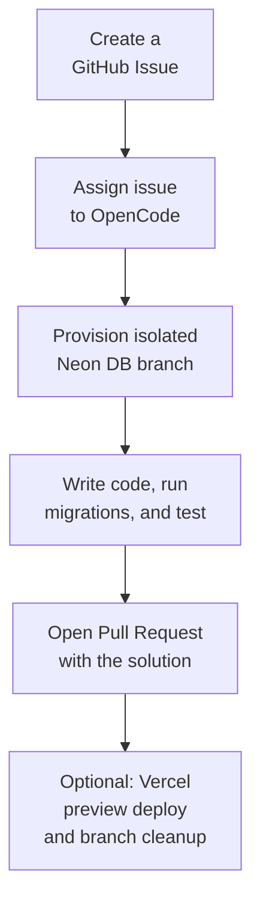

Coding assistants are rapidly evolving from simple code generators into autonomous collaborators that can implement features and open pull requests directly in your repository. To handle full-stack tasks safely, they need a production-like environment where they can test application code and validate database changes without touching production.

This guide shows how to combine OpenCode’s GitHub Action with Neon’s instant branching to give an AI agent an isolated Postgres branch on demand. With that sandbox in place, the agent can update schema files, generate and run migrations, validate its changes against a real database, and open a Pull Request with the complete implementation.

## Overview

In this guide, you'll connect GitHub Actions, OpenCode, and Neon Database Branching to create a seamless workflow for AI-driven development. The high-level flow looks like this:



## Prerequisites

To follow along with this guide, you will need:

- **Neon account and project:** A Neon account with an active project. Sign up for a free [Neon account](https://console.neon.tech/signup) if you don't have one.
- **OpenCode CLI:** OpenCode CLI installed and configured. You can find installation instructions in the [OpenCode documentation](https://opencode.ai/docs#install).
- **Application repository on Github:** A GitHub repository containing an application that uses your Neon project as its database. In this example, you'll use a simple snippet management tool called SnippetHub built with Next.js and Drizzle ORM. You can follow along with any of your own Neon-backed projects - the focus is on the workflow rather than the specific application.

## The sample application

To demonstrate this workflow, you'll use an example app called **SnippetHub**. It’s a simple tool for saving and organizing code snippets. Each snippet includes a title, description, code content, and is tied to a user. Currently, users can create, edit, and delete snippets, but all snippets remain private visible only to their creator.

<DetailIconCards>
    <a href="https://github.com/dhanushreddy291/code-snippet" description="Example app repository used in this guide. It’s a simple snippet management tool built with Next.js, Drizzle ORM, and Neon Auth." icon="github">Example repository (SnippetHub)</a>
</DetailIconCards>

Now you want to add a **"Share Snippet"** feature. This will let users make a snippet public, generating a shareable link that anyone can view without authentication.

You'll create a GitHub Issue for that feature and ask OpenCode to implement it. In the rest of this guide, you'll set up the automation that gives the agent its own Neon branch, lets it make and validate schema changes safely, and returns the finished work as a Pull Request.

Follow these steps to set up that end-to-end workflow in your own repository.

<Steps>

## Set up the Neon GitHub Integration

<Tabs labels={["Using the Neon GitHub Integration", "Manual configuration"]}>

<TabItem>

To allow your GitHub Action to create and manage Neon branches, you need to connect your Neon project to GitHub. This integration will securely inject the necessary credentials into your GitHub Actions environment.

1. In the [Neon Console](https://console.neon.tech), navigate to the **Integrations** page for your project.
2. Locate the **GitHub** card and click **Add**.
   
3. On the **GitHub** drawer, click **Install GitHub App**.
4. If you have more than one GitHub account, select the account where you want to install the GitHub app.
5. Select whether to install and authorize the GitHub app for **All repositories** in your GitHub account or **Only select repositories**.
6. Follow the prompts to select your target repository and click **Connect**.

Once connected, Neon will automatically inject `NEON_API_KEY` into your repository's Secrets and `NEON_PROJECT_ID` into your repository's Variables. These will be used by your workflow to manage branches.

</TabItem>

<TabItem>

To set up the integration manually follow these steps:

1. In your GitHub repository, go to **Settings > Secrets and variables > Actions**. Under **Secrets**, create a new repository secret named `NEON_API_KEY`, and paste in a project-scoped API key from the Neon Console. This secret allows the GitHub Action to authenticate with Neon and manage branches. For setup steps, see [Neon Docs: Create project-scoped API keys](/docs/manage/api-keys#create-project-scoped-organization-api-keys).
2. In the same GitHub Actions settings page, under **Variables**, create a new repository variable named `NEON_PROJECT_ID`, and set its value to your Neon project ID. You can find the project ID in the Neon Console under **Project settings**.

</TabItem>

</Tabs>

## Create the OpenCode GitHub Action Workflow

Now that your Neon project is connected to GitHub, set up OpenCode's GitHub integration from your local repository by running:

```bash
opencode github install
```

This command opens the GitHub configuration flow in your browser, where you'll be asked to choose the GitHub organization and repositories where you want to install the OpenCode GitHub App.

Next, you will be prompted to chose the model you want to use for your OpenCode GitHub Action. For this example, select `opencode/minimax-m2.5-free`, which is a free, general-purpose model suitable for a wide range of coding tasks. You can always change the model later by updating the workflow file.

As part of that setup, OpenCode also creates a basic workflow file at `.github/workflows/opencode.yml`. The generated file does not include the Neon branch creation step, so you will need to modify it to add that in. Update the file with the following content:

```yaml
name: OpenCode

on:
  issue_comment:
    types: [created]

jobs:
  opencode:
    if: |
        contains(github.event.comment.body, '/oc') ||
        contains(github.event.comment.body, '/opencode')
    runs-on: ubuntu-latest
    permissions:
      id-token: write
    steps:
      - name: Checkout repository
        uses: actions/checkout@v6
        with:
          persist-credentials: false

      # 1. Create an isolated Neon database branch for the AI agent
      - name: Create Neon Branch
        id: create_neon_branch
        uses: neondatabase/create-branch-action@v6
        with:
          project_id: ${{ vars.NEON_PROJECT_ID }}
          # Name the branch based on the issue number for traceability
          branch_name: opencode-issue-${{ github.event.issue.number }}
          api_key: ${{ secrets.NEON_API_KEY }}

      # 2. Run OpenCode, passing the new Database URL as an environment variable
      - name: Run OpenCode
        uses: anomalyco/opencode/github@latest
        env:
          # Inject the isolated database URL into the environment
          DATABASE_URL: ${{ steps.create_neon_branch.outputs.db_url }}
        with:
          model: opencode/minimax-m2.5-free
          prompt: |
            You are an expert autonomous AI engineer. Please fulfill the user's request from the issue comment.

            IMPORTANT CONTEXT:
            You have been provided a safe postgres database URL that is an isolated branch of the production database. You can make any schema changes you need, generate and run migrations, and test your code against this database.

            You are responsible for delivering the complete end-to-end fix needed for the issue. Implement all required application, API, UI, server, test, and database changes needed to fully resolve the issue.

            Expectations:
            1. Investigate the issue / feature request and identify the full scope of required changes across code, configuration, tests, and database.
            2. Implement the necessary code changes end to end so the feature or fix actually works in the application.
            3. If the task involves database schema changes, adding columns, or fixing queries:
              - Modify the ORM schema files as needed.
              - Generate the migration files (for example, using `npx drizzle-kit generate`).
              - Apply the migration scripts to your isolated database using the $DATABASE_URL environment variable.
            4. Run the relevant validation for your changes, including tests, builds, linting, and/or manual verification as appropriate.
            5. Verify the complete fix works end to end.
```

After updating `.github/workflows/opencode.yml`, commit and push the workflow to your repository. With this in place, the next time you comment on an issue with the trigger phrase, the workflow will execute, giving OpenCode a fully isolated Neon database branch to work with as it implements the requested changes.

**How the Workflow Works**

The GitHub Action is designed to respond to issue comments that contain specific trigger phrases. Here's a breakdown of the key steps:

1. **The Trigger:** The `if` condition ensures the workflow only runs when an issue comment contains `/oc` or `/opencode`.
2. **Branch creation:** You'll use Neon's [`create-branch-action`](https://github.com/marketplace/actions/neon-create-branch-github-action) to instantly fork the primary database. Because Neon uses copy-on-write, this takes less than a second and gives the Action a completely isolated database containing production-like data.
3. **Context Injection:** You'll pass the output of the branch creation (`${{ steps.create_neon_branch.outputs.db_url }}`) into OpenCode's environment as `DATABASE_URL`.
4. **The system prompt:** Using OpenCode's `prompt` parameter, you'll explicitly tell the AI that it has a safe, isolated Postgres database to work with. You set the expectation that it should make any necessary schema changes, generate and run migrations, and validate its code against that database before opening a PR.

## Testing the workflow

With the workflow merged into your default branch you can now test it out by creating a new GitHub Issue in your repository.

Navigate to your repository and create a **New Issue** describing the feature you want. For example, title it "Add Share Snippet Feature" and describe it like this:

> Add a "Share Snippet" feature to the app. Each snippet should have a share button that generates a unique public link. The link must be accessible without authentication, while non-shared snippets remain private.

Once the issue is created, add a comment assigning the task to OpenCode:

```text shouldWrap
/opencode Implement this feature.
```


When you submit the comment, the GitHub Action kicks off. Behind the scenes:

1. Neon creates a new branch called `opencode-issue-xyz` that is an instant copy of your production database.
2. OpenCode reads the issue description and your prompt.
3. It analyzes the existing codebase to understand the application structure and database schema.
4. It updates the schema files as needed to support the feature.
5. It executes the migration generator (e.g., `npx drizzle-kit generate`) to create the SQL migration file.
6. It executes the migration commands (using the injected Neon branch URL) to verify the schema changes.
7. It updates the application code to implement the new feature, including API routes, frontend components, and tests.
8. Once validated, OpenCode creates a new git branch and opens a Pull Request linking back to the issue.

The result is a fully implemented feature with the necessary database changes, all tested against a real database, and delivered as a PR ready for review.


For example, here is the PR generated by OpenCode for the "Share Snippet" feature: [github.com/dhanushreddy291/code-snippet/pull/7](https://github.com/dhanushreddy291/code-snippet/pull/7)

## Automatically clean up Neon branches

If you want these temporary Neon branches to clean themselves up automatically, `create-branch-action` also supports an `expires_at` input. You can add an expiration time when creating the branch, after which Neon will automatically delete it. This is a great way to ensure that old branches don't accumulate if an issue is abandoned.

```yaml
- name: Set Neon branch expiration # [!code ++]
  run: echo "EXPIRES_AT=$(date -u --date '+48 hours' +'%Y-%m-%dT%H:%M:%SZ')" >> "$GITHUB_ENV" # [!code ++]

- name: Create Neon Branch
  uses: neondatabase/create-branch-action@v6
  with:
    project_id: ${{ vars.NEON_PROJECT_ID }}
    branch_name: opencode-issue-${{ github.event.issue.number }}
    api_key: ${{ secrets.NEON_API_KEY }}
    expires_at: ${{ env.EXPIRES_AT }} # [!code ++]
```

Setting `expires_at` to 48 hours is a good default for ephemeral AI workspaces because it keeps cleanup simple and prevents old branches from accumulating if an issue is abandoned.

If you need more advanced lifecycle management, use Neon's [`delete-branch-action`](https://github.com/neondatabase/delete-branch-action) in a separate workflow. That approach is useful when cleanup should happen in response to a specific event, such as an issue being closed, a pull request being merged, or another repository-specific automation trigger.

Follow [Automated Database Branching with GitHub Actions](/guides/neon-github-actions-authomated-branching) for an example of how to set up that kind of event-driven cleanup workflow.

## (Optional) Enable automatic preview deployments

For a complete end-to-end experience, you can configure Vercel to automatically deploy the Pull Requests that OpenCode creates. By combining Vercel with the [Neon Vercel Integration](/docs/guides/vercel-managed-integration), every PR opened by the agent gets a live preview URL backed by its own isolated Neon database branch.

This lets you review OpenCode's work in a real browser environment, validating the full stack from UI to database without touching production data or having to reproduce the setup locally.

1. **Deploy to Vercel:** Connect your GitHub repository to a Vercel project.
2. **Install the Neon Integration:** Go to the [Neon Vercel Integration](https://vercel.com/integrations/neon) page and click **Add Integration**.
3. **Enable Preview Branching:** During setup, select **Create a branch for every preview deployment** so each PR gets its own isolated database.

Follow the [Neon Vercel Integration guide](/docs/guides/vercel-managed-integration) for the full setup instructions.


### Entire workflow in action

After setup is complete, you can trigger OpenCode from a GitHub issue comment and let the workflow provision an isolated Neon branch for that run. OpenCode then implements the requested changes, generates and applies any required migrations, validates the result against the branch, and opens a Pull Request. If you connect the repository to Vercel with the Neon integration enabled, that PR can also get a preview deployment backed by its own separate preview database branch.

</Steps>

## Conclusion

AI coding agents are incredibly powerful, but their potential is often constrained by the environments they run in. By combining OpenCode with Neon Database Branching and GitHub Actions, you remove one of the biggest barriers to AI-driven development: safe access to stateful infrastructure.

With a simple GitHub Action, a static CI runner becomes a fully capable, isolated development sandbox. This means you can confidently request complex, database-altering features directly from a GitHub Issue, knowing the AI has everything it needs to iteratively test, validate, and refine its changes without ever putting your production data at risk.

## Resources

- [Neon Database Branching](/branching)
- [Automated Database Branching with GitHub Actions](/guides/neon-github-actions-authomated-branching)
- [Connect OpenCode to GitHub](https://opencode.ai/docs/github/)
- [Integrating Neon with Vercel](/docs/guides/vercel-overview)
- [Neon GitHub integration guide](/docs/guides/neon-github-integration).

<NeedHelp />
