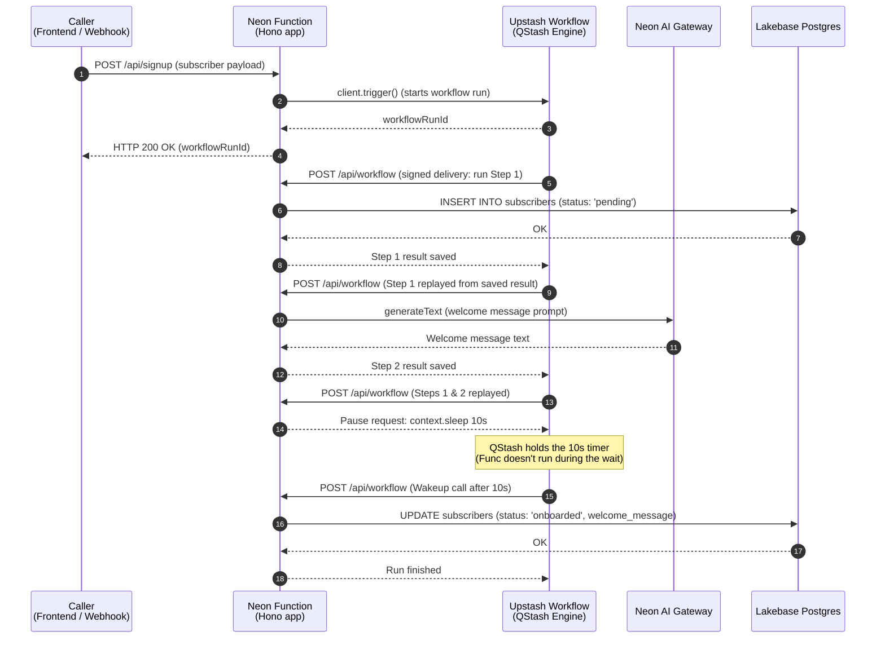

If you're building a backend that runs long jobs, you need a way to execute each step reliably and keep track of state between them. Maybe it's a sequence of onboarding emails spread over a few days, an AI pipeline where each model call depends on the previous one's output, or a weekly report that takes minutes to generate. If the request times out or the server restarts halfway through, the job can stop, and restarting it often means repeating steps that already succeeded.

This gets painful fast. A three-step pipeline that fails on step 3 shouldn't have to rerun steps 1 and 2 just because they already completed successfully. Add retries and timers on top, and you're quickly managing workflow state that has little to do with your actual business logic.

That's where [Upstash Workflow](https://upstash.com/docs/workflow/getstarted) comes in. You add the Workflow SDK to your existing backend API and wrap each step in a `context.run` block. Upstash's [QStash](https://upstash.com/docs/qstash/overall/getstarted) engine then calls your endpoint once for each step and saves the result. If a step fails, only that step is retried, while completed steps reuse their saved results. And when a workflow needs to wait, for example, a day between onboarding emails, `context.sleep` hands the timer off to QStash, so your code doesn't have to stay running during the wait.

Pair it with [Neon Functions](/docs/compute/functions/overview) and the whole pipeline can run in one place. Neon Functions are long-running Node.js functions deployed onto a Neon branch, so your workflow endpoint runs in the same region as [Lakebase Postgres](/docs/postgres/overview). Since a function is just an HTTPS endpoint, QStash can deliver each workflow step directly to it. You don't need to manage a separate queue or keep worker processes running.

In this guide, you'll build a subscriber onboarding pipeline with Upstash Workflow running on a Neon Function. The endpoint you deploy will run four steps, including a durable wait:

- Records the signup in Lakebase Postgres with a `pending` status
- Drafts a personalized welcome message with an LLM through the [Neon AI Gateway](/docs/ai-gateway/overview)
- Waits on a timer before completing onboarding
- Saves the message and marks the subscriber as `onboarded`

These same four building blocks can be applied to any multi-step pipeline where a failed step shouldn't force earlier steps to run again.

## Architecture overview

Upstash Workflow calls your Neon Function once per step, and each step can use the results of the steps that came before it. The following diagram shows how the pieces fit together:



1. **Trigger route**: A caller POSTs the signup to `/api/signup` on your Neon Function. The handler calls `client.trigger()` with your QStash token, which starts a workflow run and immediately returns a `workflowRunId` to the caller.
2. **Signed step deliveries**: QStash calls your `/api/workflow` endpoint once per step. Each request includes an `Upstash-Signature` header, which the SDK verifies against your signing keys to authenticate the request.
3. **Checkpoint and replay**: Upstash saves the result of every `context.run`. On subsequent calls, completed steps return their saved results immediately, and execution continues from the first unfinished step.
4. **Durable sleep**: `context.sleep` hands the timer to QStash. Your function stops running while the workflow waits, and QStash sends a request to resume it when the delay ends.

## Prerequisites

Before you start, make sure you have:

1. **Node.js**: Version 22 or later (v24 recommended). Download from [nodejs.org](https://nodejs.org/).
2. **Neon account**: Sign up at [console.neon.tech](https://console.neon.tech/signup).
3. **Neon CLI**: Installed globally (`npm i -g neon@latest`) and authenticated (`neon auth`). See the [Neon CLI Quickstart](/docs/cli/quickstart) for details.
4. **Upstash account**: Sign up for a free account at [console.upstash.com](https://console.upstash.com).

<Steps>

## Set up the project

Create a new directory and initialize a Node.js project:

```bash
mkdir neon-upstash-workflow && cd neon-upstash-workflow
npm init -y
```

Run the Neon CLI initialization command:

```bash
neon init
```

The `neon init` command sets up your project. It installs the Neon plugin into your coding agents, links the directory to a Neon project, pulls the project's variables into `.env.local`, and scaffolds a `neon.ts` config file declaring the Neon services you pick.

Follow the prompts to configure your project:

1. **Coding agents**: Choose **Plugin (recommended)**, then select the agents you use (for example, Claude Code, Codex, or Cursor). The plugin lets these agents assist you in building and working with Neon.
2. **Project**: `neon init` runs `neon link` automatically and asks which project to link. **Create a new project** named `neon-upstash-workflow` (or pick an existing one).
3. **Region**: Choose **AWS US East 2 (Ohio)** (`aws-us-east-2`), because Neon Functions are currently available only in this region during beta.
4. **Setup as code**: Confirm that you want to manage your setup as code, then select **Functions** and **AI Gateway** as the services `neon.ts` should declare.

The full initialization looks like this:

```text
$ neon init
✔ How should coding agents get Neon in this project? › Plugin (recommended)
✔ Which coding agents should get the Neon plugin? (space to toggle, enter to confirm) › Claude Code, Codex, Cursor

INFO: Installed the Neon plugin (project).
INFO: Running `neon link`
INFO: Linking organization MyOrg (org-example-12345678).
✔ Which project would you like to link? › ＋ Create new project…
✔ Name for the new project: … neon-upstash-workflow
✔ Which region should the new project run in? › AWS US East 2 (Ohio) (aws-us-east-2)
Created project cool-darkness-12345678 ("neon-upstash-workflow") in aws-us-east-2.
Linked ~/neon-upstash-workflow/.neon:
  orgId:     org-example-12345678
  projectId: cool-darkness-12345678
  branch:    main

INFO: Pulled 3 Neon variables into ~/neon-upstash-workflow/.env.local: NEON_BRANCH, DATABASE_URL, DATABASE_URL_UNPOOLED
✔ Manage this project's Neon setup as code? Adds a neon.ts you can edit and apply with `neon config apply`. … yes
✔ Which Neon services should neon.ts declare? (space to toggle, enter to confirm) › Functions, AI Gateway
INFO: Created neon.ts declaring functions, ai-gateway.
INFO: Created hello.ts — the source of the hello function.
INFO: Installing @neon/config, @neon/env with npm…
INFO: Next: edit neon.ts, then run `neon config plan` to preview and `neon config apply`.
INFO: Pulled 5 Neon variables into ~/neon-upstash-workflow/.env.local: NEON_BRANCH, DATABASE_URL, DATABASE_URL_UNPOOLED, NEON_AI_GATEWAY_TOKEN, NEON_AI_GATEWAY_BASE_URL

Configured this directory for Neon.
-----------------------------------

  Agents   plugin
  Project  linked
  Config   neon.ts
```

The `neon init` command also creates a placeholder function, `hello.ts`, at your project root, and a `.env.local` file with your project's variables, including `DATABASE_URL`. You'll build the workflow in your own `index.ts` file, so delete the placeholder:

```bash
rm hello.ts
```

You now have a project linked to Neon with a `neon.ts` config file and the dependencies needed to build the workflow.

Install the dependencies by running:

```bash
npm install hono @upstash/workflow @neon/ai-sdk-provider pg ai
npm install --save-dev esbuild @types/node @types/pg typescript dotenv
```

- `hono`: A lightweight web framework for serving the workflow endpoint and the trigger route.
- `@upstash/workflow`: The Upstash Workflow SDK. It includes a Hono adapter and a client for starting workflow runs.
- `pg`: Postgres client for Node.js.
- `ai`: The [Vercel AI SDK](https://ai-sdk.dev/), which provides a unified interface for calling LLMs.
- `@neon/ai-sdk-provider`: [Neon's AI SDK provider](https://github.com/neondatabase/neon-pkgs/tree/main/packages/ai-sdk-provider), which routes model calls through the Neon AI Gateway.

TypeScript needs a `tsconfig.json` to resolve types correctly. Create one in your project root:

```json filename="tsconfig.json"
{
  "compilerOptions": {
    "target": "ES2022",
    "module": "esnext",
    "types": ["node"],
    "strict": true,
    "esModuleInterop": true,
    "skipLibCheck": true,
    "forceConsistentCasingInFileNames": true
  }
}
```

## Create the subscribers table

In this example workflow, you'll be implementing a simple subscriber onboarding workflow. The first step is to create the `subscribers` table in Lakebase Postgres using either the Neon CLI or the [Neon SQL Editor](/docs/get-started/query-with-neon-sql-editor).

<CodeTabs labels={["Use Neon CLI", "Raw SQL"]}>

```bash shouldWrap
neon psql main -- -c "CREATE TABLE subscribers (
  id TEXT PRIMARY KEY,
  email TEXT NOT NULL,
  name TEXT NOT NULL,
  welcome_message TEXT,
  status TEXT NOT NULL DEFAULT 'pending',
  created_at TIMESTAMPTZ DEFAULT NOW()
);"
```

```sql
CREATE TABLE subscribers (
  id TEXT PRIMARY KEY,
  email TEXT NOT NULL,
  name TEXT NOT NULL,
  welcome_message TEXT,
  status TEXT NOT NULL DEFAULT 'pending',
  created_at TIMESTAMPTZ DEFAULT NOW()
);
```

</CodeTabs>

The table will be used to store subscriber information, including their email, name, welcome message, status, and the timestamp of when they were created.

## Set up the database connection pool

Neon Functions run as long-lived Node.js processes, so you can use a Postgres connection pool to reuse connections across requests.

Create `src/db.ts` and export a `Pool` instance from the `pg` package. The pool reads the `DATABASE_URL` from the environment, which Neon injects automatically:

```ts filename="src/db.ts"
import { Pool } from 'pg';

export const pool = new Pool({
  connectionString: process.env.DATABASE_URL,
  max: 5,
});
```

## Define the workflow endpoint

Create the workflow endpoint at `src/workflow.ts`. It uses Hono to handle requests, the Upstash Workflow SDK to manage steps, and the Neon AI Gateway to generate a welcome message:

```ts filename="src/workflow.ts" shouldWrap
import { Hono } from "hono";
import { serve } from "@upstash/workflow/hono";
import { generateText } from "ai";
import { neon } from "@neon/ai-sdk-provider";
import { pool } from "./db";

type SignupPayload = {
  subscriberId: string;
  email: string;
  name: string;
};

const workflowApp = new Hono();

workflowApp.post(
  "/",
  serve<SignupPayload>(async (context) => {
    const { subscriberId, email, name } = context.requestPayload;

    await context.run("record-subscriber", async () => {
      await pool.query(
        `INSERT INTO subscribers (id, email, name, status)
         VALUES ($1, $2, $3, $4)
         ON CONFLICT (id) DO UPDATE SET status = $4`,
        [subscriberId, email, name, "pending"]
      );
      return { subscriberId, status: "pending" };
    });

    const welcomeMessage = await context.run("draft-welcome-message", async () => {
      const { text } = await generateText({
        model: neon("gpt-oss-120b"),
        prompt: `Write a warm, concise welcome message (2-3 sentences) for ${name} (${email}), who just subscribed to a newsletter about serverless Postgres and modern backend development. Mention one thing they can do with Neon in their first five minutes.`,
        system: "You write friendly onboarding copy. Keep it short and specific. No emojis.",
      });
      return text;
    });

    await context.sleep("onboarding-hold", "10s");

    await context.run("complete-onboarding", async () => {
      await pool.query(
        `UPDATE subscribers SET welcome_message = $1, status = $2 WHERE id = $3`,
        [welcomeMessage, "onboarded", subscriberId]
      );
      return { subscriberId, status: "onboarded" };
    });
  })
);

export default workflowApp;
```

The workflow reads its input from the request payload (the body passed to `client.trigger`, covered in [Wire up the Hono entry point](#wire-up-the-hono-entry-point)) and runs through three steps with a durable wait in between:

- **`record-subscriber`**: Inserts the signup into Lakebase Postgres with a `pending` status.
- **`draft-welcome-message`**: Calls an LLM through the Neon AI Gateway to write a personalized welcome message. The returned text is saved with the step's result, which is how the last step can use it without generating it again.
- **`context.sleep("onboarding-hold", "10s")`**: Pauses the workflow for ten seconds while QStash keeps track of the timer. Your function doesn't run during the wait, so nothing is billed for it. In a real application, this is where a trial-period check or a delayed follow-up would go.
- **`complete-onboarding`**: Saves the generated message and updates the status to `onboarded`.

The workflow has a few important properties to keep in mind:

- **Your endpoint is called once per step, not once per run.** When QStash delivers step 3, the handler starts from the top and `record-subscriber` returns its saved result without touching the database. This is also why the code between steps should produce the same result on every run: calling `Date.now()` or `Math.random()` outside a step can send a replayed run down a different path than the original.
- **Return values are the only state that survives between steps.** A variable assigned inside a step is gone by the next call, because each call starts a fresh run of the handler. If step 3 needs step 2's output, step 2 must return it.

## Wire up the Hono entry point

Create the entry point for your Neon Function at `index.ts`. It registers the Hono app, sets up the workflow client, and exposes a trigger route for starting runs:

```ts filename="index.ts"
import { Hono } from "hono";
import { Client } from "@upstash/workflow";
import workflowApp from "./src/workflow";

const app = new Hono();

const workflowClient = new Client({});

// The workflow endpoint for Upstash Workflow
app.route("/api/workflow", workflowApp);

// Trigger route: starts a new workflow run for a signup.
app.post("/api/signup", async (c) => {
  const { subscriberId, email, name } = await c.req.json();

  const baseUrl = new URL(c.req.url).origin;
  const { workflowRunId } = await workflowClient.trigger({
    url: `${baseUrl}/api/workflow`,
    body: { subscriberId, email, name },
    retries: 3,
  });

  return c.json({ workflowRunId });
});

app.get("/", (c) => c.text("Example Upstash Workflow + Neon Functions App"));

export default app;
```

The Hono app exposes two routes:

- **`/api/workflow`**: The workflow endpoint that QStash calls once per step. It delegates to the `workflowApp` defined in [`src/workflow.ts`](#define-the-workflow-endpoint).
- **`/api/signup`**: The trigger route that starts a new workflow run.

## Configure Upstash credentials

With the Hono app and the workflow client set up, you need to add your Upstash credentials to `.env.local`. Copy your Upstash Workflow credentials from the [Upstash Console](https://console.upstash.com/qstash) and add them to your `.env.local` file:

```bash filename=".env.local"
# ..other Neon environment variables..
QSTASH_URL="https://qstash.upstash.io"
QSTASH_TOKEN="eyJVc2VySUQiOi..."
QSTASH_CURRENT_SIGNING_KEY="sig_..."
QSTASH_NEXT_SIGNING_KEY="sig_..."
```

## Configure `neon.ts` and deploy

The `neon init` command created a `neon.ts` file in your project root. Update it to register the workflow function and pass the Upstash credentials to the function at deploy time. The workflow function is declared under `preview.functions.workflow`, and the `env` object passes the credentials to the function:

```ts filename="neon.ts" {9-23}
import { defineConfig } from "@neon/config/v1";

export default defineConfig({
  branch: (branch) => {
    if (branch.isDefault) { return {}; }
    if (!branch.exists) { return { ttl: "7d" }; }
    return {};
  },
  preview: {
    functions: {
      workflow: {
        name: "Upstash Workflow Endpoint",
        source: "./index.ts",
        env: {
          QSTASH_URL: process.env.QSTASH_URL!,
          QSTASH_TOKEN: process.env.QSTASH_TOKEN!,
          QSTASH_CURRENT_SIGNING_KEY: process.env.QSTASH_CURRENT_SIGNING_KEY!,
          QSTASH_NEXT_SIGNING_KEY: process.env.QSTASH_NEXT_SIGNING_KEY!,
        },
      }
    },
    aiGateway: true
  },
});
```

Deploy your function with the following command:

```bash
neon deploy --env .env.local
```

The `--env .env.local` flag loads your env file so the `process.env` references in `neon.ts` resolve at deploy time. The CLI bundles your code and prints the function's public URL:

```text
Function URLs
  • workflow: https://br-damp-voice-xxx-workflow.compute.c-3.us-east-2.aws.neon.tech
```

Your workflow endpoint is now live at:
`https://<your-function-url>/api/workflow`

<details>
<summary>How to run the workflow locally</summary>

You can run the workflow locally with the Upstash QStash CLI. This is useful for testing and debugging before deploying to production.

```bash
# Terminal 1: start the local QStash server
npx @upstash/qstash-cli dev
```

This prints a local `QSTASH_URL` (typically `http://127.0.0.1:8080`) and a development `QSTASH_TOKEN`. Add both to `.env.local`, then start the Neon Functions dev server:

```bash
# Terminal 2: start the Neon Functions dev server
neon dev
```

Trigger a run against `http://localhost:8787/api/signup` with the same payload shown in [Verify production execution](#verify-production-execution).

</details>

## Verify production execution

Start a run by posting a signup to the trigger route on your deployed function:

```bash shouldWrap
curl -X POST "https://<your-function-url>/api/signup" \
  -H "Content-Type: application/json" \
  -d '{
    "subscriberId": "sub_prod_204",
    "email": "dana@example.com",
    "name": "Dana Smith"
  }'
```

<Admonition type="note">

Replace `<your-function-url>` with your deployed Neon Function URL.

</Admonition>

You should see a JSON response with the workflow run ID:

```json
{ "workflowRunId": "wfr_a1b2c3..." }
```

After that, QStash runs the workflow on its own: it calls your endpoint for step 1, saves the result, calls step 2, waits out the ten-second timer, then calls step 3. The whole run finishes in about 10-15 seconds, and your function only runs when there's actual work to do.

You can follow the run in the [Upstash Console](https://console.upstash.com/workflow) under the **Workflow > Logs** tab: each step is listed with its status, input, and output. You can also inspect the run's payload and replay it if you need to debug.

Once the run finishes, confirm the database state:

```bash shouldWrap
neon psql main -- -c "SELECT * FROM subscribers WHERE id = 'sub_prod_204';"
```

<details>

<summary>Example Output</summary>

```text
| id           | email            | name       | welcome_message                                                            | status    | created_at                  |
|--------------|------------------|------------|----------------------------------------------------------------------------|-----------|-----------------------------|
| sub_prod_204 | dana@example.com | Dana Smith | Welcome aboard, Dana! Create a free Neon project and branch your produc... | onboarded | 2026-08-29 09:14:03.551227+00 |
|              |                  |            | tion database in seconds; the SQL editor on a dev branch is the fastest... |           |                             |
```

</details>

The `status` column shows `onboarded` and `welcome_message` contains the generated message, which means all three steps and the sleep ran in order.

To see how retries work, make a step fail on purpose (for example, set the AI Gateway model name to something invalid). Upstash retries only the failed step while the earlier insert stays saved. Once the retries run out, the run appears in the QStash Dead Letter Queue, where you can inspect the payload and republish the run after fixing the problem.

</Steps>

## Next steps

The onboarding pipeline you built covers the core building blocks: steps, retries, and a durable wait. As your pipelines grow, Upstash Workflow has a few more features worth knowing about:

- **`context.call`**: When a step needs to make a slow HTTP call, you can hand the request to Upstash instead of running it yourself. Upstash makes the call (for up to 12 hours) and resumes your workflow with the response, so your function isn't tied up waiting on a third-party API.
- **`context.waitForEvent`**: Pauses a run until an external event arrives, like a webhook callback or a user's approval click, then resumes with the event's payload.
- **Parallel steps**: If you have independent `context.run` calls, wrap them in `Promise.all` and Upstash runs them at the same time as separate deliveries.
- **`failureFunction`**: A callback you can register on `serve()` that runs when a workflow exhausts its retries. Use it to alert someone or record the failure in your database, the same way the Dead Letter Queue catches failed runs.

See the [Upstash Workflow documentation](https://upstash.com/docs/workflow/getstarted) for details on each.

## Source code

You can find the complete source code for this example on GitHub.

<DetailIconCards>
<a href="https://github.com/dhanushreddy291/upstash-workflow-on-neon-functions" description="Complete source code for the Upstash Workflow on Neon Functions example" icon="github">Upstash Workflow on Neon Functions Example Repository</a>
</DetailIconCards>

## Resources

- [Neon Functions Overview](/docs/compute/functions/overview)
- [Neon AI Gateway](/docs/ai-gateway/overview)
- [Neon AI SDK Provider](https://github.com/neondatabase/neon-pkgs/tree/main/packages/ai-sdk-provider)
- [Upstash Workflow Documentation](https://upstash.com/docs/workflow/getstarted)

<NeedHelp/>
