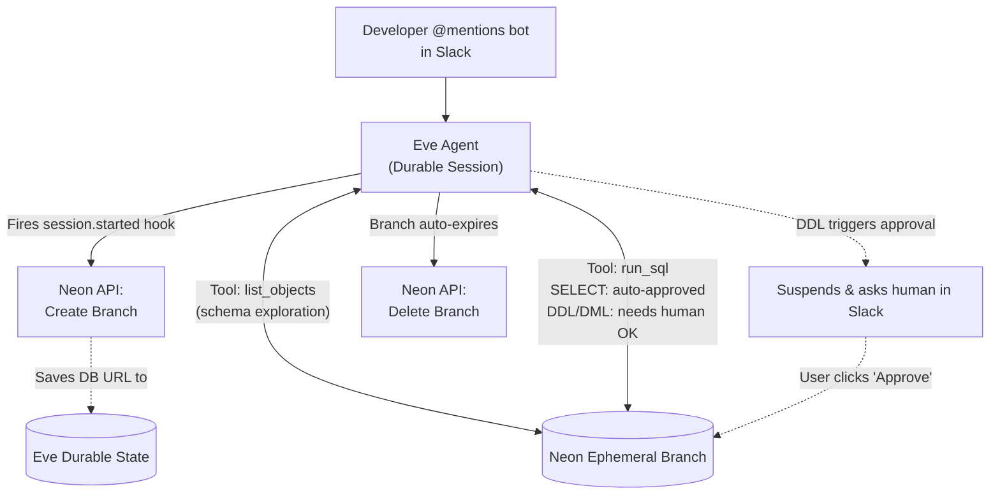

[Eve](https://eve.dev) by [Vercel](https://vercel.com) is a filesystem‑first framework for building durable backend agents. You define an agent as files (its instructions, tools, skills, channels, and schedules), and Eve takes care of the rest: stable HTTP routes, reconnectable session streams, durable state, and native human‑in‑the‑loop approvals. Agents built with Eve can run for days, pause for human review, and resume exactly where they left off.

That durability makes Eve a natural fit for database agents, those that explore schemas, run migrations, and test queries on behalf of developers. But giving an AI agent direct access to a production database is risky. A single misfired `DROP TABLE` or an unoptimized `SELECT` can corrupt data or degrade performance for real users. You need an environment where the agent can work freely, without any risk to production.

Neon's copy‑on‑write Postgres branching solves this. Instead of connecting your agent to a fragile production instance, every Eve session can automatically spin up its own isolated database branch in seconds. Because branches share data at the storage layer, they cost nothing extra and create no overhead. The agent gets a full, realistic dataset to explore, but it can run queries and migrations without fear of breaking production.

At first glance, wiring up an agent that handles Slack messages, provisions databases, manages durable state, and gates dangerous operations behind human approval sounds like a lot of plumbing. But Eve's filesystem-first approach keeps it organized. Here is what the finished project looks like:

```text
neon-eve-agent/
├── package.json
├── agent/
│   ├── agent.ts                    # Runtime config (model, compaction)
│   ├── instructions.md             # Agent identity and behavior
│   ├── channels/
│   │   ├── eve.ts                  # Default HTTP channel
│   │   └── slack.ts                # Slack channel with Vercel Connect credentials
│   ├── hooks/
│   │   └── provision-branch.ts     # Neon branch lifecycle (create on session.started)
│   ├── lib/
│   │   ├── neon.ts                 # Neon API wrapper (createBranch)
│   │   └── db-state.ts             # Durable per-session state (connection URI)
│   └── tools/
│       ├── run_sql.ts              # SQL execution with predicate-based HITL approval
│       └── list_objects.ts         # Schema exploration (tables, columns, indexes)
└── evals/
    └── schema-assistant.eval.ts    # Isolated eval runs with ephemeral branches
```

Here is what each piece does:

- **`agent/agent.ts`**: Runtime config: which model to use, compaction settings. Eve reads this once at boot.
- **`agent/instructions.md`**: The agent's system prompt. Defines its identity, available tools, and safety rules.
- **`agent/channels/`**: Inbound transports. `eve.ts` provides the default HTTP endpoint, while `slack.ts` wires up Slack with Vercel Connect credentials for bot mentions and DMs. This is how users reach the agent.
- **`agent/hooks/`**: Lifecycle event subscribers. `provision-branch.ts` listens for `session.started` to create Neon branches automatically.
- **`agent/lib/`**: Shared helper code. `neon.ts` wraps the Neon API (create branch), and `db-state.ts` holds the per-session connection URI using Eve's durable `defineState`.
- **`agent/tools/`**: The capabilities the model can call. `run_sql` executes SQL with predicate-based human approval (reads auto-approve, writes need a human click). `list_objects` explores schemas safely.
- **`evals/`**: Test harness. Each eval spins up its own Neon branch, runs the agent against a task, asserts the result, and tears down the branch.

Every file maps directly to an Eve concept, so the framework discovers and wires them automatically from the filesystem. The only manual integration is the Neon API calls in `lib/neon.ts` and `hooks/provision-branch.ts` (together about 60 lines), which handle the full branch lifecycle. Everything else (Slack connectivity, durable sessions, human-in-the-loop approvals, sandbox isolation) is framework-provided.

This pattern works across every Eve surface:

- **Channels**: each session (thread) gets its own isolated database (the channel can be Slack, Discord, MS Teams etc)
- **Local dev** (`eve dev`): every TUI session runs on a fresh branch.
- **Evals**: each eval run starts from a clean, seeded branch.
- **Preview deploys**: every Vercel preview deployment provisions its own branch.

In this guide, you will build two concrete examples using this pattern:

1. **Safe operations workflow**: An Eve database agent that automatically provisions a Neon branch whenever it is mentioned in a Slack thread, enabling safe migration testing. Before any execution, it requests explicit human approval to ensure controlled and secure operations.
2. **Agent evals**: An Eve eval setup where every test run automatically provisions its own isolated Neon branch, ensuring tests are reliable and never pollute your database.

## Architecture overview

Here's how the Eve agent and Neon interact to execute safe data operations:



## Prerequisites

Before you begin, ensure you have the following:

- **Node.js:** Version `20` or later installed on your machine.
- **Vercel CLI:** Installed globally (`npm i -g vercel`) for linking and deployment.
- **Neon account:** A free account at [console.neon.tech](https://console.neon.tech) with a project created.
- **Neon API Key:** Generate a project-scoped API key in your [Neon Account Settings](/docs/manage/api-keys#create-project-scoped-organization-api-keys).
  
  > Copy the key and store it securely. You'll need it for your `.env.local` file in the next step.

<Steps>

## Scaffold the Eve agent

Start by creating a new Eve agent project. The `eve init` command scaffolds the full project structure, installs dependencies, and launches a TUI to configure your model provider.

Run the following command in your terminal:

```bash
npx eve@latest init neon-eve-agent
```

You should see output similar to this:

```text
eve  v0.11.10
✓ Created an eve agent in /home/neon-eve-agent in 11ms
✓ Installed dependencies in 21.2s
```

Next, the TUI will prompt you to choose a model. Select Vercel AI Gateway and connect it to your Vercel project. The output should look like this:

```text
⚠ 1 setup issue: model provider not linked · /model

/model

▔▔▔▔▔▔▔▔▔▔▔▔▔▔▔▔▔▔▔▔▔▔▔▔▔▔▔▔▔▔▔▔▔▔▔▔▔▔▔▔▔▔▔▔▔▔▔▔▔▔▔▔▔▔▔▔▔▔▔▔▔▔▔▔▔▔▔▔▔▔▔▔▔▔▔▔▔▔▔▔▔▔▔▔▔▔▔▔▔▔▔▔▔▔▔▔▔▔▔▔▔▔▔
   Configure the agent model

   ◦ Change model
     anthropic/claude-sonnet-4.6

   ▷ Configure provider
     Required to enable the agent

   ◦ Done

Configure the agent model

   Which model provider do you want to use?

   ▷ Vercel AI Gateway
     one key, every model

   ◦ Something else
     use your own provider credentials

Configure the agent model

   How do you want to connect to AI Gateway?

   ▷ Connect via a project
     vercel link + env pull

   ◦ Use my own key
     paste an AI_GATEWAY_API_KEY

Select your team

   > type to search teams
   ▷ Dhanush Reddy's projects (current)

Vercel project

   ▷ Create a new project · Named neon-eve-agent

/model
   ⎿  Project linked. Connected to AI Gateway via VERCEL_OIDC_TOKEN.

anthropic/claude-sonnet-4.6  ·  AI Gateway (neon-eve-agent)
```

You will be prompted to link the agent to a Vercel project. If you don't have one, the TUI will create it for you. After linking, the TUI will generate a `VERCEL_OIDC_TOKEN` and store it in your `.env.local` file. This token allows the agent to authenticate with Vercel AI Gateway.

Once the project is linked and the default model (`anthropic/claude-sonnet-4.6`) is configured, exit the TUI and navigate into the project directory:

```bash
cd neon-eve-agent
code .
```

Next, install the [Neon API TypeScript SDK](/docs/reference/typescript-sdk) for branch management, the [serverless driver](/docs/serverless/serverless-driver) for querying branches, and a YAML parser that the eval runner uses internally:

```bash
npm install @neondatabase/api-client @neondatabase/serverless yaml
```

Now configure the environment variables your agent needs. Your `.env.local` file should already contain a `VERCEL_OIDC_TOKEN` from the Vercel link step. Add your Neon credentials and the Slack connector name alongside it:

```env
VERCEL_OIDC_TOKEN="eyJh..."

NEON_API_KEY="your_neon_api_key"
NEON_PROJECT_ID="your_neon_project_id"
```

> Replace `your_neon_api_key` and `your_neon_project_id` with your actual Neon API key and project ID.

You can find your Neon project ID in the Neon Console under **Project Settings > General > Project ID**.


## Build the Neon branching wrapper

Your Eve agent needs a way to create and delete database branches programmatically. Create a small wrapper around the Neon API that exposes a function: `createBranch`. The wrapper uses your Neon API key and project ID from the environment variables. This is the only file that talks to the Neon control plane. Every branch is created with a 24-hour expiry as a safety net. Neon will delete it automatically even if the session never ends (for example, a Slack thread that goes idle). You can adjust the expiry duration according to your development and testing needs.

Create `agent/lib/neon.ts`:

```typescript
import { createApiClient, EndpointType } from "@neondatabase/api-client";

const api = createApiClient({ apiKey: process.env.NEON_API_KEY! });
const projectId = process.env.NEON_PROJECT_ID!;

export interface Branch {
  id: string;
  name: string;
  connectionUri: string;
}

export async function createBranch(name: string): Promise<Branch> {
  const expiresAt = new Date(Date.now() + 24 * 60 * 60 * 1000).toISOString();

  const res = await api.createProjectBranch(projectId, {
    branch: { name, expires_at: expiresAt },
    endpoints: [{ type: EndpointType.ReadWrite }],
  });

  const id = res.data.branch?.id;
  const connectionUri = res.data.connection_uris?.[0]?.connection_uri;

  if (!id || !connectionUri) {
    throw new Error("Failed to create branch or retrieve connection URI");
  }

  return { id, name, connectionUri };
}
```

## Add session-scoped branch state

Once a branch is created, every tool in the session needs to know its connection string. Eve's [`defineState`](https://eve.dev/docs/guides/session-context#custom-state-with-definestate) gives you durable, typed, per-session memory that survives step boundaries, crashes, and redeploys. You'll use it to hold the branch's connection URI so that `run_sql`, `list_objects`, and any other tool all query the exact same database branch throughout the session.

Create `agent/lib/db-state.ts`:

```typescript
import { defineState } from "eve/context";

export interface BranchState {
  branchId: string;
  branchName: string;
  connectionUri: string;
}

export const dbBranch = defineState<BranchState | null>(
  "neon.session-branch",
  () => null,
);
```

## Provision branches with hooks

This is the heart of the integration. [Eve hooks](https://eve.dev/docs/guides/hooks) subscribe to the runtime event stream, letting you run code at key lifecycle moments. You'll subscribe to `session.started` to create a branch as soon as a conversation begins. This means every Slack thread, local dev session, or eval run automatically gets its own isolated database.

Since long-lived sessions like Slack threads may stay open indefinitely, the branch is created with a 24-hour `expires_at`. Even if the session never ends, Neon will delete the branch automatically after the expiry window.

Create `agent/hooks/provision-branch.ts`:

```typescript
import { defineHook } from "eve/hooks";
import { createBranch } from "../lib/neon.js";
import { dbBranch } from "../lib/db-state.js";

export default defineHook({
  events: {
    async "session.started"(_event, ctx) {
      const name = `eve-${ctx.session.id.slice(0, 12)}`.toLowerCase();

      const branch = await createBranch(name);
      dbBranch.update(() => ({
        branchId: branch.id,
        branchName: branch.name,
        connectionUri: branch.connectionUri,
      }));

      console.info(`[neon] provisioned branch ${branch.name} for session ${ctx.session.id}`);
    },
  },
});
```

## Author the database tools

With the branch lifecycle handled, you now need to expose database operations as tools to the Eve agent so it can invoke them. Each tool reads the connection URI from `dbBranch` (set by the hook above) and uses the Neon serverless driver to query the branch.

You'll create two tools that serve distinct purposes:

- **`run_sql`**: Executes SQL against the branch. Uses a predicate-based `needsApproval` that auto-approves read-only queries (`SELECT`, `SHOW`, `EXPLAIN`) but gates any data-modifying statement (`ALTER`, `CREATE`, `DROP`, `INSERT`, `UPDATE`, `DELETE`) on human approval. This is the Eve-native way to handle mixed-safety operations in a single tool. The approval decision is driven by the input, not by a blanket policy. Checkout [Customize the approval predicate](#customize-the-approval-predicate) for more details on a production-ready approval flow.
- **`list_objects`**: A lightweight, always-safe tool that queries `information_schema` and `pg_catalog` to list tables, columns, and indexes. Giving the agent a dedicated schema-exploration tool keeps its discovery queries clean and separate from arbitrary SQL execution.

### The `run_sql` tool

Instead of splitting read-only queries and migrations into two separate tools (which would look identical under the hood), you define a single `run_sql` tool and let the `needsApproval` predicate decide at runtime whether a given statement needs a human sign-off. When the model passes a `SELECT`, the tool runs immediately. When it passes an `ALTER TABLE`, Eve pauses the workflow and renders approval buttons in Slack.

Create `agent/tools/run_sql.ts`:

```typescript
import { neon } from "@neondatabase/serverless";
import { defineTool } from "eve/tools";
import { z } from "zod";
import { dbBranch } from "../lib/db-state.js";

export default defineTool({
  description:
    "Execute SQL against the session's isolated Neon branch. SELECT, SHOW, and EXPLAIN run directly. DDL and DML statements (ALTER, CREATE, DROP, INSERT, UPDATE, DELETE) require human approval.",
  inputSchema: z.object({
    sql: z.string().describe("The SQL statement to execute."),
    reason: z.string().describe("A short explanation of why you are running this statement."),
  }),
  needsApproval: ({ toolInput }) => {
    const sql = toolInput?.sql?.trim().toUpperCase() ?? "";
    const readOnly = ["SELECT", "SHOW", "EXPLAIN"];
    return !readOnly.some((prefix) => sql.startsWith(prefix));
  },
  async execute({ sql: query }) {
    const branch = dbBranch.get();
    if (!branch) return { ok: false, error: "No branch provisioned." };

    const sql = neon(branch.connectionUri);
    try {
      const rows = await sql.query(query);
      return { ok: true, rows };
    } catch (err) {
      return { ok: false, error: (err as Error).message };
    }
  },
});
```

<Admonition type="info" title="How predicate-based approval works">
Eve's `needsApproval` accepts a function that receives `{ toolName, toolInput, approvedTools }` and returns a boolean. Unlike `always()` (every call) or `once()` (first call only), a predicate lets you gate approval on the actual input. In this case, the tool inspects the SQL prefix: read-only statements pass through, while anything that modifies data or schema triggers a durable pause. When the pause fires, the Slack adapter automatically renders native **Approve** and **Deny** buttons. No extra code needed.

Learn more about [Approvals in Human-In-The-Loop](https://eve.dev/docs/human-in-the-loop#approvals)
</Admonition>

### The schema exploration tool

The `list_objects` tool lets the agent discover what tables, columns, and indexes exist on the branch before writing any SQL. It queries PostgreSQL's catalog views, so it's always safe and never needs approval.

Create `agent/tools/list_objects.ts`:

```typescript
import { neon } from "@neondatabase/serverless";
import { defineTool } from "eve/tools";
import { z } from "zod";
import { dbBranch } from "../lib/db-state.js";

export default defineTool({
  description:
    "List database objects on the session's Neon branch. Use to discover tables, columns, and indexes before writing queries or migrations.",
  inputSchema: z.object({
    kind: z
      .enum(["tables", "columns", "indexes"])
      .describe("Which type of object to list."),
    table: z
      .string()
      .optional()
      .describe("Table name (required for 'columns' and 'indexes')."),
  }),
  async execute({ kind, table }) {
    const branch = dbBranch.get();
    if (!branch) return { ok: false, error: "No branch provisioned." };

    const sql = neon(branch.connectionUri);

    try {
      if (kind === "tables") {
        const rows = await sql.query(
          `SELECT table_name, table_type
           FROM information_schema.tables
           WHERE table_schema = 'public'
           ORDER BY table_name`
        );
        return { ok: true, rows };
      }

      if (kind === "columns") {
        if (!table) return { ok: false, error: "Table name is required for columns." };
        const rows = await sql.query(
          `SELECT column_name, data_type, is_nullable, column_default
           FROM information_schema.columns
           WHERE table_schema = 'public' AND table_name = $1
           ORDER BY ordinal_position`,
          [table]
        );
        return { ok: true, rows };
      }

      if (kind === "indexes") {
        if (!table) return { ok: false, error: "Table name is required for indexes." };
        const rows = await sql.query(
          `SELECT indexname, indexdef
           FROM pg_indexes
           WHERE schemaname = 'public' AND tablename = $1`,
          [table]
        );
        return { ok: true, rows };
      }

      return { ok: false, error: `Unknown kind: ${kind}` };
    } catch (err) {
      return { ok: false, error: (err as Error).message };
    }
  },
});
```

<Admonition type="tip" title="Why two tools instead of one">
You might wonder why `list_objects` exists as a separate tool instead of relying on `run_sql` for auto-discovery of tables and columns.

There are two key reasons:

1. **Ease of correct usage** - A dedicated tool with a structured `kind` enum is far simpler for the model to invoke reliably than expecting it to recall and construct raw catalog queries. This reduces friction and improves accuracy.

2. **Separation of responsibilities** - `run_sql` should remain focused on user-driven tasks like queries and migrations, while `list_objects` handles the agent’s internal discovery needs. This clean division minimizes confusion, prevents tool misuse, and leads to more consistent results.

For database agents, narrowly scoped, well-defined tools outperform a single catch‑all tool. Specialization reduces errors, improves tool-call precision, and makes the agent’s behavior more predictable.
</Admonition>

## Write the agent instructions

The instructions file defines how the agent behaves. Replace `agent/instructions.md` with a clear description of the agent's purpose, its available tools, and the safety guarantees it operates under. This is what shapes the model's responses when a developer asks it to explore or modify the database.

```markdown
# Identity
You are a database assistant working inside Slack. Developers ask you to explore schemas, run queries, and test migrations.

# How you work
1. **Isolated Environments:** When this conversation started, a copy-on-write Neon branch of production was created just for you. Everything you do lands on that branch. It never touches production.
2. **Explore with `list_objects`.** Use it to discover tables, columns, and indexes before writing SQL. Pass `kind: "tables"` to list all tables, `kind: "columns"` with a `table` name to see columns, or `kind: "indexes"` to see indexes.
3. **Execute with `run_sql`.** Use it for SELECT queries and for schema changes (ALTER, CREATE, DROP). Read-only queries run immediately. Schema changes require developer approval.
4. **Always explain your reasoning.** When calling `run_sql`, fill in the `reason` field so the developer understands why you are running each statement.
```

## Test locally with `eve dev`

Before connecting Slack, you can exercise the entire agent in the `eve dev` TUI. This lets you verify the branch provisioning, tool execution, and human-in-the-loop approval flow all work end-to-end on your machine.

```bash
npm run dev
```

The TUI launches a local development session. When the session starts, the `session.started` hook fires and creates a Neon branch. You can verify this in your [Neon Console](https://console.neon.tech). A new branch named `eve-<session-id>` should appear under **Branches**.


Try these interactions to exercise the full tool surface:

**1. Explore the schema:**
Ask: _"What tables exist in this database?"_

The agent calls `list_objects` with `kind: "tables"`. Since this queries the branch's catalog, it runs immediately with no approval.

**2. Run a read-only query:**
Ask: _"Show me the first 5 rows from the users table."_

The agent calls `run_sql` with a `SELECT` statement. The predicate sees it starts with `SELECT` and auto-approves it. The TUI shows the result inline.

**3. Request a migration:**
Ask: _"Add an email column to the users table."_

The agent calls `run_sql` with `ALTER TABLE users ADD COLUMN email TEXT`. The predicate sees `ALTER`. This is not a read-only statement, so Eve pauses the workflow and asks for approval. In the TUI, this renders as a `y/n` prompt:


Type `y` to approve. The migration executes on your isolated branch, and the agent confirms the column was added.

**4. Verify the result:**
Ask: _"What columns does the users table have now?"_

The agent calls `list_objects` with `kind: "columns"` and `table: "users"`. The new `email` column appears in the output.

**5. Exit and observe cleanup:**
Type `/exit` to leave the TUI. The branch will be automatically deleted by Neon after its 24-hour expiry window. You can also delete it manually from the Neon Console if you want immediate cleanup.

Once you're satisfied with the local behavior, deploy the agent to Vercel so it's accessible from Slack:

```bash
vercel env add NEON_API_KEY production
vercel env add NEON_PROJECT_ID production
npx eve deploy
```

## Connect the agent to Slack

To connect the agent to Slack, Eve uses [Vercel Connect](https://vercel.com/docs/connect). Run the following commands to create the connector and wire it to your agent's Slack endpoint:

```bash
# Enable Vercel Connect and install the CLI
npm install -g vercel@latest && export FF_CONNECT_ENABLED=1

vercel connect create slack --name eve-db-agent --triggers
```

You will be prompted to authorize the Slack app and select the workspace.


You will then be prompted to enter the bot name and create the connector. Update the details as per your preference. The bot will be installed in your Slack workspace, and you can invite it to any channel or DM.


With the Vercel Connect Slack app installed, you can now add the Slack channel to your Eve agent. This creates `agent/channels/slack.ts`, which configures how the agent handles Slack messages, thread context, and human-in-the-loop interactions. Run the following commands to add the Slack channel:

```bash
npm install @vercel/connect
npx eve channels add slack
```

The `slackChannel` handles incoming `app_mention` and `message.im` events, posts typing indicators, and renders HITL prompts as native Slack buttons. Thread anchoring happens automatically: the first agent reply anchors the session to that thread, and subsequent mentions in the same thread resume the existing session.

The eve agent should be redeployed automatically after adding the channel. If not, run `npx eve deploy` again to make sure the latest code is live.

## See it in action in Slack

With the agent deployed and connected to Slack, you can now interact with it from any channel. Here's a typical workflow that shows the full lifecycle, from schema exploration to a safe, human-approved migration.

**1. Start a thread:**

`@mention` the bot in any Slack channel. The moment the thread starts, Eve's `session.started` hook fires and provisions a fresh Neon branch in the background.


**2. Explore the schema:**

Type: _"What tables do we have?"_

The agent calls `list_objects` with `kind: "tables"` and replies with the tables on your branch. Since this is a catalog query, it runs immediately. No approval needed.

Follow up with: _"Show me the columns on the users table."_

The agent calls `list_objects` with `kind: "columns"` and `table: "users"`, returning the full column list.


**3. Run a query:**

Type: _"How many users do we have?"_

The agent calls `run_sql` with a `SELECT COUNT(*)` query. The predicate sees `SELECT` and auto-approves. The agent replies with the count.

**4. Request a migration (the key moment):**

Type: _"Add a `last_login` timestamp column to the users table."_

The agent calls `run_sql` with `ALTER TABLE users ADD COLUMN last_login TIMESTAMPTZ`. The predicate sees `ALTER`. This is not read-only, so Eve durably pauses the workflow. Slack renders a native Block Kit message with **Approve** and **Deny** buttons:


The agent holds here. No compute is consumed while waiting. You can close Slack, go to lunch, come back hours later, and click **Approve**. Eve rehydrates the session and resumes exactly where it left off.

Click **Approve**. The migration executes on the branch, and the agent confirms:


**5. Session ends, branch is cleaned up:**

Each branch is created with a 24-hour expiry set via the Neon API. Even if the session stays open (for example, a Slack thread that goes idle without being explicitly closed), Neon will delete the branch automatically when the expiry window is reached, so branches never accumulate.

</Steps>

## Agent Evals with Ephemeral Databases

Building AI agents requires rigorous testing. A common hurdle when evaluating database agents is state management: if your eval tells an agent to "delete inactive users," your staging database is now mutated. Run the test again and it fails because the users are already gone. You end up manually resetting state between runs, which is error-prone and doesn't scale.

Eve's `eve eval` framework solves this with setup and teardown lifecycle hooks. By provisioning a fresh Neon branch in the `setup` phase and deleting it in `teardown`, every single test run gets a pristine, isolated copy of your database. A hundred concurrent test runs will never experience race conditions or data pollution, because each one operates in its own Neon universe.

Here's what a typical eval looks like. Create a file at `evals/schema-assistant.eval.ts`:

```typescript
import { defineEval } from "eve/evals";
import { includes } from "eve/evals/expect";
import { createApiClient, EndpointType } from "@neondatabase/api-client";
import { neon } from "@neondatabase/serverless";

export default defineEval({
  description: "Agent can successfully apply a migration to add a new column.",

  // 1. Setup: Runs before the eval. You create a fresh Neon branch here.
  setup: async () => {
    const api = createApiClient({ apiKey: process.env.NEON_API_KEY! });
    const expiresAt = new Date(Date.now() + 24 * 60 * 60 * 1000).toISOString();
    const res = await api.createProjectBranch(process.env.NEON_PROJECT_ID!, {
      branch: { name: `eval-${Date.now()}`, expires_at: expiresAt },
      endpoints: [{ type: EndpointType.ReadWrite }],
    });

    const dbUrl = res.data.connection_uris?.[0]?.connection_uri;

    // Seed the ephemeral database with a test table
    const sql = neon(dbUrl!);
    await sql`CREATE TABLE IF NOT EXISTS users (id SERIAL, name TEXT)`;

    return { dbUrl, branchId: res.data.branch.id, api };
  },

  // 2. Run: The actual agent invocation. You pass the ephemeral DB URL in the prompt.
  run: async (ctx) => {
    return ctx.run({
      message: `Connect to ${ctx.setup.dbUrl} and add an 'email' column to the users table.`
    });
  },

  // 3. Checks: Assert the agent successfully manipulated the data.
  checks: [
    async (ctx) => {
      // Check the LLM's text output
      const responseMatches = includes("added")(ctx);

      // Hard check: Query the ephemeral DB to verify the column exists
      const sql = neon(ctx.setup.dbUrl);
      const columns = await sql`
        SELECT column_name
        FROM information_schema.columns
        WHERE table_name = 'users' AND column_name = 'email'
      `;

      return responseMatches.pass && columns.length === 1
        ? { pass: true, score: 1 }
        : { pass: false, score: 0 };
    }
  ],

  // 4. Teardown: Always clean up the branch, even if the test fails.
  teardown: async (ctx) => {
    await ctx.setup.api.deleteProjectBranch(
      process.env.NEON_PROJECT_ID!,
      ctx.setup.branchId
    );
  }
});
```

The eval follows four lifecycle phases:

1. **`setup`**: Creates a fresh Neon branch with a 24-hour expiry and seeds it with a test table. The branch URL and ID are returned for use by the other phases.
2. **`run`**: Invokes the agent with a task that references the ephemeral database URL from setup.
3. **`checks`**: Asserts the agent succeeded by checking both its text output and the actual database state (verifying the `email` column was added).
4. **`teardown`**: Deletes the branch regardless of whether the test passed or failed, keeping your Neon project clean.

To run this evaluation, execute:

```bash
npx eve eval
```

Eve spins up the environment, Neon forks the database, and the agent executes its task. The eval framework asserts the database state, and the branch is cleanly destroyed. You can run this in CI/CD pipelines with confidence. Every run is fully isolated.


## Extending this workflow

This guide gives you a working template. Before using it in production, adapt these areas to your requirements.

### Customize the approval predicate

The `run_sql` tool in this guide uses a simple prefix check (`SELECT`, `SHOW`, `EXPLAIN`) to decide what runs automatically and what needs human approval. This is a demo pattern. It works for straightforward cases but has limits. A model could craft a `SELECT` that calls a dangerous function, or a statement could be misclassified by prefix alone.

For production use, tighten the predicate to match your actual safety requirements. Consider a parser-based approach, an allowlist of approved statements, or a dedicated read-only database role that enforces constraints at the Postgres level.

## Resources

- [Vercel Eve Framework Documentation](https://eve.dev/docs)
- [Neon Database Branching](/docs/introduction/branching)
- [Neon for AI Agent Platforms](/use-cases/ai-agents)
- [Neon API Reference](https://api-docs.neon.tech/reference/getting-started-with-neon-api)
- [Vercel Connect for Slack](https://vercel.com/docs/connect)

<NeedHelp />
