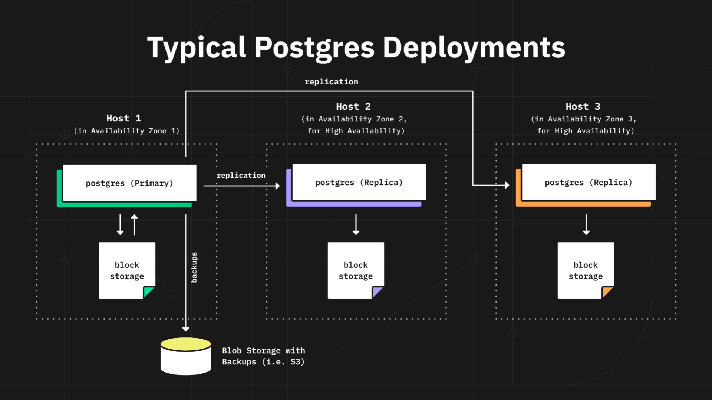
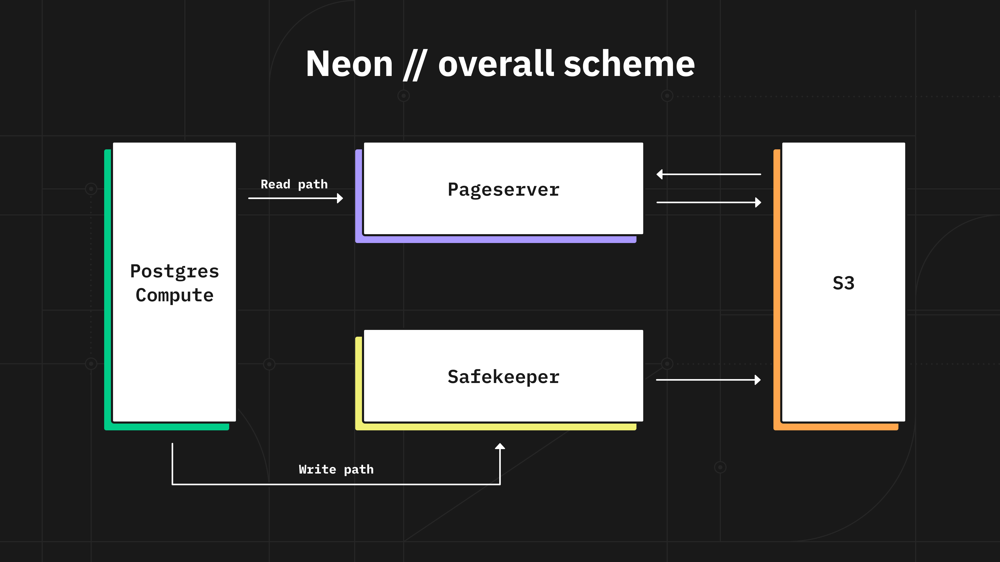

We have just launched Neon designed to provide you with the best Postgres experience in the cloud. You can [sign up to our waitlist](https://neon.tech/early-access/) right now and experience serverless Postgres enabled by the separation of storage and compute. The service is still gated by the waitlist as we are onboarding more and more users every day, and we expect to open it up for everyone soon.

Our website [leaked](https://news.ycombinator.com/item?id=315368270) to HackerNews a few weeks ago before we officially launched the company. While there was a great deal of discussion there, it’s important to us to talk in detail about the motivation for the project.

## Why Neon?

As we are looking at the world it’s clear to us that database workloads are shifting into the cloud — no one wants to manage a database themselves. We are a team of Postgres hackers, systems and cloud engineers and we are all huge fans of Postgres. We believe that in the ever-changing technology stack Postgres is here to stay. Just like Linux operating system or Git version control Postgres is the default choice for a relational database system.

That’s why lots of platforms such as AWS, Azure, Google Cloud Platform, Digital Ocean, Heroku, as well as newcomers like Fly.io (we are big fans) offer Postgres as a service.

## Built for the Cloud

If you look at the architecture of Postgres deployments, be that self-hosted, managed or cloud, often it looks like this:

If you squint at this diagram you realize that in order to get more throughput or storage, a user has to migrate to bigger host machines, and the service provider needs to explicitly manage the migration procedure to avoid downtimes. Due to the monolith architecture of Postgres you end up overprovisioning either storage or compute which also has a direct implication on the cost of running the service in the cloud. Another problem is that since you have to handle failover you are paying triple for storage and compute. Amazon EBS volumes provide you yet another level of redundancy, but they also charge for it. EBS volumes are very expensive, they throttle your throughput unless you pay for provisioned IOPs in which case your costs balloon even further.

We realized that a modern Postgres service can be designed differently in order to be cheaper and more efficient in cloud environments, but it will require some real systems engineering. We call this approach **separation of storage and compute**. It allows us to architect the service around performance, reliability, manageability, and cost. Cost is particularly important when you design a system for the cloud. Any cloud service has an infrastructure bill that it has to pass on to the end user. If you don’t account for cost at the architecture level running a service can get very expensive. That’s why when you build for the cloud you have to make the cost of running the service an important design consideration on par with manageability, reliability, and performance. One of the immediate implications of designing for cost was to never use EBS volumes and use a combination of local storage and S3 instead. Local storage for hot and S3 for cold data.

The architecture diagram looks like this. At the bottom of our diagram is our distributed multi-tenant storage that we built from the ground up. It integrates into Postgres without the need of forking Postgres itself (it does require small changes in the engine that we are aiming to commit upstream). You can read more on the details of this architecture in our next posts.

Each user gets a dedicated Postgres that we run in a container, while the data is safely stored in our multi-tenant storage system. Storage consists of two services: Safekeepers and Pageservers. Safekeepers implement a consensus protocol. The combination of Safekeepers and S3 provide the system of record. Pageservers serve database pages with low latency and provide “scratch space” for updates. Pageservers are not part of the system of record - you can lose all the pageservers and won’t lose any data.

## Architecture Benefits

This architecture provides a surprising number of benefits. Compared to the “naive” approach the most obvious are cost and elasticity of storage (bottomless). Compute and storage are separated, so you don’t overprovision either. Storage is backed up by a reliable and cost effective S3, so we do not have to triple the cost of storing the data.The quorum only has to store a small window of the most recent data which is not yet saved in S3. Moreover, quorum nodes can be shared between users, so the end user does not pay triple for the compute either. Backups and restores are integrated seamlessly as they are all built into the storage architecture. And most importantly this design allows us to deliver on a better developer experience (DevX), with elasticity, branching, and time machine. All these are enabled by our ability to transparently serve a Postgres instance any version of any page from our storage system.

## Serverless

Since storage is separate, compute, which is a Postgres process, becomes stateless (barring the buffer cache). This allows dynamically rescheduling compute and moving it from one node to another. And this opens up the possibility to run a compute layer that scales in response to changes in traffic, including the scale down to 0 when the database is not in use. You don’t need to specify the size of the compute instance. You push a button and get Postgres in under 3 seconds. Your only interface to it is a connection string and we will handle the rest.

Here is an example of spinning up Postgres in 3 seconds.

## Branching

Today everyone who is following modern app development practices needs to easily create dev, stage, and test environments. Modern developer workflow includes GitLab CI/CD, GitHub actions and other various CD/CI tools. Developers send pull requests and have platforms like [Vercel](https://vercel.com/) to compile, test, and deploy their code. Databases today don’t support this workflow very well and the key missing feature for this was branching – the ability to create a branch of the whole database similar to how Git does it.

Neon allows instantly branching your Postgres database to support a modern development workflow. You can create a branch for your test environments for every code deployment in your CI/CD pipeline. You can test migrations against a recent production snapshot without affecting the production. Branches are created instantly and implemented using the "copy on write" technique. In the current version you have to contact us separately if you want to try branching after receiving an invitation. We will open it up for everyone as we build the UI support.

## Open Source

We are not the first to offer separation of storage and compute for Postgres. AWS Aurora is probably the most famous example, however it is proprietary and tied to AWS's internal infrastructure.

We think we have an opportunity to define the standard for cloud Postgres. We carefully designed our storage focusing on cloud independence, performance, manageability, DevX, and cost. We chose the most permissive open source license: Apache 2.0 and invited the world to participate. You can already build and run your own fully featured instance of Neon.

## Hello World

Please welcome Neon to the world. Follow @neondatabase on [Twitter](https://twitter.com/Neondatabase) or [GitHub](https://github.com/neondatabase/) and be on the lookout for exciting new features we will be continuously shipping.
