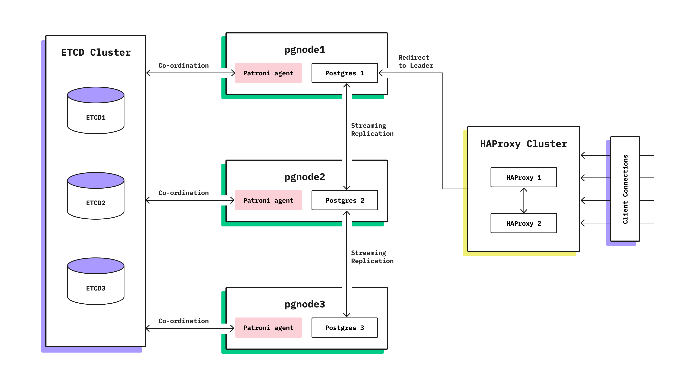
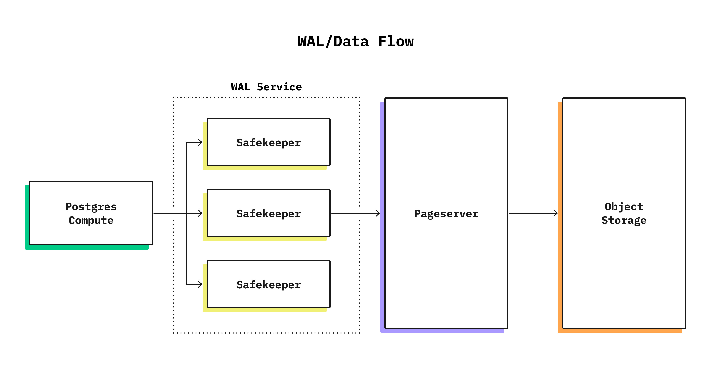
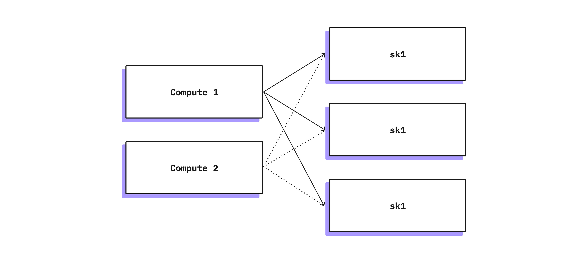

_TLDR: Neon separates storage and compute, substituting the PostgreSQL persistency layer with a custom-made distributed storage written in rust. Due to this separation, some nodes don't have persistent disks. The original Raft paper works only with uniform nodes, but Paxos variants support proposers without storage and allow the acceptors to be the only nodes that have storage. We use a Paxos-like separation of concerns and recovery procedure, Raft-like election procedure, and TLA⁺ to check our modifications._

Correct implementation of a distributed consensus protocol is usually deemed to be a challenging task, but when it comes to design decisions, the industry has a lot of answers ready for you. "If it's not Paxos, it's probably wrong," — the phrase is often attributed to Leslie Lamport. But what about Raft, ZAB, viewstamped replication, or even virtual synchrony? Are they wrong? Are they Paxos? Happily, another distributed systems expert, Kyle Kingsbury, aka Aphyr, gives a hint about the answer to these questions, paraphrasing yet another classic: "All happy databases are alike; each unhappy database is unhappy in its own way."

Before we dive into the Neon consensus implementation, let's look at the standard way of providing high availability and failover in Postgres today. This is what we're aiming to improve upon, so we want to understand its strengths and weaknesses first.

## Automatic failover in Postgres

A standard way to provide high availability [^1] with Postgres is to set up several replicas of your primary instance. When the primary becomes unavailable, one of the replicas takes over as the new primary. Sounds easy, right? But, in reality, it is a lot trickier since Postgres has no built-in mechanism that will choose a new primary out of the available replicas. There is also no mechanism to protect from a so-called split-brain situation: when most of the nodes in the cluster think that the old primary is down (e.g., due to some partial network connectivity issues) and a new primary is promoted, while actually the old primary is up and has some clients connected to it. This can lead to serious disagreement about the data in the database! For example, if running a financial app, clients may be able to "double-spend" their money: once by sending a transaction to the old primary and once with the new primary.

Fortunately, the Postgres ecosystem has tools like Patroni and Stolon that can help with new primary selection by using stores like etcd, Zookeeper, or Consul (let's call them consensus stores). So, while Postgres replication alone cannot solve the problem of assigning the new primary, it is possible to use a separate consensus store to maintain the id of the current primary node. In such a setup, we need to be sure that the state of our cluster corresponds to whatever is written into the consensus store. This is usually done by having some control agent near each Postgres instance that will promote/demote Postgres if the consensus store state has changed, as well as shut down Postgres instances after a timeout if the connectivity with the consensus store is lost. These solutions work well in practice but have a complicated setup and are prone to configuration errors. Also, to avoid false-positive failovers, the timeouts are usually quite long and can cause user-noticeable 10-30s downtime every time primaries switch.

Can we get high availability Postgres without the significant user-noticeable downtime and without the clunky Postgres+agent+consensus store setup? To answer this question, let's start with a distributed systems refresher to set up some terminology and identify parts of highly available replication that Postgres replication is missing. If you are already deeply familiar with distributed systems, feel free to skip directly to the next section.

## Distributed systems refresher

**Failure model**. The solution for highly available replication will differ depending on what failures we expect our system to survive. On the one hand, we won't need something as complicated as Raft or Paxos if the network is fully reliable and nodes operate with a known upper bound on processing time. On the other hand, if nodes are allowed to violate the protocol intentionally, we would need something more complicated like PBFT [^2]. Raft and Paxos operate under the following assumptions: computers can crash or restart and lose in-memory state, but the disk state will be preserved upon restart; the network may lose or duplicate messages but can't generate them out of thin air, and eventually, some messages would be delivered [^3].

**Single-value consensus** is a distributed protocol for a set of nodes to agree on a single value that will never change once selected. We can think of it as a distributed register - all nodes can try to write different values, but only one value will be selected, and all nodes will eventually learn that selected value. We don't care what value will be chosen; we just need some procedure for all to select the same value in the presence of both node failures and network omissions. At first glance, it seems to be an easy task: for example, we can try to use a protocol where everybody just accepts a proposal from an alive node with the highest node id. The problematic part here is how to define "alive." Since the network in our model can drop messages, we cannot distinguish between situations when the node is actually down and situations when we haven't heard from the node due to network failures. And that will lead to the split-brain problem mentioned earlier. [^4]

It turns out that there is a solution even in the case of an unreliable network, and that is the so-called `Single-decree Paxos` or `Synod,` which is a base block for building more complicated protocols. Synod protocol itself is actually quite simple; it has two phases (usually referred to as `Phase 1` and `Phase 2`) and three types of messages (`prepare,` `accept,` `decide` with positive and negative responses for the first two), and it can be described in one screen of pseudocode: <http://nil.csail.mit.edu/6.824/2015/notes/paxos-code.html>. It also turns out that `Synod` may never terminate, being forever bouncing between phases, but in practice, it is not a problem, and with some randomization, it quickly converges.

**Atomic broadcast**. Following the Wikipedia definition, atomic broadcast is a broadcast in which all correct processes in a system of multiple processes receive the same set of messages in the same order. Or, in less strict terms, it is a fault-tolerant replication. And that is precisely the problem that Raft, Paxos, and ZAB are solving, so the problem's scope is bigger than a single-value consensus. The atomic broadcast protocol also needs to deal with the detection of dead nodes, node recoveries after the restart, split-brain protection, etc.

**Paxos**. Paxos, or more precisely, multi-Paxos, is one of the first protocols to solve atomic broadcast and probably the most famous one. The protocol defines several types of nodes, namely:

- Proposers – replication "source" that executes the client request and coordinates its further execution until the client's value is fully replicated. Paxos also selects a distinguished Proposer who is referred to as a Leader.
- Acceptors – replication "destination" for fresh and not necessarily committed values
- Learners – replication "destination" for definitely committed values

In a practical system, some or all of the roles are usually colocated in the same node. The protocol gives much freedom about exact implementation, but that freedom may lead to hard-to-reason bugs.

**Raft**. Raft solves the same algorithmic problem but in a more engineering-friendly way. Instead of talking about all possible roles like Paxos, Raft is described like a usual replication setup: there is a primary (called leader) and a set of replicas (called followers). When followers do not hear from the leader for a while, one of them becomes a candidate and starts voting to become a leader. Each election procedure is stamped with a number called `term.` But, underneath, it is a similar concept to Paxos, just put together in a well-thought-out manner:
each node collocates Proposer/Acceptor/Learner;
voting is the same `Phase 1` from Paxos (albeit with different term selection rules);
the replication process is a consequent execution of `Phase 2`;
the leader acts as a proposer, and the follower act as an acceptor;
some recovery problems are mitigated by not allowing the most lagged nodes to be elected;
the description does not skip some parts of the protocol.

So one can define a 'Rosetta stone' [^5] to align the terminology of both Raft and Paxos, or even argue that they are very similar protocols if both are described in Raft terminology. But the fact that Raft's terminology was chosen in [^5] to represent Paxos and not vice versa emphasizes how vital Raft's contribution to understandability is.

## Can we turn Postgres replication into Raft?

Imagine we want Postgres to have a built-in replication with automatic failover. How much of the current replication infrastructure can we reuse? Should we write it from scratch, or can we augment an existing one? I would argue it is the latter. In fact, Postgres replication does a lot of things that Raft does for a happy case:

- Replication is built around WAL (Write-Ahead Log), which is strictly ordered, and each message is stamped with an LSN (Log Sequence Number).

- The replication connection mainly transfers WAL records, but there are out-of-band messages going in both directions to perform heartbeats and acknowledgments of the received LSN.

- Synchronous replication can be configured to proceed when the majority of acknowledgments are received. Namely, one can configure the primary with `synchronous_standby_names = 'ANY 1 (follower_A, follower_B)'` and have the same wait logic as in Raft in the case of three nodes.

However, we'd also need to change a few Postgres replication behaviors to turn it into Raft:

- Postgres replica applies WAL records right after receiving it. Conversely, Raft treats recent log entries as transient and applies (or commits) them only when the current leader allows that by advancing `commitIndex .` To match that behavior, the Postgres replica should delay WAL replay, and a few more out-of-band messages should be introduced [^6].

- Postgres doesn't have any leader election logic. It is pretty straightforward to code it with a few more additional messages, but it would require each node to know the addresses of all other nodes. And this metadata management is a whole design universe (Is it just a config? Is it a DDL that manages the catalog? How does it react to changes?). Also, Raft requires each WAL record to be stamped with `currentTerm,` so this would be an extra field in each WAL record.

- Primary to replica transition in Postgres requires a restart. Although this is not directly related to Raft, it is necessary if you want to have a self-managing cluster. This easily could be the most complicated and invasive change out of the whole list of changes.

So the answer is yes, it is possible, but it will require several invasive changes. I hope that with time a common subset of this infrastructure may find its way into a vanilla Postgres enabling auto-recovering clusters. At Neon, we took a slightly different approach due to the separation of storage and compute, which allowed us to keep Postgres changes to a minimum.

## Neon high availability

However, Neon distinguishes between several types of nodes, and in this post, we will focus on two types: compute nodes and safekeepers. You can read more about the overall architecture at <https://neon.tech/blog/architecture-decisions-in-neon/>. To recap:

- Compute nodes run modified Postgres and don't store any long-term data locally. Instead, a compute node reads its data from the network and writes WAL entries to the safekeeper via the Postgres replication protocol.
- Safekeeper receives data from the compute node and writes it to disk as soon as possible. It is the primary storage for new data that is not yet replicated to S3, so we need to store it several times to account for possible node failures.

Once we have a compute node (Postgres) replicating its data to several other nodes (safekeepers), we end up needing to solve the atomic broadcast problem with a few small quirks:

- Unlike in Raft setup, where each node can be both a leader and follower, our safekeepers and compute nodes cannot turn into each other (and we don't want them to). One way to look at this is that a compute node can only be a leader (or candidate), and the safekeeper is always a follower. Or, going back from Raft to Paxos, we can say that a set of compute nodes is a set of proposers, and safekeepers are acceptors – we actually use this terminology in our codebase.

- Each compute node is externally managed by a control plane (k8s in our case), and if k8s detects a failure, it will run a new compute node. We don't want our durability to be dependent on k8s properties, so we have to think of the split-brain situations that may arise if two compute nodes simultaneously work as leaders. Also, a possible bug in the control plane code can spin up hundreds of such compute nodes. Compared to Raft, which operates on a fixed set of nodes, we deal with the fixed set of safekeepers and a potentially unbounded set of compute nodes.

So we can't directly apply Raft to our situation, but Paxos definitely allows nodes with different roles. In fact, such a setup was studied by Lamport himself [^7] and by others [^8]. To better understand how it works, let's look at the concrete situations:

### Failure-free case

When a compute node starts, it connects to safekeepers via the Postgres replication protocol and initiates election. Our election procedure is closer to Raft than to Paxos: a compute node asks all the safekeepers about the last term, increments it, and sends a `Proposal` (aka `RequestVote`/`Phase 1`) message with a new term to safekeepers. The election will succeed if there is no competing compute node, and replication (`AppendEntries`/`Phase 2`) will start. During replication, the safekeeper always checks that WAL records are stamped with the latest observed term and prohibits any WAL record from previous terms.

### Competing compute nodes

When several compute nodes simultaneously think they are read-write nodes on the same database, they all will try to secure a new term with majority votes and start replication. Imagine that one of the compute nodes secured a term and started replication. If competing compute nodes were not fast enough to generate a new term and communicate it to the safekeepers, our node may replicate some records. However, when a competing node communicates a new term to the safekeepers, they will decline any records from the previous term. So, all compute nodes will end up in a stalemate, constantly knocking out each other.
In our setup, we have a control plane that eventually will resolve this situation, keeping only one compute node, which will be able to proceed without competition. So we don't try to solve liveness with our replication protocol but want to be sure that safety is always guaranteed – even if there are competing nodes, they will not damage the data.

### Safekeeper failure

When a safekeeper fails and a majority of safekeepers are alive, the system will work without noticing it – the compute node waits for a majority of acknowledgments from safekeepers, not all of them. But, with a smaller amount of safekeepers, our replication factor is decreased, so we need to either bring the old safekeeper back or replace it with a new one. If the safekeeper is up again, it can join the cluster automatically. But if it crashes without a way to recover, we need to change cluster membership. Right now, such a change requires humans to be in the loop to ensure that the old safekeeper is actually down. It is on our roadmap to automate this procedure.

## Verification

We've had experience with TLA⁺ before, and as always, it proved to be an excellent tool to check the correctness of one's thought process. On the one hand, we don't deviate from classical proven protocols in important ways, so we should be okay; on the other hand, our setup with separation of proposers and acceptors is not the most standard one, so we'd better check it with a model that describes our setup and includes some of our implementation details. For example, one of the important considerations for us was keeping the Postgres WAL format intact, which means that there is no room for term numbers in each WAL record. The trivial solution would be to keep a separate log only with terms, but that would mean doubling the amount of `fsync()` calls, severely impacting performance. So we had to be more thoughtful about this, and we've checked a few approaches: keeping only the last term, keeping the history of term changes separately, etc. There is some thought process and mental proof that such a change does not affect the protocol state machine, but it's better always to check yourself.

## Summary

This post was largely written in response to "Why Paxos instead of Raft?" questions. The separation of concerns we needed for compute node and safekeepers drove us back to Paxos, which allows it. On the other hand, Raft was written later and has some great ideas like a different (and IMO better) way of term assignment, which we also adopted. Since Paxos is more general, we've used that name, considering our approach as a subset. Another option was to call it "Disk Raft," making an analogy with "Disk Paxos."

I think it would be correct to say that the main difference between the two is not the algorithm itself but how they are described. Lamport's description of Paxos is more bottoms up: prove properties of smaller blocks and sketch a way to build a replication solution without going too much into details. Raft follows the top-down approach: to get a resilient replication, do this and that.

If you are interested in more details about our replication protocol, you can look at the [pseudocode description](https://github.com/neondatabase/neon/blob/main/docs/safekeeper-protocol.md) or the [TLA⁺ model](https://github.com/neondatabase/neon/blob/main/safekeeper/spec/ProposerAcceptorConsensus.tla).

Thanks to @larhat, Egor Rogov, and @PredragGruevski for their feedback on the early drafts of this post. All mistakes and possible controversies are on me.

[^1]: High availability here is used in a general sense (like <https://www.postgresql.org/docs/current/high-availability.html> does), not in the CAP-theorem sense
[^2]: <https://pmg.csail.mit.edu/papers/osdi99.pdf>
[^3]: The requirement for some messages to be eventually delivered is essential in the light of the FLP theorem, which states that no consensus algorithm is guaranteed to terminate under a similar failure model. Without this eventual delivery requirement, it would be a trivial result.
[^4]: However, in a synchronous system with a reliable network algorithm with a similar idea will work: <https://en.wikipedia.org/wiki/Bully_algorithm>
[^5]: <https://arxiv.org/abs/2004.05074>
[^6]: Such delay addresses a similar kind of problem the `pg_rewind` utility addresses, but instead of "rewinding" WAL, it prohibits situations when rewind is needed.
[^7]: <https://www.microsoft.com/en-us/research/publication/disk-paxos/>
[^8]: <https://dl.acm.org/doi/10.1145/571825.571837>
